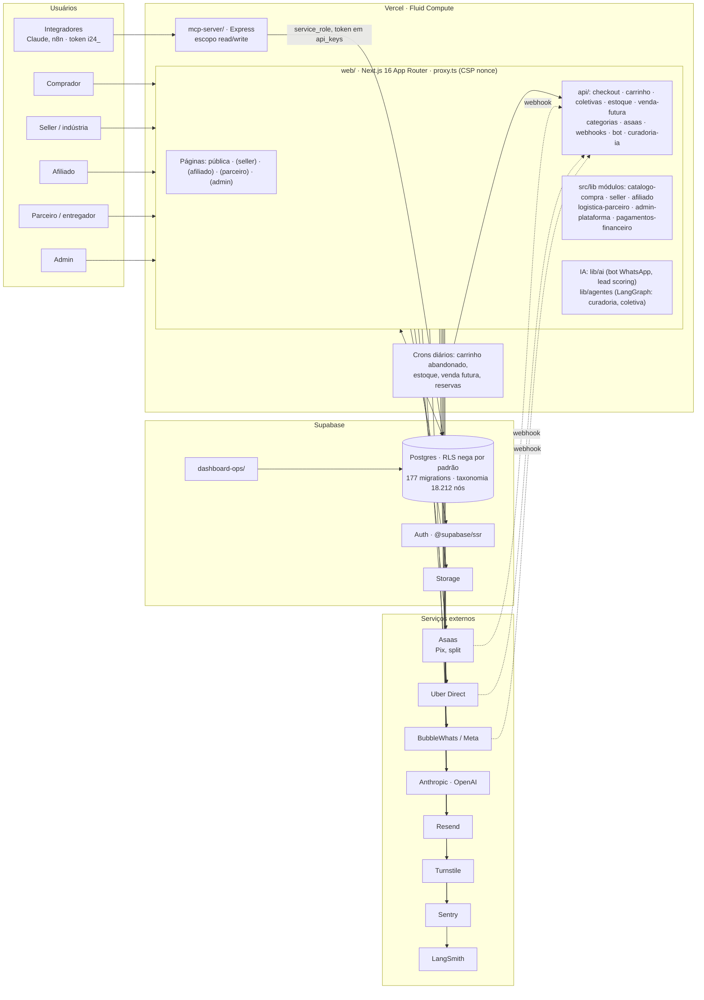

# Arquitetura Industria24

Estado em 21/09/2026. Marketplace B2B reconstruído do Bubble (`industria24h.com.br`) para Next.js 16 + Supabase, publicado em `industria24.com.br`.

## Notas

**Monolito modular.** Seis domínios mapeados no `CODEOWNERS` (PRD 018). Regra nova entra em `src/lib/<modulo>/` com `.test.ts`; código antigo migra por strangler fig quando um PR o toca.

**Dados e segurança.** Três clients em `lib/supabase`: `client.ts` (browser, anon), `server.ts` (RSC/Actions, sessão), `service.ts` (service_role, só servidor). Integradores recebem token `i24_`, nunca chave do banco.

**Caminho do dinheiro.** `asaas.ts`, `repasses.ts`, `api/asaas/`, `api/webhooks/`: merge pede confirmação do usuário.

**Entrega.** PR com CI verde (`lint-build`, `test`, `migrations-lint`, `secret-scan`) → merge → Vercel. Com o limite diário de builds, deploy via `vercel --prod` na CLI.
