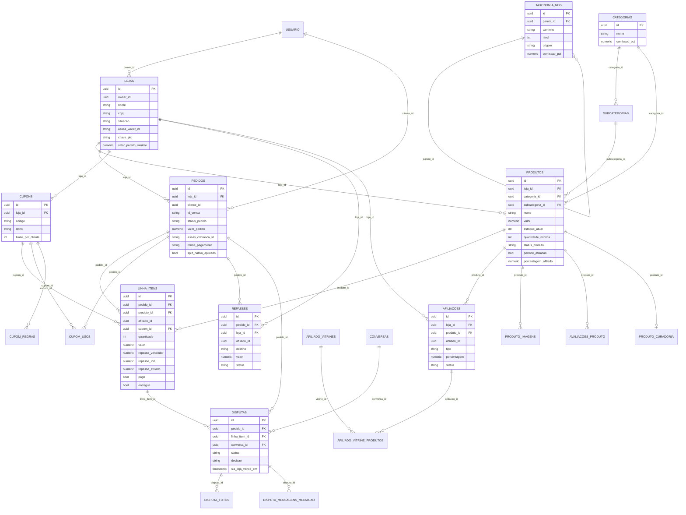
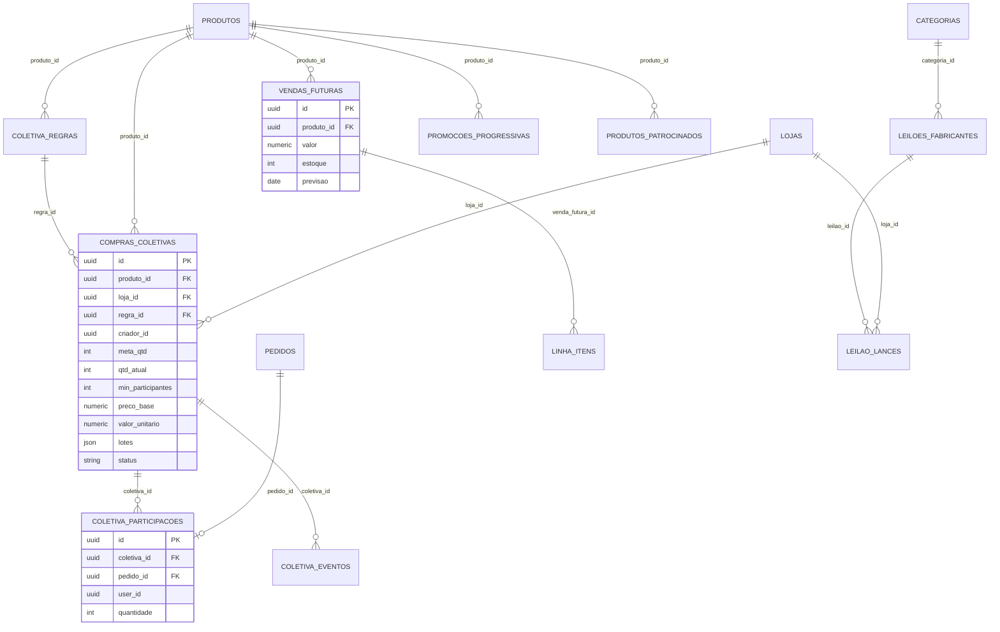
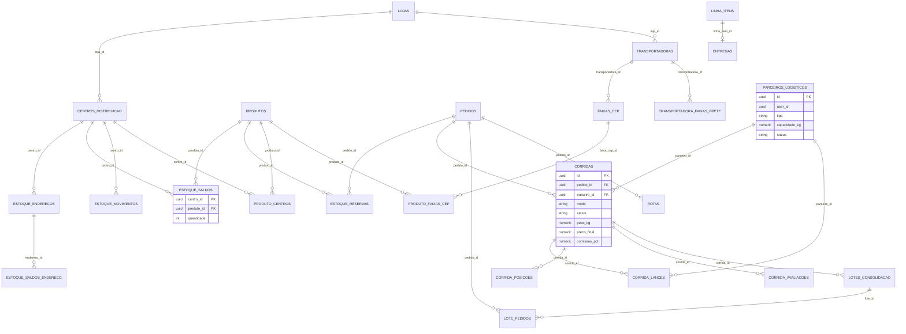
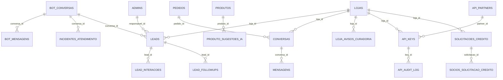

# Modelo de Dados Industria24

Fonte: `src/lib/supabase/database.types.ts` (21/09/2026). 87 tabelas em `public`; views omitidas; vínculos com `auth.users` aparecem como `USUARIO` (sem FK declarada no tipo gerado).

## Núcleo comercial

Loja vende produto; pedido é por loja e se abre em `linha_itens`, onde mora o split (vendedor, Industria24, afiliado). `repasses` registra cada transferência.

## Compra coletiva, venda futura e leilão

Coletiva agrega participações até a meta; cada participação vira um pedido. Leilão reverso liga fabricantes por categoria.

## Logística e estoque

Estoque por centro de distribuição e endereço; frete por faixa de CEP e transportadora; entrega própria em `corridas` com lances de parceiros.

## Atendimento, IA e API de parceiros

Bot do WhatsApp gera leads; conversas entre comprador e loja alimentam disputas; `api_keys` sustenta o mcp-server.

