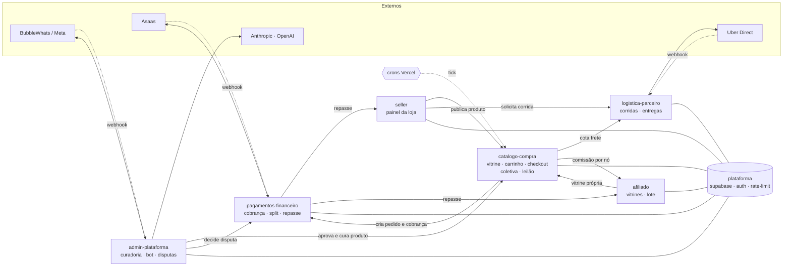

# Módulos Industria24

Monolito modular (PRD 018, `.github/CODEOWNERS`). Levantado do código em `master` em 22/09/2026.

## Como os módulos conversam

## Vitrine e compra · `catalogo-compra`

Tudo que o comprador toca: descobrir produto por CEP, montar carrinho multi-loja, fechar pedido, entrar em coletiva ou leilão.

- **Telas:** `/ (home)`, `produto`, `loja`, `categoria`, `busca`, `carrinho`, `checkout`, `pedido`, `meus-pedidos`, `coletiva(s)`, `leilao`, `favoritos`, `cupons`
- **API:** `checkout/cotar-frete`, `carrinho/sync`, `busca-preview`, `categorias`, `carrinho/abandono/tick`, `coletivas/tick`, `estoque/reservas/expirar`, `venda-futura/avisos/tick`
- **Regra de negócio:** `catalogo-compra/vitrine-home`, `proximidade`, `faixa-cep-regra`, `desconto-progressivo`, `ruptura`, `recompra`, `checkout/montagem-pedido`, `checkout/opcoes-frete`, `carrinho/travas-minimas`, `coletiva.ts`, `preco-faixa.ts`, `cupom-desconto.ts`
- **Tabelas:** `produtos`, `categorias`, `taxonomia_nos`, `pedidos`, `linha_itens`, `compras_coletivas`, `coletiva_participacoes`, `vendas_futuras`, `leiloes_fabricantes`, `favoritos`, `carrinhos_abandonados`
- **Externos:** `Turnstile`, `ViaCEP / ceps_geo`, `Resend`

## Painel do seller · `(seller)/seller`

A indústria gerencia catálogo, estoque por centro, frete, promoções, crédito e acompanha pedidos e reputação.

- **Telas:** `minha-loja`, `produtos`, `pedidos`, `centros`, `transportadoras`, `entregas`, `rotas`, `promocoes`, `cupons`, `ads`, `coletivas`, `leiloes`, `venda-futura`, `afiliados`, `disputas`, `credito`, `reputacao`, `analise-geral`, `carrinhos-abandonados`, `mensagens`, `tutoriais`
- **Regra de negócio:** `seller/estoque-estado`, `seller/tour-passos`, `seller/aviso-admin-nova-loja`, `transportadoras/parser-tabela-frete`, `transportadoras/xlsx · csv`, `estoque/faixa-enderecos`, `dashboard-kpis.ts`
- **Tabelas:** `lojas`, `centros_distribuicao`, `estoque_saldos`, `estoque_movimentos`, `transportadoras`, `faixas_cep`, `promocoes_progressivas`, `produtos_patrocinados`, `solicitacoes_credito`, `cupons`
- **Externos:** `OpenAI (imagem)`, `Resend`

## Afiliados · `(afiliado)/afiliado`

Revendedor monta vitrines próprias com produtos de lojas que permitem afiliação e ganha comissão por item vendido; também opera logística em lote.

- **Telas:** `vitrines`, `solicitar`, `lote`, `logistica`, `vitrine-afiliado (pública)`, `vender-como-afiliado`
- **Regra de negócio:** `afiliado/afiliacoes`, `afiliado-lote.ts`, `comissao/percentual`
- **Tabelas:** `afiliacoes`, `afiliado_vitrines`, `afiliado_vitrine_produtos`, `afiliado_dados_pix`, `lotes_consolidacao`, `lote_pedidos`
- **Regra-chave:** Comissão resolve nó da taxonomia > subcategoria > categoria > 5%, igual em checkout, cupom e coletiva.

## Logística e parceiros · `logistica-parceiro`

Entrega própria por corridas com lances de parceiros, last-mile pela Uber Direct e armazenagem.

- **Telas:** `(parceiro)/cadastro`, `corridas`, `entregador`, `seja-parceiro`, `armazeneconosco`
- **API:** `webhooks/uber-direct`
- **Regra de negócio:** `logistica-parceiro/entregas`, `uber-direct.ts`, `geo.ts · geo-raio`, `cep.ts`, `checkout/peso-carrinho`
- **Tabelas:** `corridas`, `corrida_lances`, `corrida_posicoes`, `corrida_avaliacoes`, `parceiros_logisticos`, `entregas`, `rotas`, `cotacoes_frete_externo`
- **Externos:** `Uber Direct`

## Admin, bot e IA · `admin-plataforma`

Operação do marketplace: aprovar lojas e produtos, curar catálogo com IA, mediar disputas, atender leads pelo WhatsApp.

- **Telas:** `lojas`, `produtos`, `taxonomia`, `categorias`, `pedidos`, `repasses`, `disputas`, `incidentes`, `leads`, `usuarios`, `auditoria`, `galerias`, `destaques`, `paginas`, `editar-marketplace`, `fulfillment`, `lotes`, `parceiros`, `transportadoras`, `mensagens`
- **API:** `curadoria-ia`, `bot/chat`, `bot/health`, `bot/whatsapp/webhook`, `webhooks/bubblewhats`, `observabilidade/cron`
- **Regra de negócio:** `agentes/curadoria-orquestrador`, `agentes/curadoria-regras`, `agentes/coletiva-etapas`, `ai/atendimento`, `ai/leadScoring`, `ai/systemPrompt`, `disputas.ts`, `auditoria-acesso.ts`
- **Tabelas:** `admins`, `produto_curadoria`, `produto_sugestoes_ia`, `bot_conversas`, `bot_mensagens`, `leads`, `disputas`, `incidentes_atendimento`, `auditoria_eventos`, `paginas_cms`, `marketplace_config`
- **Externos:** `Anthropic Claude`, `OpenAI`, `BubbleWhats / Meta`, `LangSmith`

## Pagamentos e repasse · `pagamentos-financeiro`

Cobrança Pix/cartão, split nativo entre vendedor, Industria24 e afiliado, confirmação e transferência.

- **API:** `asaas/webhook`
- **Regra de negócio:** `asaas.ts`, `asaas-confirmar.ts`, `repasses.ts`, `cupom-desconto.ts`, `token-timing-safe.ts`
- **Tabelas:** `pedidos (asaas_cobranca_id)`, `linha_itens (repasse_*)`, `repasses`, `asaas_clientes`, `cupom_usos`
- **Externos:** `Asaas`
- **Governança:** PR que toca estes arquivos pede confirmação do usuário antes do merge, mesmo com CI verde.

## Plataforma · `plataforma compartilhada`

Infra que todos os módulos usam. Mudança aqui exige revisão de quem já é dono.

- **Código:** `lib/supabase/client · server · service`, `auth.ts · auth-actions`, `gate-rotas.ts`, `rate-limit.ts`, `turnstile.ts`, `sentry-context.ts`, `proxy.ts`
- **Banco e CI:** `supabase/migrations (numeração manual)`, `.github/workflows/ci.yml`, `lint-build`, `test`, `migrations-lint`, `secret-scan`
- **Sub-pacotes:** `mcp-server/ (Express)`, `dashboard-ops/ (Next)`
- **Externos:** `Sentry`, `Cloudflare Turnstile`, `Vercel`

Rotas de entrada externa (webhook/cron): `asaas/webhook`, `webhooks/uber-direct`, `webhooks/bubblewhats`, `bot/whatsapp/webhook`, e os `*/tick` dos crons.
