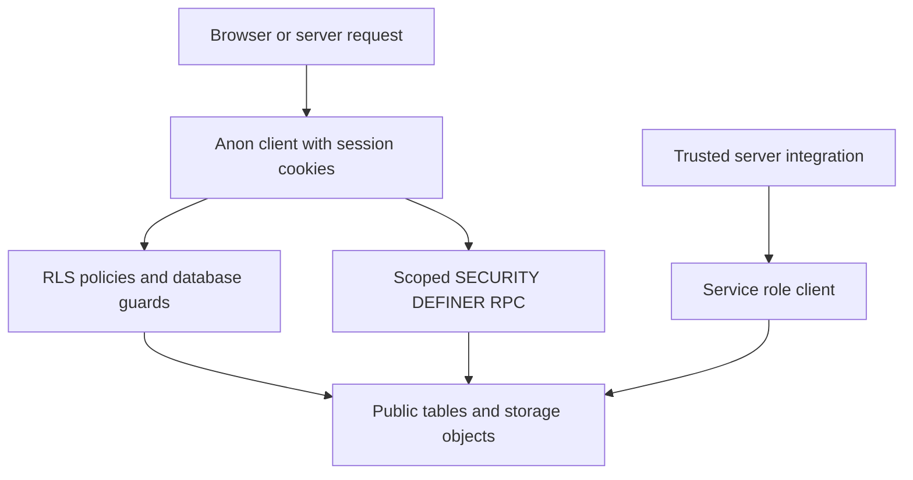

# Data Access, Security, and Schema Evolution

Supabase is both the persistence layer and the final authorization boundary. Route groups, layouts, and UI role gates improve the experience, but they do not authorize a database operation. User traffic must be constrained by Row Level Security (RLS), and controls that RLS cannot express—field-level integrity, elevated workflows, and secret handling—belong in triggers and tightly bounded RPCs.

## Choose the client by trust boundary

All four client factories are parameterized with the generated `Database` type in `src/lib/supabase/database.types.ts`. It represents the deployed schema for TypeScript query checking; it does not create columns, policies, or permissions.

| Entry point | Context | Credential and effective boundary | Use it for |
| --- | --- | --- | --- |
| `src/lib/supabase/client.ts` → `createClient()` | Client Components | Browser client with `SUPABASE_URL` and `SUPABASE_ANON_KEY`; a signed-in session is evaluated by RLS. | Ordinary browser reads and writes. |
| `src/lib/supabase/public.ts` → `createPublicClient()` | Fully public catalogue routes | Anon-key client with no cookies and no persisted or refreshed session; RLS still applies. It avoids the cookie access that would force request-time rendering, allowing ISR. | Public store, product, and category reads. |
| `src/lib/supabase/server.ts` → `createClient()` | Server Components and Route Handlers | Anon-key server client wired to Next request cookies, so the user session and RLS remain effective. It attempts cookie writes; an immutable Server Component can reject them, in which case session middleware performs renewal. | The default server-side data path. |
| `src/lib/supabase/service.ts` → `createServiceClient()` | Server-only trusted code | Service-role key, without persisted or auto-refreshed session. It bypasses RLS and throws when no service key is configured. | Provider webhooks and other narrowly reviewed system work. |



This shows the ordinary session path, the deliberately privileged service path, and the constrained RPC path.

**Default rule:** use the browser/server `createClient()` for product behavior. `createServiceClient()` is not an application authorization shortcut: never expose `SUPABASE_SERVICE_ROLE_KEY` or import that module into browser-delivered code. Because service-role calls can pass the restricted-field guard, each usage needs its own authentication and input-validation boundary.

For example, the Asaas webhook first checks its access token and service-role configuration. For payment events, it loads the referenced order and ignores the event unless the provider charge id equals the stored `asaas_cobranca_id` and the received amount covers `valor_pedido`. Only then does its service client write protected payment state and mark line items paid. Provider notification and payment identity are therefore not trusted merely because an endpoint was reached.

## Session helpers assist selection; the database enforces access

`getUser()` obtains the session user with the server client. If `auth.getUser()` throws while refreshing an invalid session, it reports the exception to Sentry and returns `null`, treating the request as logged out. `isAdmin()` queries the caller-visible `admins` row; `isSuperAdmin()` and `hasRole()` use RPCs. These helpers are suitable for rendering and application flow, not replacements for database authorization.

Keep explicit predicates when a public policy makes an otherwise convenient query ambiguous. `getMinhaLoja()` selects `lojas` with `owner_id = user.id` before `.limit(1).maybeSingle()`. That condition is required even under RLS: an active-store catalogue policy can make another seller's row visible, so an unqualified limiting query could choose the wrong store.

## Authorization is layered

### RLS scopes rows and tenants

New tables are expected to start deny-by-default: RLS enabled with no matching policy exposes no rows. Core seller policies root access at `auth.uid()`: a store requires its `owner_id`, while product, order, and line-item policies follow relationships back to that owned store. Administrator policies call `is_admin()`, a `SECURITY DEFINER` helper that checks `admins` without RLS recursion. The `admins` table lets a user read only their own membership row and has no ordinary insert policy.

RLS is row authorization, not column authorization. An owner-wide `FOR ALL` policy otherwise permits a seller to change every column of their own row. The restricted-field trigger closes that gap:

- `guard_campos_restritos()` is `SECURITY DEFINER` with `search_path = public`. Admins and calls where `auth.uid()` is null, including service-role/postgres calls, pass it; normal users cannot self-approve products, change store moderation state, or change protected order and line-item finance fields.
- Its current form also validates protected finance fields on insert, prevents non-admin deletion of paid orders or paid/transferred items, and returns `OLD` on `DELETE`. Returning `NEW` during a delete would return null and silently suppress the deletion.
- The trigger additionally protects the final resolution fields of disputes. A user may participate in the workflow only through the policies and transitions supplied for that workflow; they cannot set a final decision.

### Elevated operations use narrow transaction-local capabilities

Some valid operations must write fields that the caller could never write directly. Checkout is one. The checkout database function validates and calculates the order, then sets transaction-local `app.checkout_rpc = 'on'` before it inserts `pedidos` and `linha_itens`, including calculated payout values. The guard recognizes that capability only in the same transaction; it is not a browser-provided bypass flag. Migration `0109` is important maintenance history: a prior `CREATE OR REPLACE` of the guard accidentally removed accumulated branches, and `0109` restored the insert, delete, PIX, checkout, and dispute behavior without recreating the triggers that call the function by name.

`alterar_chave_pix_loja(uuid, text, text)` is the other model operation. It is a `SECURITY DEFINER` RPC with a fixed search path that requires a signed-in caller, validates the key type and format, selects the store only when it is owned by that caller, and then sets local `app.chave_pix_rpc` for the guarded update. It clears the confirmation timestamp and records before/after values in `auditoria_eventos`; direct PIX-key changes remain blocked. Execute is revoked from `public` and granted to `authenticated`.

Not every function with elevated access is a user RPC. `confirmar_chave_pix` and `confirmar_chave_pix_afiliado` explicitly require `auth.role() = 'service_role'` or `is_admin()` and have execute revoked from `anon`. Do not use `auth.uid() is null` as a service-role test: anonymous calls also have no user id.

### Public projections and Storage are separate contracts

A view may intentionally run as its owner to make a minimal projection available where direct base-table RLS would either expose sensitive fields or return no rows. `lojas_vitrine` exposes catalogue fields from active stores, and public product reads require an approved product whose store occurs in that view rather than direct public access to `lojas`.

Owner-running views must carry their own access predicate and a deliberately narrow projection. The tenant-scoped examples include `afiliado_ganhos`, `pedidos_cliente`, `linha_itens_cliente`, `logistica_pedidos`, and `logistica_itens`; public-safe cases include `parceiros_publicos` and aggregate-only views such as `favoritos_contagem`. Their migrations set `security_barrier = true`, preventing consumer predicates from being pushed ahead of the view filter and creating a timing/error side channel. Do not blindly set `security_invoker`: that reapplies base-table RLS and can make deliberate projection-based access return no rows. Treat every `CREATE OR REPLACE VIEW` as security-sensitive: preserve its filter, barrier, intended grants, and column allowlist.

Storage uses `storage.objects` policies independently of application-table RLS:

- `produtos` and `lojas` buckets are public to read. Upload and delete require `authenticated` and validate that the first path segment belongs to a store owned by `auth.uid()`. Their object-name contract is `<loja_id>/<arquivo>`.
- The `disputas` bucket is private. A participant may upload and read its dispute folder; an administrator may also read it. Sensitive evidence does not belong in a public asset bucket.
- Bucket-level configuration supplements policies for image buckets: `produtos`, `lojas`, and `marketplace` accept only JPEG, PNG, or WebP and are capped at 5 MiB. Client-side validation is only a usability check; the bucket setting is the enforceable limit.

## Migration-led schema changes and generated-type drift

Migrations in `supabase/migrations/` are the schema change record. Query code must not assume that a cast makes a new column, RPC, relation, policy, or view exist. The codebase contains localized `as any` or `as unknown as` adapters where generated types lag the schema; treat these as temporary compatibility boundaries, not as authorization bypasses.

Use this change discipline:

1. Inspect relevant migrations, current generated types, policies, triggers, grants, and callers before designing DDL or a query.
2. Choose a unique numeric migration prefix. Check all branches before creation with `git log --all --oneline -- supabase/migrations/00XX*`, then check again before push: `cd supabase/migrations && ls | grep -oE '^[0-9]{4}' | sort | uniq -d`. Duplicate prefixes block the repository's migration lint job.
3. For DDL/DML against real data, rehearse `begin;`, the change, a verification query, and `rollback;`. Apply through the linked CLI, for example `supabase db query --linked --file <arquivo>`.
4. Verify deployment from the actual schema with `to_regclass` or `information_schema`, not migration history alone; history can drift from a target database.
5. Regenerate `src/lib/supabase/database.types.ts` from the real schema with `supabase generate typescript types` and inspect the diff. Generation without a token can silently truncate that file.
6. Add RLS and narrow policies with every new table. For any trigger, RPC, view, or storage naming convention, define its authorization and grant contract in the migration and test the boundary.

## Focused verification

Use database-level verification for database authorization. The focused smoke command is:

```sh
supabase db query --linked --file supabase/tests/rls_smoke.sql
```

`supabase/tests/rls_smoke.sql` runs in a transaction and rolls back. It fails when a `public` table lacks RLS, an owner-running view loses its tenant filter, a limited view gains sensitive columns, or an arbitrary authenticated subject can read protected orders, line items, or affiliations. It also asserts that the cancellation RPC rejects an authenticated JWT even if a grant is accidentally added. Absent objects are reported and skipped so it can run against targets whose migrations differ; pair it with an explicit schema-presence check during rollout.

For a change to access controls, use the narrowest proof that exercises the altered contract: inspect the migration/type diff, run the relevant transactional database check, and add or adjust a focused test where the smoke suite has no coverage. Use application lint/build/test checks for affected TypeScript, but do not treat them as proof of RLS, trigger, RPC, view, or Storage-policy behavior.

## Change review checklist

- Is this normal user work using `createClient()` rather than service role?
- Does RLS scope each normal operation to the correct subject, and do ambiguous seller-context queries retain explicit ownership predicates?
- Are moderation, payment, payout, and final-decision controls enforced below the UI?
- Does each `SECURITY DEFINER` routine have a fixed search path, caller and tenant checks, minimal grants, and only a transaction-local capability where justified?
- Does a view retain its filter, barrier, narrow projection, and grants? Does the Storage path convention still match its policies?
- Did the change check migration-prefix uniqueness, real-schema presence, generated types, and the focused database test?

## Related pages

- [System map](/openwiki/architecture/system-map.md)
- [Checkout, payment, and order lifecycle](/openwiki/workflows/checkout-payment-and-order-lifecycle.md)
- [After-sales disputes](/openwiki/workflows/after-sales-disputes.md)
- [MCP partner API](/openwiki/integrations/mcp-partner-api.md)
- [Verification strategy](/openwiki/testing/verification-strategy.md)
