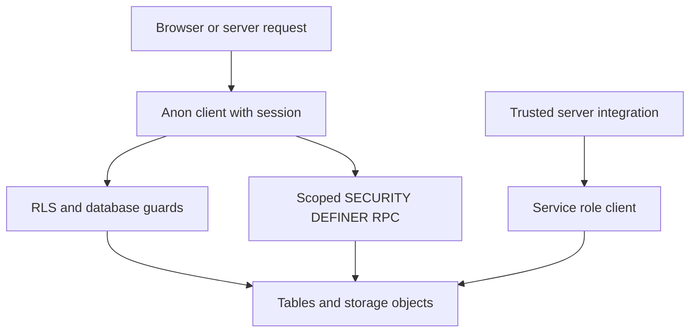
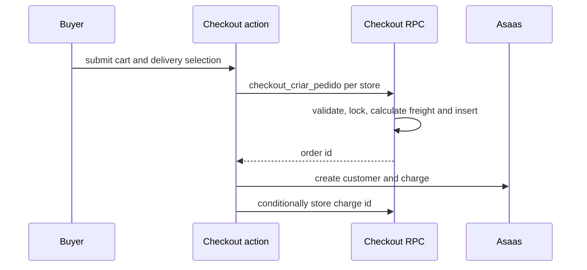
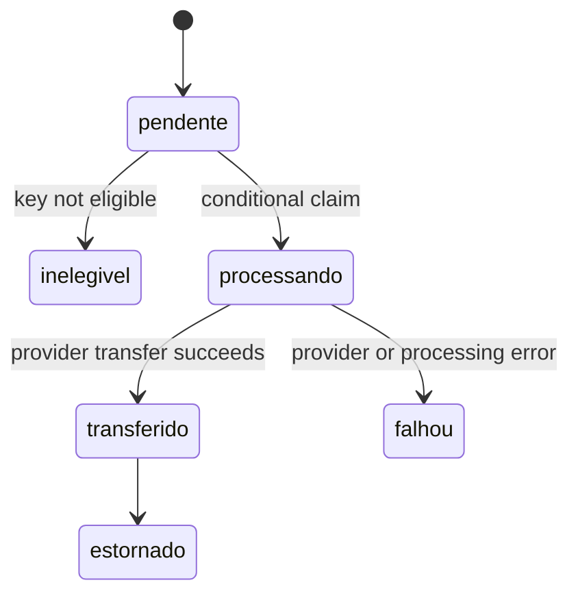

# Data Access, Security, and Schema Evolution

Supabase is both the persistence layer and the final authorization boundary. UI role gates and server actions improve the experience but do not authorize a database operation. Normal user traffic is constrained by session-aware RLS; field integrity, privileged workflows, and secrets are protected by database triggers, narrowly granted `SECURITY DEFINER` routines, and server-only service-role code.

## Trust boundaries and client selection

All client factories use the generated `Database` type. It provides TypeScript query checking only: it neither changes deployed schema nor grants access.

| Entry point | Credential and context | Appropriate use |
| --- | --- | --- |
| `src/lib/supabase/client.ts` → `createClient()` | Browser anon-key client; a signed-in session remains subject to RLS. | Normal browser reads and writes. |
| `src/lib/supabase/server.ts` → `createClient()` | Anon-key server client carrying the Next request cookies; user session and RLS apply. Cookie writes may be unavailable in a Server Component, where session middleware handles renewal. | Default server-side user path. |
| `src/lib/supabase/public.ts` → `createPublicClient()` | Anon key, but no cookies, persisted session, or token refresh; RLS still applies. This permits public catalogue ISR. | Fully public catalogue reads. |
| `src/lib/supabase/service.ts` → `createServiceClient()` | Server-only service-role key with no persisted or refreshed session. It bypasses RLS and fails closed when unconfigured. | Carefully bounded provider and system work. |



This shows the normal RLS path and the two deliberate exceptions: a server-only service client and a constrained RPC.

Use a normal client for product behavior. `createServiceClient()` is not an authorization shortcut: never expose `SUPABASE_SERVICE_ROLE_KEY` or import its module into browser-delivered code. A service call can pass restricted-field guards, so each entrypoint must authenticate its request and validate its input.

Session helpers support routing, not authorization. `getUser()` reports a failed `auth.getUser()` refresh and treats it as logged out. `getMinhaLoja()` explicitly filters `lojas` by `owner_id = user.id`; that predicate remains necessary because the active-store public policy can make other stores readable, and an unqualified `.limit(1)` could select the wrong store.

## Layered database authorization

### Rows, fields, and safe projections

New tables should start deny-by-default: enable RLS and add only deliberate policies. Core seller policies scope stores and related products, orders, and order lines through ownership relationships rooted at `auth.uid()`. Admin policies use `is_admin()`, a `SECURITY DEFINER` helper backed by `admins`, avoiding RLS recursion.

RLS does not protect columns once an owner can update a row. `guard_campos_restritos()` supplies that missing field-level control. For a non-admin it blocks product/store moderation changes and protected financial order and line-item fields; it also validates protected financial fields at insert, prevents deletion of paid orders or paid/transferred items, returns `OLD` on deletes, and prevents final dispute decisions or `resolvida` status. Admins and calls with no `auth.uid()` pass, as does the checkout routine's transaction-local capability.

Public access is based on narrow projections rather than unrestricted base-table reads. `lojas_vitrine` is an owner-running limited projection of active stores, and public products must be approved and belong to a store present in it. Owner-running customer, affiliate, logistics, partner, and aggregate views carry their own tenant filter and use `security_barrier = true`. Do not add `security_invoker` mechanically: it reapplies base RLS and breaks the intentionally projection-scoped pattern. A view replacement must preserve its filter, barrier, grants, and column allowlist.

Storage is a separate authorization contract. `produtos` and `lojas` objects are publicly readable, but upload/delete requires an authenticated owner of the store represented by the first object-path segment (`<loja_id>/<arquivo>`). The private `disputas` bucket is restricted to dispute participants and administrators. The `produtos`, `lojas`, and `marketplace` buckets additionally enforce a 5 MiB limit and JPEG, PNG, or WebP MIME types at the bucket layer.

### Narrow elevated write paths

Checkout is the principal user-initiated privileged write. The database `checkout_criar_pedido` validates the authenticated buyer, duplicate items, payment method, approved product, active store, stock, minimum quantity, and single-store composition while locking product rows. It calculates prices and payout values in the database, sets `app.checkout_rpc` locally, then inserts the order and lines. That bounded in-transaction capability permits guarded calculated writes without letting a browser provide a bypass flag.

The server action groups a multi-store cart and calls the RPC once per store. Those calls are independent: if a later store fails, previously created orders remain visible rather than rolling back across stores. Provider charge creation happens only after order creation and is best-effort; the order page can retry it.

Freight is likewise authoritative in the RPC, not in `frete_por_loja` from the form. For an active carrier tied to a store or global carrier, `uber_direct` uses a stored unexpired quote belonging to that store, `tabela_importada` calls `cotar_frete_tabela(v_loja, v_cep, 0)`, and the internal route uses an eligible CEP percentage range. The RPC rejects unsupported carrier/source, expired or missing quote, uncovered CEP, and prohibited pickup. It computes the order total and allocates freight across line items, assigning the residual to the final line so line freight sums exactly to order freight.



This flow separates client-supplied delivery selection from the database-calculated monetary amount; charge creation cannot undo an already-created order.

`alterar_chave_pix_loja` is another model: it authenticates and validates the caller, verifies store ownership, sets `app.chave_pix_rpc` locally for the guarded update, clears confirmation, and audits before/after values. It is executable by `authenticated`, not `public`. In contrast, provider-side PIX confirmation RPCs require `service_role` or `is_admin()` and revoke `anon`; a null `auth.uid()` is not evidence of privileged backend access.

## Asaas payment identity and encrypted personal data

The checkout action uses the service client to cache an Asaas `customer_id` and submit `cpf_cnpj`. Migration `0149` makes the database the persistence safeguard: a `BEFORE INSERT OR UPDATE` trigger encrypts a nonempty plaintext CPF/CNPJ with `pgp_sym_encrypt` using a key retrieved from Supabase Vault, stores the ciphertext in `cpf_cnpj_enc`, and clears the plaintext column. Applying the migration fails early if Vault lacks `cpf_cnpj_encryption_key`; the key is never versioned. The key lookup and on-demand decryption functions are `SECURITY DEFINER` and executable only by `service_role`.

The Asaas webhook validates its timing-safe access token and refuses to run without service-role configuration. Webhook and manual verification converge on `confirmarPagamentoPedido()`: it finds the order, treats a non-null `dt_pagamento` as the idempotency fact, requires the provider charge id and a received amount at least equal to `valor_pedido`, then conditionally writes payment fields only while `dt_pagamento IS NULL`. Only the invocation that wins that conditional update marks line items paid and emits notifications/routing; duplicate or concurrent confirmations do not repeat effects. Cancellation delegates to the service-only cancellation RPC.

## Payout ledger state and external transfer claims

Delivery confirmation may trigger `dispararRepasseAutomatico`. When both Asaas and service-role configuration exist, it recalculates the order ledger, obtains `pendente` `repasses`, verifies the seller or affiliate PIX key through the appropriate eligibility RPC, and marks missing/ineligible keys `inelegivel`.

Before calling Asaas `createPixTransfer`, `transferirRepasse` atomically updates one ledger row from `pendente` to `processando` and proceeds only if it claimed a row. Thus retries and concurrent delivery paths cannot issue a second transfer. A successful transfer becomes `transferido` with a timestamp (and marks seller line items transferred); an exception becomes `falhou` and is reported for administration. Migration `0151` expands the ledger status constraint to include this intermediate claim state. Existing deduplication and recalculation changes must be deployed consistently with that state machine.



This is the ledger lifecycle relevant to automatic transfer processing; the conditional transition is the duplicate-payment barrier.

## Moderation state at insertion

A seller-created store is no longer implicitly catalogue-ready. Migration `0152` expands `lojas.situacao` to `Ativa`, `Inativa`, or `EmAnalise`, makes `EmAnalise` the default, and adds `guard_loja_insert_moderacao`. A non-admin authenticated insert must use `EmAnalise`; admin, service/postgres calls, and the checkout capability follow the established guard pattern. Existing stores are not changed. The existing restricted-field guard still limits later situation changes to admins, and public catalogue behavior remains tied to active stores.

## Migration discipline and verification

Schema changes are migration-led. A TypeScript cast cannot create a column, RPC, relation, policy, or view; localized `as any` adapters around generated-type drift are compatibility boundaries, not authorization bypasses.

1. Inspect migrations, deployed/generated types, grants, policies, triggers, views, and callers before changing DDL or a query.
2. Select a unique numeric migration prefix across branches. Verify before push with `cd supabase/migrations && ls | grep -oE '^[0-9]{4}' | sort | uniq -d`.
3. Rehearse production data changes in a transaction and verify the actual target schema with `to_regclass` or `information_schema`, not migration history alone.
4. Add RLS and narrow policies for each new table, and explicitly define grants and authorization for every RPC, trigger, view, and storage convention.
5. Regenerate `src/lib/supabase/database.types.ts` from the real schema and inspect it. Type generation without a token can truncate the file.

Run the database smoke check with:

```sh
supabase db query --linked --file supabase/tests/rls_smoke.sql
```

It runs transactionally and rolls back. It checks RLS enablement, tenant filters and sensitive projections in owner-running views, cross-tenant reads under an arbitrary authenticated JWT, and rejection of the cancellation RPC for that JWT. Missing objects are noticed and skipped for cross-environment use, so rollout verification must also assert required schema presence.

CI on pull requests to and pushes to `master` independently runs Gitleaks, lint/build with high-severity `npm audit`, Vitest, and migration-prefix collision checks. Those checks complement rather than prove database authorization; changes to policies, guards, RPCs, views, Storage, checkout freight, or payout claims need a focused linked-database test.

## Change review checklist

- Does normal user work use the session-aware client rather than service role?
- Are row scope and ambiguous ownership queries explicit, and are moderation/payment/payout fields guarded below the UI?
- Does every elevated routine fix its search path, authenticate its caller, check tenant ownership where applicable, and have minimal execute grants?
- Is a client-provided money value recomputed or verified by a trusted database/provider source?
- Does a ledger side effect have an atomic state claim before the external call and a durable failure state afterward?
- Does a new store or product remain out of public projections until the authorized moderation transition?
- Did the migration check prefix uniqueness, real schema state, generated types, and a focused transactional database proof?

## Related pages

- [System map](/openwiki/architecture/system-map.md)
- [Marketplace catalog and roles](/openwiki/concepts/marketplace-catalog-and-roles.md)
- [Authentication and role onboarding](/openwiki/workflows/authentication-and-role-onboarding.md)
- [Checkout, payment, and order lifecycle](/openwiki/workflows/checkout-payment-and-order-lifecycle.md)
- [Verification strategy](/openwiki/testing/verification-strategy.md)
