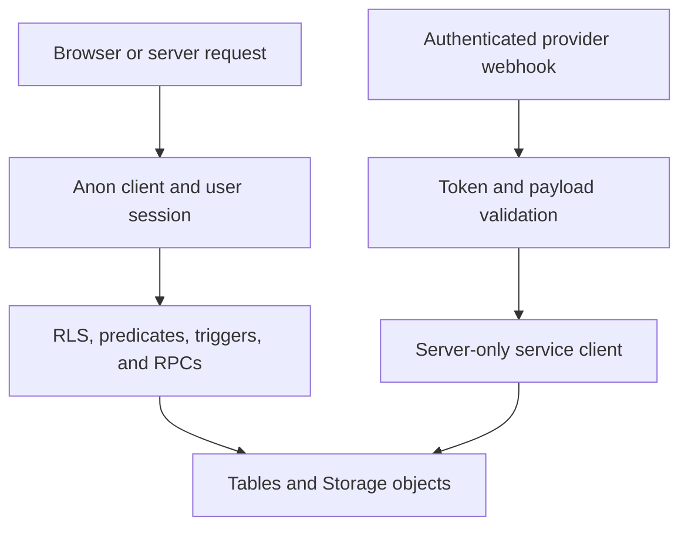

# Data Access, Security, and Schema Evolution

Supabase is the persistence layer and the authorization authority. UI and layout gates make protected areas usable and reduce accidental exposure, but they do not authorize a database operation. Database RLS, explicit tenant predicates, triggers, and narrowly scoped RPCs decide whether a row or protected field may change.

## Select a client for the trust boundary

All client factories use the generated `Database` type. It gives TypeScript query checking against a captured schema; it does not create database objects or grant access.

| Entry point | Credential and context | Appropriate use |
| --- | --- | --- |
| `src/lib/supabase/client.ts` → `createClient()` | Browser client with the anon key. A user session, when present, is evaluated by RLS. | Normal Client Component reads and writes. |
| `src/lib/supabase/server.ts` → `createClient()` | Anon-key server client wired to Next request cookies. Session context and RLS still apply. | Default Server Component, Server Action, and Route Handler access. |
| `src/lib/supabase/public.ts` → `createPublicClient()` | Anon key without cookies, persisted session, or token refresh. RLS still applies. | Public catalogue reads that must remain compatible with ISR. |
| `src/lib/supabase/service.ts` → `createServiceClient()` | Server-only service-role key; no persisted or refreshed session. It bypasses RLS and fails if unconfigured. | A reviewed provider webhook or system job after its caller boundary has authenticated and validated input. |



This separates normal session access from the service-role path, which must be preceded by a dedicated authentication and validation boundary.

Do not use service role as an application authorization shortcut, expose `SUPABASE_SERVICE_ROLE_KEY`, or import its factory into browser-delivered code. Environment values are trimmed to avoid BOM/whitespace failures, but configuration is deliberately non-throwing at import time so the UI can show an honest unconfigured state. The Asaas webhook is an example of the required privileged boundary: it compares the access token in constant time, rejects an absent service configuration, accepts only recognized event shapes, and delegates payment meaning to shared logic. That service function checks the order exists, makes repeated notifications idempotent using `dt_pagamento`, matches the charge id and received amount, and conditionally updates the still-unpaid order before marking its lines paid. Notification and dispatch side effects are best-effort after the payment write.

## Session, route, and browser protections

`getUser()` treats an exception from `auth.getUser()` as logged out after sending it to Sentry. Application helpers resolve panel destination and roles, but they are not authorization authority. Keep explicit predicates even where RLS exists: `getMinhaLoja()` filters `lojas` by `owner_id = user.id` because public visibility of active stores means an unqualified `.limit(1)` can select another seller’s store. Similar helper predicates prevent an admin’s broader RLS visibility from being mistaken for the caller’s own affiliate or logistics membership.

The proxy refreshes Supabase session cookies, redirects unauthenticated requests for `/admin`, `/seller`, `/afiliado`, and `/parceiro` to login, and applies CSP. It intentionally does not query roles; route-group layouts independently check the fine-grained admin, store-owner, affiliate, or logistics-partner condition, accommodate the documented onboarding exceptions, audit a role denial, and redirect. This is defense in depth: direct API/database requests remain governed by database controls.

Protected panel routes receive a per-request nonce CSP with `'strict-dynamic'` and no `'unsafe-inline'` in `script-src`; public and onboarding routes retain the compatible policy needed for static/ISR rendering. Common directives restrict connections, frames, objects, base URL, form actions, and allowed image origins. CSP limits browser injection/exfiltration risk, but it is not a substitute for server-side authorization.

`registrar_acesso_negado()` is a narrowly granted `SECURITY DEFINER` audit RPC: it does nothing for no session and otherwise records route and expected role in `auditoria_eventos`. It supports observability of layout denials without granting clients a direct audit-table insert policy.

## Database authorization and integrity

### RLS scopes rows; guards scope fields

New tables start deny-by-default: enable RLS and add no policy until the business rule is established. Core seller access is rooted in `auth.uid()`: store ownership flows into products, centres, affiliations, orders, and line items. `is_admin()` is a `SECURITY DEFINER` membership helper backed by `admins`, avoiding policy recursion; ordinary users can read only their own membership row.

RLS authorizes rows, not individual columns. `guard_campos_restritos()` closes that gap. Regular users cannot self-approve products, alter store moderation state, set protected financial order/line fields, change a PIX key directly, or finalize a dispute. The current guard validates sensitive values at insert as well as update, rejects non-admin deletion of paid orders/items, and returns `OLD` on delete. Service/postgres calls and administrators pass the guard, which is why a service call needs its own trusted caller boundary.

Some legitimate writes require a bounded database capability rather than a broad exception:

- Checkout validates and calculates within its database function, sets transaction-local `app.checkout_rpc`, then inserts the calculated order and lines. The guard only recognizes that setting in the same transaction.
- `alterar_chave_pix_loja` authenticates the caller, validates format and ownership, sets local `app.chave_pix_rpc`, clears confirmation, and writes an audit event. Direct changes remain blocked; execute is granted to `authenticated`, not `public`.
- PIX confirmation functions test `auth.role() = 'service_role'` or `is_admin()` and remove anonymous execution. A null `auth.uid()` does **not** demonstrate a trusted backend caller.

The database also owns business invariants beyond access. Inventory movement records are immutable, balance updates serialize on the product/centre balance row and cannot become negative, and seller adjustment occurs through an ownership-checking `SECURITY DEFINER` RPC that requires a reason. The ledger’s first milestone mirrors `produtos.estoque_atual`; it is not yet the source of checkout writes. A later delivery/cancellation guard prevents inventory restoration and payout reversal after any item has been delivered, including partial delivery, and records the skipped restoration for audit.

Sensitive payment identity is protected at rest too. The CPF/CNPJ trigger encrypts a non-empty `asaas_clientes.cpf_cnpj` with a Vault-held key then clears the plaintext column. Its key lookup and decrypt RPC are executable only by `service_role`; applying the migration fails early if the Vault secret is absent.

### Views and Storage have their own contracts

`lojas_vitrine` is an owner-running, minimal projection of active stores. Public product access requires an approved product whose store appears in that view rather than public direct reads of `lojas`. Other owner-running views provide tenant-filtered customer, affiliate, and logistics data, public partner summaries, or aggregates. They retain a narrow column allowlist and in-view tenant predicate, and use `security_barrier = true` so a consumer predicate cannot be pushed ahead of that filter. Setting `security_invoker` would reapply base-table RLS and break these deliberately scoped projections; changes to a view require review as a security change.

Storage authorization is independent of application-table RLS:

- Public `produtos` and `lojas` buckets allow reads, but upload/delete policies require an authenticated owner of the store encoded as the first segment of `<loja_id>/<arquivo>`.
- Private `disputas` storage authorizes its `<disputa_id>/...` folder to dispute participants, plus administrators for reading.
- Bucket configuration limits `produtos`, `lojas`, and `marketplace` uploads to JPEG, PNG, or WebP and 5 MiB. Client validation is only usability; the bucket setting is enforced.

## Safe schema evolution

Migrations in `supabase/migrations/` are the change record. Before changing a schema-dependent feature, inspect callers, generated types, RLS policies, triggers, RPC grants, views, Storage conventions, and focused tests. A TypeScript cast or a stale generated type never establishes that a column, function, policy, or view exists in the target database.

1. Use `scripts/proximo-migration.sh` to choose a number, and run `scripts/proximo-migration.sh --checar` immediately before push. The script considers `origin/master` and migration directories across all worktrees, covering collisions not yet committed by another session. CI separately rejects duplicate four-digit prefixes.
2. Apply through the linked database, never ad-hoc HTTP: `supabase db query --linked --file <arquivo>`. Rehearse production DDL/DML in `begin;`, run a verification query, then `rollback;` first.
3. Confirm the deployed object with `to_regclass` or `information_schema`; migration history can drift and is not proof that schema exists.
4. Regenerate `src/lib/supabase/database.types.ts` from the real linked schema and inspect its diff. Generation without a token can silently truncate the file. Local `as any` / `unknown` adapters mark known type drift, not permission to invent schema.
5. Enable RLS for every new table, start with no policy, then add minimal policies, grants, triggers/RPC authorization, and focused proof for its intended access path.

## Verification and review

Run database authorization checks against the linked target, not merely TypeScript tests:

```sh
supabase db query --linked --file supabase/tests/rls_smoke.sql
```

The RLS smoke test uses a transaction and rolls back. It verifies RLS is enabled on public tables, owner-running views retain their filter and limited projection, an arbitrary authenticated subject cannot read protected tenant rows, and the service-only cancellation RPC rejects an authenticated JWT. It skips absent objects with a notice, so rollout also needs explicit schema-presence verification. `supabase/tests/0191_guarda_pedido_entregue.sql` similarly rolls back while proving restoration occurs only when no item is delivered and that cancellation refuses a delivered order.

On pull requests to and pushes to `master`, CI independently runs Gitleaks, lint/build plus high-severity `npm audit`, Vitest, and migration-prefix collision detection. These are useful repository gates, but neither UI tests nor CI compile success proves a database policy, trigger, RPC, view, or Storage policy behaves correctly.

### Change checklist

- Is ordinary user work using an anon/session client and constrained by RLS?
- Does an ambiguous query retain its explicit ownership predicate?
- Is any service-role caller authenticated and its payload validated before privileged access?
- Are field integrity, role checks, and sensitive state transitions enforced by database guard/trigger/RPC rather than a layout or UI?
- Do views preserve their filter, barrier, grants, and narrow projection; do Storage paths still satisfy their policies?
- Were migration number, linked-schema presence, generated types, RLS default, and a focused transactional test checked?

## Related pages

- [System map](/openwiki/architecture/system-map.md)
- [Marketplace catalog and roles](/openwiki/concepts/marketplace-catalog-and-roles.md)
- [External services and webhooks](/openwiki/integrations/external-services-and-webhooks.md)
- [Checkout, payment, and order lifecycle](/openwiki/workflows/checkout-payment-and-order-lifecycle.md)
- [Inventory ledger and warehouse operations](/openwiki/workflows/inventory-ledger-and-warehouse-operations.md)
- [Verification strategy](/openwiki/testing/verification-strategy.md)
