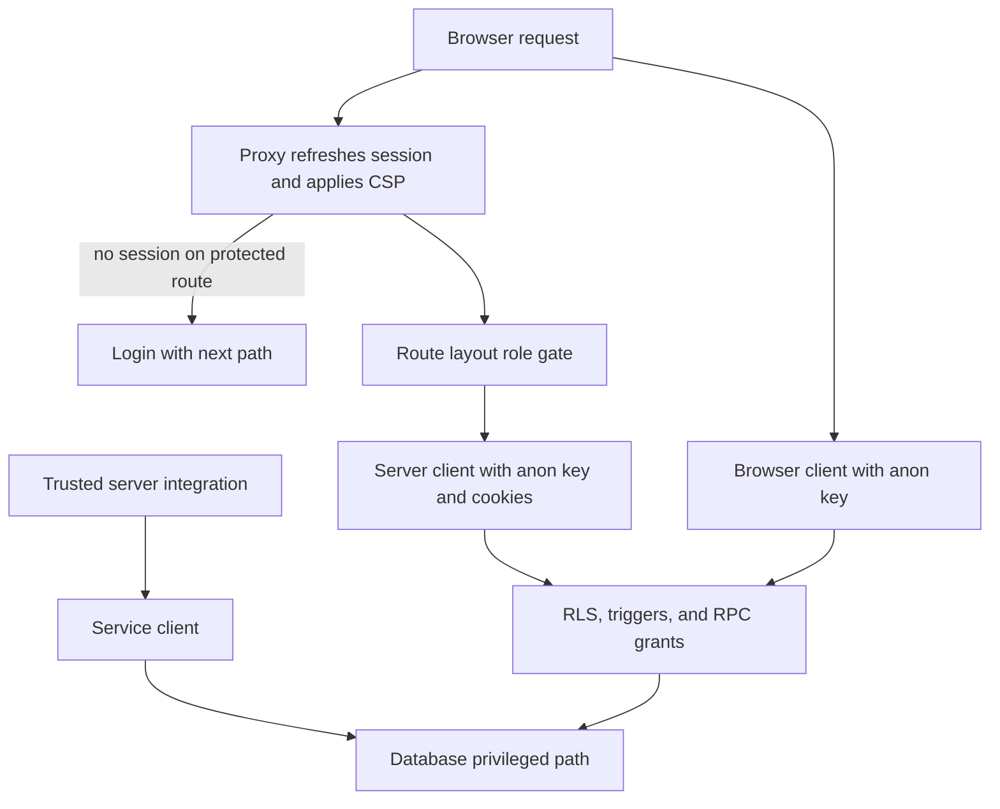

# Data Access, Authorization, and Schema Evolution

Supabase is the final data-authorization boundary. Route gates improve navigation and prevent an unauthenticated panel flash, but every normal data operation must still be constrained by the caller session and database controls. Use the service role only in reviewed server integrations; it bypasses RLS and is never a substitute for user authorization.

## Request, session, and client boundary



This shows the separate session, UI-gate, normal data-client, and privileged-server boundaries.

`src/lib/supabase/env.ts` is the single configuration check: it trims malformed environment values and exposes `isSupabaseConfigured` rather than throwing during import. All client factories use the generated `Database` type. Generated types make query code type-check against a schema snapshot; they do not create schema objects or grant access.

| Factory | Credential and context | Appropriate use |
| --- | --- | --- |
| `src/lib/supabase/client.ts` → `createClient()` | Browser client using the anon key; a signed-in session is evaluated by RLS. | Normal Client Component access. |
| `src/lib/supabase/server.ts` → `createClient()` | Anon key plus Next request cookies. Cookie writes may fail in an immutable Server Component, leaving renewal to the proxy. | Default Server Component and Route Handler access. |
| `src/lib/supabase/public.ts` → `createPublicClient()` | Anon key, no cookies, persistence, or refresh. RLS remains in force. | Public catalogue pages that need ISR. |
| `src/lib/supabase/service.ts` → `createServiceClient()` | `SUPABASE_SERVICE_ROLE_KEY`, with persistence and refresh disabled. | Narrow server-only system work. |

`createServiceClient()` throws when its key is absent. Do not import it into browser-delivered code or expose `SUPABASE_SERVICE_ROLE_KEY`. A privileged call must provide its own authentication, validation, tenant selection, and failure handling.

The Asaas webhook is an example: it rejects a bad access token and absent service configuration, delegates the payment rule to `confirmarPagamentoPedido`, and acknowledges ignored events to avoid a retry loop. The shared service function is idempotent on `dt_pagamento`, checks the stored provider charge id and received amount, and conditions the payment update on an as-yet-null timestamp so concurrent webhook and manual verification do not duplicate downstream effects.

## Session and role gates are defense in depth

The proxy refreshes Supabase cookies on requests. It redirects a request without a session only when `exigeSessao()` identifies a protected `/admin`, `/seller`, `/afiliado`, or `/parceiro` path; documented onboarding exceptions remain reachable. If the auth request itself fails, the proxy allows the request through, leaving the layout gate and RLS as the effective protections.

Fine role checks remain in route layouts and application helpers. `getUser()` reports an `auth.getUser()` refresh failure to Sentry and returns `null`. `isAdmin()` reads the caller-visible membership row, while `isSuperAdmin()` and `hasRole()` use RPCs. These are UI and flow decisions, not database authorization. Keep explicit ownership predicates where public visibility makes an otherwise limited query ambiguous: `getMinhaLoja()` filters `lojas` by `owner_id = user.id` because an active store may be publicly readable.

A role denial is auditable without becoming an authorization bypass. Layouts call `registrarAcessoNegado()` before their role redirect; the helper records failures to Sentry but does not delay the redirect. Its `SECURITY DEFINER` RPC returns without writing for no session, writes the authenticated actor, route, and expected role to `auditoria_eventos`, and is executable by `authenticated`, not `public` or `anon`.

The proxy also provides the response CSP. Protected routes receive a per-request nonce and `strict-dynamic`; the nonce and CSP are mirrored into the request headers so Next SSR can attach it. Public routes use the less strict script policy to preserve static rendering and ISR. Static security headers—HSTS, `nosniff`, frame, referrer, and permissions policies—remain configured in `next.config.ts`.

## Database authorization and integrity

### RLS scopes rows; guards constrain fields

New tables begin deny-by-default: enable RLS and add no policy until the business rule is known. Core seller policies scope stores and related products, orders, and order lines through ownership relationships rooted at `auth.uid()`. Administrator policies use the `SECURITY DEFINER` `is_admin()` helper backed by `admins`.

RLS is row authorization, not column authorization. `guard_campos_restritos()` adds field-level integrity: a regular user cannot alter product or store moderation state, or protected order and line-item financial fields. Its restored behavior validates protected finance fields on inserts, blocks non-admin removal of paid orders/items, returns `OLD` on deletes, and protects final dispute resolution fields and the `resolvida` status. Admin and no-`auth.uid()` service/postgres calls pass the guard, so service-role use needs the stricter outer boundary described above.

### Use narrowly bounded elevated writes

The checkout function sets transaction-local `app.checkout_rpc` before inserting calculated orders and line items. That same-transaction capability is the bounded exception recognized by the guard; it is not a client-controlled flag. `alterar_chave_pix_loja` similarly authenticates and validates the caller, selects only their store, sets `app.chave_pix_rpc` locally, audits before/after values, and has execute granted to `authenticated` rather than `public`.

Service-only PIX confirmation functions require `auth.role() = 'service_role'` or `is_admin()` and revoke `anon` execution. A null `auth.uid()` is not evidence of a trusted backend because anonymous callers also lack a user id.

### Views and Storage have independent contracts

`lojas_vitrine` is a narrow owner-running projection of active stores. Public product reads require an approved product whose store appears in that view instead of granting direct public reads of `lojas`. Other tenant and public projections use `security_barrier = true` and preserve their own filters and narrow column lists; changing them to `security_invoker` would reapply base RLS and break the deliberate projection pattern.

Storage policies are separate from table RLS. `produtos` and `lojas` are publicly readable but uploads/deletes require the store owner and the `<loja_id>/<arquivo>` object-name contract. The private `disputas` bucket is restricted to participants and administrators. The `produtos`, `lojas`, and `marketplace` buckets additionally enforce JPEG/PNG/WebP content and a 5 MiB limit.

## Schema evolution: inventory ledger example

Migration `0175_estoque_ledger_milestone1.sql` introduces `estoque_movimentos` and per-product/per-centre `estoque_saldos` while retaining `produtos.estoque_atual` as the write authority in this milestone. It seeds the ledger, aborts if aggregate balances do not match existing stock, then adds triggers to mirror later product-stock changes. A new store receives a default centre; deletion cannot remove a centre with stock or leave a store without a default centre.

The ledger is append-only: an update or delete trigger raises an exception, including for service-role calls, so a correction requires a compensating movement. The balance table has a non-negative constraint, and the insert-then-update trigger path serializes updates to a product/centre row. RLS exposes the two ledger tables only for reads tied through the product and store owner; there are no client write policies. Seller adjustment goes through `estoque_ajustar_produto(uuid, int, text)`, which requires login, a nonblank reason, nonnegative quantity, and ownership while locking the product row.

## Migration and type-change discipline

1. Inspect migrations, generated types, policies, triggers, grants, callers, and existing data before changing DDL or query code. Do not use casts to pretend an object exists.
2. Run `scripts/proximo-migration.sh` to choose a number and `scripts/proximo-migration.sh --checar` again before push. The script considers `origin/master` and all worktrees to avoid concurrent uncommitted collisions; CI still rejects duplicate four-digit prefixes in this checkout.
3. For data-bearing changes, rehearse `begin;`, the change, a verification query, and `rollback;`. Apply through `supabase db query --linked --file <arquivo>`, never direct `curl`.
4. Verify actual schema presence with `to_regclass` or `information_schema`, not migration history alone; history can drift.
5. Regenerate `src/lib/supabase/database.types.ts` from the real schema and inspect its diff. Type generation without a token can silently truncate the file.
6. For each table, view, trigger, RPC, or Storage convention, establish its RLS, grant, ownership, and focused verification contract in the same change.

## Verification and review

Run the transactional database smoke suite when changing authorization:

```sh
supabase db query --linked --file supabase/tests/rls_smoke.sql
```

It rolls back and checks that public tables enable RLS, owner-running views retain tenant filters and omit sensitive projections, an arbitrary authenticated subject cannot read protected tenant data, and a cancellation RPC rejects an authenticated JWT. Objects absent on a target are reported and skipped, so rollout verification must also explicitly check schema presence.

On pull requests to and pushes to `master`, CI independently runs Gitleaks, lint/build plus high-severity `npm audit`, Vitest, and migration-prefix collision checks. These checks complement, but cannot prove, the database policy, trigger, RPC, or Storage behavior exercised against a linked database.

Before merging, confirm: normal user paths use anon/session clients; RLS and explicit ownership predicates identify the intended subject; privileged routines have fixed search paths, caller checks, and minimal grants; service credentials stay server-only; views retain their barriers and projections; and the real schema, generated types, migration-number check, and focused database test agree.

## Related pages

- [System map](/openwiki/architecture/system-map.md)
- [Marketplace catalog and roles](/openwiki/concepts/marketplace-catalog-and-roles.md)
- [Quickstart](/openwiki/quickstart.md)
- [Verification strategy](/openwiki/testing/verification-strategy.md)
- [Checkout, payment, and order lifecycle](/openwiki/workflows/checkout-payment-and-order-lifecycle.md)
- [Inventory ledger and reservations](/openwiki/workflows/inventory-ledger-and-reservations.md)
