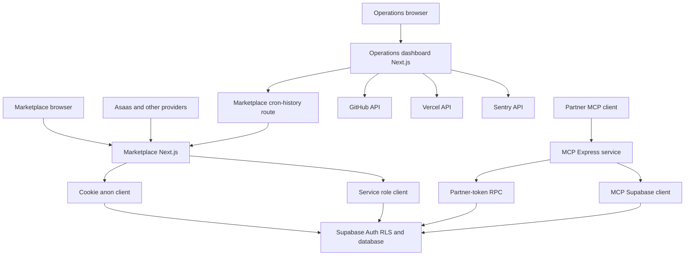
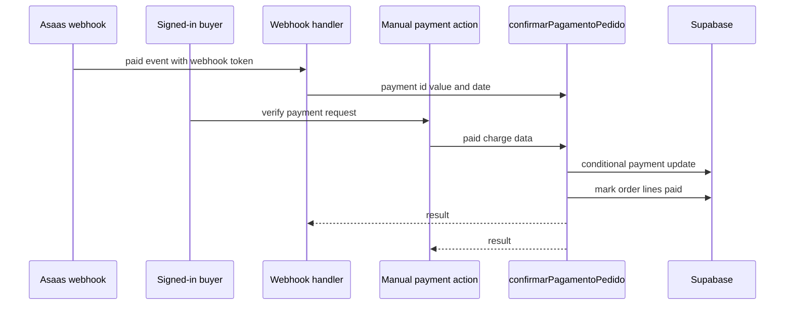

# System Map and Runtime Boundaries

This repository contains three independently deployed applications. They share Supabase as their persistence and authorization boundary, but they do not share a request-authentication context:

- **Marketplace web** (`package.json`) is the root Next.js App Router application. It serves the customer experience, role panels, Server Actions, and Route Handlers in `src/app/api/`.
- **Operations dashboard** (`dashboard-ops/`) is a separate Next.js application that presents deployment and incident data through its own server-side API routes.
- **Partner MCP server** (`mcp-server/`) is an Express service for Model Context Protocol clients. It supports both a standalone Node listener and a Vercel-function entrypoint.

Supabase is external shared infrastructure rather than an internal HTTP service of the marketplace deployment. Browser and cookie-session server code normally uses the anon key with RLS; trusted callback and system paths use the service role deliberately. See [Supabase data access, authorization, and schema evolution](/openwiki/architecture/data-access-security-and-schema-evolution.md) for client modes and database policy details.

## Deployment and trust map

This diagram shows deployment and credential boundaries: a marketplace cookie session is not an `i24_` partner token, and neither is the dashboard's server-side provider credential.

## Marketplace web runtime

The root layout supplies cart and affiliate-selection providers, the mobile tab bar, and the chat widget throughout the marketplace. Its pages include public shopping journeys and route-grouped admin, seller, affiliate, and partner panels; route groups are organizational boundaries inside the same web deployment, not additional applications.

### Authentication, destination, and panel gates

Password login is a Server Action so the application can rate-limit by both normalized email and forwarded IP, verify Turnstile, and establish the Supabase session before client navigation. When the login form has an explicit `next`, it only navigates to a safe internal path. Without one, the client calls the server-only `destinoPosLogin()` action rather than querying role data in the browser.

`resolverDestinoPorPapel()` gets the session user, resolves roles on the server, and passes booleans to the pure `destinoPorPapel()` function. Its stable precedence is:

1. `/admin`
2. `/seller`
3. `/afiliado`
4. `/parceiro`
5. `/` for an account with none of those roles or no session

The ordering matters because an account may hold multiple roles. The focused Vitest test locks down that precedence. A failed session refresh is reported to Sentry and is treated as logged out rather than failing page rendering. Seller-store lookup also explicitly requires `owner_id = user.id`, because public store visibility could otherwise return another active store.

The `/parceiro` layout is a **session gate**, not proof of a logistics-partner record: an unauthenticated request redirects to `/login?next=/parceiro`. A signed-in user without a partner registration is intentionally allowed through this layout so the registration page under the same layout remains reachable. Page-level workflows must make the enrollment decision separately.

### HTTP and privileged boundaries

Route Handlers are externally callable adapters; each establishes its own caller trust and does not inherit a browser session merely by living beside pages. Representative boundaries include public cookie-free catalogue reads with process-local per-IP limiting, signed-in cart and freight requests, provider webhooks, and scheduler-token work.

The cookie-aware server Supabase client retains RLS and can tolerate immutable Server Component cookies. The server-only service client disables session persistence/refresh and throws if `SUPABASE_SERVICE_ROLE_KEY` is unavailable; it must not be moved into client code or used as a replacement for an end-user session.

`next.config.ts` applies security headers to every route and rewrites `/webhooks/uber-direct` to `/api/webhooks/uber-direct`.

## Payment confirmation convergence

Asaas payment completion has two entrypoints but one business convergence point:

This is the two-input, one-confirmation path. The webhook first performs a timing-safe token check and requires service-role availability. It ignores malformed, unsupported, or unmatched events with a successful response to avoid provider retry loops. Paid events call `confirmarPagamentoPedido()`; cancellation events call the stock-return cancellation RPC.

The buyer-triggered fallback in `src/app/pedido/[id]/actions.ts` is deliberately authenticated and rate-limited. It uses the buyer's RLS-constrained `pedidos_cliente` view to establish order ownership, asks Asaas for the stored charge, and invokes that same confirmation routine only when Asaas reports it paid.

`confirmarPagamentoPedido()` is the durability and idempotency boundary. It verifies that the stored charge ID matches and that the received amount is at least the order amount. `dt_pagamento` is its idempotency fact: the conditional update requires it to be null, so concurrent webhook and manual paths permit only the winner to mark the order and lines paid or initiate side effects. After durable payment, WhatsApp/email notification and delivery dispatch are best effort; failures are reported without undoing payment. Internal automatic dispatch is tried first; eligible orders without an internal run can fall back to Uber Direct.

See [Checkout, payment, and order lifecycle](/openwiki/workflows/checkout-payment-and-order-lifecycle.md) for the user-facing lifecycle and [External services and webhooks](/openwiki/integrations/external-services-and-webhooks.md) for provider configuration.

## MCP partner runtime

The MCP application exposes stateless `POST /mcp` and `GET /health`. Every protocol POST must present an `i24_` Bearer token, hashed and validated through `api_validar_token`; a fresh MCP server and transport are created for each request. `GET` and `DELETE` protocol requests return 405. When `ALLOWED_HOSTS` is set, the transport enables DNS-rebinding protection.

Partner tokens produce a store and scope context. Write tools require a write-scoped token **and** the relevant `MCP_WRITE_ENABLED` module, constrain catalogue/order mutations to the token store, and register outcome through `api_registrar_uso`. The checkout tool is intentionally a two-principal flow: it additionally requires a buyer Supabase access token, validates it via an anon client, groups items by store, and uses `checkout_criar_pedido`. It returns order URLs; it does not start an Asaas charge.

## Operations dashboard runtime

The independent dashboard browser polls its own GitHub, Vercel, Sentry, and cron routes every 30 seconds. Those routes fetch upstream services server-to-server and return JSON errors when upstream work fails. Its cron route holds `CRON_SECRET` and forwards it to the marketplace cron-history route, which independently validates the secret. This is a cross-deployment machine credential, not a marketplace user session.

`GET /api/push-metrics` fetches dashboard data without cache, turns available values into named metrics, and sends them to Grafana Prometheus remote write with configured credentials. The dashboard routes shown do not authenticate viewers themselves, so deployment access controls must protect operational and provider-derived data.

## Operating and change checklist

1. Choose the caller and credential boundary before changing a flow: public anon, browser session, provider token/signature, scheduler secret, MCP partner token, buyer access token, or dashboard credential.
2. Keep role navigation as a usability decision and retain RLS/RPC checks as the authorization decision. Preserve the server-side destination precedence when adding a role.
3. Keep all payment paths converged on `confirmarPagamentoPedido()` and retain the conditional durable update before notification or routing work.
4. Keep service-role keys and provider secrets deployment-only. An unavailable service role is an explicit failure state, not permission to fall back to a browser client.
5. Run `npm run lint`, `npm run build`, and `npm run test` for marketplace changes; run `npm run build` in `mcp-server`; run `npm run lint` and `npm run build` in `dashboard-ops`.

## Related pages

- [Quickstart](/openwiki/quickstart.md)
- [Authentication and role onboarding](/openwiki/workflows/authentication-and-role-onboarding.md)
- [Checkout, payment, and order lifecycle](/openwiki/workflows/checkout-payment-and-order-lifecycle.md)
- [Supabase data access, authorization, and schema evolution](/openwiki/architecture/data-access-security-and-schema-evolution.md)
- [External services and webhooks](/openwiki/integrations/external-services-and-webhooks.md)
