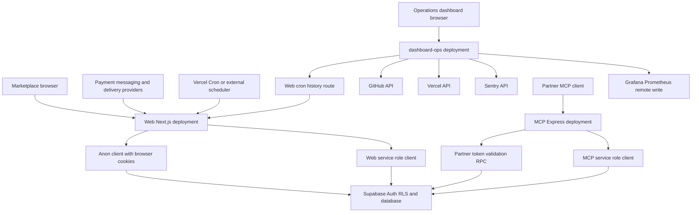
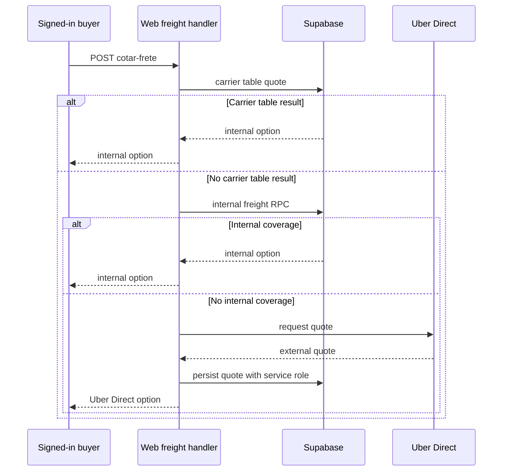

# System Map and Runtime Boundaries

This repository contains **three separately deployable applications** that share a Supabase backend but do not share an authentication context:

- The root `web` project is the customer-facing Next.js App Router marketplace. It serves pages and client UI, Server Components, and HTTP Route Handlers under `src/app/api/`.
- `mcp-server/` is an Express Model Context Protocol (MCP) service for partner agents. It supports standalone Node hosting and a Vercel function entrypoint.
- `dashboard-ops/` is a separate Next.js operations dashboard. Its browser polls its own server routes, which query operational providers and the marketplace cron-history endpoint.

Supabase is the shared persistence and authorization boundary, not an internal HTTP service owned by one deployment. Marketplace browser and cookie-session server paths use the anon key under RLS. Trusted callbacks, ticks, and integration writes explicitly use the service role. The operations dashboard does not directly access Supabase. For policy and schema detail, see [Supabase data access, authorization, and schema evolution](/openwiki/architecture/data-access-security-and-schema-evolution.md).

## Runtime boundary map

This diagram shows deployment, caller, and credential boundaries. A marketplace cookie session is not a provider secret; an MCP `i24_` token is not a buyer session; and dashboard provider credentials do not authenticate a browser user to the marketplace.

## Marketplace Next.js application

### Pages, route groups, and request protection

The root layout makes `CarrinhoProvider`, `SelecaoAfiliadoProvider`, `TabBarMobile`, and `ChatWidget` available across routes. The dynamic home page reads the session and CEP cookies, revalidates the Supabase session alongside cached catalogue data, and filters product sections by delivery coverage. It renders an explicit error state when Supabase is unconfigured; without a CEP, it withholds product listings.

Public shopping routes such as `/`, `/busca`, `/produto/[id]`, `/loja/[id]`, `/carrinho`, `/checkout`, and `/pedido/[id]` coexist with route-grouped `/admin/*`, seller, affiliate, partner, and delivery panels in the same deployment. These groups are UI/navigation organization, not separate applications. Role checks supplement RLS: `getMinhaLoja()` explicitly filters `lojas` by `owner_id = user.id`, avoiding an active public store belonging to another seller.

`src/proxy.ts` is the edge request layer for the web deployment. It refreshes Supabase cookies when configuration is available, redirects unauthenticated requests for session-required panels to `/login`, and issues a per-request CSP. It uses a nonce-based strict CSP for selected panel/login paths and a less strict public-route CSP so public static/ISR rendering remains possible; detailed role authorization stays in layouts and RLS rather than the proxy.

The root Next configuration supplies static security headers on every route, permanent redirects for retired landing paths, and rewrites `/webhooks/uber-direct` to `/api/webhooks/uber-direct`. It also rewrites the root of `vender.industria24.com.br` to `/venda-no-industria` without changing the campaign hostname.

### Supabase client modes

The web application intentionally separates clients by trust and rendering context:

- `src/lib/supabase/client.ts` creates a browser anon client.
- `src/lib/supabase/server.ts` creates a cookie-aware anon server client for Server Components, Server Actions, and Route Handlers. It retains RLS and tolerates immutable Server Component cookies because the proxy refreshes sessions.
- `src/lib/supabase/public.ts` creates a cookie-free anon client with persistence and refresh disabled. It supports ISR-compatible public catalogue reads without calling `cookies()` while retaining RLS.
- `src/lib/supabase/service.ts` creates a server-only service-role client with persistence and refresh disabled and throws if its key is unavailable.

Do not move the service-role client into pages or client components. It is for trusted callbacks, scheduled work, and system writes—not a substitute for an end-user session. Authentication helpers likewise treat a failed session refresh as logged out after reporting it to Sentry.

### Route Handlers as HTTP adapters

`src/app/api/**/route.ts` endpoints are distinct from pages and Server Actions. Each establishes caller trust independently; sharing a deployment does not give a callback or scheduler a browser session.

| Caller/context | Representative endpoint | Boundary and effect |
| --- | --- | --- |
| Public browser read | `GET /api/categorias`, `GET /api/busca-preview` | Cookie-free public client plus in-memory per-IP limiting. The limiter is process-local and is not shared across serverless instances. |
| Signed-in browser | `POST /api/carrinho/sync` | Requires the cookie-session user, upserts the abandoned-cart mirror, and clears `lembrete_enviado_em` after item changes. |
| Signed-in browser | `POST /api/checkout/cotar-frete` | Authenticates and rate-limits the buyer, then applies freight-source precedence. |
| Provider machine | `POST /api/asaas/webhook`, `POST /api/bot/whatsapp/webhook`, `POST /api/webhooks/uber-direct` | Uses provider-specific token or signature verification and service-role work; it has no marketplace browser session. |
| Trusted automation | `POST /api/curadoria-ia`, ticks under `/api/**/tick` | Requires a dedicated secret and performs bounded system work. |

## Marketplace asynchronous paths

### Freight, payment, and delivery

Freight pricing stays out of client authority. The checkout handler first returns an applicable carrier-table price, then an internal freight RPC result. Only when neither is available does it request an Uber Direct quote and persist the quote using service role before returning it. Provider or persistence failures are reported to Sentry and return no option rather than an invented price.

This sequence shows freight precedence and the service-role persistence of a provider quote after buyer authentication and rate limiting.

Payment completion is asynchronous. The Asaas webhook validates its token and service-role availability, then delegates paid events to a shared confirmation routine. The routine is idempotent for payment states, verifies the stored charge ID and minimum order amount, marks the order and lines paid, then performs notification and delivery routing as best effort. Cancellation events use the stock-return cancellation RPC. A manual payment-verification path calls the same confirmation routine. See [Checkout, payment, and order lifecycle](/openwiki/workflows/checkout-payment-and-order-lifecycle.md).

The Uber Direct webhook maps recognized delivery states to internal route state using service role. Its HMAC check rejects bad signatures only when `UBER_DIRECT_WEBHOOK_SIGNING_KEY` is configured; with no signing key the current code accepts callbacks. Configure the key before treating the endpoint as authenticated.

### Chat, WhatsApp, and AI ingress

The site chat endpoint persists conversations with service role, but order and dispute lookup tools use the caller's cookie-session client and RLS. This maintains account-data disclosure in the browser session context even though conversation storage is privileged.

The Meta WhatsApp webhook has a separate identity model. It validates the raw-body HMAC, finds or creates an open conversation keyed by sender phone, and can resolve an account from supplied contact information. Before disclosing an order, it also requires the stored order contact phone to match that sender. A resolved identity therefore does not by itself grant order disclosure. The CrewAI curation ingress instead authenticates with `CREWAI_CURADORIA_TOKEN`, confirms that the referenced product exists, and inserts a typed suggestion for later human admin application or discard.

### Scheduled and externally triggered ticks

`vercel.json` declares four daily marketplace jobs. Vercel calls their `GET` surfaces with `Authorization: Bearer $CRON_SECRET`; each rejects an absent or mismatched secret. Their `POST` surfaces are for manual or other schedulers and instead require `ASAAS_WEBHOOK_TOKEN`.

| Vercel path and schedule | Work and durable behavior |
| --- | --- |
| `/api/carrinho/abandono/tick` at `0 12 * * *` | Reminds carts idle at least one hour. It marks a reminder after successful email or a terminal undeliverable recipient; WhatsApp is best effort. |
| `/api/estoque/alerta/tick` at `0 11 * * *` | Emails each affected seller about critical/out-of-stock products and records suppression keys so unchanged states are not repeatedly sent for seven days. |
| `/api/venda-futura/avisos/tick` at `0 13 * * *` | Sends buyer and seller WhatsApp reminders on the eve and day of a future-sale forecast. It records an item/milestone key only after at least one delivery succeeds. |
| `/api/estoque/reservas/expirar` at `30 5 * * *` | Calls `estoque_reservas_expirar` to return expired unpaid reservations and cancel eligible orders. Checkout independently expires reservations before stock decisions, so a stopped cron makes displayed stock conservative rather than oversold. Buyer notification is best effort after the RPC. |

All four ticks record cron events and require service role for their system reads/writes. `POST /api/coletivas/tick` has no repository scheduler declaration: an external scheduler or manual caller must provide the Asaas token. It runs collective-purchase stages, while page reads can also perform lazy closure, so missing ticks delay notices rather than money handling. `GET /api/observabilidade/cron` independently requires `CRON_SECRET` before returning persisted cron events.

## MCP partner application

The MCP process is a separate partner-facing deployment. `mcp-server/src/http.ts` starts its Express app at `HOST` and `PORT`, defaulting to `0.0.0.0:3333`; `mcp-server/api/index.js` re-exports the compiled app for Vercel. It provides `GET /health` and stateless Streamable HTTP `POST /mcp`; explicit `GET` and `DELETE /mcp` requests return 405.

Each protocol POST must have an `i24_` Bearer token. MCP hashes the token and validates it through the `api_validar_token` RPC, yielding key, store, and scope context. It builds a fresh server and transport per request and closes both on response close. If `ALLOWED_HOSTS` is configured, transport DNS-rebinding protection is enabled.

MCP has a separate service-role Supabase client. Read tools expose only an enumerated table set, product search, and logistics tracking. Write tools require both a write-scoped partner token and the relevant `MCP_WRITE_ENABLED` module; catalogue and order mutations are constrained to the token's store, and `api_registrar_uso` records write success or failure.

`industria24_finalizar_compra` is a two-principal exception. The partner token authorizes the tool, but a separate buyer Supabase access token authenticates the buyer. MCP creates an anon client with that buyer token, groups items by store, invokes `checkout_criar_pedido` for every group, and returns order URLs without initiating an Asaas charge. See [AI assistance and customer channels](/openwiki/integrations/ai-assistance-and-customer-channels.md) for customer-facing agent boundaries.

## Operations dashboard application

`dashboard-ops/` is an independent Next.js deployment for operational visibility rather than a marketplace admin panel. Its client page polls `/api/github`, `/api/vercel`, `/api/sentry`, and `/api/cron` every 30 seconds. Those routes collect server-side provider data and return JSON errors when upstream calls fail.

The dashboard's `/api/cron` proxies to `https://industria24.com.br/api/observabilidade/cron`. It must hold the same `CRON_SECRET` as the marketplace and forwards it as a Bearer token; the marketplace independently validates that token before its service-role read. This is a cross-deployment machine credential, not an end-user Supabase session.

`GET /api/push-metrics` fetches the dashboard's GitHub, Vercel, and Sentry route data without cache, converts available numeric values to named metrics, and sends them to Grafana Prometheus remote write with configured credentials. These operational routes are provider-credential and side-effect surfaces, not marketplace APIs.

## Change and test checklist

1. Select the caller and trust context first: cookie session, public anon read, provider signature/token, `CRON_SECRET`, MCP partner token, buyer access token, or dashboard server credential.
2. Use Server Actions for user-initiated work in the cookie/RLS context and Route Handlers for external HTTP boundaries. Do not imply a webhook or tick has a logged-in user.
3. Keep service-role keys and all provider, cron, MCP, and operations credentials deployment-only. Preserve explicit unavailable behavior when service-role configuration is missing.
4. Authenticate callbacks and associate them with durable records before mutation. Keep payment confirmation durable even if notification or routing later fails.
5. Extend MCP with fixed tools/data exposure, scope and module gates, store constraints, and audit registration; never expose arbitrary database access or a service credential.
6. Run `npm run lint`, `npm run build`, and `npm run test` for `web`; run `npm run build` in `mcp-server`; and run `npm run lint` and `npm run build` in `dashboard-ops`. Focused Vitest coverage verifies freight option math and precedence, timing-safe token behavior, and fail-closed WhatsApp webhook HMAC validation.

## Related pages

- [Supabase data access, authorization, and schema evolution](/openwiki/architecture/data-access-security-and-schema-evolution.md)
- [AI assistance and customer channels](/openwiki/integrations/ai-assistance-and-customer-channels.md)
- [External services and webhooks](/openwiki/integrations/external-services-and-webhooks.md)
- [Runtime configuration and observability](/openwiki/operations/runtime-configuration-and-observability.md)
- [Checkout, payment, and order lifecycle](/openwiki/workflows/checkout-payment-and-order-lifecycle.md)
- [Inventory ledger and reservations](/openwiki/workflows/inventory-ledger-and-reservations.md)
- [Quickstart](/openwiki/quickstart.md)
