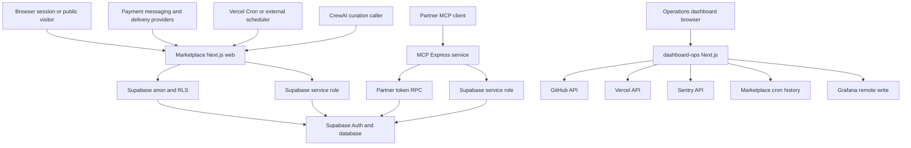
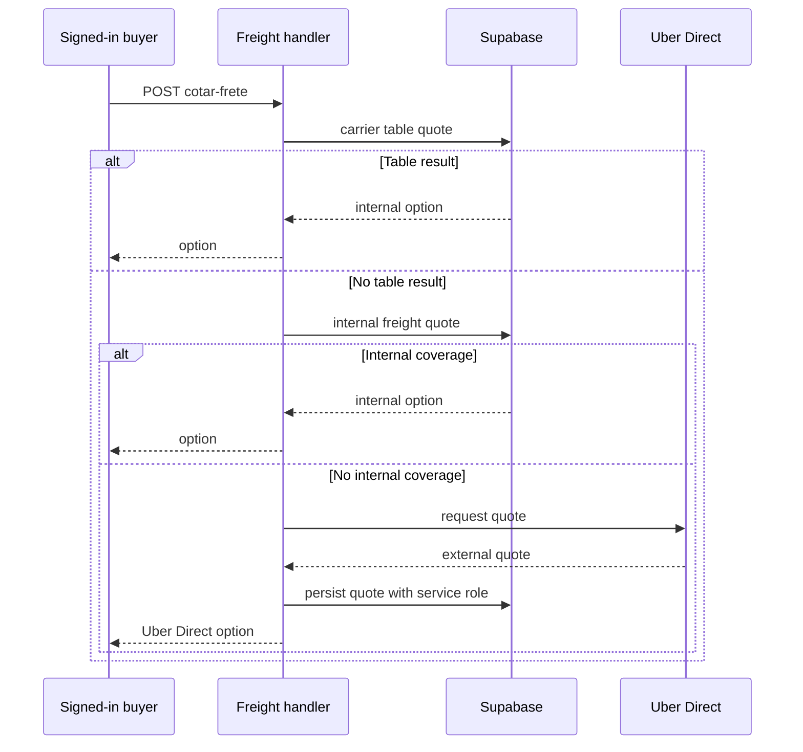

# System Map and Runtime Boundaries

This repository is a **modular monolith with three deployables**. The root `web` application is the marketplace; `mcp-server/` is a partner-facing Express MCP service; and `dashboard-ops/` is an independent Next.js operations dashboard. They share Supabase and some operational services, but they do not share an HTTP request context or credentials.

The web monolith is organized by business ownership rather than technical layer: catalogue/purchase, seller, affiliate, logistics partner, platform administration, and payments/finance. Shared platform paths—especially `src/lib/supabase/`, authentication, rate limiting, migrations, and root configuration—cross all modules and require particularly careful review. `CODEOWNERS` currently documents this boundary even though its configured owner is the same address throughout.

## Runtime context map

This diagram distinguishes callers and trust domains. A browser session, a provider signature, `CRON_SECRET`, an MCP `i24_` token, a buyer access token, and operations-provider credentials are not interchangeable authentication mechanisms.

## Marketplace web application

The root package is a Next.js App Router marketplace. It renders public and session-aware browsing, cart, checkout, orders, and role panels; it also hosts the external HTTP adapters under `src/app/api/`. The root layout provides the cart and affiliate-selection providers, mobile tab bar, site chat widget, and cookie notice across routes.

The public home page is deliberately dynamic: it uses a cookie-aware server client, session and CEP cookies, cached catalogue reads, and delivery-coverage filtering. It presents an explicit error state when Supabase is unconfigured. Without a CEP, it suppresses product listings rather than presenting merchandise that might not be deliverable.

Route groups are deployment-internal UI boundaries, not applications: `(admin)/admin`, `(seller)/seller`, `(afiliado)/afiliado`, and `(parceiro)/parceiro` map to platform administration, seller, affiliate, and logistics-partner surfaces. Public purchase surfaces remain outside those groups. Application role gates improve navigation and early rejection; RLS and scoped RPCs remain the authorization boundary. In particular, seller-store lookup adds `owner_id = user.id` because public store visibility could otherwise select another active seller's store.

### Edge proxy and browser boundary

`src/proxy.ts` refreshes the Supabase session on requests, redirects an unauthenticated request for a session-protected panel to `/login`, and emits CSP per request. It does not resolve roles: route-group layouts and database policy perform that finer check. Public routes receive a CSP compatible with static/ISR rendering; panel and login paths receive a nonce-based strict CSP. Root configuration applies the remaining security headers to every route and rewrites `/webhooks/uber-direct` to `/api/webhooks/uber-direct`.

### Supabase client boundary

Web access is intentionally split by runtime and privilege:

- Browser components use an anon browser client.
- Server Components, Server Actions, and session-aware Route Handlers use a cookie-aware anon client, retaining RLS. In immutable Server Component rendering, cookie writes can be ignored because the proxy refreshes them.
- Public/ISR reads use a cookie-free anon client with session persistence and refresh disabled, retaining RLS without calling `cookies()`.
- Trusted server callbacks and scheduled jobs use the service-role client. It has persistence and refresh disabled and throws when its key is unavailable.

Do not import the service-role client into a client component or ordinary page. It is a narrowly privileged integration boundary, not a shortcut around end-user authorization. Authentication helpers report a failed session refresh to Sentry and treat it as logged out so rendering remains available.

## HTTP entrypoints are caller-specific adapters

A Route Handler does not automatically inherit browser identity. Choose the entrypoint and client from its caller:

| Caller | Boundary and representative work |
| --- | --- |
| Public browser | `GET /api/categorias` and `GET /api/busca-preview` use the cookie-free public client and a per-IP in-memory limiter. That limiter is process-local, so it is not a global cross-instance defense. |
| Signed-in browser | Cart sync requires a session and upserts the abandoned-cart mirror; changed items reset `lembrete_enviado_em`. Freight quotation authenticates and rate-limits the buyer. |
| Payment and provider callbacks | Asaas, Meta WhatsApp, and Uber Direct authenticate with a provider token or signature and make privileged server-side mutations. They do not have browser sessions. |
| Trusted machine caller | CrewAI curation, scheduled ticks, and cron observability use dedicated bearer secrets and service role where needed. |
| Site chat | The handler persists conversation state with service role, but its order and dispute tools use the caller's cookie-session client and RLS. |

### Freight, payment, and delivery control flow

Freight quotes are server-authoritative. The checkout handler first prefers a carrier-table quote, then an internal freight RPC; only when neither is available does it call Uber Direct. It persists the external quote with service role before it returns that option. Provider errors are captured in Sentry and return no quote, rather than an invented price.

This is the precedence and persistence sequence after buyer authentication and limiting.

Asaas paid events first validate their token and service-role availability, then call one shared confirmation routine. That routine is idempotent on durable payment state, checks the stored charge ID and received minimum amount, conditionally marks the order and its lines paid, and only then performs notification and delivery routing as best effort. The shared routine is also the manual-verification convergence point; failures after the durable write must not undo a payment. Cancellation events use the cancellation path.

The Uber Direct callback maps recognized provider states to internal delivery state with service role. It only verifies `x-uber-signature` if `UBER_DIRECT_WEBHOOK_SIGNING_KEY` is configured; without that key it accepts callbacks. Treat configuring that key as a production security requirement.

### Conversational and AI ingress

Meta WhatsApp has a separate identity model from browser sessions. Its webhook verifies raw-body HMAC before processing, finds or creates a phone-bound open conversation, and can resolve an account from supplied contact information. Before it returns order information, it additionally requires the order contact phone to match the sender. The CrewAI curation endpoint instead authenticates with `CREWAI_CURADORIA_TOKEN`, confirms the product exists, and inserts a typed suggestion for a later admin application or discard.

## Scheduled work and operational lifecycle

Vercel schedules four daily `GET` handlers in `gru1`: abandoned-cart processing, stock alerts, future-sale notices, and expired stock-reservation cleanup. Each checks `Authorization: Bearer $CRON_SECRET`; their `POST` fallback accepts the Asaas webhook token for a manual or external scheduler. They use service role and record cron observability events.

The abandoned-cart worker processes carts idle for at least an hour with no reminder. A successful email, or a terminally undeliverable recipient, marks the reminder complete; an ordinary email failure leaves it eligible for retry. WhatsApp is best effort. The reservation-expiry tick is cleanup, not the stock-consistency guarantee: `checkout_criar_pedido` expires a product reservation before deciding availability, so a stalled cron can only make storefront stock conservative. Future-sale notices are idempotent through recorded alert keys and only record a key after at least one recipient receives the message.

Collective-purchase ticking has no Vercel schedule declaration. An external scheduler or manual caller must send the Asaas bearer token; it advances collective stages and records success or failure. `GET /api/observabilidade/cron` independently requires `CRON_SECRET` before returning persisted cron events.

## MCP partner service

`mcp-server/` is a separate TypeScript/Express package. Its standalone entrypoint listens on `HOST` and `PORT` with defaults `0.0.0.0:3333`; its Vercel entrypoint re-exports the built Express app. It exposes stateless Streamable HTTP `POST /mcp`, `GET /health`, and rejects `GET` and `DELETE /mcp`.

Every protocol request must carry an `i24_` Bearer token. The service hashes that token and validates it through `api_validar_token`, which supplies the partner key, store, and scope context. It builds and closes a fresh MCP server and transport per request. When `ALLOWED_HOSTS` is configured, the transport enables DNS-rebinding protection.

MCP's service-role client is an integration boundary distinct from web sessions. Read exposure is limited to a fixed table enumeration and registered tools. Writes need both a `write`-scoped partner token and an enabled module in `MCP_WRITE_ENABLED`; mutations constrain product, order, and delivery changes to the token store, and `api_registrar_uso` records both success and failure.

`industria24_finalizar_compra` deliberately combines two principals: the partner token authorizes use of the tool, while a separate buyer Supabase access token is used with an anon client to authenticate the actual buyer. It groups items by store, invokes `checkout_criar_pedido` for each group, and returns order URLs. It does not create an Asaas charge.

## Operations dashboard

`dashboard-ops/` is an independent Next.js deployment, not an in-marketplace admin panel. Its browser page polls its own GitHub, Vercel, Sentry, and cron routes every 30 seconds. Those server routes contact their provider or marketplace dependency and return JSON errors when upstream work fails.

The dashboard cron route forwards its `CRON_SECRET` to `https://industria24.com.br/api/observabilidade/cron`, where the marketplace independently checks the same secret before querying stored events. This is a cross-deployment machine credential, not a browser or Supabase login. The dashboard routes shown here do not apply viewer authentication themselves; deploy them behind an appropriate access boundary before exposing operational data.

`GET /api/push-metrics` reads the dashboard's GitHub, Vercel, and Sentry views with no cache, turns available values into named metrics, and pushes them to Grafana Prometheus remote write using configured credentials. It is an operations integration with side effects, not a marketplace API.

## Safe change checklist

1. Identify the caller first: browser session, public read, provider callback, Vercel cron, external scheduler, MCP partner, buyer token, or operations dashboard.
2. Keep domain rules in the owning module and testable `src/lib/<module>/` code; keep pages, Server Actions, and Route Handlers as UI or transport adapters.
3. Use the least privileged Supabase client. Preserve RLS for user work and reserve service role for trusted callbacks, ticks, and system writes.
4. For provider callbacks, authenticate the caller and validate its association with durable records before mutation. Preserve the payment-first/best-effort-follow-up ordering.
5. Do not expand MCP into arbitrary database access. Add fixed tools, module and scope gates, store ownership constraints, and audit registration.
6. Run root `npm run lint`, `npm run build`, and `npm run test`; run `npm run build` in `mcp-server`; and run `npm run lint` and `npm run build` in `dashboard-ops`. Focused Vitest coverage verifies freight precedence/math, timing-safe tokens, and fail-closed WhatsApp HMAC validation.

## Related pages

- [Data access, security, and schema evolution](/openwiki/architecture/data-access-security-and-schema-evolution.md)
- [Marketplace catalog and roles](/openwiki/concepts/marketplace-catalog-and-roles.md)
- [External services and webhooks](/openwiki/integrations/external-services-and-webhooks.md)
- [Runtime configuration and observability](/openwiki/operations/runtime-configuration-and-observability.md)
- [Quickstart](/openwiki/quickstart.md)
