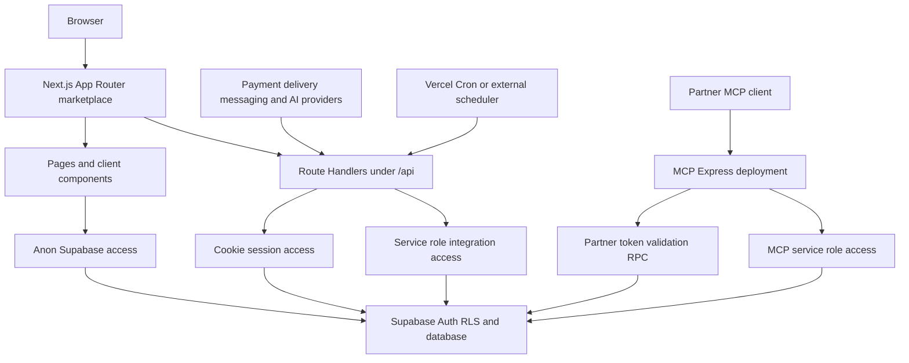

# System Map and Runtime Boundaries

This repository operates two separately deployable server systems which share Supabase but accept different callers and credentials:

- The root `web` project is a Next.js 16 App Router marketplace. It renders browser pages and implements its integration endpoints as Route Handlers under `src/app/api/`.
- `mcp-server/` is an Express implementation of the Model Context Protocol (MCP) for partner agents. It can listen as a standalone Node process or be served as a separate Vercel function.

Supabase is the shared persistence and authorization boundary, rather than an internal HTTP service owned by either deployment. Web paths normally use the anon key with an appropriate session and are therefore constrained by RLS. Service-role use is reserved for explicitly privileged server-side integration work. Database-side policy and schema details are documented in [Supabase data access, authorization, and schema evolution](/openwiki/architecture/data-access-security-and-schema-evolution.md).

## Runtime boundary map

This shows deployable and credential boundaries: provider and scheduled requests enter the Next deployment, partner protocol traffic enters MCP, and both systems access the same Supabase project.

## Next.js marketplace

### App Router surfaces and shared UI

The root layout wraps every route with `CarrinhoProvider` and `SelecaoAfiliadoProvider`, renders `TabBarMobile`, and renders `ChatWidget`. Cart and affiliate selection are consequently shared UI state rather than per-page state. The home page is explicitly dynamic: it reads session and CEP cookies, obtains the current user alongside cached catalogue data, and then filters stores and products by delivery coverage. When Supabase configuration is absent, it renders an explicit error state.

The repository has public shopping and account paths alongside route-grouped operational areas:

| Surface | Responsibility | Boundary note |
| --- | --- | --- |
| Public paths such as `/`, `/busca`, `/produto/[id]`, `/loja/[id]`, `/carrinho`, `/checkout`, and `/pedido/[id]` | Catalogue discovery, cart, checkout, and order journeys | Pages may be public or session-aware; a path is not an authorization grant. |
| `/admin/*` | Marketplace administration and operational management | Application gates support the UI; database policies remain authoritative. |
| `/seller/*` | Store-owner catalogue, order, delivery, and sales operations | `getMinhaLoja()` explicitly queries `owner_id = user.id`, preventing a publicly readable active store from being chosen. |
| `/afiliado/*`, `/parceiro/*`, and `/entregador/*` | Affiliate and logistics-facing workflows | These are App Router page surfaces, not separate services. |

Shared authentication helpers obtain the cookie-session user and role labels. A refresh failure is reported to Sentry and treated as logged out, so an invalid session does not crash the page. Application-level role checks do not replace RLS or scoped database RPCs.

### Supabase client modes

The application intentionally provides separate constructors for different trust and rendering contexts:

- `src/lib/supabase/client.ts` creates the browser client from public anon configuration.
- `src/lib/supabase/server.ts` creates an anon-key server client carrying request cookies for Server Components and Route Handlers. It tolerates an inability to write refreshed cookies from an immutable Server Component.
- `src/lib/supabase/public.ts` creates a cookie-free anon client with session persistence and refresh disabled. Because it does not call `cookies()`, public catalogue paths can use ISR while keeping RLS.
- `src/lib/supabase/service.ts` creates a server-only service-role client with token persistence and refresh disabled, and throws if its key is unavailable.

`src/lib/supabase/env.ts` is the common configuration check and normalizes environment values before client construction. Do not move the service-role client into pages or client components: it is the boundary used for trusted provider callbacks, scheduled work, and similar privileged writes.

### Route Handlers as adapters

Under the App Router, `route.ts` files implement HTTP endpoints independently of page layouts and client navigation. In this project, `src/app/api/` is an adapter boundary for browser actions, provider callbacks, and trusted machines—not a generic substitute for direct RLS-constrained application data access.

| Caller | Representative endpoint | Control flow and effect |
| --- | --- | --- |
| Public browser read | `GET /api/categorias`, `GET /api/busca-preview` | Uses the cookie-free public client and an in-memory per-IP limiter. The process-local limiter is not shared by concurrent serverless instances. |
| Signed-in browser | `POST /api/carrinho/sync` | Requires a user, upserts the abandoned-cart mirror, and resets the reminder marker whenever items change. |
| Signed-in browser | `POST /api/checkout/cotar-frete` | Authenticates and rate-limits the buyer. It prefers carrier-table then internal freight; only then does it quote Uber Direct and persist the quote before returning it. |
| Provider callback | `POST /api/asaas/webhook`, `POST /api/bot/whatsapp/webhook`, `POST /api/webhooks/uber-direct`, `POST /api/webhooks/bubblewhats` | Each endpoint has provider-specific authentication before its privileged work. See the lifecycle sections below for payment and messaging controls. |
| Trusted machine | `POST /api/curadoria-ia`, `POST /api/coletivas/tick`, `GET` or `POST /api/carrinho/abandono/tick` | These require dedicated secrets and use service role for system work. Curation inserts a proposal for human admin review rather than modifying a product directly. |

The root `next.config.ts` applies security headers to every route and rewrites the externally configured `/webhooks/uber-direct` callback path to `/api/webhooks/uber-direct`.

## Inbound lifecycles

### Checkout, payment, and delivery

Freight quotation keeps provider values out of client authority. The freight handler returns a carrier-table result first, then an internal quote; if neither exists and configuration and addresses are complete, it requests Uber Direct and persists the resulting external quote. Provider failures are captured by Sentry and yield no external option rather than a fabricated price.

Payment completion is asynchronous. The Asaas webhook validates its access token and service-role availability. For paid events, it loads the referenced order and requires the incoming charge ID to match its stored `asaas_cobranca_id` and the received amount to meet or exceed the order amount before marking the order and line items paid. Notifications and post-payment dispatch happen after durable payment and are best effort, so their failures are reported without undoing payment. Cancellation events call the stock-return cancellation RPC. See [Checkout, payment, and order lifecycle](/openwiki/workflows/checkout-payment-and-order-lifecycle.md) for the detailed domain lifecycle.

The Uber Direct webhook maps recognised delivery states onto internal route state using service role. Its HMAC check rejects bad signatures only when `UBER_DIRECT_WEBHOOK_SIGNING_KEY` is configured; without that key, the implementation accepts the callback and signals that the protection is not effective. This configuration must be present before treating that endpoint as authenticated.

### Messaging and AI

The site chat endpoint uses service role to store and process conversations but uses the caller's cookie-session anon client and RLS for order and dispute lookup tools. This keeps ordinary browser account disclosure tied to the signed-in user.

The Meta WhatsApp webhook has a distinct identity model. It verifies the raw-body HMAC before processing, creates or reuses an open conversation bound to the sending phone number, and resolves identity through the supplied contact. It does not treat the phone number or an email supplied in chat as sufficient authority: before disclosing an order it also requires the stored order contact phone to match the sender. The BubbleWhats ingress instead validates its query-string secret with a timing-safe comparison and currently consumes/logs its device and message events.

### Scheduler boundaries

Vercel schedules `GET /api/carrinho/abandono/tick` daily through `vercel.json` and injects `Authorization: Bearer $CRON_SECRET` when configured. The job selects carts idle for at least one hour with no reminder, sends email, marks the reminder after successful email, and treats WhatsApp as best effort. It records its outcome as an operational event.

`POST /api/coletivas/tick` has no repository scheduler declaration. An external scheduler or manual caller must authenticate with the Asaas webhook Bearer token; the handler runs collective-purchase stages and records success or failure. The cron observability endpoint separately requires `CRON_SECRET` and returns persisted cron events. The abandonment handler also supports a manually/external-triggered POST authenticated with the Asaas token.

## MCP partner server

The MCP process is a separate partner-facing boundary. `mcp-server/src/http.ts` starts the Express app at `HOST` and `PORT`, defaulting to `0.0.0.0:3333`. The Vercel configuration routes requests to `api/index`, which re-exports the compiled app. The app exposes `GET /health` and a stateless Streamable HTTP `POST /mcp`; its explicit GET and DELETE `/mcp` handlers return 405.

Every MCP protocol POST carries an `i24_` Bearer token. The server hashes it and validates it with the `api_validar_token` RPC, producing a key, store, and scope context. It constructs a fresh server and transport for every request and closes them with the response. Optional `ALLOWED_HOSTS` enables DNS-rebinding protection for the streamable transport.

MCP owns a separate service-role Supabase client; the credential stays inside this process. Read tools expose an enumerated table set plus product search and run tracking. Write tools are double-gated: the partner token must be `write` scoped and the appropriate module must be enabled in `MCP_WRITE_ENABLED`. Catalogue and order updates constrain the mutation to the token's store, while audit registration records write successes and failures through `api_registrar_uso`.

`industria24_finalizar_compra` is a two-principal exception. The partner credential authorizes access to the tool, but it also requires an independent buyer Supabase access token. The MCP server makes an anon client carrying that buyer token, verifies the buyer, groups requested items by store, and calls `checkout_criar_pedido` for each group. It returns the normal order URLs and does not start an Asaas charge. See [MCP partner API](/openwiki/integrations/mcp-partner-api.md) for tool contracts and rollout guidance.

## Change and test checklist

1. Choose the caller and trust boundary before adding an endpoint. Prefer RLS-constrained browser/server access for user data; use a Route Handler for a provider callback, privileged system work, or external ingress.
2. Authenticate at the provider boundary and verify the callback's association to the durable record before changing state. Keep notification failures separate from a confirmed durable payment transition.
3. Treat service-role keys, provider secrets, `CRON_SECRET`, and MCP credentials as deployment-only secrets. Missing service-role configuration must remain an explicit unavailable path.
4. Extend MCP only with fixed tool/data exposure, scope and module gates, tenant/store constraints, and audit registration; never expose arbitrary database access or the service credential.
5. Run `npm run lint`, `npm run build`, and `npm run test` for the web project, and `npm run build` in `mcp-server`. Focused Vitest tests cover freight option calculation and precedence, timing-safe token behavior, and fail-closed WhatsApp HMAC validation. Provider handlers also need exercised valid and invalid authentication paths.

## Related pages

- [Supabase data access, authorization, and schema evolution](/openwiki/architecture/data-access-security-and-schema-evolution.md)
- [External services and webhooks](/openwiki/integrations/external-services-and-webhooks.md)
- [MCP partner API](/openwiki/integrations/mcp-partner-api.md)
- [Runtime configuration and observability](/openwiki/operations/runtime-configuration-and-observability.md)
- [Checkout, payment, and order lifecycle](/openwiki/workflows/checkout-payment-and-order-lifecycle.md)
