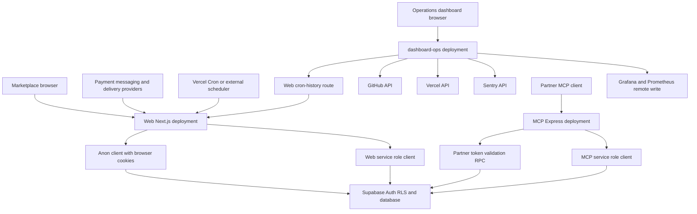
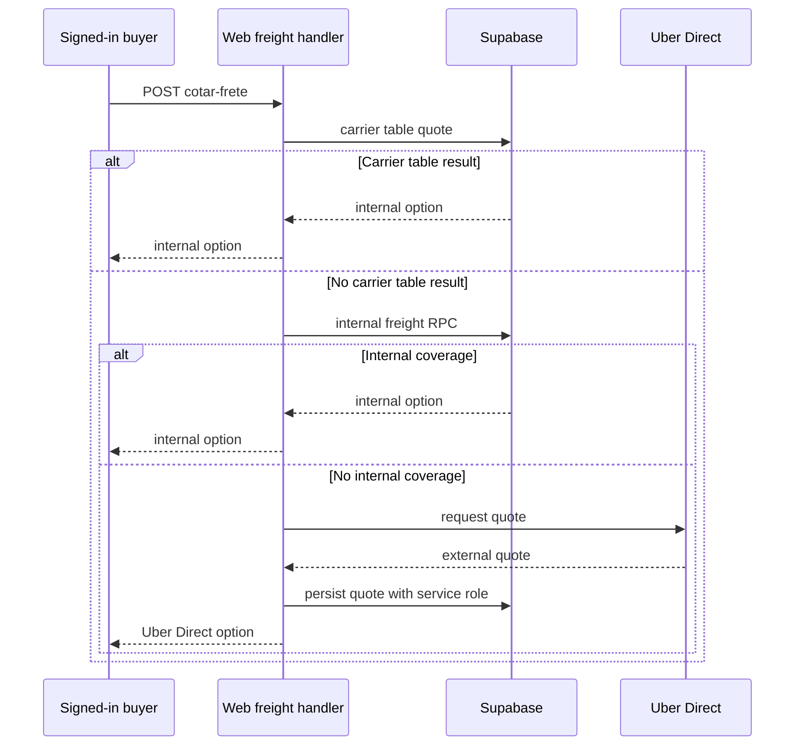

# System Map and Runtime Boundaries

The repository contains **three separately deployable applications** that share operational context but not a common request-authentication context:

- The root `web` project is the customer-facing Next.js App Router marketplace. It serves pages, Server Components and client UI, plus HTTP Route Handlers under `src/app/api/`.
- `mcp-server/` is an Express Model Context Protocol (MCP) service for partner agents. It can run as a standalone Node listener or as its own Vercel function.
- `dashboard-ops/` is a separate Next.js operations dashboard. Its browser UI polls its own API routes, which in turn query GitHub, Vercel, Sentry, the marketplace cron-history endpoint, and optionally Grafana remote write.

Supabase is the shared persistence and authorization boundary, not an internal HTTP service owned by one of these deployments. Marketplace browser and cookie-session server paths normally use the anon key and RLS; explicitly privileged integration paths use service role. The operations dashboard does **not** use Supabase directly. Database policy and schema details belong in [Supabase data access, authorization, and schema evolution](/openwiki/architecture/data-access-security-and-schema-evolution.md).

## Runtime boundary map

This maps caller, deployment, and credential boundaries. A marketplace cookie session is not a provider secret; an MCP `i24_` token is not a buyer session; and the dashboard's server-side provider credentials do not authenticate its browser user to the marketplace.

## Marketplace Next.js application

### Pages, panels, and server-side UI work

The root layout makes `CarrinhoProvider`, `SelecaoAfiliadoProvider`, `TabBarMobile`, and `ChatWidget` available across routes. The dynamic home page reads session and CEP cookies, gets the current user alongside cached catalogue data, then filters stores and products by delivery coverage. It explicitly renders an error state when Supabase is unconfigured.

Pages are presentation and navigation surfaces, not HTTP callbacks. The application includes public shopping paths such as `/`, `/busca`, `/produto/[id]`, `/loja/[id]`, `/carrinho`, `/checkout`, and `/pedido/[id]`, plus route-grouped role panels:

| Surface | Responsibility | Authentication meaning |
| --- | --- | --- |
| Public and session-aware marketplace pages | Catalogue discovery, cart, checkout, and order journeys | A public route is not an authorization grant; data access is still RLS- or RPC-constrained. |
| `/admin/*` | Marketplace administration | UI role gates supplement database policy. |
| `/seller/*` and `(seller)` routes | Store-owner catalogue, order, delivery, and sales workflows | `getMinhaLoja()` constrains lookup to `owner_id = user.id`; public store visibility must not select another seller's store. |
| `(afiliado)`, `(parceiro)`, and delivery-related routes | Affiliate and logistics workflows | These are pages within the web deployment, not separate deployables. |

Shared authentication helpers resolve cookie-session users and role labels. A Supabase refresh error is sent to Sentry and treated as logged out. This protects rendering availability, but application-level role checks do not replace RLS or scoped database RPCs.

Server Actions, where used by page/component workflows, execute in the web application's authenticated request context rather than exposing a provider endpoint. They should therefore follow the same cookie-session/RLS boundary as the server client; they are distinct from the Route Handlers below.

### Supabase client modes

The web application intentionally separates clients by trust and rendering context:

- `src/lib/supabase/client.ts` creates a browser anon client.
- `src/lib/supabase/server.ts` creates a cookie-aware anon server client for Server Components, Server Actions, and Route Handlers. It retains RLS and tolerates an inability to write refreshed cookies from an immutable Server Component.
- `src/lib/supabase/public.ts` creates a cookie-free anon client with session persistence and refresh disabled. It can support ISR public catalogue reads without calling `cookies()`, while retaining RLS.
- `src/lib/supabase/service.ts` creates a server-only service-role client with persistence and refresh disabled, and throws if its key is unavailable.

Do not move the service-role client into pages or client components. It is the privileged boundary for trusted callbacks, scheduled work, and system writes—not a substitute for an end-user session.

### Route Handlers: externally callable adapters

`src/app/api/**/route.ts` implements HTTP endpoints separately from pages and Server Actions. Each handler must establish its own caller trust; none automatically inherits a browser session merely because it lives in the same deployment.

| Caller/context | Representative endpoint | Authentication and effect |
| --- | --- | --- |
| Public browser read | `GET /api/categorias`, `GET /api/busca-preview` | Cookie-free public client plus in-memory per-IP limiting. The limiter is process-local and not shared across concurrent serverless instances. |
| Signed-in browser | `POST /api/carrinho/sync` | Requires the Supabase cookie-session user, upserts the server-side abandoned-cart mirror, and clears `lembrete_enviado_em` after item changes. |
| Signed-in browser | `POST /api/checkout/cotar-frete` | Requires and rate-limits the buyer. It tries carrier-table pricing, then internal freight, then a persisted Uber Direct quote. |
| Payment or provider machine | `POST /api/asaas/webhook`, `POST /api/bot/whatsapp/webhook`, `POST /api/webhooks/uber-direct` | Uses provider-specific tokens or signatures and service role; it has no marketplace browser session. |
| Trusted automation machine | `POST /api/curadoria-ia`, `POST /api/coletivas/tick`, `GET` or `POST /api/carrinho/abandono/tick` | Requires a dedicated Bearer secret and performs bounded system work. |

The root `next.config.ts` applies security headers to every route and rewrites the externally configured `/webhooks/uber-direct` callback path to `/api/webhooks/uber-direct`.

## Marketplace asynchronous request paths

### Freight, payment, and delivery

Freight quotation keeps provider values out of client authority: the handler returns a carrier-table result first, then an internal quote; only if neither is available does it call Uber Direct and persist the external quote before returning it. Provider failures go to Sentry and return no option rather than an invented price.

This is the freight-option precedence and persistence path; it runs only after buyer authentication and request limiting.

Payment completion is asynchronous. The Asaas webhook validates its token and service-role availability, then delegates paid events to a shared confirmation routine. That routine is idempotent for payment states, checks the stored charge ID and minimum order amount, marks the order and lines paid, and only afterwards performs notification and delivery routing as best effort. A manual verification fallback calls the same confirmation routine, avoiding duplicated credit or dispatch. Cancellation events use the stock-return cancellation RPC. See [Checkout, payment, and order lifecycle](/openwiki/workflows/checkout-payment-and-order-lifecycle.md) for the detailed domain lifecycle.

The Uber Direct webhook maps recognized delivery states onto internal route state using service role. Its HMAC check only rejects bad signatures when `UBER_DIRECT_WEBHOOK_SIGNING_KEY` is configured; with no signing key, the current implementation accepts callbacks. Configure that key before treating the endpoint as authenticated.

### Chat, WhatsApp, and AI ingress

The site chat handler persists conversations with service role, but its order and dispute lookup tools use the caller's cookie-session anon client and RLS. Thus browser account disclosure remains tied to that user session.

The Meta WhatsApp webhook has a distinct identity model: it verifies the raw-body HMAC, binds an open conversation to the sender phone, and resolves identity from supplied contact information. Before order disclosure it also requires the order's stored contact phone to match the sender; an unverified message is not equivalent to a browser session. The CrewAI curation ingress instead accepts `CREWAI_CURADORIA_TOKEN`, verifies the referenced product, and inserts a typed suggestion for later human admin application or discard.

### Scheduled and externally triggered ticks

Vercel schedules `GET /api/carrinho/abandono/tick` daily through `vercel.json`; the handler requires `Authorization: Bearer $CRON_SECRET`. It finds carts idle for at least one hour with no reminder, sends email, marks the reminder only after email succeeds, sends WhatsApp best effort, and records an operational event. The same work can be called by `POST` with the Asaas token for an external scheduler or manual trigger.

`POST /api/coletivas/tick` has no repository scheduler declaration. An external scheduler or manual caller must authenticate with the Asaas Bearer token; the handler runs collective-purchase stages and records success or failure. `GET /api/observabilidade/cron` independently requires `CRON_SECRET` and returns persisted cron events.

## MCP partner application

The MCP process is a separate partner-facing deployment. `mcp-server/src/http.ts` starts the Express app at `HOST` and `PORT`, defaulting to `0.0.0.0:3333`; `mcp-server/api/index.js` re-exports the compiled app for its Vercel function. It provides `GET /health` and stateless Streamable HTTP `POST /mcp`; explicit `GET` and `DELETE /mcp` requests return 405.

Every protocol POST must carry an `i24_` Bearer token. MCP hashes and validates it through the `api_validar_token` RPC, yielding a key, store, and scope context. It creates a fresh server and transport for each request and closes both with the response. `ALLOWED_HOSTS`, when configured, enables DNS-rebinding protection for the transport.

MCP holds a separate service-role Supabase client. Read tools expose an enumerated table set, product search, and logistics tracking. Write tools require both a write-scoped partner token and the matching module in `MCP_WRITE_ENABLED`; catalogue/order updates constrain mutations to the token's store, and `api_registrar_uso` records write success or failure.

`industria24_finalizar_compra` is a two-principal exception: the partner token authorizes the tool, but a separate buyer Supabase access token authenticates the buyer. MCP builds an anon client with that buyer token, groups items by store, invokes `checkout_criar_pedido` for each group, and returns order URLs. It does not initiate an Asaas charge. See [MCP partner API](/openwiki/integrations/mcp-partner-api.md) for tool contracts and rollout guidance.

## Operations dashboard application

`dashboard-ops/` is an independent Next.js deployment for operational visibility, rather than an admin panel inside the marketplace. Its client page polls `/api/github`, `/api/vercel`, `/api/sentry`, and `/api/cron` every 30 seconds. Those routes fetch their backing services server-to-server, cache upstream reads for 20 seconds where implemented, and return an error JSON response on failure.

The dashboard's `/api/cron` is a credentialed proxy to `https://industria24.com.br/api/observabilidade/cron`: it must have the same `CRON_SECRET` as the web deployment, and the web route verifies it. This is a cross-deployment machine credential, not an end-user Supabase session. The dashboard route implementations shown here do not perform viewer authentication themselves; deploy it behind an appropriate access boundary before treating provider-derived operational data as private.

`GET /api/push-metrics` calls the dashboard's GitHub, Vercel, and Sentry API routes without cache, converts available values into named metrics, and writes them to Grafana Prometheus remote write using its configured credentials. `GET /api/check-prom` queries Grafana for a Prometheus datasource and an example metric. These are operational endpoints with side effects or provider access, not marketplace application APIs.

## Change and test checklist

1. Start a change by selecting the caller and authentication context: browser cookie session, public anon read, provider signature/token, scheduler secret, MCP partner token, buyer access token, or dashboard server credential.
2. Use Server Actions for user-initiated application work in the cookie/RLS context; use Route Handlers for an external HTTP boundary. Never imply a webhook or tick has a logged-in user.
3. Authenticate provider callbacks and verify their association with durable records before mutation. Keep confirmed payment durable even when follow-on notification or routing fails.
4. Keep service-role keys, provider secrets, `CRON_SECRET`, MCP credentials, and operations-provider tokens deployment-only. Missing service-role configuration must remain an explicit unavailable path.
5. Extend MCP only with fixed tools/data exposure, scope and module gates, store constraints, and audit registration; never expose arbitrary database access or a service credential.
6. Run `npm run lint`, `npm run build`, and `npm run test` for `web`; run `npm run build` in `mcp-server`; and run `npm run lint` and `npm run build` in `dashboard-ops`. Focused Vitest coverage verifies freight option math and precedence, timing-safe token behavior, and fail-closed WhatsApp HMAC validation.

## Related pages

- [Supabase data access, authorization, and schema evolution](/openwiki/architecture/data-access-security-and-schema-evolution.md)
- [External services and webhooks](/openwiki/integrations/external-services-and-webhooks.md)
- [MCP partner API](/openwiki/integrations/mcp-partner-api.md)
- [Runtime configuration and observability](/openwiki/operations/runtime-configuration-and-observability.md)
- [Checkout, payment, and order lifecycle](/openwiki/workflows/checkout-payment-and-order-lifecycle.md)
- [Quickstart](/openwiki/quickstart.md)
