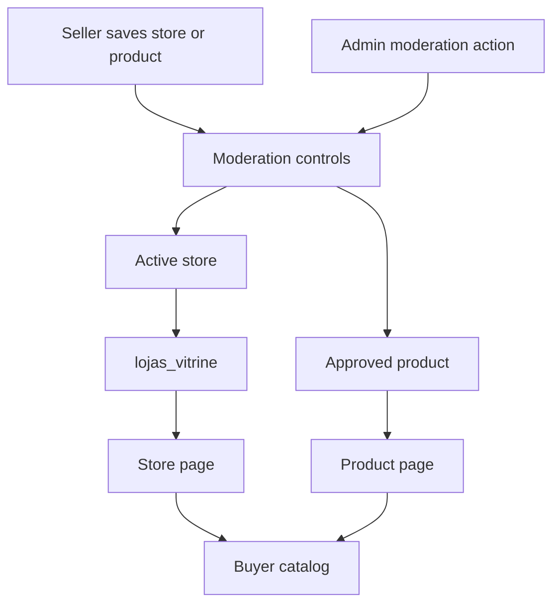
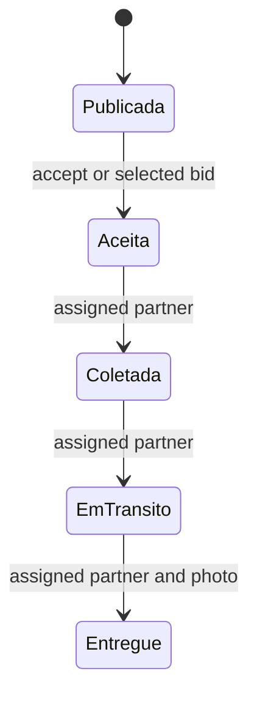

# Marketplace Catalog, Actors, and Moderation

The marketplace separates buyer-facing discovery from authenticated operating panels. A store is owned by an authenticated user, products belong to a store, and categories, images, and distribution-center links provide the catalog structure. Publication is deliberately stricter than mere record existence: buyers can read only approved products associated with active stores.

For database-wide access patterns, see [Data Access, Security, and Schema Evolution](/openwiki/architecture/data-access-security-and-schema-evolution.md). The downstream transaction and fulfillment rules are covered by [Checkout, Payment, and Order Lifecycle](/openwiki/workflows/checkout-payment-and-order-lifecycle.md) and [Fulfillment and Logistics](/openwiki/workflows/fulfillment-and-logistics.md).

## Actors and boundaries

| Actor | Surface | Responsibility and boundary |
| --- | --- | --- |
| Buyer or visitor | `/loja/[id]`, `/produto/[id]` | Browses the public catalog and proceeds to checkout. These pages use public reads, not seller authority. |
| Seller | `/seller` | Maintains its own store and catalog, including product images and distribution-center links. Seller actions derive the store from the authenticated owner rather than accepting a store ID from the form. |
| Administrator | `/admin` | Has cross-seller moderation authority over stores and products; server actions independently check `isAdmin()` before changing moderation fields. |
| Affiliate | `/afiliado` | Requests product sales affiliation after accepting terms. The product, not submitted form values, supplies the store and commission. |
| Logistics partner | `/parceiro` | Registers as a driver or carrier, then accepts or bids on delivery jobs and progresses only its assigned jobs after approval. |

`getMinhaLoja()` explicitly includes the authenticated user's `owner_id`. This is defense in depth rather than a redundant filter: active stores are publicly readable through catalog access, so an unconstrained single-row lookup could otherwise resolve a different seller's store. The seller layout then requires a session, an owned store, and accepted seller terms; its attention badges use that store ID.

## Catalog ownership and publication

This diagram shows the independent store and product conditions that protect buyer-facing catalog access.

The schema ties `lojas.owner_id` to an authenticated user and `produtos.loja_id` to a store. Categories and subcategories form public taxonomy; `produto_imagens` and the `produto_centros` many-to-many table are dependent catalog records. RLS scopes seller access through store ownership.

Seller product actions validate required name and numeric inputs, find the caller's owned store, and verify ownership again before update, deletion, minimum-stock changes, or image attachment. Creation links selected distribution centers and an optional image after inserting the product. Those follow-up writes are not a transaction with the product insert: a link failure can return an error after the product exists, so repair/retry must be safe.

The public projection is intentionally narrow. `lojas_vitrine` returns only active stores and catalog-oriented columns; public product access additionally requires an approved product joined to that view. The store page queries that view and filters to approved products with a positive price. The product page also calls `notFound()` for a missing, non-positive-price, or non-approved product, including direct requests.

### Moderation authority

Store moderation accepts only `Ativa`, `Inativa`, or `EmAnalise`; product moderation accepts only `Aprovado`, `Recusado`, `Pendente`, or `rascunho`. The `admins` table and the security-definer `is_admin()` function are the database basis for administrator RLS policies across seller-owned marketplace tables. Application role checks protect the callable server-action entrypoints as well as the `/admin` layout.

Database triggers are the final guard against direct Data API writes. A non-admin product must start as `Pendente` and cannot change status except to re-submit to `Pendente`; a non-admin cannot change a store situation. Administrators and trusted server contexts bypass this guard. Do not model these values as a complete transition graph: the repository establishes status values and authority constraints, not every possible administrator transition.

## Buyer catalog and checkout integrity

The store page uses 60-second ISR and the product page uses 30-second ISR, so rendered price or stock can briefly lag. This is presentation freshness only: `checkout_criar_pedido` re-reads every product in the database, requires an approved positive-price product in an active store, checks quantity and stock, and rejects a cart spanning stores. It is the integrity boundary rather than the catalog card.

## Advisory AI curation

Store and product saves schedule curation with `after()`. The orchestrator uses a service client to run deterministic completeness checks and only calls the LangSmith text helper when gaps exist. It catches errors, so a curation failure cannot fail a seller save. Product runs replace an existing pending `parecer` suggestion before inserting the new one, preventing old pending opinions from accumulating; store runs replace only pending notices and preserve seller-resolved or dismissed notices.

AI output is advisory. A product `parecer`, including a suggested decision, is stored separately in `produto_sugestoes_ia`; an administrator must confirm it manually. The agent cannot change `status_produto` or write the append-only official `produto_curadoria` history. Sellers can read history only for their own products. Store completeness notices are informational and sellers can resolve or dismiss their own notices; neither AI path publishes a listing.

## Affiliate enrollment

An affiliate request requires the sales-affiliate terms, derives store and commission from the current product, and starts `Pendente`. Batch enrollment de-duplicates requested IDs, rechecks live eligibility, skips already affiliated products, and preserves each product's current commission.

The commission and identity protections are also database-backed: percentage is constrained to `0..100`, a pending insert must match the product commission, non-admins cannot reassign an affiliate, and a commission change requires pending status. A separate trigger prevents a store owner from affiliating with its own store or products.

## Logistics-partner workflow

New logistics partners are `Pendente` driver or carrier records and administrators moderate their status. Only approved partners can read available rides or use the acceptance and bidding RPCs. The RPCs are authoritative: acceptance locks a still-`Publicada` first-accept ride, while bidding requires a positive bid on an open auction ride.

This is the database-enforced ride progression after a partner has been assigned; only the assigned partner may take each listed transition.

For an order-backed ride, the partner action confirms the buyer delivery code before requesting `Entregue`. A bad code stops the flow. Once confirmation succeeds, seller payout is best effort: a payout error is reported but does not reverse the recorded delivery confirmation. The ride RPC still requires a delivery photo for the `Entregue` transition.

## Safe changes and focused verification

- Preserve both public gates when changing catalog reads: the active-store `lojas_vitrine` projection and approved-product predicate. Do not add confidential store fields to the view.
- Retain explicit server-action ownership checks alongside RLS. Add a database guard, not only a UI restriction, for any new moderated field.
- Treat post-save curation as non-blocking and keep its writes separate from moderation state. Human administration remains the decision point.
- The curatorial rule tests cover complete and incomplete product/store records. The affiliate batch tests cover duplicate and ineligible selection plus per-product commission. The partner terms test covers mandatory first acceptance and preservation of an earlier acceptance.
- Integration tests against Supabase are appropriate for cross-owner writes, direct reads of inactive or unapproved records, moderation trigger behavior, and concurrent ride acceptance, because those are RLS/RPC/database behaviors rather than page-only logic.
