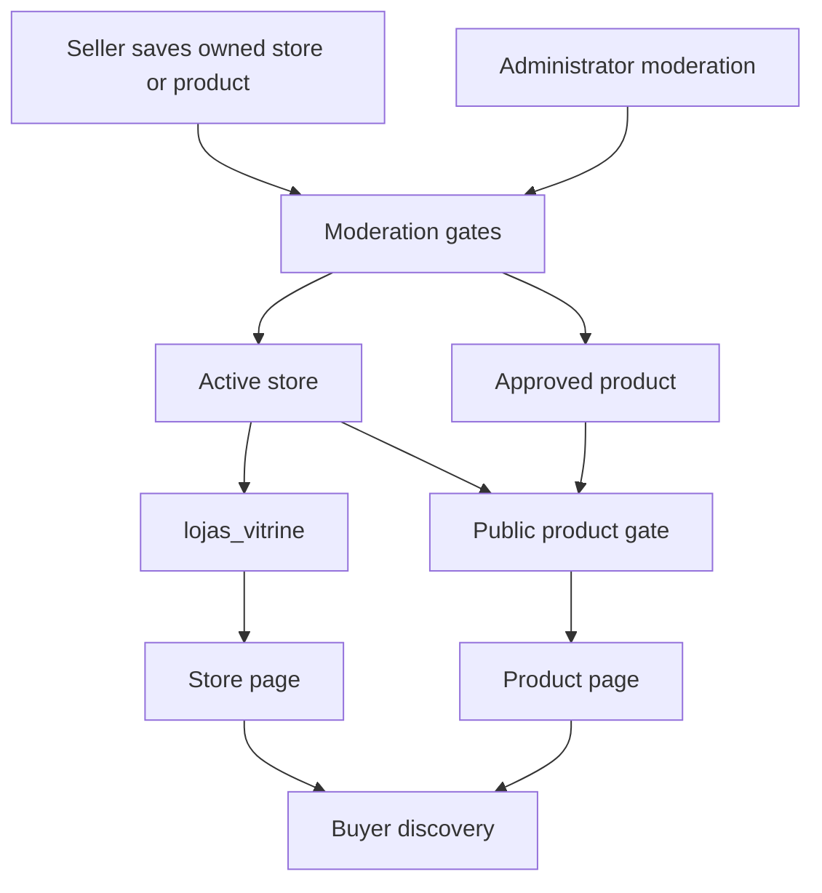
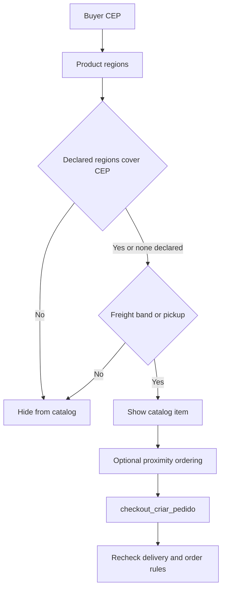

# Marketplace Catalog, Coverage, and Role Surfaces

The marketplace distinguishes **discovery**, **ownership**, and **authorization**. Visitors can discover a deliberately restricted public catalog; a seller owns and operates one store and its products; role panels add their own session, role, and terms gates. A record being visible or queryable publicly never grants its store owner authority to another user.

Related material: [Data Access, Security, and Schema Evolution](/openwiki/architecture/data-access-security-and-schema-evolution.md), [Checkout, Payment, and Order Lifecycle](/openwiki/workflows/checkout-payment-and-order-lifecycle.md), [Collective Commerce and Affiliates](/openwiki/workflows/collective-commerce-and-affiliates.md), and [Inventory Ledger and Warehouse Operations](/openwiki/workflows/inventory-ledger-and-warehouse-operations.md).

## Actors, panels, and routing

| Actor | Main surface | Effective gate and responsibility |
| --- | --- | --- |
| Buyer / visitor | `/`, `/loja/[id]`, `/produto/[id]` | Public discovery only. A buyer can view published catalog data but checkout remains the authority for purchasability. |
| Seller | `/seller` | Authenticated owner manages the owned store, products, product images, delivery regions, and distribution-center links. Seller terms must be accepted. |
| Administrator | `/admin` | Session plus `isAdmin()`; moderates stores and products and has database-backed cross-seller authority. |
| Affiliate | `/afiliado` | An approved or suspended affiliation opens the panel after affiliate terms; pending/rejected applicants use `/afiliado/solicitar`. |
| Logistics partner | `/parceiro` | A non-suspended partner record opens the panel; approval controls access to available rides and operating RPCs. |

`ROTAS_PROTEGIDAS` makes the four panels session-protected at the edge, while `/seller/cadastro`, `/parceiro/cadastro`, and `/afiliado/solicitar` are explicit onboarding exceptions. `/seller/minha-loja` still requires a session but is the sole seller route permitted before a store exists. `/afiliado/logistica` is intentionally shared with logistics partners. Panel layouts repeat their role checks, audit denial, and redirect rather than trusting the edge barrier alone.

A post-login account may accumulate roles. Destination precedence is admin, seller with a store, active affiliate, logistics partner, pending-affiliate onboarding, then home. The resolver uses the same status criteria as layouts to avoid redirect loops—for example, a merely pending affiliation must not be sent to the affiliate panel.

## Store ownership and catalog publication

This flow separates a seller-owned record from a buyer-visible listing: active store and approved product are independent publication conditions.

A `lojas` record belongs to an authenticated `owner_id`; `produtos` belong to a store. Products can have images, selected distribution centers, legacy category/subcategory assignments, a taxonomy node, and one or more coverage regions. Seller RLS is based on store ownership, but it is not the only owner boundary: active stores have a public-read policy. Therefore `getMinhaLoja()` and seller creation explicitly constrain `lojas.owner_id` to the authenticated user; update actions also include that predicate and treat a zero-row update as a permission failure. Product mutations resolve an owned product through `lojas.owner_id` before deleting, editing, adjusting its minimum stock, or adding an image.

New stores explicitly start `EmAnalise`; their owner cannot set store situation through the generic form. New non-admin products start pending, and sellers may re-submit only to `Pendente`. Administrator status actions independently check `isAdmin()` and accept only the defined store and product status values. Database triggers enforce these moderation boundaries even when a caller bypasses the UI; administrative and trusted server contexts are the intentional bypasses.

`lojas_vitrine` is the narrow public projection of active stores, excluding sensitive fields such as PIX key, CNPJ, email, and address. Public product reads require an approved product associated with that view. The store page additionally queries approved, positive-price products; the product page returns `notFound()` for a direct request to a missing, non-positive-price, or non-approved product. Public rendering is not ownership authorization.

## Seller writes and advisory curation

Seller actions validate names and numeric values, obtain the caller's owned store, and assign its ID rather than accepting a store ID from the form. A product save stores taxonomy/category choices, product CEP/radius and delivery-region selection; create then links regions, centers, and an optional image. The product insert precedes those follow-up writes, so a later link failure can leave a product that needs safe retry or repair. Direct stock changes are delegated to the inventory adjustment RPC rather than included in the generic product update.

Store and product saves schedule best-effort curation after the response. Deterministic checks run first; generated LangSmith text is optional, and errors are caught so seller saves succeed independently. Product suggestions and store notices replace only pending entries. When product text is unavailable no new suggestion is stored; a store still receives notices based on deterministic gaps. AI does not publish or moderate: product opinions are separate from the official history and need manual administrator confirmation, while sellers can resolve or dismiss their own informational store notices.

## Taxonomy and commission selection

The legacy category/subcategory tree supports catalog navigation and commission configuration; the newer `taxonomia_nos` tree provides a deeper classification selected on the product. The Martins source is a static import snapshot, while database import supports Google, Martins, and Mercado Livre taxonomy sources and marks missing imported nodes obsolete/non-selectable instead of silently deleting them.

The platform commission is selected at checkout, not trusted from a card or form. `comissao_pct_produto` resolves the closest taxonomy-node percentage by walking ancestors, then falls back to subcategory, category, and finally 5%. `NULL` means inherit; `0` is an explicit zero commission. Checkout snapshots the applied percentage into `linha_itens.repasse_ind_pct`, so later configuration changes do not rewrite historical economics, and rejects an item when platform plus affiliate percentage exceeds 100%.

## Delivery coverage, proximity, and the purchase boundary

Coverage has two distinct meanings:

* **Catalog eligibility:** `produto_faixas_cep` is a product-to-region N:N relation. With a valid buyer CEP, one declared region must include it; an undeclared region list fails open. But a product with coverage is still hidden if its store has neither an active matching freight band nor pickup enabled. The same filter is used by home, store, and product surfaces, so a listing is not advertised solely because it looks geographically plausible.
* **Proximity ranking:** the catalog obtains a product CEP, falling back to the private store CEP through a service client, and sorts by geocoded distance. Missing coordinates, unavailable service/Maps configuration, or a buyer beyond `raio_entrega_km` move an item to the stable tail; they never remove it. Radius is a confidence ordering signal, not delivery authorization.

This shows that coverage filtering improves truthful discovery, whereas checkout remains the final authority.

Store and product pages use 60-second and 30-second ISR respectively, and the cached home catalog uses a 60-second TTL. Those values can make presentation stale. `checkout_criar_pedido` locks and re-reads product data, requires an approved positive-price product from an active store, enforces one store per cart, quantities, stock, store minimums, and pickup eligibility. For delivery it validates the selected carrier/source and requires either an applicable quote/table or matching active freight band; an unavailable CEP is rejected. Do not relax this backend validation because a catalog filter or proximity ordering passed.

## Affiliate and logistics role boundaries

An affiliate request requires terms, derives store and commission from the current product, begins pending, and de-duplicates/rechecks batch requests. Constraints and triggers protect the 0–100 percentage, current product commission, pending-only commission changes, affiliate identity, and prohibition on a store owner affiliating with their own products.

Logistics partners register as pending drivers or carriers and are moderated by administrators. Approved partners use database RPCs for available ride acceptance or bids. Assigned-ride progression is `Aceita → Coletada → EmTransito → Entregue`; delivery requires a photo, and order-backed delivery additionally confirms the buyer code before best-effort seller payout. These operational roles do not confer catalog ownership.

## Change and verification guide

- Preserve explicit `owner_id` / joined-store predicates wherever public-read RLS can coexist with owner access. A layout gate, public visibility, and RLS each solve different problems.
- Keep coverage filtering aligned across home, store, and PDP, but treat checkout freight and stock validation as authoritative. Test the no-region fail-open case, closed CEP endpoints, mismatched freight coverage, pickup fallback, and checkout rejection.
- Keep taxonomy commission precedence and `NULL` versus `0` semantics intact; calculate and snapshot it in the transactional path rather than from current configuration after an order.
- The focused tests cover CEP filtering and de-duplicated counts, stable proximity ordering, role-destination precedence, onboarding/session exceptions, curation completeness, affiliate batches, and mandatory partner terms. Use Supabase integration tests for RLS predicates, moderation triggers, checkout coverage, and concurrent logistics RPC behavior.
