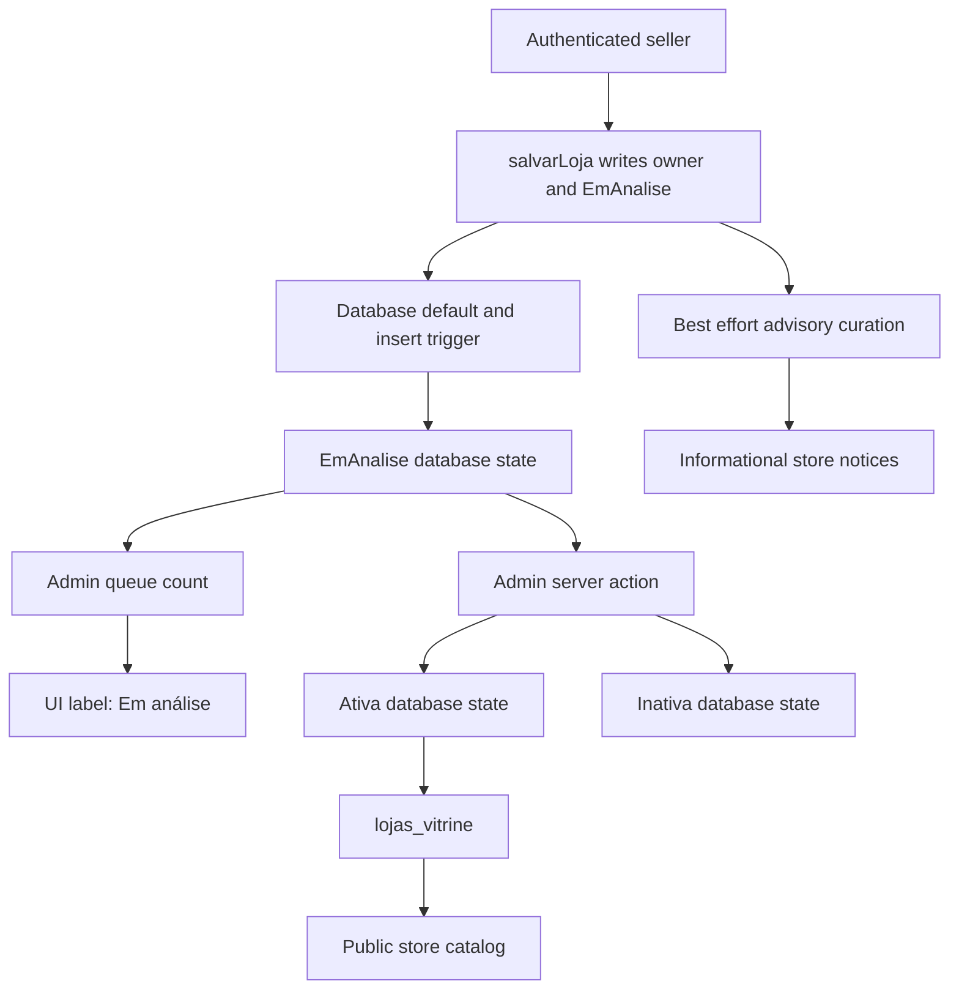
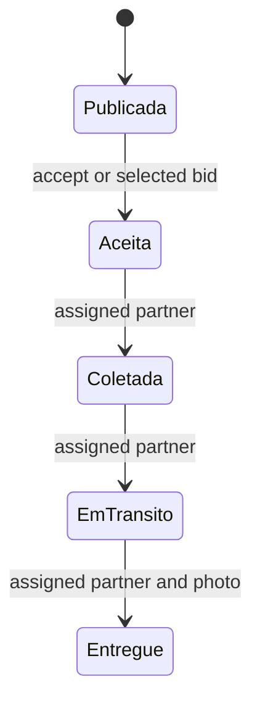

# Marketplace Catalog, Roles, and Moderation

The marketplace separates buyer-facing discovery from authenticated operating panels. A store is owned by an authenticated user, products belong to a store, and categories, images, and distribution-center links provide catalog structure. Publication is deliberately stricter than record existence: buyers can read only approved products associated with active stores.

For database-wide access patterns, see [Data Access, Security, and Schema Evolution](/openwiki/architecture/data-access-security-and-schema-evolution.md). The downstream transaction and fulfillment rules are covered by [Checkout, Payment, and Order Lifecycle](/openwiki/workflows/checkout-payment-and-order-lifecycle.md), [Collective Commerce and Affiliates](/openwiki/workflows/collective-commerce-and-affiliates.md), and [Fulfillment and Logistics](/openwiki/workflows/fulfillment-and-logistics.md).

## Actors and access boundaries

| Actor | Surface | Responsibility and boundary |
| --- | --- | --- |
| Buyer or visitor | `/loja/[id]`, `/produto/[id]` | Browses the public catalog and proceeds to checkout. These pages use public reads, not seller authority. |
| Seller | `/seller` | Maintains its own store and catalog, including product images and distribution-center links. Seller actions derive the store from the authenticated owner rather than accepting a store ID from the form. |
| Administrator | `/admin` | Has cross-seller moderation authority over stores and products. Server actions independently check `isAdmin()` before changing moderation fields. |
| Affiliate | `/afiliado` | Requests product sales affiliation after accepting terms. The product, rather than submitted form values, supplies the store and commission. |
| Logistics partner | `/parceiro` | Registers as a driver or carrier, then accepts or bids on delivery jobs and progresses only assigned jobs after approval. |

`getMinhaLoja()` explicitly includes the authenticated user's `owner_id`. This is defense in depth rather than a redundant filter: active stores are publicly readable through catalog access, so an unconstrained single-row lookup could otherwise resolve a different seller's store. The seller layout then requires a session, an owned store, and accepted seller terms; its attention badges use that store ID.

The administrator layout similarly requires a session and `isAdmin()`. It counts stores in `EmAnalise` as the store-moderation queue, alongside other operational counts. The layout is only a navigation gate: each sensitive server action repeats its role check.

### Post-login routing

An account may accumulate roles. When login has no explicit `next` destination, `resolverDestinoPorPapel()` resolves role facts on the server and uses the pure `destinoPorPapel()` precedence: administrator, seller with an owned store, affiliate with an affiliation, logistics partner with a partner record, then the buyer home page. This is routing convenience, not database authorization: the destination does not grant a role, and panel layouts and actions still enforce their own gates. The pure precedence function has focused unit coverage.

## Catalog ownership and publication

This flow distinguishes the enforceable publication path from presentation and assistance: the default, insert trigger, administrator action, and active-store view are database-backed controls; the translated UI label and advisory notices do not change store state or publish a store.

The schema ties `lojas.owner_id` to an authenticated user and `produtos.loja_id` to a store. Categories and subcategories form public taxonomy; `produto_imagens` and the `produto_centros` many-to-many table are dependent catalog records. RLS scopes seller access through store ownership.

Seller product actions validate required name and numeric inputs, find the caller's owned store, and verify ownership again before update, deletion, minimum-stock changes, or image attachment. Creation links selected distribution centers and an optional image after inserting the product. Those follow-up writes are not a transaction with the product insert: a distribution-center link failure can return an error after the product exists, so repair or retry must be safe.

The public projection is intentionally narrow. `lojas_vitrine` returns only active stores and catalog-oriented columns; it excludes sensitive store fields such as PIX key, CNPJ, email, and address. Public product reads additionally require an approved product joined to that view. The store page queries the view and filters to approved products with a positive price. The product page also calls `notFound()` for a missing, non-positive-price, or non-approved product, including direct requests.

### Moderation authority and the store gate

`lojas.situacao` has the valid states `Ativa`, `Inativa`, and `EmAnalise`, and its database default is `EmAnalise`. `salvarLoja()` also explicitly inserts `situacao: "EmAnalise"` with the authenticated `owner_id`; this redundancy protects the intended lifecycle if the column default regresses. A separate `before insert` trigger rejects a non-administrator insert whose situation is not `EmAnalise`. It allows trusted contexts identified by a null `auth.uid()`, administrators, or the `app.checkout_rpc` setting. Existing stores are deliberately not rewritten by that migration.

Consequently, a newly created seller store is not public merely because it exists. Only an administrator can move it to `Ativa` (approval) or `Inativa` (refusal/deactivation), and `lojas_vitrine` admits only `Ativa`. The administrator action independently checks `isAdmin()`, validates the supplied ID and one of those three values, writes `lojas.situacao`, and revalidates the admin list. `ModerarSituacaoLoja` presents the stored `EmAnalise` value as **Em análise** and changes the button wording to **Aprovar** or **Recusar**; those labels are UI affordances, not the enforcement mechanism.

The `admins` table and security-definer `is_admin()` function are the database basis for administrator RLS policies across seller-owned marketplace tables. The existing update guard is the final boundary for direct Data API writes: a non-administrator cannot change a store situation. Product moderation independently accepts `Aprovado`, `Recusado`, `Pendente`, or `rascunho`; products begin `Pendente`, and a seller may only re-submit to `Pendente`. Administrators and trusted server contexts bypass the product/update guards. Do not model the listed values as a complete transition graph: the repository establishes allowed values and authority constraints, not every possible administrator transition.

## Buyer catalog and checkout integrity

The store page uses 60-second ISR and the product page uses 30-second ISR, so rendered price or stock can briefly lag. This is presentation freshness only: `checkout_criar_pedido` re-reads every product in the database, requires an approved positive-price product in an active store, checks quantity and stock, and rejects a cart spanning stores. It is the integrity boundary rather than the catalog card.

## Advisory AI curation

Store and product saves schedule curation with `after()`. The orchestrator uses a service client to run deterministic completeness checks and only calls the LangSmith text helper when gaps exist. It catches errors, so a curation failure cannot fail a seller save. Product runs replace an existing pending `parecer` suggestion before inserting the new one, preventing old pending opinions from accumulating; store runs replace only pending notices and preserve seller-resolved or dismissed notices.

There is an intentional asymmetry when text generation fails. A product run returns without a new suggestion if no `parecer` is available. A store run instead falls back to the deterministic gaps and still stores actionable notices. Thus AI-generated wording enriches store curation but is not required to communicate missing registration data.

AI output is advisory. A product `parecer`, including a suggested decision, is stored separately in `produto_sugestoes_ia`; an administrator must confirm it manually. The agent cannot change `status_produto` or write the append-only official `produto_curadoria` history. Sellers can read history only for their own products. Store completeness notices are informational and sellers can resolve or dismiss their own notices; neither AI path publishes a listing.

## Affiliate enrollment

An affiliate request requires the sales-affiliate terms, derives store and commission from the current product, and starts `Pendente`. Batch enrollment de-duplicates requested IDs, rechecks live eligibility, skips already affiliated products, and preserves each product's current commission.

The commission and identity protections are also database-backed: percentage is constrained to `0..100`, a pending insert must match the product commission, non-admins cannot reassign an affiliate, and a commission change requires pending status. A separate trigger prevents a store owner from affiliating with its own store or products.

## Logistics-partner workflow

New logistics partners are `Pendente` driver or carrier records and administrators moderate their status. Only approved partners can read available rides or use the acceptance and bidding RPCs. The RPCs are authoritative: acceptance locks a still-`Publicada` first-accept ride, while bidding requires a positive bid on an open auction ride.

This is the database-enforced ride progression after a partner has been assigned; only the assigned partner may take each listed transition.

For an order-backed ride, the partner action confirms the buyer delivery code before requesting `Entregue`. A bad code stops the flow. Once confirmation succeeds, seller payout is best effort: a payout error is reported but does not reverse the recorded delivery confirmation. The ride RPC still requires a delivery photo for the `Entregue` transition.

## Safe changes and focused verification

- Preserve both public gates when changing catalog reads: the active-store `lojas_vitrine` projection and approved-product predicate. Do not add confidential store fields to the view.
- Keep all three layers of the store publication gate aligned: `salvarLoja()` explicit `EmAnalise`, the column default, and `guard_loja_insert_moderacao`. A UI-only default or label is not sufficient.
- Retain explicit server-action ownership checks alongside RLS. Add a database guard, not only a UI restriction, for any new moderated field.
- Treat post-save curation as non-blocking and keep its writes separate from moderation state. Human administration remains the decision point; store notices must retain their deterministic fallback.
- `src/lib/auth-destino.test.ts` covers the role-routing precedence. The curatorial rule tests cover complete and incomplete product and store records. The affiliate batch tests cover duplicate and ineligible selection plus per-product commission. The partner terms test covers mandatory first acceptance and preservation of an earlier acceptance.
- Add Supabase integration coverage for a normal seller insert with omitted, explicit `EmAnalise`, and attempted `Ativa` situations; direct seller situation updates; administrator approval; and anonymous visibility before and after approval. These validate defaults, triggers, RLS, and the view together—behaviors a component test cannot establish. Integration tests are also appropriate for cross-owner writes, direct reads of inactive or unapproved records, and concurrent ride acceptance.
