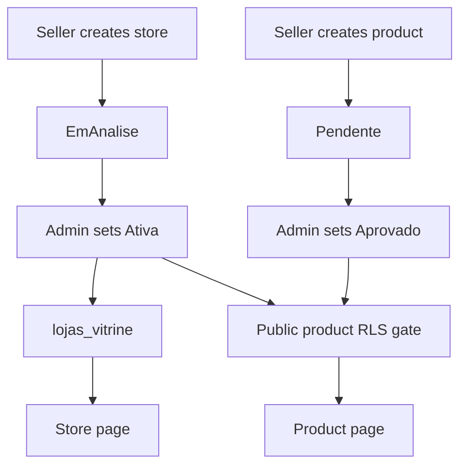

# Marketplace Catalog, Coverage, and Role Ownership

A store is the seller-owned aggregate: products belong to a store, products may have images and distribution-center links, and categories/subcategories classify the catalog. Buyers discover a deliberately constrained public projection; authenticated panels operate on the underlying records. This page distinguishes **catalog filtering**, **proximity ordering**, and **checkout enforcement**—a listing result is not itself a delivery authorization.

For cross-cutting database/RLS practices, see [Data Access, Security, and Schema Evolution](/openwiki/architecture/data-access-security-and-schema-evolution.md). Transactional purchase guarantees are covered by [Checkout, Payment, and Order Lifecycle](/openwiki/workflows/checkout-payment-and-order-lifecycle.md); inventory adjustments and center allocation by [Inventory Ledger and Reservations](/openwiki/workflows/inventory-ledger-and-reservations.md); affiliate fulfillment and payouts by [Collective Commerce and Affiliates](/openwiki/workflows/collective-commerce-and-affiliates.md).

## Roles and entry boundaries

| Role | Primary surface | Authority boundary |
| --- | --- | --- |
| Visitor/buyer | `/`, `/busca`, `/categoria/[id]`, `/loja/[id]`, `/produto/[id]` | Reads public catalog data and gets CEP-sensitive discovery results. |
| Seller | `/seller` | Creates and maintains its own store and products; cannot publish itself. |
| Administrator | `/admin` | Moderates stores/products and administers taxonomy. |
| Sales affiliate | `/afiliado` | Requests affiliation to eligible products or stores; product affiliation terms, store, and commission are derived rather than client-selected. |
| Logistics partner | `/parceiro` | Is a separately moderated fulfillment participant; delivery-job assignment and transitions remain RPC-controlled. |

`getMinhaLoja()` selects by the current user's `owner_id`, rather than relying only on RLS. This matters because active stores have a public read path: a broad `lojas` query could otherwise return another seller's store. The seller layout requires a session and, except for `/seller/minha-loja`, an owned store; that exception lets a logged-in newcomer create its first store. Seller terms are also a rendering gate. The shared route gate separately declares public onboarding routes and panel prefixes that require a session.

The admin layout checks both session and `isAdmin()` and supplies moderation/operational badges. It is not the authorization boundary for mutations: server actions must repeat their application role check, while RLS and explicit owner predicates protect data operations. The database `admins` table and security-definer `is_admin()` function provide the cross-seller RLS basis; current application-level admin roles do not add RLS granularity.

## Catalog lifecycle and publication

This shows the separate active-store and approved-product conditions behind public catalog reads.

New seller stores explicitly insert as `EmAnalise`; the column default and an insert trigger reinforce that state, and non-admin callers cannot select another initial situation. Store moderation accepts `Ativa`, `Inativa`, or `EmAnalise`. Product creation must start `Pendente`; seller updates may only change a product status by re-submitting it to `Pendente`, while administrator actions accept `Aprovado`, `Recusado`, `Pendente`, or `rascunho`. Trigger guards protect these fields against direct Data API writes, including where owner RLS would otherwise permit an update; trusted server contexts and admins bypass the guards.

The public `lojas_vitrine` view exposes only active stores and catalog-oriented fields, excluding sensitive store data such as PIX key, CNPJ, email, and address. Public product RLS requires an approved product associated with that view. Public store pages additionally query approved, positive-price products; product pages reject a missing, non-positive-price, or non-approved record. Those UI predicates improve presentation, but the public view/RLS gates are what constrain ordinary public reads.

Seller product actions validate required and non-negative inputs, derive the owned store, and re-check ownership by joining through `lojas.owner_id` before mutations. Product coverage, selected distribution centers, and an optional image are persisted after the product insert; these follow-up operations are not one transaction with creation, so an error can leave a product that needs repair/retry. Updating `estoque_atual` takes a dedicated `estoque_ajustar_produto` RPC with a reason instead of the generic product update path.

### Advisory curation, not moderation

Store and product saves schedule best-effort curation using `after()`. The orchestrator runs deterministic completeness checks, optionally obtains LangSmith text, and catches errors so seller saves still succeed. AI product opinions live separately from official moderation/history and require administrator confirmation; the agent cannot set `status_produto`. Store notices are informational and seller-resolvable. New runs replace only pending suggestions/notices, preserving decisions or notices that have already left that state. If product text is unavailable, no opinion is inserted; store curation instead persists deterministic gap notices.

## CEP coverage, discovery, and delivery

A product can declare multiple delivery regions through `produto_faixas_cep`; one closed CEP interval match is enough. The legacy scalar `produtos.faixa_cep_id` remains populated with the first selected range because older freight/admin code still reads it. Coverage is deliberately independent of `produto_centros`: centers describe collection locations, while the seller declares product coverage.

With a valid buyer CEP, `idsForaDaFaixaCep()` excludes a product that declares regions none of which cover the CEP. It also excludes a covered product if its store has neither an active applicable freight range nor store pickup. A product with no declared regions is fail-open for this **listing** rule. The home additionally does not list products until a buyer CEP exists, and applies the same exclusion set across regular products, discounts, supermarket items, galleries, and future-sales items. Store, category, search, and product surfaces reuse the coverage calculation, though their no-CEP behavior is surface-specific.

`ordenarPorProximidade()` is different: it never removes a result. It obtains a product CEP or, if absent, the store CEP through a service client because store CEP is not public-view data; it then orders known origins by distance. Missing coordinates, unavailable service configuration/geocoding, or an exceeded `raio_entrega_km` put items at the end in their existing order. Radius is therefore a confidence/order signal, not a catalog filter.

Neither display filtering nor proximity ordering should be treated as final eligibility. `checkout_criar_pedido` re-reads products under lock and requires an approved, positive-price product in an active store, one store per cart, valid quantities, and sufficient inventory. For ordinary percentage freight it independently requires an active applicable `faixas_cep` entry (with store-specific preference); it also validates carrier/table quote paths, minimum order value, and pickup permission. The inspected checkout function does not use `produto_faixas_cep` as its checkout predicate, so product-range filtering is not evidence of a database-level per-product delivery enforcement rule.

## Taxonomy and commission ownership

The established sellable taxonomy remains `categorias` and `subcategorias`, referenced by products. Platform commission resolution is `subcategoria.comissao_pct`, then `categoria.comissao_pct`, then a 5% default; `NULL` means inherit and `0` is an intentional zero. Checkout snapshots the applied platform percentage onto `linha_itens.repasse_ind_pct` and rejects an item where platform plus selected affiliate commission exceeds 100%.

`taxonomia_nos` is a newer, public, arbitrary-depth reference tree, separate from the legacy category tables and not read by checkout. Nodes can be Google-imported or local, use stable source IDs for idempotency, retain curator aliases/visibility/selectability/commission values, and become obsolete/non-selectable rather than being deleted when absent from a subsequent import. Its own ancestor commission helper has the same null-inherits/zero-is-explicit semantics, but does not currently price an order.

Taxonomy preview and import actions each download the Google taxonomy source without caching and require `isAdmin()`. Preview invokes the read-only RPC. Confirmation invokes the transactional import RPC, which rejects an unparseable empty input, inserts parents before children, records import history, and marks missing Google nodes obsolete. The import endpoints are revoked from public/anon; action-level admin checks complement that database boundary. An administrator may set a tree-node commission to `null` (inherit) or `0..100` (explicit).

## Affiliate and partner boundaries

A product-affiliation request requires accepted sales terms and looks up `loja_id`, eligibility, and commission from the current product; the batch action de-duplicates IDs, reloads current products, skips existing affiliations, and preserves each product's live commission. Database constraints and triggers restrict the percentage to `0..100`, require a pending insert matching the product commission, constrain reassignment/commission changes, and block store-owner self-affiliation. Store-level sales/logistics affiliation is a separate request path.

Logistics partners are not sellers or affiliates: they register as pending driver/carrier records, undergo admin moderation, and only approved partners may access available rides or use assignment/bidding RPCs. See the related workflows for delivery state progression and money movement.

## Safe changes and focused checks

- Keep explicit owner predicates in server actions even where RLS exists, and repeat admin role checks inside callable actions. A layout gate is navigation protection, not mutation authorization.
- Preserve the active-store and approved-product public-read gates; do not add PII to `lojas_vitrine`.
- Treat CEP coverage filtering, proximity ordering, freight-range lookup, and checkout integrity as separate mechanisms. Any new per-product delivery guarantee needs an explicit checkout/RPC guard and tests, not only a card/page condition.
- Preserve the compatibility write to legacy `faixa_cep_id` until freight/admin callers are migrated. Avoid deriving coverage from distribution centers.
- The focused pure tests cover inclusive range boundaries, no-region fail-open behavior, exclusion/count de-duplication, multi-region matching, and the invariant that proximity ordering retains every item and keeps unlocatable/out-of-radius items stably at the end. Add Supabase integration tests for RLS, moderation triggers, public catalog gates, and concurrent checkout behavior.
