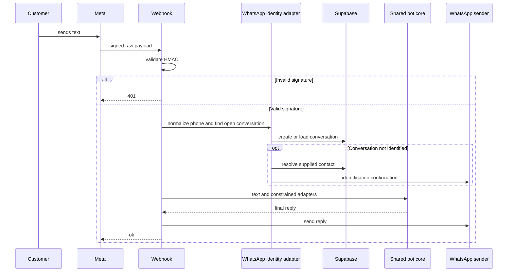
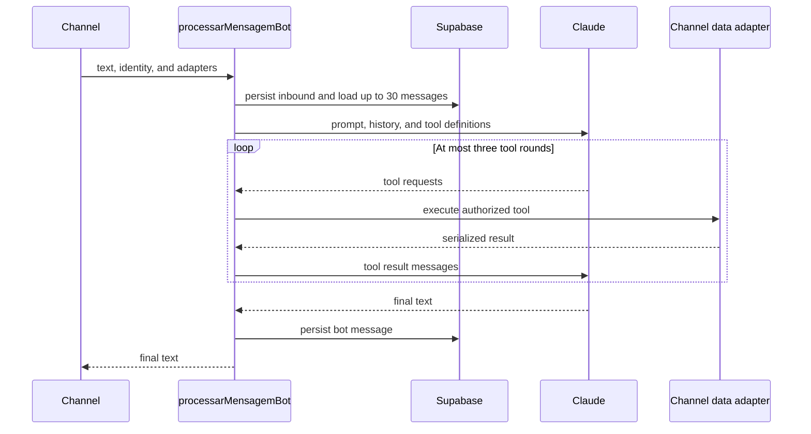

## Scope and authority boundary

The application has two separate conversational systems:

- The **general customer-service bot** serves the global site widget and WhatsApp. It persists its own `bot_conversas` and `bot_mensagens`, and its orchestration layer may execute a narrow set of server-owned tools.
- The **buyer-seller thread bot** operates only inside marketplace `conversas` and `mensagens`. It has no general-service tools, lead records, or Jira integration.

AI-generated text and tool requests are not authoritative business rules, authentication, or database authority. Routes and server actions establish identity; channel adapters constrain data access; and deterministic server code performs persistence and side effects. Prompts are operational guidance to the model, not a substitute for the marketplace’s policy or authorization implementation. For the broader data model and RLS approach, see [Data Access, Security, and Schema Evolution](/openwiki/architecture/data-access-security-and-schema-evolution.md). See [Marketplace Catalog and Roles](/openwiki/concepts/marketplace-catalog-and-roles.md) and [After-sales Disputes](/openwiki/workflows/after-sales-disputes.md) for the relevant domain workflows.

## General customer-service channels

### Site widget and endpoint

`ChatWidget` is a client-side, global chat surface for anonymous and authenticated visitors. It keeps rendered messages and the returned conversation ID only in component memory. Each request posts the trimmed message, the current ID, and an optional persona seed to `POST /api/bot/chat`; durable records belong to the server. An event can open the widget with a persona seed, but that value only affects creation of the first conversation and is validated against the supported persona list.

The route requires the Anthropic-backed bot configuration and service-role Supabase configuration. It rejects blank and over-2,000-character messages, then obtains the optional Supabase Auth user. To limit anonymous model and storage abuse, it applies a 12-per-minute in-memory limit keyed by authenticated user ID or forwarded client IP. When no conversation ID is supplied, it creates a `site` conversation containing the optional user ID and sanitized persona. It injects order, order-list, and dispute-list adapters into the shared core and returns `{ conversaId, resposta }`. A missing prerequisite returns 503; validation failures return 400; rate limiting returns 429.

The site adapters use the request-scoped Supabase client rather than service role. `buscar_pedido` and `listar_pedidos` read customer views subject to the caller’s RLS context, and the dispute adapter only lists existing disputes. The core will not invoke these adapters when there is no authenticated user. Consequently, a site visitor does not gain order access merely by conversing with the model.

`GET /api/bot/health` is force-dynamic and returns only boolean readiness fields, `llm` and `service`; it does not disclose credentials.

### WhatsApp webhook and identity proof

WhatsApp has a different trust model: its sender number is a channel address, not a logged-in session. `GET /api/bot/whatsapp/webhook` completes Meta subscription verification only when `hub.mode` is `subscribe` and the supplied verification token matches `WHATSAPP_VERIFY_TOKEN`.

On `POST`, the webhook reads the raw body before parsing it and validates `x-hub-signature-256` as an HMAC-SHA256 using the separate `WHATSAPP_APP_SECRET`. Missing secret, malformed/missing header, altered payload, and digest-length mismatch fail closed. Invalid requests are reported to Sentry and receive 401 before JSON processing. A valid webhook without bot/service prerequisites, without a text message, or unable to create a conversation is acknowledged with `{ ok: true }`, avoiding needless Meta retries.

For a text message, the route normalizes the sender number, reuses an open phone-matched conversation or creates a `whatsapp` conversation, and attempts identity resolution until `identificado_em` is set. A matching contact associates the resolved user and timestamp, sends a confirmation through WhatsApp, and returns without passing that identifying turn to the bot. The resolver is a restricted security-definer RPC that matches the submitted contact to an Auth email; that association alone is deliberately insufficient to disclose orders.

This sequence shows the webhook’s authentication gate and the separate identity step before conversational processing.

### Least-privilege order access by channel

The site proves identity through the authenticated Supabase session and relies on RLS-backed customer views. WhatsApp instead combines two proofs for every order disclosure:

1. The open conversation must previously be associated with a user by the contact-resolution step.
2. The service-role lookup additionally filters by that `cliente_id` and compares the order’s normalized `telefone_contato` with the current WhatsApp sender.

A single WhatsApp order lookup returns only the non-phone order fields and its items after the comparison. Listing first filters all candidate orders by the same phone match, limits the result to 20, and removes the checked phone field. Thus the channel’s use of service role is limited by code-enforced ownership and proof of possession; a model request cannot select another authority path.

## Shared core: persistence, personas, tools, and limits

`bot_conversas` is the durable state owner for channel, optional user and telephone identity, identification time, status, optional Jira key, and persona. Status is one of `aberta`, `escalada`, or `encerrada`. `bot_mensagens` has a cascading conversation foreign key and accepts only `usuario` or `bot` messages with trimmed length from 1 to 4,000 characters. `leads` references a conversation when available. RLS is enabled on all three tables: normal policies expose records to admins, while these server flows use the service client for operational writes.

Supported persisted personas are `consumidor`, `seller`, `motorista`, and `afiliado`. A supplied creation seed is accepted only if it is one of those values; invalid values become `null`. When no persona is saved, the model receives a generic identification prompt. Selecting a persona through the tool persists it, so following turns use the corresponding prompt. The prompt can guide escalation based on retained history, but there is no dedicated persisted unresolved-attempt counter; do not treat the model’s count or response as a business-system decision.

The bot provider is Anthropic Claude Haiku (`claude-haiku-4-5`), despite the internal message representation using OpenAI-compatible `ChatCompletionMessageParam` types. The provider module translates assistant tool calls and tool results to Anthropic’s message format. It declares the available tools but does not execute database operations; `processarMensagemBot` owns execution.

For each turn, the shared core stores the inbound message, loads chronological history capped at 30 messages plus the saved persona, and calls the model. It processes requested function calls sequentially, appends serialized results, and calls the model again for no more than three tool rounds. Unknown tool names yield a structured error. Finally, it stores model text, or `Não consegui gerar uma resposta agora.` when final text is absent. The bound controls cost and prevents an unbounded agent loop while allowing persona selection before persona-specific work.

This bounded loop separates a model request from caller-owned authorization and execution.

The callable surface comprises persona selection, best-effort PRD lookup, authorized order and dispute lookup where the channel supplies those adapters, lead registration, and human escalation. `consultar_prd` searches Confluence using a CQL query built from up to six terms longer than three characters, fetches the first matching page, strips HTML, and returns a nearby plain-text excerpt capped at 1,200 characters. Missing configuration, no usable terms/results, or a failed request returns no snippet rather than blocking the conversation.

## Leads, scoring, and human escalation

When the core handles `registrar_lead`, it creates at most one lead per conversation by first looking up `conversa_id`. A later registration updates that record, retains a newly supplied distinct contact by merging it with the previous one, and records persona and funnel stage. If the model supplies blank contact, the core falls back to a known channel contact when one is available. Scoring is best effort after registration: it reads at most 30 messages, accepts only a valid `quente`, `morno`, or `frio` structured response, and writes the score, summary, and timestamp. It is skipped when bot configuration is absent and throttled to no more than once per hour per lead.

`abrir_chamado` first inserts an admin-auditable `incidentes_atendimento` record, then attempts to create a Jira issue. It updates the bot conversation to `escalada` and stores an issue key where one is returned; it also adds that key to the incident when the incident insertion succeeded. Jira is optional and failures return `null`, so a Jira outage does not erase the local incident. Email notification to the configured owner is likewise best effort. Incidents are RLS-protected for admins and have `aberto` or `resolvido` status.

## Buyer-seller conversation bot

The marketplace thread is isolated from general support. A buyer must be authenticated and must have a paid order for the target store, and for the target product when specified, before `iniciarConversa` creates or reuses a buyer × store × product conversation. The server action checks these conditions instead of trusting UI visibility; later message insertion is also protected by participant RLS.

A buyer message activates the automatic store reply only while the conversation’s `bot_ativo` is true. The action loads at most 30 thread messages and supplies `responderBotConversa` only bounded context: buyer name, product name/perishability when applicable, and an unresolved dispute for the linked order. This assistant uses `chatLivre` with no tools, so it has no path to general bot records or arbitrary order/store access. Its prompt instructs it to work from supplied context and history rather than invent operational facts; those instructions are not themselves authoritative policy.

Bot replies are written under a fixed system-user ID and visibly prefixed `🤖 Assistente automático da loja:`. The action strips this prefix before returning earlier bot text to the model, avoiding prefix imitation. A seller or admin message disables `bot_ativo`. The bot also disables itself when it returns the `[HANDOFF]` marker, which it treats as an escalation response; if bot configuration is absent, it immediately requests handoff and produces no reply. No automatic reactivation is implemented in this flow.

## Configuration, operations, and focused tests

The general bot requires `ANTHROPIC_API_KEY` and service-role Supabase configuration. WhatsApp additionally requires `WHATSAPP_VERIFY_TOKEN` for Meta verification and `WHATSAPP_APP_SECRET` for signed POSTs. Confluence and Jira share Atlassian configuration: `JIRA_BASE_URL`, `JIRA_EMAIL`, and `JIRA_API_TOKEN` (with `altassim_jira` and `ALTASSIN_JIRA` compatibility fallbacks); `CONFLUENCE_SPACE_KEY` and `JIRA_PROJECT_KEY` can refine their respective integrations.

Operationally, distinguish missing bot configuration from webhook authentication: site chat reports unavailable prerequisites as 503, while a valid WhatsApp webhook is acknowledged without a reply when prerequisites are missing. An invalid WhatsApp signature is always rejected. Use the local incident record as the durable escalation audit trail rather than Jira availability. The 2,000-character site request cap, 12-per-minute site limit, 30-message histories, three-round tool ceiling, 4,096-token model limit, and hourly lead-scoring throttle are the principal implemented cost controls.

Focused tests include `src/lib/ai/systemPrompt.test.ts`, which verifies accepted personas and rejection of invalid persona seeds, and `src/lib/whatsapp-webhook-signature.test.ts`, which covers valid signatures and fail-closed cases such as altered payloads, malformed headers, wrong secrets, and absent secret. `supabase/tests/e2e_incidentes_atendimento.sql` verifies the admin-only incident access model.
