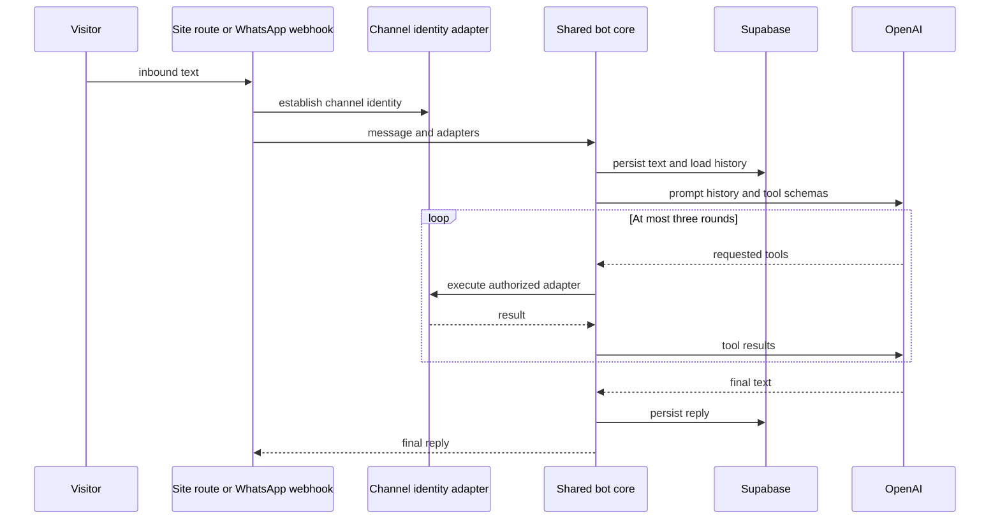
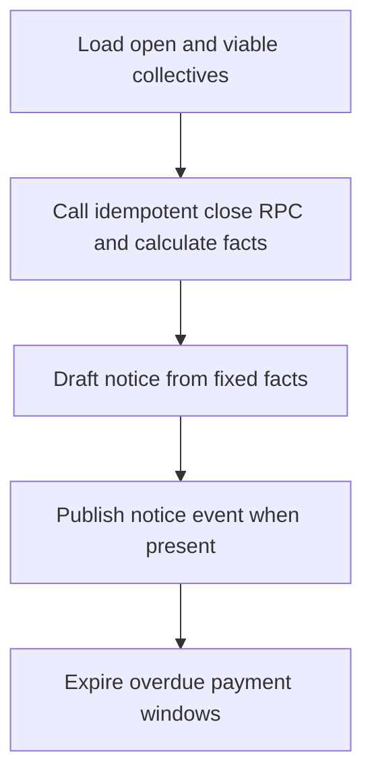

## Scope and authority boundaries

AI operates in four deliberately separate contexts:

- The **general customer-service bot** serves the global site widget and WhatsApp. It persists `bot_conversas` and `bot_mensagens` and can request a narrow tool set.
- The **buyer-seller thread bot** is a separate, tool-free assistant in marketplace `conversas`/`mensagens`. It speaks for a store only until seller takeover or bot handoff.
- **Seller curation** computes product and store gaps in deterministic code. A LangSmith deployment may improve wording but cannot decide completeness or approve a deficient product.
- The **collective-commerce stages agent** is a LangGraph workflow: database/RPC logic decides lifecycle and numbers, while an Anthropic model may only phrase participant notices.

Generated language is never an authorization mechanism or direct authority to mutate arbitrary business state. Routes, server actions, and deterministic graph nodes own identity, database writes, lifecycle calls, and side effects. For the database/RLS model, see [Data Access, Security, and Schema Evolution](/openwiki/architecture/data-access-security-and-schema-evolution.md). Related business flows are [Marketplace Catalog and Roles](/openwiki/concepts/marketplace-catalog-and-roles.md), [After-sales Disputes](/openwiki/workflows/after-sales-disputes.md), and [Collective Commerce and Affiliates](/openwiki/workflows/collective-commerce-and-affiliates.md).

## General customer-service bot

### Web and WhatsApp entrypoints

`ChatWidget`, mounted by the application layout, is available to anonymous and authenticated visitors. Its transcript and current `conversaId` exist only in component state. It posts trimmed text and the last returned ID to `POST /api/bot/chat`; the server owns durable persistence. The route rejects a blank message, requires OpenAI and service-role Supabase configuration, obtains the optional Supabase Auth user, creates a `site` conversation when needed, injects RLS-backed order/dispute adapters, and returns `{ conversaId, resposta }`. A missing prerequisite is a 503; a client network failure remains local to the widget.

`GET /api/bot/health` is a force-dynamic configuration diagnostic. It returns only the boolean `openai` and `service` readiness values, never credential values.

WhatsApp uses `GET` and `POST /api/bot/whatsapp/webhook`. GET performs Meta subscription verification with `WHATSAPP_VERIFY_TOKEN`. POST reads the raw payload and validates `x-hub-signature-256` as an HMAC-SHA256 over that body using the distinct `WHATSAPP_APP_SECRET`. Missing secret, header/prefix errors, altered payloads, and unequal digest lengths fail closed. Invalid signatures are reported to Sentry and receive 401 before JSON parsing or message processing. A valid request with missing bot prerequisites, or without a text message, is acknowledged as `{ ok: true }` rather than retried as a webhook failure.

Both routes call `processarMensagemBot`, but each supplies its own identity-sensitive adapters. The OpenAI client receives schemas and conversation messages; the caller-controlled adapter performs data disclosure.

### Conversation state and bounded tool loop

`bot_conversas` records the channel (`site` or `whatsapp`), optional user and phone identity, identification time, persona, Jira key, and `aberta`/`escalada`/`encerrada` status. Messages cascade with their conversation, have `usuario` or `bot` sender, and allow only nonblank 1–4,000-character content. Bot conversations, messages, and leads use RLS; normal policies expose bot records to admins, while the application workflow uses the service client.

For every turn, the shared core persists incoming text, reads chronological history capped at 30 messages and the saved persona, then calls `gpt-4o-mini`. It executes requested function calls sequentially and returns their serialized results to the model for at most three rounds. This permits `definir_persona` in the first round and persona-specific work in a later round without creating an unbounded agent. An unknown tool returns a structured error. The core persists model text or `Não consegui gerar uma resposta agora.` when final content is absent.

This flow shows that the model requests actions but cannot choose a database authority path or run beyond the orchestration bound.

### Identity and order-disclosure gates

On the site, `buscar_pedido` and `listar_pedidos` use the request user's Supabase client and customer views, so RLS restricts results to that user. The dispute adapter lists existing disputes only; it does not create one. A missing authenticated user receives the core's not-logged-in tool result. The bot can construct a prefilled dispute URL from an authorized order item, but formal opening still requires confirmation in the order flow.

A WhatsApp number is a channel address, not a login:

1. The webhook normalizes the sender number and reuses an open conversation for it or creates a `whatsapp` conversation.
2. Until `identificado_em` is set, message text is offered to `resolver_usuario_por_contato`. On a match, the conversation gets the user ID and timestamp, the sender receives an identification confirmation, and the identifying turn does not reach bot tools.
3. For an identified conversation, the service-role order lookup requires both the linked `cliente_id` and normalized stored `telefone_contato` to match the current sender. It removes the checked phone before returning an order. Listing applies the same filter and returns at most 20 orders.

Thus knowledge of an email may associate a conversation but cannot itself disclose an order: a model request cannot bypass the second proof-of-possession check.

### Personas, knowledge, leads, and handoff

The persisted personas are `consumidor`, `seller`, `motorista`, and `afiliado`. Until selected, the prompt requires identification; `definir_persona` saves the result and later calls use the matching prompt and tutorials. The tool surface is persona selection, on-demand PRD lookup, authorized order/dispute lookup, lead registration, and escalation. OpenAI describes and requests tools; shared orchestration executes them.

Escalation is prompt-guided from retained history, not enforced by a dedicated attempt counter. The prompt instructs the model to escalate after two unresolved attempts at the same question or an explicit human request, register an `escalado_humano` lead, and open an incident. Known channel contact is used when tool contact is missing or blank; a distinct supplied contact is merged. Lead persistence is conversation-idempotent, stores persona and funnel stage, and triggers best-effort scoring throttled to once per hour per lead.

`consultar_prd` is a small best-effort Confluence CQL search, not vector RAG. It uses up to six query terms longer than three characters, retrieves the first matching page, strips storage HTML, and returns a bounded nearby plain-text excerpt. Missing configuration, no useful terms or results, and request failures return no snippet without blocking service.

`abrir_chamado` creates the local, admin-auditable incident before attempting Jira, updates the conversation to escalated, and preserves the incident if Jira is unconfigured or fails. A Jira issue key is retained when available; owner email is best effort. The incident resource is admin-only RLS with `aberto` and `resolvido` states.

## Buyer-seller conversational thread

The marketplace thread is not the general bot: it does not use `bot_conversas`, tool calls, leads, or Jira. A buyer must be authenticated and have a paid order with the target store, and with the product when specified, to create or reuse a `comprador × loja × produto` conversation. The server action checks this independently of UI visibility and relies on participant RLS for message insertion.

When a buyer messages a thread whose `bot_ativo` is true, the action loads at most 30 messages and only limited context: buyer name, relevant product name/perishability, and an unresolved order dispute. `responderBotConversa` uses tool-free `chatLivre` and is instructed not to invent order, price, stock, delivery, or policy facts. Replies belong to a fixed non-login system user, visibly start with `🤖 Assistente automático da loja:`, and have that prefix removed before prior bot messages return to the model.

A seller or admin reply disables `bot_ativo`. The bot also returns a `[HANDOFF]` marker after two unsuccessful attempts at the same question or an explicit human/store request; the action strips the marker, may persist the short reply, and disables the bot. If OpenAI is unconfigured, it hands off immediately.

## Seller curation and external proposal ingestion

Product creation/update and store profile saves, including the dedicated PIX-key change, schedule curation with Next.js `after()`. Seller success therefore does not wait for curation. The orchestrator uses a service client to fetch only needed fields, catches all exceptions, calculates gaps in pure functions, and writes nothing when there are no gaps.

Product rules require a trimmed title of at least 10 characters, description of at least 40, at least one image, and a category. Store rules require CNPJ; all CEP/city/state/street/number address fields; WhatsApp or email; and confirmed PIX. Only after gaps exist can the LangSmith deployment phrase a product decision or store tip. It has a 15-second timeout and returns `null` for missing configuration, HTTP/network failures, unexpected replies, or parsing failures. Store warnings fall back to deterministic messages; absent product wording creates no product suggestion.

A product response must begin with `APROVADO`, `REPROVADO`, or `SUGESTAO`. An apparent LLM approval is demoted to `sugestao` whenever deterministic gaps remain, preventing seller-supplied prompt text from overriding code-derived deficiencies. Pending product `parecer` entries and pending store warnings are replaced on recheck; resolved or discarded store warnings remain untouched.

`POST /api/curadoria-ia` is a separate ingestion boundary for an external CrewAI curator. It requires `Authorization: Bearer <CREWAI_CURADORIA_TOKEN>` and service-role configuration; validates JSON, product existence, an allowlisted `descricao`, `imagem`, or `dados_loja` type, and nonblank content; then inserts the proposal. The external agent receives no direct Supabase credentials. Applying or discarding a proposal remains an admin decision.

## Collective-commerce stages LangGraph

`POST /api/coletivas/tick` is the operational entrypoint for collective progression. It requires `Authorization: Bearer <ASAAS_WEBHOOK_TOKEN>` and service-role configuration, invokes `rodarEtapas`, records a success or failure observability event, and returns its result or a 500. There is no in-repository scheduler: an external cron or manual caller invokes the endpoint. The comment-level operational guarantee is that missing ticks delay notices, while page reads still invoke lazy closing RPC logic so they do not delay money-related closure.

The compiled graph is `START → carregar → avaliar → redigir → publicar → END`. `carregar` selects only `Aberta` and `Viavel` collectives. `avaliar` calls idempotent `coletiva_fechar` per collective, derives current and next-lot prices, quantities, savings, and deadline hours deterministically, and emits a `prazo_proximo` event for an unclosed collective within 24 hours. `publicar` writes agent events only for evaluations with a message. After the graph, `rodarEtapas` separately expires payments for overdue `Atingida` collectives through `coletiva_expirar_pagamentos` and reports evaluated, closed, and cancelled-payment counts.

This workflow separates database lifecycle and all numeric facts from optional language generation.

`redigir` considers only unclosed collectives that have a positive next-lot gap. With no `ANTHROPIC_API_KEY`, it creates a fixed notice using deterministic values and the workflow continues. With a key, it calls `claude-haiku-4-5` for JSON notices and instructs it to use the supplied numbers exactly; malformed/no matching output falls back to the same fixed notice. The model cannot select a collective status, price, deadline, event type, or payment action.

## Configuration, operations, and focused tests

The general bot needs `OPENAI_API_KEY` (or legacy `openai`) and `SUPABASE_SERVICE_ROLE_KEY`. WhatsApp additionally needs `WHATSAPP_VERIFY_TOKEN` for GET setup and `WHATSAPP_APP_SECRET` for POST signatures. Jira uses `JIRA_BASE_URL`, `JIRA_EMAIL`, `JIRA_API_TOKEN` with legacy `altassim_jira`/`ALTASSIN_JIRA` fallbacks, and `JIRA_PROJECT_KEY`; Confluence shares Atlassian credentials and can set `CONFLUENCE_SPACE_KEY`. LangSmith curation needs `LANGSMITH_API_KEY`; external curation ingestion needs `CREWAI_CURADORIA_TOKEN`. The collective language node uses `ANTHROPIC_API_KEY`; the tick route needs `ASAAS_WEBHOOK_TOKEN` and service-role access.

Treat site-chat 503 as missing model/service prerequisites. A signed WhatsApp request missing those prerequisites deliberately returns `{ ok: true }` with no bot reply; an invalid signature is 401 and generates a Sentry warning. Use the local admin incident rather than Jira availability as the escalation audit record. Confluence, Jira, LangSmith, curation orchestration, and collective language generation are best effort; their respective deterministic workflow remains available where described.

Focused tests include:

- `src/lib/whatsapp-webhook-signature.test.ts` covers valid signatures and altered payload, missing/malformed header, wrong secret, and absent-secret fail-closed cases.
- `src/lib/agentes/curadoria-regras.test.ts` covers each deterministic product/store gap and combined gaps.
- `src/lib/agentes/langsmith-curadoria.test.ts` covers strict decision parsing and deterministic demotion of an approval when a gap remains.
- `supabase/tests/e2e_incidentes_atendimento.sql` verifies that admins can create/read/resolve incidents and ordinary authenticated users cannot read or insert them.
