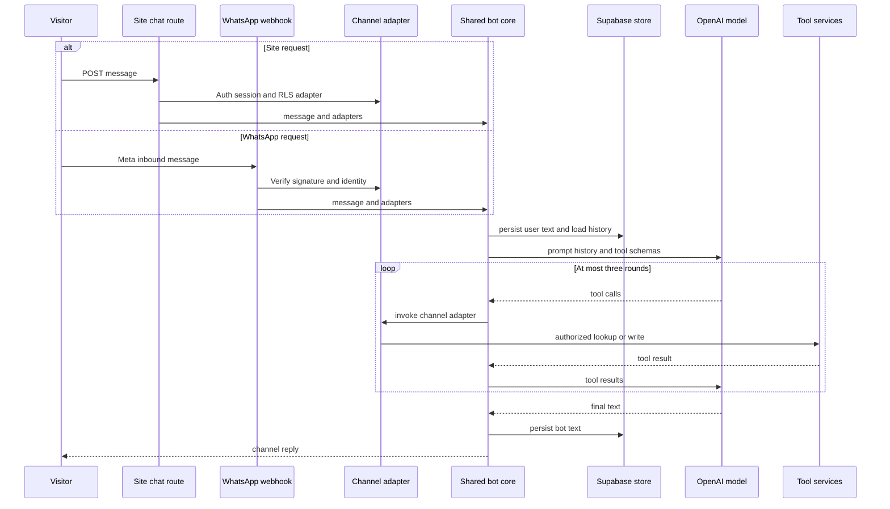
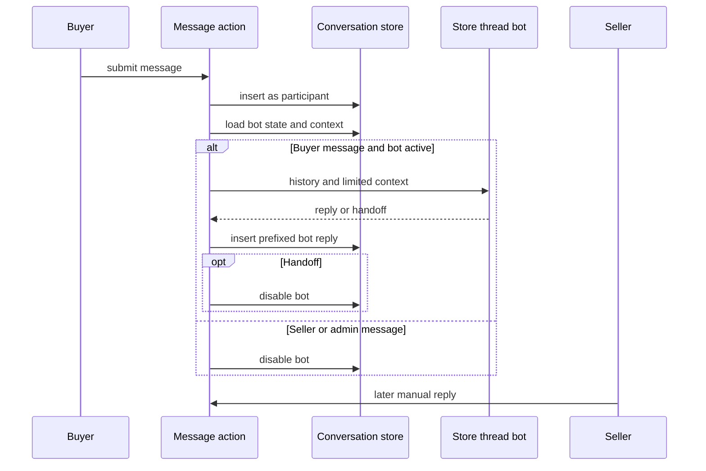

## Scope and authority boundaries

The application uses AI in three distinct contexts:

- The **general customer-service bot** serves the site-wide chat widget and WhatsApp. It has persisted `bot_conversas`/`bot_mensagens` state and may request narrowly defined tools.
- The **buyer-seller thread bot** is a different, tool-free assistant inside the marketplace's `conversas` and `mensagens` thread. It speaks for a store only until a seller takes over or the bot hands off.
- **Seller curation** assesses store and product completeness. Deterministic code decides gaps; a LangSmith agent can only improve the wording of resulting suggestions. A separate authenticated endpoint accepts proposals from a CrewAI-style external curator.

In all cases, generated text is not an authorization mechanism and does not directly write arbitrary business data. The surrounding route, server action, or orchestrator owns identity checks, persistence, and side effects. For the underlying database/RLS model, see [Data Access, Security, and Schema Evolution](/openwiki/architecture/data-access-security-and-schema-evolution.md); for the business workflows, see [Marketplace Catalog and Roles](/openwiki/concepts/marketplace-catalog-and-roles.md), [After-sales Disputes](/openwiki/workflows/after-sales-disputes.md), and [External Services and Webhooks](/openwiki/integrations/external-services-and-webhooks.md).

## General customer-service bot

### Web and WhatsApp entrypoints

`ChatWidget`, mounted in the application layout, is available to anonymous and authenticated visitors. Its display state and current `conversaId` are browser-memory state only; it posts trimmed text and the last returned ID to `POST /api/bot/chat`. The endpoint rejects blank messages, needs OpenAI plus service-role Supabase configuration, creates a `site` conversation when the caller has none, derives the optional Supabase Auth user, and returns `{ conversaId, resposta }`. A client-side network failure remains local to the widget; the durable transcript is written by the server.

WhatsApp uses `GET` and `POST /api/bot/whatsapp/webhook`. The GET handler implements Meta subscription verification with `WHATSAPP_VERIFY_TOKEN`. The POST handler reads the raw body and checks `x-hub-signature-256` as an HMAC-SHA256 with the separate `WHATSAPP_APP_SECRET`; absent secret, malformed header, altered body, and unequal-length signatures all reject. Invalid signatures are reported to Sentry and receive 401 before JSON parsing or message work. After authentication, non-text events and a missing OpenAI or service configuration return `{ ok: true }`, intentionally acknowledging the webhook rather than retrying a bot outage.

Both channels call `processarMensagemBot`, but the caller injects the identity-sensitive adapters. This is the critical control boundary: the OpenAI client receives tool schemas and messages, while the route-controlled adapter performs order/dispute access.

### Conversation data and orchestration

`bot_conversas` records the channel (`site` or `whatsapp`), optional user and phone identity, identification time, persona, Jira key, and `aberta`/`escalada`/`encerrada` status. Its messages have a cascading conversation foreign key, `usuario` or `bot` sender, and trimmed 1–4,000-character content. These tables and `leads` have RLS enabled; standard table policies expose bot records to admins, while the server-side service client performs the application workflow.

For each general-bot turn, the core writes the inbound message, loads up to 30 chronologically ordered messages, reads the saved persona, and asks `gpt-4o-mini` for a response with the system prompt and tool definitions. Requested function calls are executed sequentially, returned to the model, and retried for at most three rounds. Persona can therefore be selected in one round and enable a persona-specific business call in a later round of the same turn. An unknown function gets a structured error; a content-less final model result becomes the persisted fallback `Não consegui gerar uma resposta agora.`

This sequence shows that a model can request work but cannot select a database authority path or continue autonomously without bound.

### Identity and order-disclosure gates

On the site, `buscar_pedido` and `listar_pedidos` query customer views through the request user's Supabase client, so RLS limits results to that user. The optional dispute adapter similarly lists existing disputes only; it does not open one. A missing authenticated user produces the core's not-logged-in tool result. The bot may construct a prefilled dispute URL from an authorized order item, but the user must still formally confirm the dispute in the order flow.

WhatsApp treats a sending phone number as a channel address, not a login:

1. The webhook normalizes the sender phone, reuses an open conversation for it, or creates a `whatsapp` conversation.
2. Before `identificado_em` exists, the message body is tried through `resolver_usuario_por_contato`. On a match, the conversation receives the user ID and timestamp, the sender is asked to continue, and no bot tool processing occurs on that identifying turn.
3. For an identified conversation, the service-role order adapter restricts the base-table query to the linked `cliente_id` **and** requires normalized `telefone_contato` to equal the current sender phone. It removes the checked phone before returning an order to the model. The list path filters the same way, then returns at most 20 orders.

Consequently, knowing a registered email can associate a WhatsApp conversation but cannot by itself disclose an order; a model request cannot bypass the second phone possession check.

### Personas, knowledge, leads, and handoff

The general bot persistently selects one of `consumidor`, `seller`, `motorista`, or `afiliado`. Until then its prompt requires an identification question; once `definir_persona` runs, later calls receive the matching prompt and tutorials. Its tool surface covers persona selection, on-demand PRD lookup, authorized order and dispute lookup, lead registration, and escalation. Tool execution belongs to the shared core, not to OpenAI.

The escalation policy is prompt guidance rather than a stored attempt counter: after two unresolved attempts at the same question as inferred from retained history, or when the person explicitly requests a human, the model should obtain/confirm contact, register an `escalado_humano` lead, and call `abrir_chamado`. A known channel contact is used when the model omits or supplies blank contact; a supplied distinct contact takes precedence and is merged into an existing lead. One lead is maintained per conversation in orchestration, and asynchronous best-effort scoring reads up to 30 messages, accepts only parseable `quente`/`morno`/`frio` JSON, and is throttled to at most once per hour per lead.

`consultar_prd` is deliberately a small, best-effort Confluence CQL integration rather than a vector/RAG pipeline. It searches one page in the configured space using up to six terms longer than three characters, converts storage HTML to plain text, and returns a bounded snippet from the first result. Missing credentials, an empty useful query, no hit, and remote errors yield no snippet and do not prevent a response.

`abrir_chamado` first creates the database incident, then attempts Jira and marks the conversation escalated. The local incident is therefore the audit and triage record even when Jira has no configuration or fails. It can later retain a returned Jira issue key; owner email notification is also best effort. `incidentes_atendimento` is an admin-only RLS resource with `aberto` and `resolvido` states.

## Buyer-seller conversational thread

This is not the general service bot and does not use `bot_conversas`, tools, leads, or Jira. A purchaser must be authenticated and have a paid order with the target store (and product, if applicable) to create or reuse a `comprador × loja × produto` conversation. The server action checks this independently of UI visibility and relies on participant RLS for message insertion.

When a buyer sends to a thread with `bot_ativo`, the action loads a maximum 30-message history plus limited context: purchaser name, relevant product name/perishability, and an unresolved dispute for the linked order. `responderBotConversa` makes a tool-free `chatLivre` call that is instructed to use only this context and never invent order, stock, price, delivery, or policy details. The bot uses a fixed non-login system user as `mensagens.autor_id`, prefixes visible replies with `🤖 Assistente automático da loja:`, and removes that prefix before feeding its own prior replies back to the model.

A seller or admin reply disables `bot_ativo`. The bot also asks to hand off after two unsuccessful attempts at the same question or an explicit human/store request, indicated by its `[HANDOFF]` marker; the action strips the marker, optionally stores the short reply, and disables the bot. If OpenAI is unconfigured, this assistant immediately returns handoff rather than attempting an answer.

This is a per-thread takeover mechanism: human participation, not a general-bot incident, ends automatic store responses.

## Seller curation and external proposal ingestion

Seller product create/update, store profile save, and PIX-key update schedule curation via Next.js `after()`, so a successful seller save does not wait for curation. The orchestrator uses a service client to fetch only the fields needed, catches exceptions, evaluates pure deterministic rules, and writes nothing when there are no gaps.

For a product, the rules require a title of at least 10 trimmed characters, a description of at least 40, at least one image, and a category. For a store, they require CNPJ; complete CEP/city/state/street/number address fields; WhatsApp or email; and confirmed PIX. When gaps exist, the LangSmith deployment may provide product decision wording or one store tip per field. It has a 15-second timeout and returns `null` on absent configuration, HTTP/network failure, unexpected response, or parse failure. Store gaps always fall back to deterministic messages; product suggestions are simply absent if no valid agent result arrives.

The product response must start with `APROVADO`, `REPROVADO`, or `SUGESTAO`. An `APROVADO` result is demoted to `sugestao` whenever deterministic gaps remain, so seller-controlled product text cannot prompt the agent past a code-derived deficiency. Pending product `parecer` suggestions are replaced, while pending store warnings are replaced without touching resolved or discarded warnings.

`POST /api/curadoria-ia` is a separate ingestion boundary for an external CrewAI curator. It requires `Authorization: Bearer <CREWAI_CURADORIA_TOKEN>` and service-role configuration; malformed JSON, missing product ID/content, unknown type, and a non-existent product fail with explicit 4xx responses. It permits only `descricao`, `imagem`, and `dados_loja` proposal types, validates the product exists, and inserts a suggestion with an optional nonblank reason. The external agent never receives direct Supabase credentials, and applying or discarding its proposal remains an admin decision.

## Configuration, operations, and focused tests

The general service bot requires `OPENAI_API_KEY` (or legacy `openai`) and `SUPABASE_SERVICE_ROLE_KEY`. WhatsApp additionally requires `WHATSAPP_VERIFY_TOKEN` for GET setup and `WHATSAPP_APP_SECRET` for signed POSTs. Jira uses `JIRA_BASE_URL`, `JIRA_EMAIL`, `JIRA_API_TOKEN` (with legacy `altassim_jira`/`ALTASSIN_JIRA` fallbacks), and `JIRA_PROJECT_KEY`; Confluence shares its Atlassian credential inputs and can use `CONFLUENCE_SPACE_KEY`. LangSmith curation needs `LANGSMITH_API_KEY`; external curation ingestion separately needs `CREWAI_CURADORIA_TOKEN`.

Operationally, treat a site-chat 503 as missing model/service prerequisites. A signed WhatsApp POST with missing bot prerequisites returns `{ ok: true }` and produces no reply by design, whereas an invalid signature produces 401 and a Sentry warning. Investigate escalation from the local admin incident record rather than relying on Jira availability or a Jira key. Confluence, Jira, LangSmith, and curation orchestrator failures log diagnostics without making their best-effort work a customer-facing hard failure.

Focused tests include:

- `src/lib/whatsapp-webhook-signature.test.ts` checks valid signatures plus altered payload, missing/malformed header, wrong secret, and missing-secret fail-closed cases.
- `src/lib/ai/atendimento.test.ts` checks known-contact precedence and blank contact fallback; `src/lib/ai/leadScoring.test.ts` checks strict score parsing.
- `src/lib/agentes/curadoria-regras.test.ts` covers individual and combined deterministic gaps; `src/lib/agentes/langsmith-curadoria.test.ts` verifies strict parsing and approval demotion.
- `supabase/tests/e2e_incidentes_atendimento.sql` verifies that admins can create/read/resolve incidents while ordinary authenticated users cannot read or insert them.
