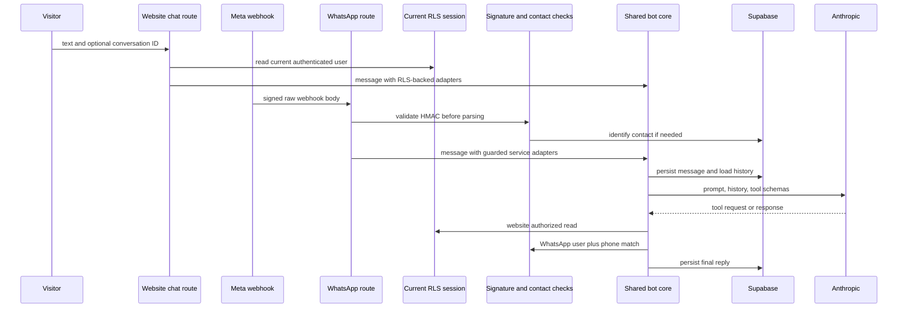

## Scope and authority boundaries

This page covers four related but separate AI-assisted experiences:

- The **general support bot** serves the global website widget and WhatsApp. It persists its own `bot_conversas` and `bot_mensagens` records and may request a narrowly defined tool set.
- The **buyer-seller thread bot** is a separate, tool-free assistant in marketplace `conversas` and `mensagens`. It speaks for a store only until a seller takes over or the bot hands off.
- **Seller completeness curation** evaluates product and store data deterministically; a LangSmith agent may improve the wording of the resulting guidance.
- **Seller product assistance** generates optional catalogue text, search keywords, price suggestions, image prompts/images, and taxonomy suggestions. It returns suggestions to the form rather than applying business changes itself.

Model output is not a source of truth and does not substitute for persisted business actions. Server routes, server actions, RLS, RPCs, and deterministic curation rules remain responsible for authentication, authorization, writes, and state transitions. See [Data Access, Security, and Schema Evolution](/openwiki/architecture/data-access-security-and-schema-evolution.md), [Marketplace Catalog and Roles](/openwiki/concepts/marketplace-catalog-and-roles.md), and [After-sales Disputes](/openwiki/workflows/after-sales-disputes.md).

## General support bot

### Website entrypoint, persistence, and cost controls

`ChatWidget` is a global client component available to anonymous and signed-in visitors. It keeps the displayed transcript and `conversaId` only in component memory. Each request sends the current ID, text, and a persona seed to `POST /api/bot/chat`; the returned ID is used on later turns. Consequently, closing/reloading the widget loses its local display state but not the server-side conversation.

Any page can dispatch `industria24:abrir-atendimento` through `abrirAtendimento({ persona, mensagem })`. The widget opens and can send that first message immediately. A persona seed is used only while creating a conversation; it is validated against the supported persona set, so invalid client input becomes `null` rather than a persisted arbitrary value.

The site endpoint requires both the configured Anthropic bot client and service-role Supabase access, rejects blank or over-2,000-character input, derives the optional current Supabase Auth user, and creates a `site` conversation when no ID was supplied. It uses the service client for the bot records but injects request-session adapters for sensitive customer reads. The endpoint returns `{ conversaId, resposta }` on success. Before creating model work it applies a 12-message-per-60-second limit keyed by authenticated user ID, or by the first `x-forwarded-for` IP for anonymous traffic; over-limit requests receive 429. The limiter is process-local, so it is a cost guard rather than a distributed rate-limit guarantee.

`GET /api/bot/health` is force-dynamic and exposes only boolean readiness: `llm` for the Anthropic key and `service` for service-role Supabase. It never returns credentials.

### Channel identity and tool authorization

The two channels deliberately do **not** establish identity the same way. The website order and dispute adapters use the current request's Supabase RLS session. WhatsApp first establishes that Meta sent the webhook, then treats its phone number as a channel address—not a login—and requires an additional possession check before exposing order information.

This sequence shows the authorization boundary: the model can request a tool, but caller-owned adapters decide whether it can disclose data.

On the website, `buscar_pedido` and `listar_pedidos` query `pedidos_cliente` through the current RLS session, and `buscar_disputas_pos_venda` reads existing disputes through that same session. The general bot never creates a dispute: it can help construct a prefilled dispute link after an authorized lookup, while formal opening remains in the order flow.

WhatsApp `GET /api/bot/whatsapp/webhook` completes Meta verification only when the supplied subscription token equals `WHATSAPP_VERIFY_TOKEN`. For POST, the route reads the raw body and validates `x-hub-signature-256` as a SHA-256 HMAC using `WHATSAPP_APP_SECRET`. A missing secret/header, malformed prefix, changed body, or non-comparable digest fails closed with 401; invalid signatures are reported to Sentry before JSON is processed. Signed requests with unavailable bot prerequisites or without a text message are acknowledged with `{ ok: true }`, avoiding webhook retry storms.

For a valid text message, the route normalizes the sender phone and reuses an open conversation for it or creates a `whatsapp` conversation. Until `identificado_em` is present, the received text is passed to the security-definer `resolver_usuario_por_contato` lookup. A match links the user and records the timestamp, sends an identification acknowledgement, and ends that webhook turn without invoking bot tools.

Identification alone is insufficient for an order lookup. The service-role adapter requires both the linked `cliente_id` **and** that the normalized `telefone_contato` on the order equals the current sender number. It removes `telefone_contato` before returning an individual order. Listing applies the same phone filter, then returns at most 20 of the newest qualifying orders. Therefore, knowing somebody else's email may associate a WhatsApp conversation but cannot by itself disclose that person's order.

### Shared orchestration and conversation lifecycle

The shared `processarMensagemBot` core is channel-neutral: callers supply identity and data adapters. For each turn it persists the incoming text, loads chronological history capped at 30 messages plus the saved persona, and invokes Claude Haiku 4.5. The model interface uses the internal OpenAI-style message types, translated at the provider boundary to Anthropic messages. Tool results from one model turn are grouped into one Anthropic `user` message, as required by that API.

The core processes function requests sequentially for no more than three rounds, returns a structured error for an unknown tool, and persists either final model text or `Não consegui gerar uma resposta agora.`. This bound supports a first-round persona selection followed by persona-specific work without turning the feature into an unbounded autonomous agent.

`bot_conversas` records the `site` or `whatsapp` channel, optional user/phone identity, identification time, persona, Jira key, and `aberta`, `escalada`, or `encerrada` status. Messages cascade on conversation deletion, are attributed as `usuario` or `bot`, and must be nonblank and 1–4,000 characters. The bot tables and leads have RLS enabled; ordinary table policies expose bot records to admins, while these server workflows use service-role access.

### Personas, knowledge, leads, and escalation

The persisted personas are `consumidor`, `seller`, `motorista`, and `afiliado`. With no persona, the prompt requires the bot to identify one; `definir_persona` persists the selected value and subsequent calls receive the persona-specific prompt. The configured tool surface is persona selection, PRD lookup, authorized order/dispute reads, lead registration, and human escalation. Tool schemas describe possible requests, but database and external side effects are executed only in shared orchestration.

Persona seeding is an optimization for an entrypoint that already knows the visitor's role, not an authority grant. The server validates it against the same allowed list used by the database constraint. The focused `systemPrompt` test covers valid and invalid seed values.

`consultar_prd` is a best-effort Confluence CQL lookup rather than vector RAG. It takes up to six terms longer than three characters, searches the configured space, extracts plain text from the first matching page, and returns a bounded nearby snippet. Missing configuration, unusable terms, no match, or a failed request yields no snippet and does not block support.

Lead registration is idempotent per conversation: an existing lead is updated, and a supplied nonempty, distinct contact is merged with the stored contact. The record carries persona and funnel stage. Scoring is fire-and-forget after registration; it reads up to 30 messages, accepts only valid `quente`, `morno`, or `frio` JSON-shaped output, and will not rescore a lead within one hour. Scoring failure or malformed model output leaves the support flow intact.

Escalation is prompt-guided from retained history rather than enforced by a dedicated attempt counter. On the escalation tool, the core first creates an admin-auditable local incident, then attempts Jira, marks the conversation escalated, and stores a Jira key when one is returned. An unconfigured or failing Jira call returns `null` rather than destroying the local incident; owner email notification is also best effort. Treat the persisted incident, not model text or Jira availability, as the audit record for handoff.

## Buyer-seller conversational thread

The buyer-seller thread is not the general support bot. A buyer must be authenticated, cannot be the store owner, and must have a paid order for the selected store—and, when supplied, product—before `iniciarConversa` creates or reuses the unique buyer × store × product conversation. The server action repeats this authorization independently of UI visibility, and message insertion is additionally constrained by participant RLS.

When a buyer sends into a conversation with `bot_ativo`, the action loads no more than 30 thread messages and a deliberately small context: buyer name, product name/perishability, and one unresolved return. `responderBotConversa` uses the tool-free `chatLivre` path; it has no access to order, stock, pricing, or arbitrary database tools. It is instructed to avoid inventing facts outside that bounded context.

Bot replies use a fixed system-user author and the visible `🤖 Assistente automático da loja:` prefix. The prefix is stripped from earlier bot messages before they are sent back to the model, preventing it from learning to duplicate presentation text. A seller or admin reply sets `bot_ativo` false. The bot also hands off on an explicit request or after two unresolved attempts as judged from conversation history: the action strips `[HANDOFF]`, persists any short reply, and disables the bot. If the LLM is unconfigured, it hands off immediately.

## Seller curation and product assistance

### Completeness curation

Successful product create/update and store profile or dedicated PIX-key saves schedule deterministic curation with Next.js `after()`. The seller-facing save does not wait for curation. The orchestrator uses service-role reads, catches all exceptions, and does nothing when there are no gaps.

Product completeness requires a trimmed title of at least 10 characters, a description of at least 40 characters, at least one image, and a category. Store completeness requires CNPJ; CEP, city, state, street, and number; either WhatsApp or email; and confirmed PIX. These are code-derived facts, not model judgments.

Only when gaps exist does the orchestrator call the LangSmith deployment for human-friendly wording. The call has a 15-second timeout and returns `null` on missing configuration, HTTP/network failure, unexpected result, or parse failure. Missing product wording means no pending product suggestion is written; store warnings instead fall back to deterministic gap messages. Rechecks replace pending product opinions and pending store warnings without changing warnings already marked resolved or discarded.

A product response must start with `APROVADO`, `REPROVADO`, or `SUGESTAO`. Even a model `APROVADO` is demoted to `sugestao` if deterministic gaps remain. This prevents seller-controlled product text from prompting the external writer into approving an incomplete listing. The curation rules and LangSmith tests cover gap detection, strict decision parsing, and this demotion behavior.

### Seller-invoked product help

`gerarCuradoriaProduto(produtoId)` is a seller server action, not automatic approval. It requires `ANTHROPIC_API_KEY`, an authenticated owner of the target product, and compares against up to 15 approved products in the same category. Claude returns schema-constrained optimized description, SEO keywords, suggested unit price, and justification; the result is returned to the form and the seller decides what to save.

`gerarImagemProduto(nome, descricao)` also requires an authenticated seller who owns a store. Claude first produces a catalogue-photo prompt. If an OpenAI key is absent, the action returns that prompt with `pendente: true`; it does not fabricate an image. With `OPENAI_API_KEY` or legacy `openai`, it calls `gpt-image-1`, uploads the returned PNG to the `produtos` bucket under the seller store ID, and returns the public URL for the form to persist. It does not itself add a product row or image relation.

Taxonomy assistance is read-only: `sugerirTaxonomiaJev` returns no suggestions unless there is an authenticated user and `TYPESAFE_API_KEY`, bounds input to name/description slices, traverses selectable non-obsolete taxonomy nodes through a per-request cache, and returns an empty list on errors. As with all assistance here, generated text, images, pricing, and taxonomy suggestions require the seller's normal persisted save path.

## Operations and focused tests

The support bot needs `ANTHROPIC_API_KEY` and service-role Supabase configuration. WhatsApp additionally needs `WHATSAPP_VERIFY_TOKEN` for Meta's GET handshake and `WHATSAPP_APP_SECRET` for signed POSTs. PRD lookup and Jira share `JIRA_BASE_URL`, `JIRA_EMAIL`, and `JIRA_API_TOKEN` (with legacy token fallbacks); Confluence can set `CONFLUENCE_SPACE_KEY`, and Jira can set `JIRA_PROJECT_KEY`. Lead scoring shares the bot model configuration. Completeness wording needs `LANGSMITH_API_KEY`. Seller product help needs `ANTHROPIC_API_KEY`, with image generation additionally requiring an OpenAI key; taxonomy suggestions need `TYPESAFE_API_KEY`.

Operationally, a 503 from site chat means the bot model or service client is unavailable; a 429 is the local cost limiter. A bad WhatsApp signature is a security failure (401 and Sentry warning), while a correctly signed but temporarily unconfigured webhook is deliberately acknowledged. Keep incident review independent of Jira health. External knowledge, scoring, Jira, and LangSmith wording are enrichments or best-effort integrations; they must not be made prerequisites for the underlying persisted support or seller workflows.

Focused tests include `src/lib/ai/claude.test.ts`, which verifies Anthropic message conversion and grouping of tool results, and `src/lib/ai/systemPrompt.test.ts`, which verifies safe persona seeding. The WhatsApp signature test exercises valid and tampered payload cases, while curation rule and LangSmith tests protect deterministic completeness and the approval-demotion invariant.
