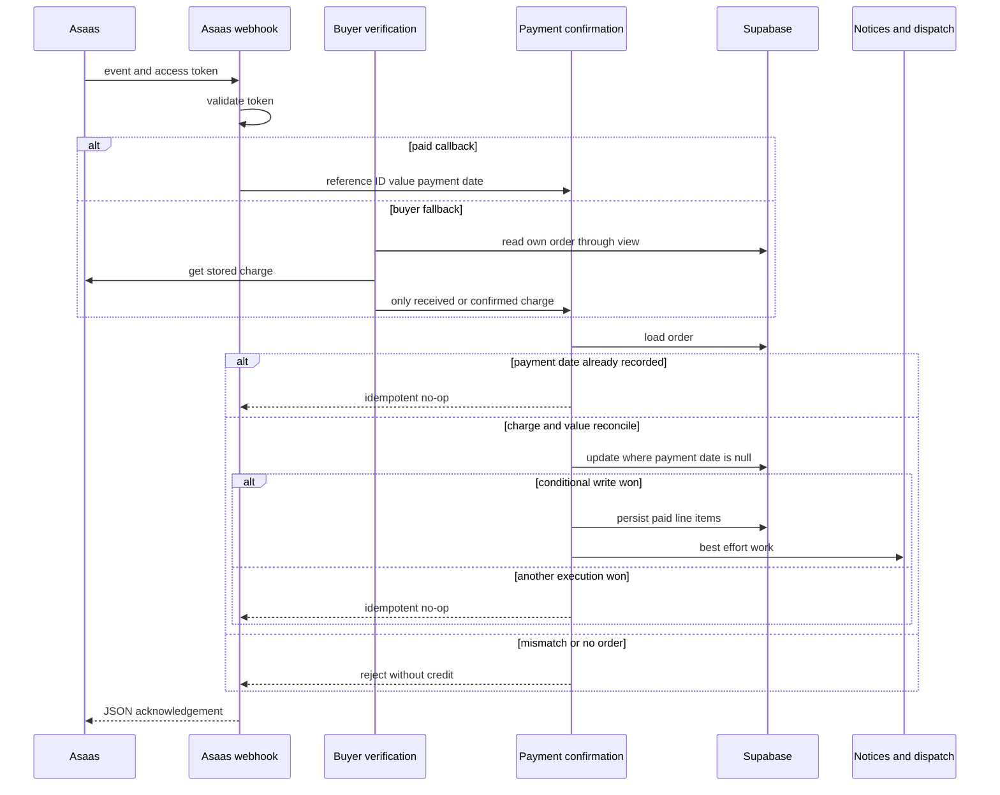

# External Services and Webhooks

Supabase owns durable marketplace state: orders (`pedidos`), order lines (`linha_itens`), routes (`rotas`), runs (`corridas`), payment recipients (`repasses`), and support conversations (`bot_conversas`). Providers supply payment evidence, delivery execution, messages, email transport, route estimates, bot mitigation, and telemetry. A provider callback is an authenticated input—not authorization by itself to mutate business state. Reconcile it against persisted records, win a conditional durable write, and only then perform non-authoritative downstream effects.

## Integration contracts at a glance

| Capability | Configuration and contract | Degraded behavior |
| --- | --- | --- |
| Asaas payments | `ASAAS_API_KEY` enables the server-only client. Only `ASAAS_ENV=production` uses production; all other values use sandbox. Customer lookup/creation validates CPF/CNPJ; payments use `pedidoId` as `externalReference` and support PIX, boleto, and hosted card billing. | Missing key means no simulated charge. Provider calls abort after 12 seconds; the already-created order remains retryable. |
| Asaas webhook | Asaas sends `asaas-access-token` to `POST /api/asaas/webhook`; configure `ASAAS_WEBHOOK_TOKEN`. Paid events enter the shared confirmation service only after token validation. | Invalid token returns 401; absent service role returns 500. Malformed, incomplete, unsupported, or unreconcilable events are acknowledged as ignored. |
| Resend | `RESEND_API_KEY` enables `POST https://api.resend.com/emails`; `RESEND_FROM` is optional and defaults to `Indústria 24h <nao-responda@industria24.com.br>`. | Missing key or a non-success provider response yields an explicit unsent result. Status mail cannot undo a persisted transition. |
| Uber Direct | `UBER_DIRECT_CUSTOMER_ID`, `UBER_DIRECT_CLIENT_ID`, and `UBER_DIRECT_CLIENT_SECRET` enable the delivery fallback. Credentials select sandbox or production; there is no alternate base URL. | Disabled until all three values exist. Delivery failures are post-payment errors, not payment reversals. |
| Meta WhatsApp | `WHATSAPP_TOKEN` and `WHATSAPP_PHONE_ID` send text through Graph API v21.0. `WHATSAPP_VERIFY_TOKEN` handles subscription verification and `WHATSAPP_APP_SECRET` authenticates POSTs. | Sending returns `false` when unconfigured or the number is too short; inbound POST validation fails closed. |
| BubbleWhats | `BUBBLEWHATS_TOKEN` and `BUBBLEWHATS_API_URL` call only `POST /send-message`; `BUBBLEWHATS_WEBHOOK_SECRET` protects its inbound observer. | Sending reports classified failures. Inbound events are logged/telemetried only and do not drive marketplace state. |
| ViaCEP and Google Routes | ViaCEP requires no key. `GOOGLE_MAPS_API_KEY` enables server-only Routes calls; `GEO_MAX_CHAMADAS_DIA` defaults to 5000. | CEP lookup returns `null`; Routes returns typed failure rather than fabricated metrics. A Maps directions link needs no key. |
| Turnstile | `NEXT_PUBLIC_TURNSTILE_SITE_KEY` renders the widget and `TURNSTILE_SECRET_KEY` enables verification for login, signup, and checkout. | Without the server secret verification deliberately returns `true`; with it, missing/rejected tokens and HTTP/network errors reject the action. |

> **Configuration hygiene.** `.env.example` documents only a subset of integration variables, including Sentry, Resend, Uber Direct, and the WhatsApp App Secret. Deliberately configure omitted Asaas, Meta sending/verification, BubbleWhats, Turnstile, and Maps variables. Only explicit `NEXT_PUBLIC_` values belong in browser-visible configuration; API keys, tokens, client secrets, webhook secrets, and service-role credentials remain server-side.

## Asaas: payment evidence, durable authority, and encryption

Checkout first calls the database `checkout_criar_pedido` RPC for each seller group. It then performs customer/payment work only when both Asaas and the service role are configured. Thus, Asaas failure does not roll back an order; the order page can retry charge creation. The charge is written back to `pedidos` only with `asaas_cobranca_id IS NULL`. If a concurrent request already recorded a charge, the losing request cancels its newly created Asaas charge; cancellation failure is captured as a possible ghost charge for investigation.

The service-role checkout path caches the provider customer ID in `asaas_clientes`. It may upsert a CPF/CNPJ in plaintext, but the database trigger encrypts every nonempty value with `pgp_sym_encrypt` using a Vault-backed key, clears the plaintext column, and grants decryption only to `service_role`. Applying the migration requires the `cpf_cnpj_encryption_key` Vault secret; it fails early if absent. This is a database-enforced privacy boundary, not a promise that callers must remember to encrypt.

Asaas is payment evidence, while Supabase remains the state authority. Both the signed webhook and the buyer-controlled `verificarPagamento` action call `confirmarPagamentoPedido`. The manual path can read only the caller's order through `pedidos_cliente`, queries its stored charge, accepts only Asaas `RECEIVED` or `CONFIRMED`, and limits verification to once per order per 15 seconds. It is a fallback for delayed, failed, or environment-misconfigured webhook delivery—not a polling mechanism.

This sequence shows that a callback supplies evidence only: persisted charge/value checks and the `dt_pagamento` conditional write authorize the one durable transition.

For `PAYMENT_RECEIVED` and `PAYMENT_CONFIRMED`, confirmation first loads `asaas_cobranca_id`, `valor_pedido`, and `dt_pagamento`. A non-null `dt_pagamento` is the idempotency fact, regardless of the order's later lifecycle status. Before any write, the charge ID must equal `payment.id` and the received value must be at least the order amount. The winning update sets `status_pedido` to `Pagamento Realizado`, records the provider payment date (or current time), and stores the received amount. Crucially, it adds `dt_pagamento IS NULL` to the update itself: if a webhook and manual check pass the initial read concurrently, only one can return a row and mark lines paid or trigger effects. A zero-row write is an idempotent success for the loser.

After that durable payment and line-item recording, buyer/seller WhatsApp, status email, internal dispatch, and eligible Uber Direct work are best effort. WhatsApp and routing exceptions are captured in Sentry; the centralized email notifier catches its own failures. The buyer's pickup/delivery code is sent through BubbleWhats, while the seller receives a paid-order Meta WhatsApp notice without the code, preserving it as a possession check. `PAYMENT_OVERDUE`, `PAYMENT_DELETED`, `PAYMENT_CANCELED`, and `PAYMENT_REFUNDED` invoke `pedido_cancelar_devolver_estoque` and then request cancellation email.

Seller and affiliate PIX settlement is separate from payment collection: Asaas `createPixTransfer` moves a fraction already held in the platform account and is not split payment. At delivery confirmation, the repasse flow recalculates pending ledger records, checks recipient eligibility and PIX details, then conditionally claims each record by changing `pendente` to `processando`. Only the execution that receives a claimed row calls Asaas; it later marks `transferido` (and seller lines transferred) or marks `falhou` and reports to Sentry. Migration 0151 permits the intermediate `processando` status. This conditional claim prevents concurrent retries from paying the same ledger record twice.

## Delivery callbacks and routing

Uber Direct is considered only after internal automatic dispatch produced no `corridas` record and only for an eligible non-consolidated delivery with complete pickup/address data. It quotes before creating a delivery, formats Brazilian addresses as unstructured strings, normalizes contacts to E.164, and persists the returned delivery ID, status, and tracking URL in `rotas`. Internal dispatch stores null route metrics on Google Routes failure while retaining a keyless Maps link.

Register `/webhooks/uber-direct`, which Next rewrites to `/api/webhooks/uber-direct`. When `UBER_DIRECT_WEBHOOK_SIGNING_KEY` is configured, the handler validates raw-body HMAC-SHA256 from `x-uber-signature` with a timing-safe comparison. This dedicated signing key is distinct from the OAuth client secret. With no signing key, the current implementation intentionally accepts the callback; production must configure the dedicated key.

The callback finds routes by `uber_delivery_id`, always persists raw provider status, maps `pending`/`pickup` to `Atribuida`, `pickup_complete`/`in_transit` to `EmTransito`, and `delivered` to `Entregue`, and saves a supplied tracking URL. It attempts the buyer out-for-delivery notice only after an `EmTransito` update. There is no provider-event-ID deduplication, so retries may repeat the update and notice attempt.

## Messaging, email, auth links, and inbound trust boundaries

Meta Cloud API and BubbleWhats are distinct provider boundaries. Meta normalizes recipient numbers with Brazilian country code `55`. Its GET webhook returns the challenge only for the configured verify token; its POST verifies raw-body `X-Hub-Signature-256` using the App Secret and rejects missing/invalid secret or signature. The support bot creates or finds an open conversation by normalized phone. It does not expose sensitive order lookup merely because a sender supplied identifying text: lookup requires an identified user and an order contact phone matching the sender. If service role or OpenAI is unavailable, the handler acknowledges without processing.

BubbleWhats shares a device with another application. This integration never configures the device, plan, or webhook; it sends only `/send-message`. Its inbound endpoint requires a timing-safe query-string secret and only logs message/status events and sends device-status telemetry. Resend accepts text plus optional HTML. `notificarMudancaStatusPedido` is the status-mail boundary for supported status changes and catches every error, so mail delivery cannot reverse state.

Authentication email is also transport, not authority. Password recovery uses Supabase Admin `generateLink` and sends a branded Resend message whose URL targets `/auth/confirm` with `token_hash`, `type=recovery`, and a safe internal next path. Signup likewise generates a link and sends it by Resend. `/auth/confirm` verifies an OTP hash when present or exchanges a PKCE `code` fallback, then redirects only to a `safeNext` internal destination; failed verification redirects to login with `link_invalido`.

## Operational safeguards and focused verification

Google Routes has an in-process daily counter, so its default 5000-call ceiling is a per-instance loop/cost brake rather than a durable serverless quota. Turnstile passes the first `x-forwarded-for` address as `remoteip` and uses an eight-second verification timeout. Sentry is non-authoritative telemetry: absent DSN is a no-op, default PII sending is disabled, and client replay masks text and blocks media.

When changing these integrations:

1. Preserve raw-body HMAC validation and timing-safe token checks. Provider authentication does not remove reconciliation requirements.
2. Keep all payment confirmation behavior in `confirmarPagamentoPedido`; preserve both the `dt_pagamento` read guard and the conditional write.
3. Treat outbound charge creation and PIX payout as separate races: retain their respective conditional database claims and investigate failed provider cleanup rather than hiding it.
4. Keep notifications, email, mapping, and dispatch after the durable write and best effort. They must be observable but must not roll back a paid order.
5. Cover authentication edge cases with `src/lib/token-timing-safe.test.ts`, including correct, incorrect, unequal-length, missing, and unconfigured tokens. Maintain focused tests for webhook signatures, Turnstile failures, BubbleWhats classifications, route failure results, Uber phone normalization, and email status mapping.
