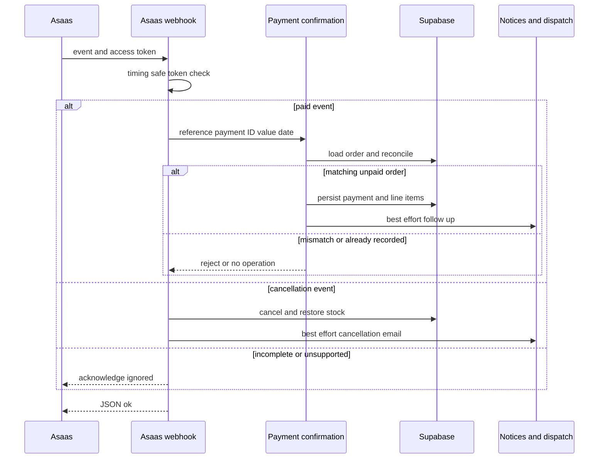
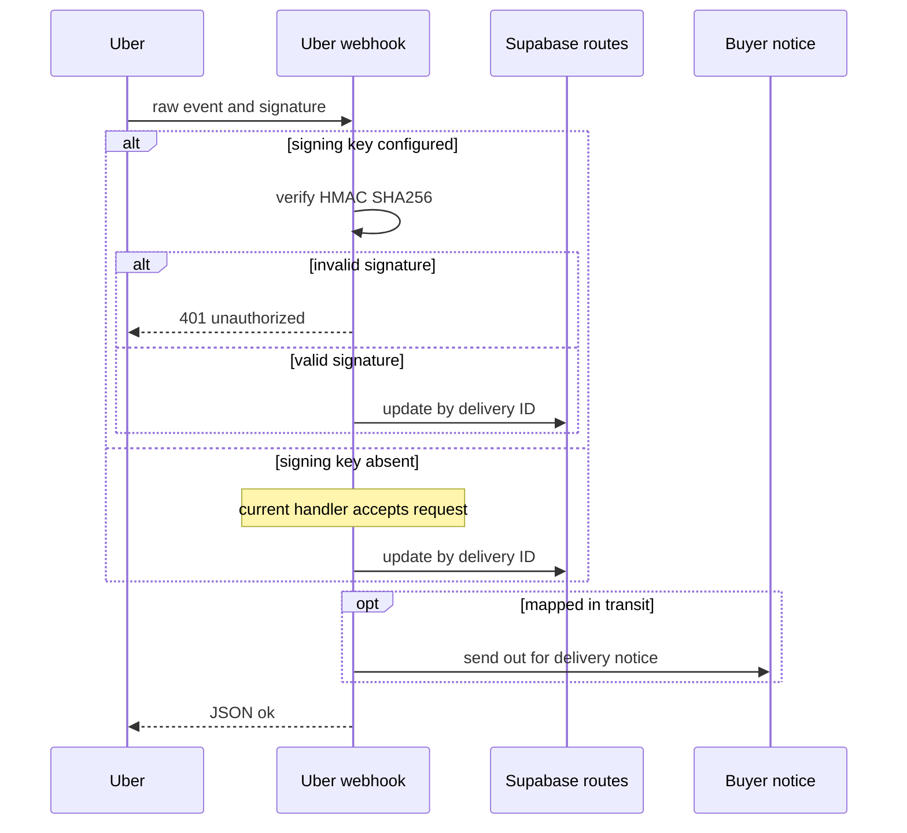

# External Services and Webhooks

Supabase owns marketplace state. External providers may report payment or delivery facts, transport messages, calculate route data, mitigate bots, or receive telemetry; they do not authorize a state change merely by responding or calling back. In particular, a payment callback must pass endpoint authentication and local order/charge/value reconciliation before `pedidos` and `linha_itens` change. Post-persistence messages, email, routing, and telemetry are best effort and must not reverse the durable transition.

## Configuration and operating posture

The checked-in `.env.example` currently contains only comments, so it is not a usable inventory of runtime configuration. Provision integration variables through the deployment environment, keep all credentials server-side, and treat the following as the implementation contract:

| Integration | Configuration and boundary | Disabled or failure behavior |
| --- | --- | --- |
| Asaas | `ASAAS_API_KEY`; `ASAAS_ENV=production` selects production and every other value selects sandbox. `ASAAS_WEBHOOK_TOKEN` authenticates `/api/asaas/webhook`. | No key means no charge is simulated. Requests have a 12-second abort deadline and errors reach the calling checkout flow. |
| Uber Direct | `UBER_DIRECT_CUSTOMER_ID`, `UBER_DIRECT_CLIENT_ID`, and `UBER_DIRECT_CLIENT_SECRET` enable delivery creation. `UBER_DIRECT_WEBHOOK_SIGNING_KEY` is a separate callback signing key. | Delivery fallback is off without all OAuth credentials. **Production gap:** an absent callback signing key makes the current handler accept callbacks; install the per-endpoint Uber signing key. |
| Meta WhatsApp | `WHATSAPP_TOKEN` and `WHATSAPP_PHONE_ID` send messages. `WHATSAPP_VERIFY_TOKEN` handles subscription GET; `WHATSAPP_APP_SECRET` validates POST bodies. | Send returns `false` when unconfigured or the normalized number is too short; inbound POST fails closed without a valid App Secret signature. |
| BubbleWhats | `BUBBLEWHATS_TOKEN` and `BUBBLEWHATS_API_URL` send; `BUBBLEWHATS_WEBHOOK_SECRET` protects inbound observation. | Explicit result codes distinguish no configuration and provider failures. The inbound route does not mutate application state. |
| Resend | `RESEND_API_KEY`; optional `RESEND_FROM`. | Returns an unsent result without a key; reserved/test recipient domains are terminal non-deliverable results, not retryable sends. |
| ViaCEP and Google | ViaCEP needs no key. Google accepts the first nonblank of `GOOGLE_MAPS_API_KEY` and legacy `GOOGLE_MAPS_API`; `GEO_MAX_CHAMADAS_DIA` defaults to 5000. | CEP lookup returns `null`; route/geocoding operations return typed failures rather than fabricated data. |
| Turnstile | `NEXT_PUBLIC_TURNSTILE_SITE_KEY` is browser-visible; `TURNSTILE_SECRET_KEY` is server-only. | The current `TURNSTILE_ATIVO` kill switch is `false`: no widget or verification call runs and all checks accept. Re-enable the flag before relying on either key as a gate. |
| Sentry | `NEXT_PUBLIC_SENTRY_DSN` enables SDK initialization. `SENTRY_ORG`, `SENTRY_PROJECT`, and `SENTRY_AUTH_TOKEN` support build-time source-map upload. | No DSN is a no-op; monitoring must never gate a business action. |

## Asaas: payment creation, authenticated confirmation, and settlement

`src/lib/asaas.ts` is server-only. It finds or creates a customer after validating an 11- or 14-digit CPF/CNPJ, creates PIX, boleto, or hosted-card payments with `pedidoId` as `externalReference`, and uses a due date three days ahead. PIX QR data is retrieved separately; hosted billing means card details do not traverse this application. Its separate `createPixTransfer` is seller/affiliate settlement, not a payment split.

The normal confirmation entrypoint is `POST /api/asaas/webhook`. It timing-safely checks `asaas-access-token`, requires service-role configuration, parses the event, and delegates only paid or cancellation-class events. Invalid authentication is 401; unavailable service role is 500. Invalid JSON, incomplete events, unsupported events, and reconciliation rejects are deliberately acknowledged as ignored, avoiding provider retry loops while never crediting an untrusted payment.

The buyer-facing fallback `verificarPagamento` is intentionally not polling: it reads only the caller-visible `pedidos_cliente` row, checks the stored charge with Asaas, accepts only `RECEIVED` or `CONFIRMED`, and is limited once per order per 15 seconds. Both paths converge on `confirmarPagamentoPedido`.

This sequence shows that endpoint authentication alone is insufficient: the local charge and amount checks authorize the payment transition.

The core first treats a non-null `dt_pagamento` as an idempotent no-op. For a new payment it requires the callback payment ID to equal `asaas_cobranca_id` and its value to be at least `valor_pedido`. Its conditional `dt_pagamento IS NULL` update closes the concurrent webhook/manual-check race; only the writer that updates the order marks line items paid and begins follow-up work. It records the received value and payment date. Cancellation events call `pedido_cancelar_devolver_estoque` before requesting cancellation email.

After persistence, buyer and seller notifications, status email, internal dispatch, and eligible Uber fallback are isolated as best effort; failures are captured rather than undoing payment. The buyer receives the pickup/delivery code through BubbleWhats, whereas the seller’s Meta notification intentionally excludes it. Seller/affiliate PIX transfers have a separate durable claim: a `repasses` row must transition from `pendente` to `processando` before the Asaas transfer call; competing retries that claim no row do not transfer again, and exceptions mark that repasse `falhou`.

## Uber Direct: fallback delivery and callback lifecycle

Post-payment dispatch first tries the internal `corridas` RPC. It stores null distance/duration when Google Routes fails but retains a keyless Google Maps link. Uber Direct is considered only where no internal run exists (or the line explicitly selected Uber), the order is not consolidated freight, delivery address data exists, and the store pickup address is complete. The client obtains and in-process caches an OAuth client-credentials token, quotes before creating a delivery, sends Brazilian addresses as unstructured strings and contacts in E.164, then persists the returned delivery ID, status, tracking URL, and quoted fee in `rotas`.

Register `https://industria24.com.br/webhooks/uber-direct`; Next rewrites it to `/api/webhooks/uber-direct`. When `UBER_DIRECT_WEBHOOK_SIGNING_KEY` is configured, the raw body requires timing-safe HMAC-SHA256 verification of `x-uber-signature`. This signing key is not the OAuth client secret. The implementation currently returns true if the signing key is absent, so an unconfigured deployment has an unauthenticated state-changing callback and must be remediated rather than treated as trusted.

This sequence shows the configuration-dependent trust boundary and that the route update precedes the out-for-delivery notice.

The handler locates the route by `uber_delivery_id`, always records raw `uber_status`, saves a supplied tracking URL, and maps `pending`/`pickup` to `Atribuida`, `pickup_complete`/`in_transit` to `EmTransito`, and `delivered` to `Entregue`. It captures database update errors but acknowledges the provider. There is no provider-event-ID deduplication, so retries can repeat the update and the `EmTransito` notification attempt. The notice is awaited after persistence; changing this endpoint should catch downstream notification failure if acknowledgement reliability is required.

## Messaging, email, and support channels

Meta sending normalizes to Brazilian country code `55` and posts text to Graph API v21.0. Its support webhook GET returns `hub.challenge` only for the configured verify token. POST validates the raw body as `sha256=<hex>` using `WHATSAPP_APP_SECRET` before parsing; an absent secret, absent signature, altered body, or wrong signature is rejected.

After signature validation, the support route acknowledges without processing if service-role access or the AI bot is unavailable. It finds an open `bot_conversas` row by normalized phone or creates one. An entered contact may identify a user, but sensitive order tools require both that `cliente_id` and the saved `telefone_contato` to normalize to the sender. Thus a callback, an email typed in chat, or an AI result alone cannot disclose someone else’s order.

BubbleWhats is a distinct shared-device client limited to `POST /send-message`; it never configures the device, plan, or webhook. Its inbound endpoint requires a timing-safe query-string secret, logs message/message-status events, and sends device status to Sentry. It is observation only. Resend sends text plus optional HTML to its REST endpoint. `notificarMudancaStatusPedido` is the centralized status-mail boundary: it supports four order statuses, obtains the buyer email through the service client, and catches all errors, so email cannot reverse a persisted status.

## Address, bot mitigation, and observability

`buscarEndereco` accepts exactly eight cleaned CEP digits and maps a successful ViaCEP response to normalized fields; callers must allow manual completion on `null`. Google Routes, CEP geocoding, and reverse geocoding are server-only and share a per-process, per-day counter. They return explicit `nao_configurado`, quota, no-result/no-route, or provider-unavailable results. The 5000-call default is a per-instance loop/cost brake, not a durable global serverless quota. `linkTrajeto` is pure and needs no key.

Turnstile call sites still pass the first `x-forwarded-for` address from checkout/login/registration to `verificarTurnstile`. If the kill switch is turned on and a secret is present, missing/rejected tokens plus Cloudflare HTTP/network failures reject the request after an eight-second timeout; with no secret, verification deliberately returns true. At present, however, the false kill switch short-circuits before all of those cases, including widget rendering. The focused test asserts this disabled contract; restore active-path tests when re-enabling.

Sentry initializes client, Node, and Edge with default PII sending disabled. The browser bridge queues up to ten early errors and dynamically loads the SDK on idle or error; replay masks all text and blocks media. Client trace sampling defaults to 0.1; Node and Edge default to 1. `next.config.ts` supplies static browser security headers, the proxy emits per-request CSP, and Sentry build configuration can upload source maps without making runtime telemetry mandatory.

## Safe changes and focused tests

1. Preserve raw-body validation before parsing and use local identity/value/ownership checks before any state mutation. A delivery quote, an AI response, an unauthenticated callback, or a third-party success response is not authorization.
2. Extend payment confirmation in `confirmarPagamentoPedido`, rather than independently in the webhook and manual fallback. Retain the conditional write and all reconciliation checks.
3. Treat absent integration configuration according to its specific contract: no Asaas charge, no Uber fallback, typed Maps failure, no-op message/email result, or—in the current Uber callback and Turnstile cases—a security risk/intentional disablement requiring explicit operational action.
4. Keep provider follow-up after durable payment/route writes and instrument failure without rolling back marketplace state. Decide explicitly whether callback notification errors need catching before the provider response.
5. Run focused boundary tests: `src/lib/whatsapp-webhook-signature.test.ts` covers valid and invalid Meta HMAC cases; `src/lib/turnstile.test.ts` asserts the current kill-switch behavior; `src/lib/uber-direct.test.ts` covers E.164 normalization; `src/lib/bubblewhats.test.ts` covers explicit result classification; and `src/lib/geo.test.ts` guards against fabricated route metrics.

For adjacent ownership and lifecycle detail, see [data access, security, and schema evolution](../architecture/data-access-security-and-schema-evolution.md), [checkout payment and order lifecycle](../workflows/checkout-payment-and-order-lifecycle.md), [fulfillment and logistics](../workflows/fulfillment-and-logistics.md), [AI assistance and customer channels](ai-assistance-and-customer-channels.md), and [runtime configuration and observability](../operations/runtime-configuration-and-observability.md).
