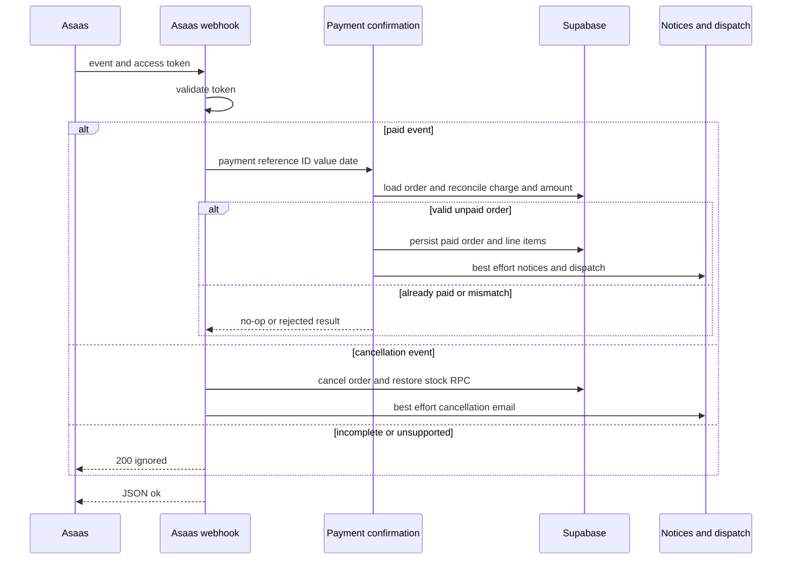

# External Services and Webhooks

The application owns durable marketplace state in Supabase: orders (`pedidos`), order lines (`linha_itens`), routes (`rotas`), runs (`corridas`), and support conversations (`bot_conversas`). External services provide payment confirmation, delivery execution, messages, route estimates, bot mitigation, email transport, and telemetry. Persist a payment or route transition before notification, email, mapping, or dispatch follow-up; those provider calls are best effort and must not undo durable state.

> **Configuration gap and server-only rule.** `.env.example` documents Sentry, Resend, Uber Direct, and `WHATSAPP_APP_SECRET`, but omits variables consumed by Asaas, Meta sending and verification, BubbleWhats, Turnstile, and Google Routes. Configure `ASAAS_API_KEY`, `ASAAS_ENV`, `ASAAS_WEBHOOK_TOKEN`, `WHATSAPP_VERIFY_TOKEN`, `WHATSAPP_TOKEN`, `WHATSAPP_PHONE_ID`, `BUBBLEWHATS_TOKEN`, `BUBBLEWHATS_API_URL`, `BUBBLEWHATS_WEBHOOK_SECRET`, `TURNSTILE_SECRET_KEY`, `NEXT_PUBLIC_TURNSTILE_SITE_KEY`, `GOOGLE_MAPS_API_KEY`, and optionally `GEO_MAX_CHAMADAS_DIA` deliberately. Only the explicit `NEXT_PUBLIC_` site key belongs in browser-visible configuration; all tokens, API keys, client secrets, and service-role credentials stay server-side.

## Contracts at a glance

| Capability | Configuration and contract | Degraded behavior and operational action |
| --- | --- | --- |
| Asaas payments | `ASAAS_API_KEY` enables the server client; `ASAAS_ENV=production` selects production, any other value selects sandbox. It finds or creates a CPF/CNPJ customer, then creates PIX, boleto, or hosted credit-card payments with `pedidoId` as `externalReference`. | No key means no charge is simulated. Requests abort after 12 seconds and provider failures propagate to checkout, which has already persisted the order and permits retry. |
| Asaas webhook | Asaas posts `asaas-access-token` to `POST /api/asaas/webhook`; configure `ASAAS_WEBHOOK_TOKEN` in its console. | Invalid authentication is 401 and absent service role is 500. Parse failures, incomplete payloads, unsupported events, and rejected payment reconciliation are acknowledged as ignored to avoid a retry loop. |
| Uber Direct | `UBER_DIRECT_CUSTOMER_ID`, `UBER_DIRECT_CLIENT_ID`, and `UBER_DIRECT_CLIENT_SECRET` enable fallback delivery. OAuth client-credentials tokens are cached in process memory with a five-minute expiry margin. The configured credentials, not an API base URL, distinguish sandbox from production. | The fallback is off until all three credentials exist. A delivery error is caught by post-payment dispatch telemetry and cannot reverse payment. |
| Uber callback | Register `/webhooks/uber-direct`, rewritten to `/api/webhooks/uber-direct`. `UBER_DIRECT_WEBHOOK_SIGNING_KEY` is the dedicated signing key for that endpoint. | With a key, `x-uber-signature` is raw-body HMAC-SHA256 checked with a timing-safe comparison. **Pending console action:** copy the dedicated Uber Webhook Signing Key to deployment configuration. Without it, the handler intentionally accepts requests, which is a production security gap. |
| Meta WhatsApp | `WHATSAPP_TOKEN` and `WHATSAPP_PHONE_ID` send text through Graph API v21.0. `WHATSAPP_VERIFY_TOKEN` is for the GET subscription handshake; `WHATSAPP_APP_SECRET` is separately used for POST signatures. | Sending returns `false` if unconfigured or the normalized number is too short. POST authentication fails closed if the secret or signature is missing or invalid. |
| BubbleWhats | `BUBBLEWHATS_TOKEN` and `BUBBLEWHATS_API_URL` are used only for `POST /send-message`; `BUBBLEWHATS_WEBHOOK_SECRET` protects inbound observation. | Sender results explicitly classify unconfigured and provider-status failures. The inbound route logs/telemeters events only and does not mutate order or conversation state. |
| Resend | `RESEND_API_KEY` enables REST email; `RESEND_FROM` is optional and defaults to `Indústria 24h <nao-responda@industria24.com.br>`. | Missing key yields an explicit unsent result. The centralized order-status notifier catches errors, so mail cannot roll back state. |
| ViaCEP and Google Routes | ViaCEP needs no key. `GOOGLE_MAPS_API_KEY` enables server-only Routes calls; `GEO_MAX_CHAMADAS_DIA` defaults to 5000. | Invalid/unavailable CEPs return `null`. Routes returns typed failure rather than invented metrics; a Google Maps direction URL always works without a key. |
| Turnstile | `NEXT_PUBLIC_TURNSTILE_SITE_KEY` renders the browser widget and `TURNSTILE_SECRET_KEY` enables server verification. | With a secret, absent/rejected tokens and HTTP/network failures reject checkout and registration. Without the server secret verification returns `true` by design, disabling this defense. |
| Sentry | `NEXT_PUBLIC_SENTRY_DSN` configures client, Node, and Edge SDKs. `SENTRY_ORG`, `SENTRY_PROJECT`, and `SENTRY_AUTH_TOKEN` are build-time source-map-upload inputs. | No DSN is a no-op; missing source-map credentials only skip upload. Telemetry must not gate business work. |

## Inbound trust boundaries and state owners

| Endpoint | State owner | Authentication and acknowledgement |
| --- | --- | --- |
| `POST /api/asaas/webhook` | `pedidos` and `linha_itens`; the confirmation service then triggers effects. | Timing-safe access-token comparison. Paid events must resolve an order, match its stored charge ID, and meet its amount before mutation. |
| `GET` / `POST /api/bot/whatsapp/webhook` | Meta subscription handshake and `bot_conversas`. | GET returns `hub.challenge` only for the configured verify token. POST validates raw-body `X-Hub-Signature-256`; missing service role or OpenAI returns `{ ok: true }` without processing. |
| `POST /webhooks/uber-direct` → `/api/webhooks/uber-direct` | `rotas`, located by `uber_delivery_id`. | Invalid configured-key signatures return 401; absent service role returns 500. A missing signing key currently accepts the callback, pending external-console remediation. |
| `POST /api/webhooks/bubblewhats?secret=...` | Observability only. | The query-string secret is required and timing-safely compared; missing/invalid values return 401. Malformed JSON becomes an acknowledged unrecognized event. |

## Payment confirmation: one idempotent core

Asaas is the payment processor, but Supabase is the state authority. Payment creation validates an 11- or 14-digit CPF/CNPJ, creates a payment due in three days, and uses Asaas-hosted billing for boleto and card so card details do not traverse the application. PIX QR data is fetched separately. Seller settlement is a separate Asaas PIX transfer, not a split payment.

Both the signed webhook and the buyer-triggered `verificarPagamento` Server Action converge on `confirmarPagamentoPedido`. The fallback loads only the caller's order through `pedidos_cliente`, queries its stored Asaas charge, and delegates only for `RECEIVED` or `CONFIRMED`; it is rate-limited to one check per order every 15 seconds rather than polling. This matters because webhooks can be missing, delayed, or not registered in the relevant Asaas environment. The core makes an already-paid or later status (`Pagamento Realizado`, `Em Separação`, or `Enviado`) a no-op, preventing duplicate credit, notification, and dispatch when those paths race.

This sequence shows the shared idempotent payment core and the durable-before-effects ordering.

`PAYMENT_RECEIVED` and `PAYMENT_CONFIRMED` pass the external reference, payment ID, amount, and date to that core. It loads the order, requires `asaas_cobranca_id === payment.id` and `payment.value >= valor_pedido`, then sets `status_pedido` to `Pagamento Realizado`, records the received value/date, and marks its line items paid. A mismatch or nonexistent order is acknowledged but never credited. `PAYMENT_OVERDUE`, `PAYMENT_DELETED`, `PAYMENT_CANCELED`, and `PAYMENT_REFUNDED` call `pedido_cancelar_devolver_estoque` and then request cancellation email.

Only after persistence, confirmation attempts buyer/seller WhatsApp notifications, status email, internal dispatch, and eligible Uber Direct fallback. Notification and routing exceptions are captured in Sentry. The buyer's pickup/delivery code travels through BubbleWhats; sellers receive a paid-order Meta WhatsApp message without that code. This separation preserves the code as a possession check.

## Uber Direct lifecycle

Uber is only considered when internal dispatch produced no `corridas` record, the order is not consolidated freight, credentials are present, an actual delivery item exists, and store pickup address data is complete. The client quotes before creating the delivery, renders Brazilian addresses as unstructured strings, normalizes contacts to E.164, and persists the returned delivery ID, provider status, and tracking URL in a route.

This sequence exposes the configuration-dependent callback trust boundary and the status-before-notice ordering.

The callback maps `pending`/`pickup` to `Atribuida`, `pickup_complete`/`in_transit` to `EmTransito`, and `delivered` to `Entregue`. It always records raw `uber_status`, records a supplied tracking URL, and retains the internal status for an unrecognized provider status. Database update errors are sent to Sentry, but the endpoint still acknowledges the provider. There is no explicit provider-event ID deduplication, so retries can repeat the update and an `EmTransito` notice attempt. Also keep the notice best effort when changing this route: the current call is made only after the route update, but an exception from it can prevent the final acknowledgement.

## Messaging and email

Meta Cloud API is the direct outbound channel and the support bot's inbound channel. It normalizes numbers to Brazilian country code `55`. The bot finds an open conversation by normalized sender phone or creates one. Text supplied as contact information can associate a user, but it is not sufficient to disclose order data: order lookup additionally requires both the associated `cliente_id` and a `telefone_contato` that normalizes to the current sender. This protects against someone who knows another user's email. If service-role access or OpenAI is unavailable, processing is skipped without creating a conversation.

BubbleWhats is a separate shared-device integration. The client deliberately does not configure the device, plan, or webhook; it calls only `/send-message`. Results are `nao_configurado`, `token_invalido` (401), `numero_invalido_ou_timeout` (408), `parametro_invalido` (422), `aparelho_desconectado` (502), or `erro_desconhecido`, rather than a false delivery success. Its webhook logs message/message-status events and emits device-status telemetry to Sentry; it cannot drive marketplace state.

Resend accepts text and optional HTML. `notificarMudancaStatusPedido` is the order-status email boundary: it supports `Pagamento Realizado`, `Em Separação`, `Enviado`, and `Cancelado`, fetches the purchaser through the service client, and catches all failures. Password recovery and signup use Supabase Admin-generated links delivered through the same email client; delivery remains non-authoritative.

## Address, anti-bot, and telemetry behavior

`buscarEndereco` accepts exactly eight cleaned CEP digits and returns normalized ViaCEP fields or `null`; callers must permit manual address completion. Google Routes is server-only and returns either distance/duration/link or one of `nao_configurado`, `teto_de_custo`, `sem_rota`, and `provedor_indisponivel`. Its daily counter resets with process memory, making the default 5000-call ceiling a per-instance loop/cost brake—not a durable global serverless quota. Dispatch stores null metrics on failure while still storing `linkTrajeto`.

Turnstile renders only when the public site key exists. Checkout passes the first `x-forwarded-for` address as `remoteip`; the verification call times out after eight seconds. With a configured secret, any missing token, rejection, HTTP error, or network failure is rejection. Deploy both keys in production; omitting the secret intentionally disables verification.

Sentry initializes in client, Node, and Edge contexts with `sendDefaultPii: false`. Client replay masks all text and blocks media; client trace sampling defaults to 0.1 while Node and Edge default to 1. Next configuration adds browser security headers and allows Supabase, Sentry, and Turnstile browser origins; it does not govern server-to-server provider calls. Integration code records parsing, authentication, update, and best-effort-effect failures in Sentry where those failures should be investigated rather than used to reverse durable state.

## Safe changes and focused verification

1. **Validate before side effects.** Preserve raw-body HMAC validation for Meta and Uber and timing-safe comparisons for Asaas and BubbleWhats. The Uber OAuth client secret is not the callback signing key.
2. **Retain the convergence point.** Add payment confirmation behavior in `confirmarPagamentoPedido`, not separately in webhook and manual verification paths. Preserve its already-paid no-op and charge/value reconciliation.
3. **Make degradation explicit.** Missing PSP credentials mean no charge; missing Maps credentials mean no metrics; missing Turnstile secret disables a defense; missing Uber signing key makes a callback permissive. These are different contracts and risks.
4. **Keep effects observable and non-transactional.** Provider errors after order/route persistence need telemetry and must not roll back payment or status. For callback changes, decide explicitly whether a downstream notice failure should be caught before acknowledging a provider retry.
5. **Run boundary tests.** `src/lib/whatsapp-webhook-signature.test.ts` covers Meta HMAC cases; `src/lib/turnstile.test.ts` covers disabled verification and failure cases; `src/lib/bubblewhats.test.ts` covers no-op/status classification; `src/lib/geo.test.ts` guards against fabricated route metrics; `src/lib/uber-direct.test.ts` covers phone normalization; and `src/lib/email-status-pedido.test.ts` covers status-to-email mapping.
