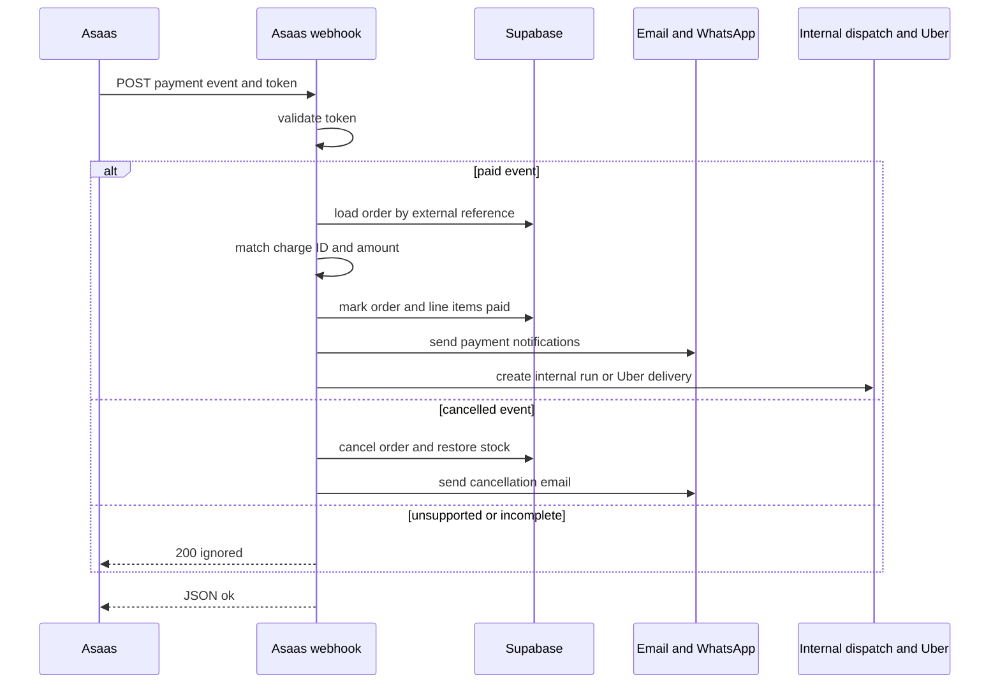
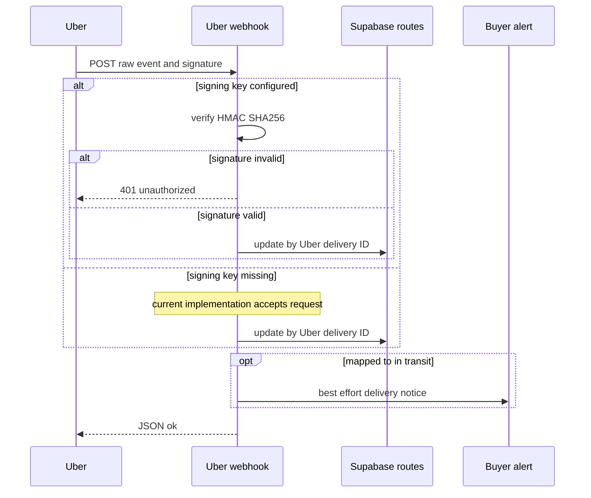

# External Services and Webhook Contracts

The application—not an external provider—owns durable order, line-item, route, and bot-conversation state in Supabase. Providers supply payment confirmation, delivery execution, messages, route metrics, bot mitigation, email transport, and telemetry. In particular, payment and route updates are persisted before notifications or other downstream work; these best-effort effects must not negate a confirmed state transition.

> **Configuration reality:** `.env.example` documents Sentry, Resend, Uber Direct, LangSmith, and `WHATSAPP_APP_SECRET`, but not all variables consumed by these integrations. Set the missing runtime variables deliberately: `ASAAS_API_KEY`, `ASAAS_ENV`, `ASAAS_WEBHOOK_TOKEN`, `WHATSAPP_VERIFY_TOKEN`, `WHATSAPP_TOKEN`, `WHATSAPP_PHONE_ID`, `BUBBLEWHATS_TOKEN`, `BUBBLEWHATS_API_URL`, `BUBBLEWHATS_WEBHOOK_SECRET`, `TURNSTILE_SECRET_KEY`, `NEXT_PUBLIC_TURNSTILE_SITE_KEY`, `GOOGLE_MAPS_API_KEY`, and `GEO_MAX_CHAMADAS_DIA`. Except for the explicit `NEXT_PUBLIC_` site key, credentials belong only in server runtime configuration.

## Boundary map

| Capability | Configuration and contract | Degraded behavior |
| --- | --- | --- |
| Asaas payment creation | `ASAAS_API_KEY`; `ASAAS_ENV=production` selects production and every other value selects sandbox. The server client finds or creates the payer, creates a PIX, boleto, or hosted credit-card payment, and uses the internal `pedidoId` as `externalReference`. | With no key, checkout records the order without inventing a charge. Requests abort after 12 seconds; non-success provider responses are errors for the caller. |
| Asaas payment webhook | `ASAAS_WEBHOOK_TOKEN`; Asaas posts its `asaas-access-token` to `POST /api/asaas/webhook`. | Bad or absent token returns 401; missing service-role configuration returns 500. Malformed, incomplete, or unsupported events are acknowledged as ignored. |
| Uber Direct fallback | `UBER_DIRECT_CUSTOMER_ID`, `UBER_DIRECT_CLIENT_ID`, and `UBER_DIRECT_CLIENT_SECRET`. OAuth client-credentials access tokens are cached in process memory until five minutes before expiry. Credential selection—not a different API base URL—chooses sandbox versus production. | The fallback is disabled unless all three values exist. Provider failures propagate to its post-payment caller, which captures them without reversing payment. |
| Uber Direct webhook | `UBER_DIRECT_WEBHOOK_SIGNING_KEY`; register `/webhooks/uber-direct`, which is rewritten to `/api/webhooks/uber-direct`. | With a signing key, a raw-body HMAC-SHA256 in `x-uber-signature` is timing-safely checked. Without the key, the implementation intentionally accepts requests: production must supply the dedicated webhook signing key from the Uber dashboard, not the OAuth client secret. |
| Meta WhatsApp Cloud API and bot | `WHATSAPP_TOKEN` and `WHATSAPP_PHONE_ID` send text through Graph API v21.0. `WHATSAPP_VERIFY_TOKEN` performs the GET subscription handshake; `WHATSAPP_APP_SECRET` verifies POST signatures. | Sending returns `false` when unconfigured or the normalized number is too short. POST verification fails closed if the app secret or signature is absent or invalid. |
| BubbleWhats | `BUBBLEWHATS_TOKEN` and `BUBBLEWHATS_API_URL` send only through `POST /send-message`; `BUBBLEWHATS_WEBHOOK_SECRET` protects inbound events. | Sending returns a structured no-configuration or status-classified failure. Its inbound handler only observes provider/device events and does not mutate order or bot state. |
| Resend email | `RESEND_API_KEY`; `RESEND_FROM` is optional and defaults to `Indústria 24h <nao-responda@industria24.com.br>`. | An absent key returns an explicit unsent result. Order-status email failures are logged and cannot roll back the status. |
| ViaCEP and Google Routes | ViaCEP has no key. `GOOGLE_MAPS_API_KEY` enables Routes; `GEO_MAX_CHAMADAS_DIA` defaults to 5000. | CEP lookup returns `null` on invalid or unavailable data. Routes returns a typed failure rather than fabricated metrics; the Maps direction URL works without a key. |
| Cloudflare Turnstile | `NEXT_PUBLIC_TURNSTILE_SITE_KEY` renders the browser widget and `TURNSTILE_SECRET_KEY` enables server verification. | A configured verifier rejects absent/rejected tokens and provider HTTP/network failures. With no server secret, verification intentionally accepts, so this protection is disabled. |
| Sentry | `NEXT_PUBLIC_SENTRY_DSN`, sampling/environment variables, and build-only `SENTRY_ORG`, `SENTRY_PROJECT`, and `SENTRY_AUTH_TOKEN` for source-map upload. | No DSN makes the SDK a no-op. Telemetry and optional source-map upload must not gate business transactions. |

## Inbound ownership and trust boundary

| Endpoint | Durable owner | Authentication and acknowledgement |
| --- | --- | --- |
| `POST /api/asaas/webhook` | `pedidos` and `linha_itens`, followed by payment notices and routing. | Timing-safe token comparison. A paid event must also resolve its `externalReference`, match `asaas_cobranca_id`, and have sufficient received value. |
| `GET` / `POST /api/bot/whatsapp/webhook` | Meta subscription handshake and customer-support conversations. | GET returns `hub.challenge` only for the configured verify token. POST validates raw-body `X-Hub-Signature-256`; if service role or OpenAI is unavailable, it returns `{ ok: true }` without processing. |
| `POST /webhooks/uber-direct` → `/api/webhooks/uber-direct` | `rotas`, located by `uber_delivery_id`. | Invalid signatures return 401 when a signing key is configured; missing service role returns 500. The current no-key acceptance is an operational security gap. |
| `POST /api/webhooks/bubblewhats?secret=...` | Observability only: message, message-status, and device-status events. | A required query-string secret is timing-safely compared. Invalid/missing secrets return 401; unparseable JSON is treated as an unknown acknowledged event. |

## Asaas is payment authority; Supabase is payment state authority

Checkout uses Asaas customer lookup/creation after validating an 11- or 14-digit CPF/CNPJ. It creates one payment due in three days, obtains PIX QR data separately when needed, and uses hosted billing for boleto and credit card so card data does not traverse this application. Seller settlement is a separate Asaas PIX transfer, not a payment split.

This sequence shows the durable payment transition before best-effort notification and dispatch work.

`PAYMENT_RECEIVED` and `PAYMENT_CONFIRMED` are the paid events. The handler changes an order to `Pagamento Realizado` only when the stored Asaas charge ID equals `payment.id` and numeric `payment.value` is at least `valor_pedido`; it records the received amount and payment date and marks all line items paid. `PAYMENT_OVERDUE`, `PAYMENT_DELETED`, `PAYMENT_CANCELED`, and `PAYMENT_REFUNDED` invoke `pedido_cancelar_devolver_estoque` and send cancellation email. That cancellation branch is authorized by the webhook token and reference but does not repeat the paid-event charge/value checks.

After a successful paid update, the buyer may receive the pickup/delivery code by BubbleWhats and the seller a paid-order Meta WhatsApp notice without that code. The centralized status-email notifier supports `Pagamento Realizado`, `Em Separação`, `Enviado`, and `Cancelado`. Automatic dispatch then creates an internal `corridas` record where applicable, writes available route metrics or nulls plus a Maps link, and may notify an exclusive logistics affiliate. A line item explicitly assigned to the fixed Uber Direct carrier ID skips internal-run creation and can enter the Uber path. Notification and routing exceptions are captured rather than undoing confirmed payment.

## Uber Direct delivery lifecycle

Uber is considered only after internal dispatch did not create a run, the order is not consolidated freight, Uber is configured, and a delivery item plus complete store pickup address are available. The client quotes before creating a delivery; Brazilian addresses are formatted as unstructured strings and contacts are normalized to E.164. The resulting delivery ID, provider status, and tracking URL are persisted with the route.

This sequence shows status persistence and the configuration-dependent inbound signature boundary.

The webhook maps `pending` and `pickup` to `Atribuida`, `pickup_complete` and `in_transit` to `EmTransito`, and `delivered` to `Entregue`. For a recognized delivery ID it records the raw Uber status, writes a supplied tracking URL, and leaves the internal status unchanged for an unmapped provider status. Database update errors go to Sentry, but the endpoint acknowledges the provider; an `EmTransito` mapping then attempts the buyer out-for-delivery notice. There is no explicit event-ID deduplication, so provider retries can repeat the update and notice attempt.

## Messaging and email channels

Meta Cloud API is the direct outbound channel and the support bot's inbound channel. It normalizes phone numbers to Brazilian country code `55`. The support bot finds an open conversation by normalized sender number or creates one. Identification may resolve a user from supplied contact text, but sensitive order lookup remains gated by a second possession check: the order must belong to that user and its saved `telefone_contato` must normalize to the current sender. If the service role or OpenAI is unavailable, the route acknowledges without creating or processing conversation state.

BubbleWhats is a distinct, shared-device integration. The application deliberately does not configure the device, plan, or webhook through it; its sender calls only `/send-message`. Callers receive `nao_configurado`, `token_invalido` (401), `numero_invalido_ou_timeout` (408), `parametro_invalido` (422), `aparelho_desconectado` (502), or `erro_desconhecido` rather than a false delivery success. Its webhook logs messages/statuses and reports device status to Sentry, so it cannot drive payment, order, or bot transitions.

Resend posts text and optional HTML email to its REST API. `notificarMudancaStatusPedido` is the single best-effort status-email entry point: it looks up the purchaser through the service client, maps only supported statuses to mail content, and catches all errors. Password recovery and signup generate Supabase Admin API links and send branded Resend messages; these outbound messages likewise do not become a durable-state authority.

## Address, route, anti-bot, and telemetry behavior

`buscarEndereco` accepts only an eight-digit CEP and returns normalized ViaCEP address fields or `null`; callers must support manual address completion. CEP coverage is a separate database rule that accepts active store-specific or global fallback ranges.

Google Routes is server-only. `calcularTrajeto` requests Brazilian driving routes and returns either distance/duration/link or a typed `nao_configurado`, `teto_de_custo`, `sem_rota`, or `provedor_indisponivel` result. The daily call counter resets per process and is therefore a per-instance cost/loop brake, not a durable global serverless quota. Dispatch consequently stores null route metrics when unavailable but can always store `linkTrajeto`.

The Turnstile widget renders only when the public site key exists and inserts `cf-turnstile-response` into the surrounding form. Checkout forwards the first `x-forwarded-for` value as `remoteip`; registration does not have an IP at its call site. With a secret, site verification has an eight-second timeout and failures reject registration or checkout while recording a classified Sentry signal. Deploy both public and secret keys in production: omitting the server secret disables verification by design.

Sentry is initialized for client, Node, and Edge execution with `sendDefaultPii: false`. Client replay masks text and blocks media; client trace sampling defaults to 0.1, while Node/Edge tracing defaults to 1 unless overridden. Next configuration applies security headers, permits browser connections to Supabase and Sentry, and wires Sentry build configuration for source maps. Server-to-server provider traffic is not governed by browser CSP.

## Safe changes and focused verification

1. **Keep authentication before side effects.** Preserve raw-body HMAC validation for Meta and Uber and timing-safe comparison for Asaas and BubbleWhats. Do not treat the Uber OAuth client secret as the webhook signing key.
2. **Keep state transitions ahead of effects.** A payment, route, or order-status update must remain durable even if a message, email, route calculation, or dispatch follow-up fails.
3. **Preserve explicit degraded contracts.** Missing PSP credentials create no payment; missing Maps credentials create no route metrics; missing Turnstile secret disables that defense; missing Uber signing key currently makes its callback permissive. Each has different operational risk and must not be silently conflated.
4. **Run the focused tests when changing their boundaries.** `src/lib/whatsapp-webhook-signature.test.ts` covers valid, altered, absent, malformed, wrong-secret, and no-secret Meta signatures. `src/lib/turnstile.test.ts` covers disabled verification, absent token, Cloudflare rejection, and network failure. `src/lib/bubblewhats.test.ts` asserts the no-op and status classifications; `src/lib/geo.test.ts` asserts unavailable routing never becomes a plausible metric; `src/lib/uber-direct.test.ts` covers E.164 normalization; and `src/lib/email-status-pedido.test.ts` covers status-to-email mapping.
5. **Add providers deliberately.** Centralize provider calls and configuration predicates, define a typed failure/degradation result, make inbound ownership and validation explicit in a route handler, decide whether absent credentials fail closed or become an exposed no-op, and document every deployment variable in `.env.example`.
