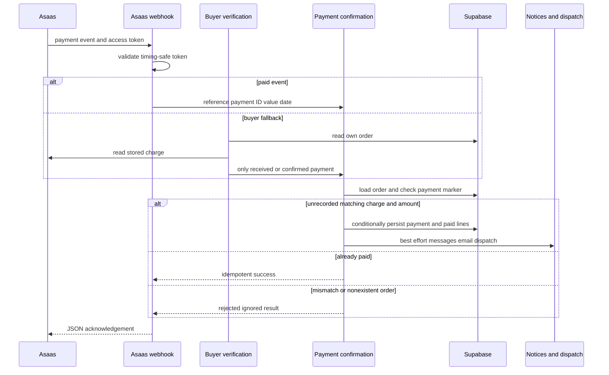
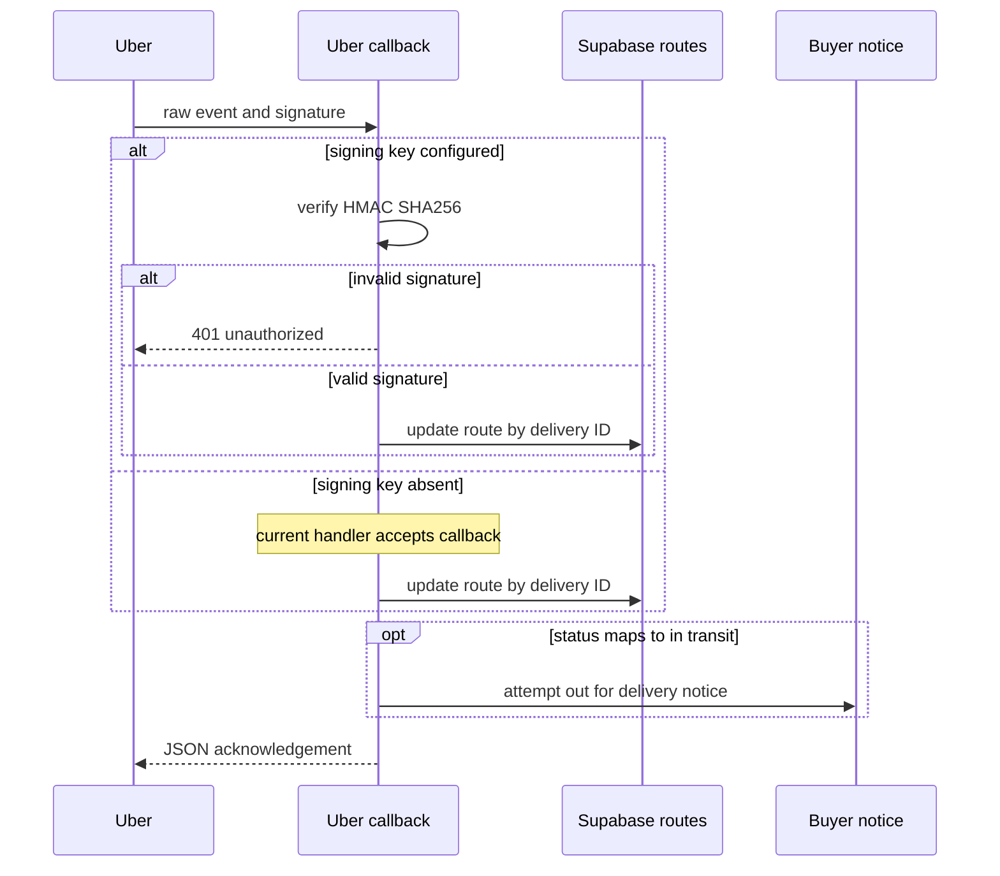

# External Services, Webhooks, and Browser Integrations

Supabase owns marketplace state; providers do not. In particular, `pedidos`, `linha_itens`, `corridas`, `rotas`, and `bot_conversas` are the durable records behind payment, fulfillment, and support behavior. Provider calls that follow a persisted payment or route update—notifications, email, routing, and delivery creation—are deliberately best effort. They must be observable, but must not undo the durable transition.

## Configuration ownership and exposure boundary

All payment keys, OAuth credentials, webhook secrets, WhatsApp tokens, Resend credentials, Google API keys, and Supabase service-role credentials belong in server-side deployment configuration. The only Turnstile value intended for browser exposure is `NEXT_PUBLIC_TURNSTILE_SITE_KEY`. Meta Pixel uses a checked-in public browser identifier, which is not a credential. Do not move any server-only value into a `NEXT_PUBLIC_` variable or a client component.

> **Configuration documentation gap.** The checked-in `.env.example` contains only copy instructions and documents no integration variables. Deployment configuration therefore has to be maintained outside that template and verified per environment. In particular, a value being present is not always equivalent to an active safeguard: `TURNSTILE_ATIVO` is currently `false`, and the Uber callback accepts requests when its signing key is absent.

| Boundary | Configuration and ownership | Failure contract |
| --- | --- | --- |
| Asaas payments | `ASAAS_API_KEY` enables the server-only client. `ASAAS_ENV=production` selects production; every other value selects sandbox. `ASAAS_WEBHOOK_TOKEN` authenticates callbacks. | A missing key does not simulate a charge. A 12-second provider timeout becomes a handled error; checkout retains its already-created order so the buyer can retry charging. |
| Uber Direct | `UBER_DIRECT_CUSTOMER_ID`, `UBER_DIRECT_CLIENT_ID`, and `UBER_DIRECT_CLIENT_SECRET` enable delivery fallback. `UBER_DIRECT_WEBHOOK_SIGNING_KEY` is a separate callback credential. | Missing delivery credentials disable fallback. Missing signing key is a **permissive and unsafe current mode**, not a fail-closed mode. |
| Meta WhatsApp | `WHATSAPP_TOKEN` and `WHATSAPP_PHONE_ID` send outbound Cloud API messages. `WHATSAPP_VERIFY_TOKEN` handles subscription verification and `WHATSAPP_APP_SECRET` authenticates POSTs. | Outbound sending explicitly reports no send when unconfigured or given a too-short number. Inbound POST authentication fails closed. |
| BubbleWhats | `BUBBLEWHATS_TOKEN` and `BUBBLEWHATS_API_URL` are for its sending endpoint; `BUBBLEWHATS_WEBHOOK_SECRET` protects inbound observation. | The sender returns classified failure results. The webhook is authenticated but has no business-state authority. |
| Resend | `RESEND_API_KEY` enables transactional mail; `RESEND_FROM` optionally changes the default sender. | Missing credentials return an unsent result. Unsendable reserved/test domains are terminal non-delivery results rather than retry candidates. |
| ViaCEP and Google | ViaCEP has no key. Google server calls use the first nonempty `GOOGLE_MAPS_API_KEY` or legacy `GOOGLE_MAPS_API`; `GEO_MAX_CHAMADAS_DIA` defaults to 5000. | Address and route failures return null or typed errors rather than fabricated data. |
| Cloudflare Turnstile | Public site key controls widget availability; `TURNSTILE_SECRET_KEY` is server-only. The source-level `TURNSTILE_ATIVO` switch controls both. | The switch is currently off: no widget or verification request is made, and login, registration, and checkout accept absent tokens. |
| Sentry and Meta Pixel | `NEXT_PUBLIC_SENTRY_DSN` enables client, Node, and Edge telemetry; Sentry org/project settings support build integration. Meta Pixel is browser-only on seller-acquisition landing layouts. | Absent Sentry DSN is a no-op. Telemetry and advertising must never gate business work. |

## Inbound webhook trust boundaries

| Endpoint | State owner | Authentication and acknowledgement |
| --- | --- | --- |
| `POST /api/asaas/webhook` | `pedidos` and `linha_itens` | Timing-safe `asaas-access-token` comparison. Invalid token is 401 and missing service role is 500. Malformed, incomplete, unsupported, or reconciliation-rejected events are acknowledged as ignored to avoid retry loops. |
| `GET` / `POST /api/bot/whatsapp/webhook` | Meta subscription and `bot_conversas` | GET returns the challenge only for the configured verify token. POST validates the raw body against `X-Hub-Signature-256` using HMAC-SHA256; an absent secret, header, or valid signature is a 401. |
| `POST /webhooks/uber-direct` → `/api/webhooks/uber-direct` | `rotas`, selected by `uber_delivery_id` | The public endpoint is rewritten by Next. With a signing key, raw-body HMAC-SHA256 is timing-safely compared and invalid requests are 401; with no key, the current handler accepts the request. Missing service role is 500. |
| `POST /api/webhooks/bubblewhats?secret=...` | Observability only | A nonempty query-string secret is timing-safely compared; absent or wrong values are 401. Valid requests are logged/telemetered and acknowledged, including malformed or unknown event bodies. |

### Asaas: validated reconciliation, then effects

Asaas is the payment processor, but it is not trusted to choose which order to credit. Payment creation associates `pedidoId` as `externalReference`. A paid callback must resolve that order and match both the stored `asaas_cobranca_id` and an amount at least equal to `valor_pedido` before it changes state. This is a fail-closed financial check: a nonexistent order, charge mismatch, or insufficient amount is never credited, even though the provider receives an ignored acknowledgement.

The webhook and buyer-triggered `verificarPagamento` action converge on `confirmarPagamentoPedido`. The manual path reads only the caller's order through `pedidos_cliente`, checks the stored Asaas charge, delegates only for `RECEIVED` or `CONFIRMED`, and has a 15-second per-order in-process rate limit. The shared core first treats an existing `dt_pagamento` as idempotent success. Its conditional order update (`dt_pagamento IS NULL`) also closes the race between manual verification and a callback: only the writer that actually records payment updates lines and triggers downstream work.

This sequence shows both confirmation entrypoints, conditional persistence, and durable-before-effects ordering.

`PAYMENT_RECEIVED` and `PAYMENT_CONFIRMED` are paid events. `PAYMENT_OVERDUE`, `PAYMENT_DELETED`, `PAYMENT_CANCELED`, and `PAYMENT_REFUNDED` invoke the `pedido_cancelar_devolver_estoque` RPC and then request cancellation email. In contrast to rejected paid reconciliation, cancellation is delegated by order reference without a payment-ID/value check; failures return 500 and may be retried by Asaas.

Checkout itself creates the database order through `checkout_criar_pedido` before attempting Asaas charging. If configured, it caches an Asaas customer per user, creates PIX, boleto, or hosted credit-card billing, and conditionally stores the charge ID and invoice URL. A concurrent writer that wins that storage race causes the newly created provider charge to be cancelled best effort, with a Sentry signal if that cancellation fails. This limits but cannot guarantee elimination of a ghost charge after provider or cancellation failure.

After the payment and lines persist, buyer code notification through BubbleWhats, seller paid-order notification through Meta WhatsApp, status email, internal dispatch, and eligible Uber fallback are independent best-effort effects. Exceptions for notification and routing are reported to Sentry rather than rolling back confirmed payment. The delivery/pickup code is sent only to the buyer; the seller is told to request it, preserving the code as a possession check.

## Delivery, maps, and Uber Direct

Uber Direct is a fallback after payment persistence. It is disabled until all three delivery credentials are present; the OAuth client-credentials access token is cached only in process memory with a five-minute expiry margin. Sandbox versus production is determined by the configured credentials, not a different API base URL.

Internal automatic dispatch runs first. Uber is considered only if it produced no `corridas` record, credentials are enabled, the order is not consolidated freight, a deliverable line has complete destination basics, and pickup-address data is complete. The Uber client requests a quote before it creates a delivery, formats Brazilian addresses as unstructured strings, normalizes contacts to E.164, and returns the provider ID, status, and tracking URL for insertion in `rotas`.

This sequence shows the configuration-dependent Uber trust boundary and the persisted-route-before-notice ordering.

The callback always stores raw `uber_status`, maps `pending` and `pickup` to `Atribuida`, `pickup_complete` and `in_transit` to `EmTransito`, and `delivered` to `Entregue`. It retains the current internal status for unrecognized provider values and writes a supplied tracking URL. Database errors go to Sentry but are still acknowledged. There is no provider event-ID deduplication: callback retries can repeat the update and an `EmTransito` notification attempt. The notice is invoked only after the route update, but is not locally caught, so its exception can prevent the final acknowledgement and invite provider retries.

Google Routes and Geocoding are server-only. `calcularTrajeto` returns either route distance/duration/link or one of `nao_configurado`, `teto_de_custo`, `sem_rota`, and `provedor_indisponivel`; dispatch stores null metrics on failure while retaining a keyless Google Maps direction link. The process-local daily counter is shared by Routes and Geocoding calls, resets on restart, and is a per-instance cost/loop brake rather than a durable global quota. ViaCEP lookup returns `null` for a non-eight-digit CEP, HTTP failure, or provider-invalid CEP, so callers must support incomplete/manual address entry.

## Messaging and email

Meta Cloud API normalizes recipient numbers to Brazilian country-code form and posts text to Graph API v21.0. It returns `false`, rather than a delivery claim, when credentials are missing, the normalized number is too short, or Meta rejects the request. Free-form text is subject to Meta's channel rules; the client does not transform cold notifications into approved templates.

The signed WhatsApp bot webhook starts work only when service-role access and bot configuration are available; otherwise it returns `{ ok: true }` without parsing or creating a conversation. For text messages, it finds an open conversation by normalized sender phone or creates one. A sender can identify a conversation through contact resolution, but sensitive order lookup additionally requires the stored `cliente_id` and that the order's saved `telefone_contato`, after normalization, equals the sender. It returns order data without the contact phone. This second check prevents knowledge of an email or other contact identifier alone from disclosing another person's orders.

BubbleWhats is deliberately isolated from Meta Cloud API and from device administration: the client calls only `POST /send-message`, never device, plan, or webhook-configuration endpoints. It classifies status failures such as invalid token, timeout/invalid number, invalid parameter, disconnected device, and unknown failure. Its inbound route only logs message/message-status events and sends device-status telemetry to Sentry; it cannot mutate marketplace state.

Resend's `enviarEmail` sends text and optional HTML through its REST endpoint. `notificarMudancaStatusPedido` is the centralized order-status boundary for `Pagamento Realizado`, `Em Separação`, `Enviado`, and `Cancelado`; it gets the purchaser via service access and catches all errors. Recovery and signup flows generate Supabase Admin links and use the same sender, but email delivery remains non-authoritative.

## Browser integrations, anti-bot posture, and observability

**Turnstile is currently disabled.** `TURNSTILE_ATIVO: boolean = false` prevents `TurnstileWidget` from loading Cloudflare or rendering even when a public site key exists, and makes server verification return `true` before checking the secret or token. Login, signup, and checkout still call `verificarTurnstile`, but it accepts them under this switch. When the switch is re-enabled, the intended behavior is fail closed if a configured secret is paired with an absent/rejected token, HTTP failure, or network failure; verification posts the token and optional first `x-forwarded-for` address with an eight-second timeout. Re-enablement must be treated as an operational change: deploy both keys and restore active-path tests.

Meta Pixel is mounted only by `/venda-no-industria` and `/armazeneconosco`, not general storefront or panels. It loads the Meta script after interactivity, sends the initial `PageView`, emits subsequent client-side navigation page views without duplicating the first render, and includes the vendor's no-JavaScript image fallback. The public-route CSP permits Meta's script, connection, and fallback image origins; strict panel CSP does not permit the Pixel's inline snippet.

Sentry initializes client-side before React hydration and is dynamically registered for Node and Edge runtime instrumentation. Default PII transmission is disabled in all three contexts. Client replay masks all text and blocks media; default client trace sampling is 0.1, while server and Edge trace sampling defaults to 1. The Next Sentry wrapper uses org/project build configuration for source-map upload integration; missing telemetry configuration is non-blocking. `next.config.ts` supplies static transport/security headers, while `proxy.ts` builds request-specific CSP, including public origins needed by Turnstile, ViaCEP, Sentry, and Meta Pixel. These browser rules do not authorize server-to-server provider calls.

## Safe changes and focused tests

1. **Keep financial validation fail closed.** Do not credit from a provider status alone. Retain stored-charge and received-amount reconciliation, the `dt_pagamento` conditional write, and the shared confirmation core.
2. **Authenticate raw request bodies before parsing or effects.** Preserve raw-body HMAC checks for Meta and Uber and timing-safe comparisons for Asaas and BubbleWhats. The Uber OAuth client secret must never substitute for the dedicated callback signing key.
3. **Treat configuration-dependent safeguards as risks.** Before production rollout, configure Uber's dedicated signing key; until then callbacks are forgeable. Turnstile is not merely unconfigured—it is code-disabled. Restoring it requires an explicit switch change, both keys, and active-path testing.
4. **Preserve durable-before-effect sequencing.** Provider failures after order/route writes should be captured and not reverse payment or status. If changing Uber callback acknowledgement semantics, explicitly decide how a buyer-notice failure should interact with provider retries.
5. **Exercise focused boundaries.** `src/lib/whatsapp-webhook-signature.test.ts` tests Meta HMAC cases; `src/lib/bubblewhats.test.ts` tests explicit sender outcomes; `src/lib/geo.test.ts` prevents invented route metrics and covers the legacy Maps variable; `src/lib/uber-direct.test.ts` covers E.164 normalization; `src/lib/email-status-pedido.test.ts` checks status mapping; and `src/lib/turnstile.test.ts` currently asserts the disabled kill switch rather than live verification behavior.
