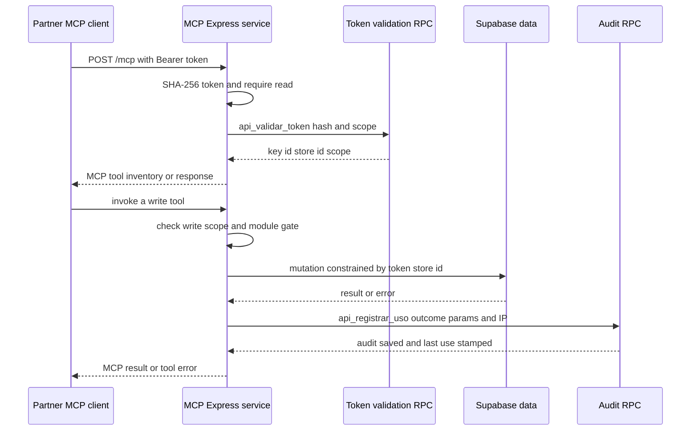

# MCP Partner API and Scoped Store Access

`mcp-server/` is a separately deployable Express service for MCP hosts such as Claude Desktop, Claude Code, n8n, and custom agents. It is not a Next.js route and does not grant partners database credentials: callers present an `i24_` Bearer token to `POST /mcp`, while the process retains its own Supabase service-role credential. The service translates a validated token into a per-request context containing the API-key ID, store ID, and `read` or `write` scope.

This boundary is deliberately narrower than generic Supabase access. It fixes the readable table set, makes write tools conditional on both credential approval and a deployment gate, and attaches store ownership predicates to seller-facing mutations. The database remains the persistence and credential-state authority; the MCP deployment is the external protocol and policy-enforcement layer. For the broader trust model, see [Supabase data access, authorization, and schema evolution](/openwiki/architecture/data-access-security-and-schema-evolution.md) and [System map](/openwiki/architecture/system-map.md).

## Endpoint and request lifetime

The public MCP endpoint is `POST /mcp`. It uses a stateless `StreamableHTTPServerTransport`: every request must carry `Authorization: Bearer i24_...`; there is no server-side MCP session. The handler authenticates before constructing a fresh `McpServer` and transport, passes the forwarded IP when supplied (otherwise the socket address) to the tool layer, and closes both objects when the response closes. `GET /mcp` and `DELETE /mcp` return a JSON-RPC method-not-allowed response, while `GET /health` returns `{ ok: true }`.



This sequence shows authentication on each stateless request and the normal gated write path, including the audit RPC; a rejected token ends at HTTP 401, and a disabled module is audited without a store mutation.

## Credential model and lifecycle

Migration `0059_api_keys_mcp.sql` introduces three RLS-enabled, deny-by-default tables:

- `api_partners` represents an external partner and its active state.
- `api_keys` permits one or more keys per partner. Each key belongs to exactly one `loja_id`, stores only a unique SHA-256 `token_hash` plus a non-secret diagnostic prefix, has `read` or `write` scope, and records approval, revocation, optional expiry, and last use.
- `api_audit_log` retains the key/store association, tool, supplied parameter summary, outcome, error, IP, and timestamp. Only admins receive table policies; the MCP service calls the purpose-built RPCs with service role.

An administrator creates a partner, then runs the issuance helper and applies the printed insert SQL:

```bash
node scripts/emitir-token.mjs read <loja_id> --partner <partner_id>
node scripts/emitir-token.mjs write <loja_id> --partner <partner_id>
```

The helper generates 24 random bytes encoded as a base64url secret and emits `i24_read_...` or `i24_write_...`. It displays the plaintext token once and computes the 64-hex-character SHA-256 value inserted into `api_keys`; plaintext cannot be recovered later. The generated SQL leaves read-key approval empty but stamps `aprovada_por` and `aprovada_em` for a write key, so operators must issue write credentials only after approval. A lost or exposed token must be revoked (`revogada_em`) and replaced, not recovered.

At request time, `autenticar()` strips the optional Bearer scheme, requires the `i24_` prefix, hashes the trimmed token, and invokes `api_validar_token`. That `SECURITY DEFINER` SQL function returns a context only when the partner is active and the key is unrevoked and unexpired. A read requirement accepts either scope; a write requirement additionally requires a `write` key with `aprovada_em`. RPC failure or no returned row becomes the same unauthorized HTTP response, avoiding a credential-state oracle to the caller.

## Tool surface and access constraints

A valid request is initially authenticated at `read`, so a write-scoped key can discover and call read tools too. Read tools are registered from a fixed allowlist rather than accepting an arbitrary database table name:

| Tool | Behavior and bounds |
| --- | --- |
| `industria24_listar_registros` | Lists an allowlisted table with equality filtering and offset pagination; `limite` is 1–200 and the response includes exact count, `has_more`, and `next_offset`. |
| `industria24_buscar_registro` | Fetches one allowlisted row by `id`. |
| `industria24_buscar_produtos` | Performs an `ilike` name search with a 1–100 limit. |
| `industria24_rastrear_corrida` | Returns a run and its newest GPS positions first, capped at 200, as `transport`, `device`, and `locations`. |

The listing and lookup allowlist is: `produtos`, `lojas`, `categorias`, `subcategorias`, `pedidos`, `linha_itens`, `entregas`, `vendas_futuras`, `promocoes_progressivas`, `afiliacoes`, `centros_distribuicao`, `corridas`, and `corrida_posicoes`. These reads use the service-role client with `select("*")`; neither listing, lookup, product search, nor run tracking applies the token's `lojaId`. Thus the store binding is a write-authorization boundary, **not** a read-row filter. The fixed enum is the intended extension boundary: adding a readable resource requires an explicit allowlist and projection review, including the cross-store exposure it creates.

Write tools are not registered at all for a `read` context. For a `write` context, each invocation also checks its module in `MCP_WRITE_ENABLED`; an empty value leaves all writes disabled. The following tools and module gates are implemented:

| Tool | Gate | Store constraint |
| --- | --- | --- |
| `industria24_atualizar_produto` | `catalogo` | Updates only `nome`, `descricao`, `valor`, or `sku` where product `id` and `loja_id` match the token context. An empty patch fails. |
| `industria24_atualizar_estoque` | `catalogo` | Updates non-negative integer `estoque_atual` only for that store's product. |
| `industria24_atualizar_status_pedido` | `pedidos` | Updates `status_pedido` only where the order belongs to the token store. |
| `industria24_atualizar_entrega` | `pedidos` | First resolves `entrega -> linha_itens -> pedidos` and compares the owning store, then changes optional status (`Pendente`, `Enviado`, or `Entregue`) and/or tracking value. |
| `industria24_finalizar_compra` | `checkout` | A buyer flow, described below; it does not use the partner store as the purchasing identity. |

The direct `loja_id` predicates and delivery ownership traversal make a foreign record indistinguishable from a missing one at the tool layer. The exposed product and order mutations omit moderation and financial fields. This is defense in depth, not a replacement for database controls: the underlying schema also protects sensitive state with guards described in the data-access page.

### Buyer checkout is a separate principal

`industria24_finalizar_compra` appears only to a write-scoped MCP client and remains disabled until `checkout` is in `MCP_WRITE_ENABLED`, but it is not a privileged partner purchase. It requires a separate `supabase_access_token` for an already authenticated buyer. The server creates a second Supabase client with `SUPABASE_ANON_KEY` and that buyer token, validates the buyer using `auth.getUser()`, and calls `checkout_criar_pedido` using the buyer's RLS/authentication context.

Before checkout, the tool retrieves the requested products through that buyer client, rejects unknown products, and groups items by store; it creates one order per store. The database RPC therefore remains responsible for price and stock validation. A successful result contains order IDs and `https://industria24.com.br/pedido/{id}` URLs; the tool explicitly does not start an Asaas charge, leaving payment or retry to the normal web order flow. `SUPABASE_ANON_KEY` is required in addition to the service-role configuration; otherwise the checkout tool reports it unavailable even if the module flag is enabled.

## Audit and failure behavior

The write completion helper calls `api_registrar_uso`, which inserts into `api_audit_log` and updates `api_keys.ultimo_uso`. It records the supplied params, success/failure, error string, and resolved IP for database-attempted write tools. A module-gate rejection is also recorded with `modulo_desabilitado:<module>` and performs no mutation. In contrast, read calls are not passed through this helper, and the product tool's early empty-patch error returns before it, so audit coverage should not be described as a log of every MCP request.

Failure modes intentionally occur at different layers:

- Missing, malformed, revoked, expired, inactive-partner, or unapproved-for-write tokens yield HTTP 401 JSON-RPC error `-32001` before MCP dispatch.
- A read credential has no write tools in its server inventory. A write credential with a disabled module receives a tool error explaining that the module is not enabled.
- Query or validation failures return MCP text content with `isError: true`; an ownership mismatch reports not found/not owned rather than disclosing the other store's record.
- Unexpected transport handling errors are logged to the server console and return JSON-RPC internal error `-32603` if headers have not already been sent.

## Deployment and operations

`npm run build` compiles the TypeScript server and `npm start` launches `dist/http.js`. Standalone mode listens on `HOST` and `PORT`, defaulting to `0.0.0.0:3333`. The Vercel configuration instead runs the same build, rewrites all paths to `api/index`, and re-exports the compiled Express app. These are separate deployment artifacts from the marketplace web application.

| Configuration | Required? | Role |
| --- | --- | --- |
| `SUPABASE_URL` and `SUPABASE_SERVICE_ROLE_KEY` | Yes | Construct the MCP process's privileged, no-session Supabase client. Startup logs an error and exits if either is absent. They must never be provided to a partner. |
| `SUPABASE_ANON_KEY` | Checkout only | Builds the buyer-session client for `industria24_finalizar_compra`; it cannot substitute for the buyer access token. |
| `MCP_WRITE_ENABLED` | No | Comma-separated progressive rollout list: `catalogo`, `pedidos`, and/or `checkout`. Default is no enabled write module. |
| `ALLOWED_HOSTS` | No | Comma-separated hostname allowlist. When non-empty it enables the transport's DNS-rebinding protection. |
| `HOST`, `PORT` | No | Standalone network bind, defaulting to `0.0.0.0` and `3333`. |

Operationally, apply migration `0059_api_keys_mcp.sql` before issuing keys, keep all Supabase credentials only in the MCP deployment environment, and roll out writes module by module after QA. The service role bypasses RLS, so new tools must retain explicit scope, module, ownership, field/projection, and audit decisions rather than exposing a generic query mechanism. Use `/health` for basic reachability; application exceptions are emitted to the server console, while durable write activity is inspectable by admins in `api_audit_log`.

## Verification and safe changes

The MCP package defines `npm run build` but no package test script. The issuance helper provides a narrow executable check:

```bash
node scripts/emitir-token.mjs --self-check
```

It verifies read/write token prefixes, deterministic SHA-256 hashing, a hexadecimal hash shape, and rejection of an invalid scope. For a deployment-level smoke test, build the service, start it with valid server-only configuration, then connect the MCP Inspector to `http://localhost:3333/mcp` with an `Authorization: Bearer i24_...` header.

Changes require focused tests or manual checks at the boundaries source code makes security-critical: reject absent/malformed/revoked/expired tokens; ensure write scope requires approval; confirm a read key cannot see write tools; exercise every disabled and enabled module; attempt product, order, and delivery updates against another `loja_id`; verify audit rows and `ultimo_uso` for both successful writes and module-gate failures; test that the global read contract is acceptable for every allowed table and projection; and exercise checkout with an actual buyer session, including multi-store items and unavailable `SUPABASE_ANON_KEY`. Pair MCP checks with the database RLS/guard smoke testing described in [Supabase data access, authorization, and schema evolution](/openwiki/architecture/data-access-security-and-schema-evolution.md).

## Related pages

- [System map](/openwiki/architecture/system-map.md)
- [Supabase data access, authorization, and schema evolution](/openwiki/architecture/data-access-security-and-schema-evolution.md)
- [Runtime configuration and observability](/openwiki/operations/runtime-configuration-and-observability.md)
- [Verification strategy](/openwiki/testing/verification-strategy.md)
- [Checkout, payments, and order lifecycle](/openwiki/workflows/checkout-payment-and-order-lifecycle.md)
