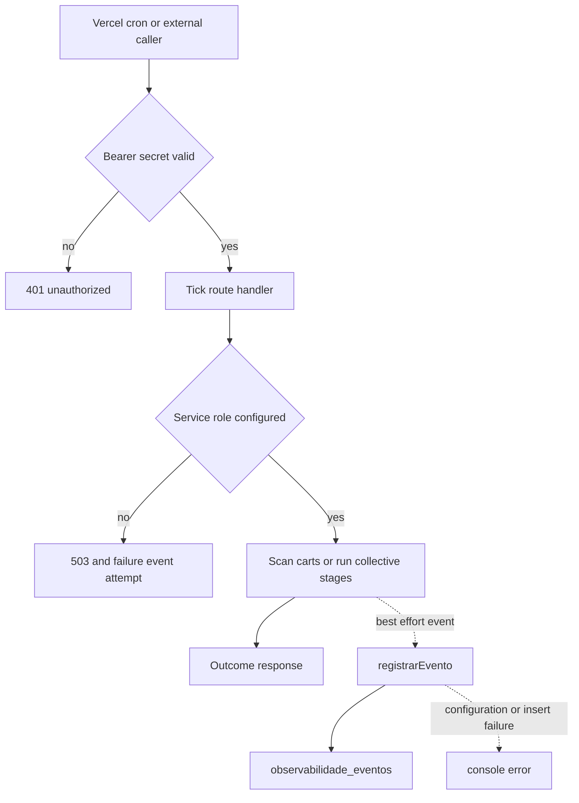

## Scope and deployment boundaries

The repository has three independently configured deployments:

- The repository root is the Next.js marketplace. Its Vercel configuration schedules the abandoned-cart tick, and its Next configuration owns response headers and the public Uber webhook rewrite.
- `mcp-server/` is a separate Express Streamable HTTP MCP service. Its Vercel build is independent and rewrites every request to its Express function entrypoint; it is not a Next route.
- `dashboard-ops/` is a separate Next.js operations dashboard. It proxies the marketplace's protected cron history and has its own scheduled metrics push.

For local marketplace development, copy `.env.example` to `.env.local` and do not commit it. `NEXT_PUBLIC_*` values are browser-visible. The public Supabase URL and anon key are therefore client inputs; service-role keys, bearer secrets, and provider credentials must remain in server deployment configuration. No `dashboard-ops/.env.example` is currently tracked: its required values must be derived from its route implementations and configured in that deployment.

| Area | Configuration | Operational boundary |
| --- | --- | --- |
| Browser Supabase | `NEXT_PUBLIC_SUPABASE_URL`, `NEXT_PUBLIC_SUPABASE_ANON_KEY` | Public endpoint and anon credential; authorization must rely on Supabase/RLS rather than secrecy. |
| Privileged marketplace data | `SUPABASE_SERVICE_ROLE_KEY` | Server-only. Required by ticks, protected event reads, and event writes. |
| Marketplace Sentry | `NEXT_PUBLIC_SENTRY_DSN`, environment and sampling variables | Missing DSN leaves the SDK inert. Client and server sampling settings are distinct. |
| Sentry source-map build upload | `SENTRY_ORG`, `SENTRY_PROJECT`, `SENTRY_AUTH_TOKEN` | Inputs to `withSentryConfig`; absent values warn but do not make runtime unavailable. |
| Scheduled callers | `CRON_SECRET`, `ASAAS_WEBHOOK_TOKEN` | Server-side Bearer credentials, with endpoint-specific authorization described below. |
| Marketplace providers | `RESEND_API_KEY`, Uber Direct credentials and `UBER_DIRECT_WEBHOOK_SIGNING_KEY`, `LANGSMITH_API_KEY`, `WHATSAPP_APP_SECRET` | Server-only integration settings. |
| MCP | `SUPABASE_URL`, `SUPABASE_SERVICE_ROLE_KEY`, `SUPABASE_ANON_KEY`, `HOST`, `PORT`, `MCP_WRITE_ENABLED`, `ALLOWED_HOSTS` | Separate service configuration. The anon key supports buyer-authenticated checkout, not service-role access. |
| Dashboard providers | `GITHUB_TOKEN`; `TARGET_VERCEL_PROJECT_ID`, `TARGET_VERCEL_TEAM_ID`, `TARGET_VERCEL_TOKEN`; `SENTRY_ORG`, `SENTRY_PROJECT`, and `SENTRY_AUTH_TOKEN` or `API_KEY_SENTRY2`; `CRON_SECRET`; Grafana credentials | Server-side values used by the dashboard's provider routes, cron proxy, and metric push. |

The marketplace service-role client refuses creation without `SUPABASE_SERVICE_ROLE_KEY` and disables persisted and refreshed auth sessions. It is a server-only client; never import it into a component or page. MCP separately exits at startup without a Supabase URL or service-role key, and partners receive neither: they authenticate with validated `i24_` Bearer tokens.

`MCP_WRITE_ENABLED` is a comma-separated, module-level rollout gate and starts empty. A nonempty `ALLOWED_HOSTS` turns on DNS-rebinding protection. MCP constructs a server for each authorized, stateless `POST /mcp`; every request consequently carries authentication. `GET` and `DELETE /mcp` return 405, while `GET /health` is the liveness endpoint.

## Web security controls and Sentry

The root Next configuration applies HSTS, MIME-type protection, same-origin framing, strict cross-origin referrer policy, disabled camera/microphone/geolocation, and CSP to every route. The CSP permits the application, Supabase, Sentry, and Cloudflare Turnstile where needed; it permits Supabase images, frames Turnstile, and blocks objects. It still includes `'unsafe-inline'` for scripts and styles.

The CSP nonce proposal is **not deployed**. There is no request nonce generation or propagation, and inline allowances remain. Treat the proposal as a security-sensitive future implementation: only remove the allowances after generating and propagating a distinct request nonce and regression-testing affected App Router rendering paths.

The external `/webhooks/uber-direct` URL is rewritten to `/api/webhooks/uber-direct`; preserve it when moving the handler. With `UBER_DIRECT_WEBHOOK_SIGNING_KEY` configured, the handler HMAC-SHA256 validates `x-uber-signature` against the raw body, reports a mismatch to Sentry at warning level, and returns 401. Without that key, validation is permissive, making deployment of the dedicated Uber signing key an important requirement.

Sentry client initialization occurs before React hydration, disables default PII collection, and has configurable trace and replay sampling. Session replay masks text and blocks media; feedback integration is enabled; and the App Router transition hook captures navigation breadcrumbs. Server instrumentation selects Node or Edge initialization by `NEXT_RUNTIME`, also disables default PII, and exports request-error capture for Server Components, route handlers, Server Actions, and SSR. `setSentryUserContext()` deliberately sets only user ID and an optional role, not email or other PII.

The generic API error helper captures the actual exception in Sentry but returns only `{"error":"Erro ao processar requisição"}`. Use it for database/provider failures that must not expose internal messages. In contrast, some specialized endpoints deliberately return a local diagnostic error; do not mistake that behavior for the generic-error contract.

## Scheduled work and event lifecycle

The root Vercel project schedules daily `GET /api/carrinho/abandono/tick` at `0 12 * * *`. Its GET path requires `Authorization: Bearer $CRON_SECRET`; the alternate POST path requires `ASAAS_WEBHOOK_TOKEN`. Both invoke the same scan. Missing service-role configuration produces a 503 after attempting to record a failure event. The scan selects carts unchanged for at least an hour, with items and no reminder marker. It marks a cart as reminded only after email success; the WhatsApp lookup/send is supplementary. Per-cart email errors yield an `alerta` event, otherwise the event is `sucesso`; query errors use the generic Sentry-reporting 500 response.

`POST /api/coletivas/tick` is not in the repository-managed Vercel schedule. An external scheduler or authorized manual caller needs `ASAAS_WEBHOOK_TOKEN` and service-role configuration. It calls `rodarEtapas()` and records success or failure. The read path's lazy closure means absence of this tick delays notification rather than moving money; see [Collective commerce and affiliates](/openwiki/workflows/collective-commerce-and-affiliates.md) for the domain lifecycle.

This flow shows the important invariant: telemetry persistence cannot change the scheduled operation's result.

`registrarEvento()` is the shared best-effort writer. It accepts a closed capability vocabulary, origin, `sucesso`/`falha`/`alerta`, plus optional reason and JSON metadata, and inserts into `observabilidade_eventos` through the service role. Missing configuration, insert errors, and exceptions are logged and absorbed. The table has RLS enabled with no policies and an index by capability and descending timestamp; it is intended for service-role-only access.

`GET /api/observabilidade/cron` is the protected cron read model. It requires `CRON_SECRET` and the service role, reads up to 50 recent cron events, then groups by origin into a latest event plus up to ten history records. Query failures use the generic error response. `dashboard-ops/api/cron` sends the same secret to that fixed marketplace URL, caches upstream data for 20 seconds, returns 500 if its local secret is absent, and converts unavailable or error upstream responses to 502.

## Dashboard triage and Grafana push

The browser dashboard polls its GitHub, Vercel, Sentry, and cron proxy endpoints every 30 seconds. GitHub returns open issues/PRs and rate-limit state; Vercel returns up to ten deployments and percentile build duration; Sentry returns unresolved issues and, when the performance query works, p50/p95 transaction latency. Provider failures become an endpoint-local 500 JSON error, so the dashboard can show an affected card rather than requiring a single aggregate request.

The dashboard's Vercel schedule invokes `GET /api/push-metrics` daily at `0 11 * * *`. The route fetches its own GitHub, Vercel, and Sentry APIs without cache, retains only numeric values, and pushes named metrics to Prometheus remote write using `GRAFANA_PROM_URL`, `GRAFANA_PROM_USERNAME`, and the currently named `GRAFANA_PRHOMOTEUS_API_KEY`. A push response other than 200 or 204 becomes 502. This route has no authorization check in repository code; Vercel cron scheduling alone is not an application-level bearer authorization boundary.

For a cron incident, distinguish bad authorization (401), missing privileged data access (503), business/provider outcomes (`falha` or `alerta`), and unavailable telemetry. Absence of an event does not prove absence of an invocation because event writing is non-fatal; check Vercel logs and Sentry. A success event records handler outcome, not scheduler health, so alert on stale latest timestamps as well as explicit non-success states.

## Safe changes and focused verification

1. Keep tick and cron-history endpoints authenticated. Configure the caller with the endpoint's correct Bearer secret rather than making the route public.
2. Configure `SUPABASE_SERVICE_ROLE_KEY` in the relevant deployment for protected-route 503 responses; do not replace it with an anon client.
3. When adding scheduled work, make repeats safe, explicitly select a scheduler and secret, record an outcome via `registrarEvento()`, and monitor both failure and staleness.
4. Treat CSP nonce work as an implementation project, not a configuration flip.
5. Preserve the Uber rewrite and use the dedicated signing key before relying on signature rejection.
6. Treat dashboard provider and Grafana values as deployment secrets. Before changing metric names or the push route, verify the remote-write credentials (including the current `GRAFANA_PRHOMOTEUS_API_KEY` spelling) and downstream dashboards.

The focused test verifies that the event writer never rejects when its dependency is unavailable. For marketplace changes, run `npm run lint`, `npm run build`, and `npm run test` at the repository root. For MCP, run `npm run build` in `mcp-server`; for the dashboard, run `npm run lint` and `npm run build` in `dashboard-ops`. See [Verification strategy](/openwiki/testing/verification-strategy.md) and [System map](/openwiki/architecture/system-map.md).

## Related pages

- [System map](/openwiki/architecture/system-map.md)
- [External services and webhooks](/openwiki/integrations/external-services-and-webhooks.md)
- [MCP partner API](/openwiki/integrations/mcp-partner-api.md)
- [Verification strategy](/openwiki/testing/verification-strategy.md)
- [Collective commerce and affiliates](/openwiki/workflows/collective-commerce-and-affiliates.md)
