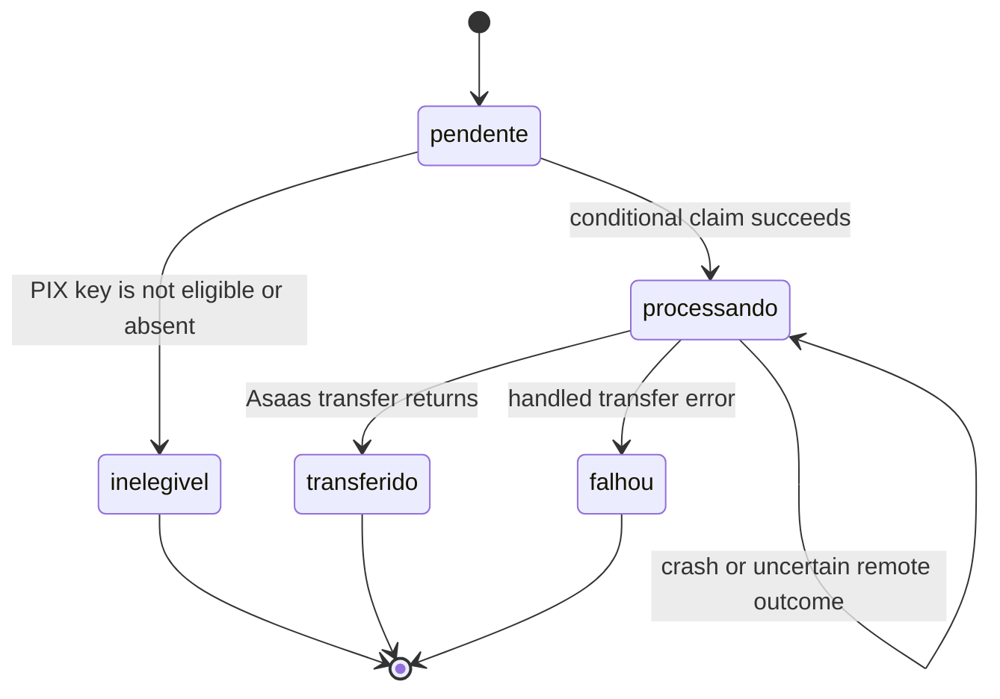
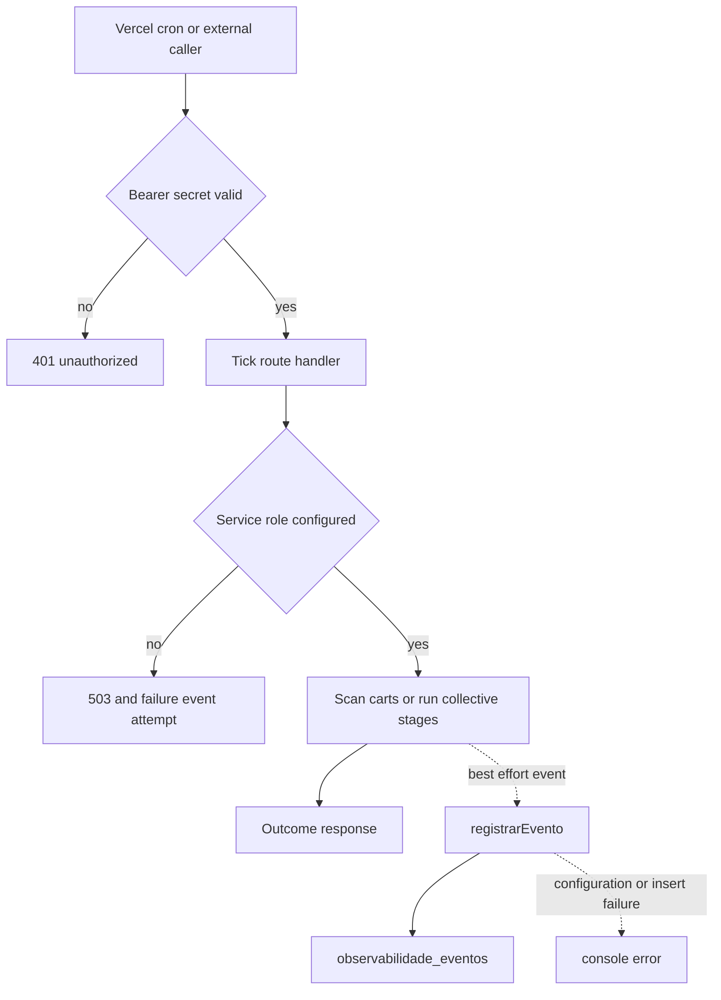

## Scope and deployment boundaries

This repository contains three independently configured deployments:

- The repository root is the Next.js marketplace. It owns browser/server configuration, marketplace routes, the public Uber webhook rewrite, and the abandoned-cart Vercel cron.
- `mcp-server/` is a separate Express Streamable HTTP MCP service. Its Vercel configuration builds it independently and rewrites all paths to the Express function entrypoint.
- `dashboard-ops/` is a separate Next.js operations dashboard. It proxies protected marketplace cron history and schedules its own metrics push.

For local marketplace development, copy `.env.example` to `.env.local` and never commit it. `NEXT_PUBLIC_*` values are browser-visible: public Supabase URL and anon key are client inputs, while service-role keys, bearer tokens, and provider credentials belong only in server deployment configuration. The repository does not track a `dashboard-ops/.env.example`; derive that deployment's secrets from its route implementations.

| Area | Configuration | Operational boundary |
| --- | --- | --- |
| Browser Supabase | `NEXT_PUBLIC_SUPABASE_URL`, `NEXT_PUBLIC_SUPABASE_ANON_KEY` | Public inputs; authorization relies on Supabase/RLS, not credential secrecy. |
| Privileged marketplace access | `SUPABASE_SERVICE_ROLE_KEY` | Server-only. Required by privileged payment, payout, tick, and observability paths. |
| Asaas | `ASAAS_API_KEY`, `ASAAS_ENV`, `ASAAS_WEBHOOK_TOKEN` | Server-only PSP credential, environment selector, and webhook/tick bearer token. |
| Marketplace Sentry | `NEXT_PUBLIC_SENTRY_DSN`, environment and sampling variables | A missing DSN leaves the SDK inert; browser and server sampling settings are distinct. |
| Sentry source-map upload | `SENTRY_ORG`, `SENTRY_PROJECT`, `SENTRY_AUTH_TOKEN` | Build-time inputs to `withSentryConfig`; absence warns rather than making runtime unavailable. |
| Scheduled callers | `CRON_SECRET`, `ASAAS_WEBHOOK_TOKEN` | Server-side bearer credentials with endpoint-specific checks. |
| MCP | `SUPABASE_URL`, `SUPABASE_SERVICE_ROLE_KEY`, `SUPABASE_ANON_KEY`, `HOST`, `PORT`, `MCP_WRITE_ENABLED`, `ALLOWED_HOSTS` | Separate-service configuration and rollout/security controls. |
| Dashboard providers | GitHub, Vercel, Sentry, `CRON_SECRET`, and Grafana remote-write credentials | Server-side values used only by dashboard routes. |

The marketplace service-role client refuses construction without `SUPABASE_SERVICE_ROLE_KEY` and disables persisted and refreshed auth sessions. It is server-only: never import it into a client component or page. The MCP service likewise exits without its Supabase URL or service-role key; partners authenticate instead with separately validated `i24_` Bearer tokens.

`MCP_WRITE_ENABLED` is a comma-separated rollout gate. A nonempty `ALLOWED_HOSTS` enables DNS-rebinding protection for the stateless Streamable HTTP transport. Each authorized `POST /mcp` gets a server instance; `GET` and `DELETE /mcp` return 405, while `GET /health` is the liveness endpoint.

## Payout lifecycle and reconciliation

A payout is a `repasses` ledger row for a paid-and-delivered order, with a seller or affiliate destination, amount, status, creation time, and optional transfer timestamp. The delivery-confirmation RPC recalculates the ledger only on a real confirmation, not its idempotent “already delivered” return. Seller, logistics-partner, affiliate-logistics, and public-deliverer entrypoints invoke the same best-effort application payout trigger after that confirmation. The public entrypoint first resolves the order by its readable sale ID through the service client.

This diagram shows the implemented automatic payout states; an operator resolves a stranded or uncertain row outside the current admin UI.

`dispararRepasseAutomatico*()` first recalculates the order ledger and selects **only** `pendente` rows. For each valid seller or affiliate destination it checks the destination's eligibility RPC and PIX key. Ineligible or incomplete-key rows become `inelegivel`. Immediately before `createPixTransfer`, it conditionally changes the specific row from `pendente` to `processando` and proceeds only if that update returned a row. Thus concurrent delivery confirmations, retries, or racing entrypoints cannot issue a second transfer for the same ledger row.

The Asaas transfer uses `POST /v3/transfers` and sends the ledger UUID as `externalReference`; that UUID is the primary reconciliation key. On a returned success, the ledger becomes `transferido`, records `transferido_em`, and seller rows mark the order's item rows transferred. A caught error changes the row to `falhou` and reports the exception to Sentry. The Asaas client has a 12-second request timeout, so a timeout or connection error is not proof that Asaas did not receive or execute the transfer.

### What `processando` means

Migration `0151_repasse_status_processando.sql` adds `processando` to the database status constraint. It is deliberately an intermediate durable claim: it means one execution has won the right to call Asaas and another automatic execution will no longer select the row. If the runtime crashes after the claim, or the outbound transfer has an uncertain outcome, the row can remain `processando`; there is no automatic reset to `pendente`.

The admin page at `/admin/repasses` is a dynamic, **read-only** ledger view. It loads at most 300 newest rows, can filter by status, and shows order sale ID, store, destination, amount, status, and creation date. It includes a distinct `Processando` label, but no reprocess, mark-transferred, or Asaas-control action is implemented there. Do not represent planned actions as available functionality.

### Manual reconciliation runbook

Treat both a stranded `processando` row and a `falhou` row following an ambiguous network/timeout failure as a money-movement incident.

1. Record the ledger UUID, order sale ID, destination, amount, and timestamps from `/admin/repasses`. The ledger UUID is sent to Asaas as `externalReference`.
2. Query Asaas using that reference and the expected amount/destination. Establish whether a transfer was created, completed, pending, rejected, or cannot be determined. Do **not** initiate a replacement transfer merely because the local caller timed out or crashed.
3. Preserve the Asaas evidence (transfer ID/status, time, amount, and lookup result) with the incident. Use Sentry and deployment logs to establish whether the local claim occurred and whether the request failed locally.
4. Escalate the state correction or any intentional retry to an authorized operator with database/Asaas access, after the provider outcome is known. A confirmed provider transfer must be reflected as transferred; a confirmed non-transfer may be eligible for a controlled retry. An unresolved provider result remains an investigation, not an automatic retry.
5. Recheck the order and ledger after resolution. The automatic selector only consumes `pendente`, so a row will remain excluded until an authorized manual resolution changes its state.

This is a manual Asaas reconciliation requirement, not a scheduler backlog. No repository-managed job scans or reprocesses `processando` rows. The status is specifically intended to prevent duplicate payouts while the external outcome is being established.

## Payment confirmation and failure reporting

Asaas payment webhooks authenticate with `asaas-access-token` against `ASAAS_WEBHOOK_TOKEN`, require service-role configuration, ignore malformed/unhandled events with 200, and delegate business confirmation to `confirmarPagamentoPedido()`. A separate manual/fallback payment-verification path converges on that same function when webhook delivery is delayed or unavailable.

Payment confirmation is idempotent on `pedidos.dt_pagamento`, rather than a fixed order-status list. It verifies payment ID and amount, then conditionally records `Pagamento Realizado`, timestamp, and received value only while `dt_pagamento` is null. Only the execution whose conditional update succeeds marks item rows paid and starts notification and dispatch side effects; a competing or replayed event returns already-paid. WhatsApp and post-payment routing failures are captured in Sentry without undoing the recorded payment.

Sentry initializes before browser hydration with default PII collection disabled, configurable tracing/replay sampling, masked replay text/media, feedback integration, and App Router transition breadcrumbs. Server instrumentation chooses Node or Edge configuration from `NEXT_RUNTIME` and registers request-error capture. The explicit user context contains only a user ID and optional role. The generic API error helper captures the real exception in Sentry but returns a generic error response so provider or database messages do not reach callers.

## Scheduled work and telemetry

The root Vercel project schedules daily `GET /api/carrinho/abandono/tick` at `0 12 * * *`. GET requires `CRON_SECRET`; the alternate POST requires `ASAAS_WEBHOOK_TOKEN`; both run the same scan. It requires the service role, selects carts idle for at least one hour with items and no reminder marker, marks a reminder only after email success, and treats WhatsApp as supplementary. It records success, alert, or failure outcomes.

`POST /api/coletivas/tick` has no repository-managed schedule. An external scheduler or authorized caller must send `ASAAS_WEBHOOK_TOKEN` and the deployment must have service-role configuration. It runs collective stages and records success/failure; lazy closure in the read path means a missing tick delays notification rather than moving money.

This flow shows that telemetry persistence cannot change the scheduled operation's result.

`registrarEvento()` inserts bounded capability/origin/result records plus optional reason and JSON metadata through the service role. Missing service configuration, insert failures, and exceptions are logged and absorbed. `observabilidade_eventos` has RLS enabled with no policies, an index by capability and descending creation time, and is intended for service-role-only access. The focused test asserts that the writer does not reject when its dependency is unavailable.

`GET /api/observabilidade/cron` requires `CRON_SECRET` and the service role, reads up to 50 newest cron events, and groups them by origin into a latest entry and up to ten historical entries. `dashboard-ops/api/cron` sends its local secret upstream, caches for 20 seconds, returns 500 for missing local configuration, and maps unavailable/error upstream responses to 502. Since event insertion is deliberately non-fatal, a missing event does not prove a cron never ran; use Vercel logs and Sentry too, and alert on both non-success outcomes and stale latest timestamps.

## Dashboard, security, and safe changes

The dashboard polls GitHub, Vercel, Sentry, and cron APIs every 30 seconds, showing cron latest-status/timestamp information alongside unresolved Sentry issues and transaction-latency summaries. Its provider routes use server-side credentials and return local JSON failures independently; Sentry preserves issue data if its optional latency request fails. Its daily `GET /api/push-metrics` fetches provider data and pushes numeric metrics to Prometheus remote write. A non-200/204 push is 502. The route has no application-level authorization check and uses `GRAFANA_PRHOMOTEUS_API_KEY` as the remote-write password.

The marketplace Next configuration applies HSTS, MIME protection, same-origin framing, referrer and permissions policies, and CSP to every route. CSP permits the marketplace, Supabase, Sentry, and Turnstile as needed, but currently retains inline script/style allowances. The nonce proposal is not deployed: do not remove those allowances as a configuration-only change. Preserve the externally registered `/webhooks/uber-direct` rewrite to `/api/webhooks/uber-direct`. With its signing key configured, that handler HMAC-validates `x-uber-signature`, reports invalid signatures to Sentry as warnings, and returns 401; without the key, validation is permissive.

When changing these paths:

1. Keep privileged credentials and bearer secrets server-only. Do not replace a service-role client with an anon client.
2. Preserve the conditional payout claim and `processando` state; any recovery automation needs an explicit provider-reconciliation and idempotency design.
3. Keep `/admin/repasses` read-only unless a separately reviewed control plane, authorization model, audit trail, and provider-outcome safeguards are implemented.
4. Keep ticks authenticated, choose a scheduler deliberately, make repeated work safe, and monitor failures and staleness.
5. Treat dashboard provider/Grafana values as deployment secrets; the current remote-write password variable spelling is `GRAFANA_PRHOMOTEUS_API_KEY`.
6. Run `npm run lint`, `npm run build`, and `npm run test` for marketplace changes; run `npm run build` in `mcp-server`, and `npm run lint` plus `npm run build` in `dashboard-ops`.

## Related pages

- [Data access, security, and schema evolution](/openwiki/architecture/data-access-security-and-schema-evolution.md)
- [External services and webhooks](/openwiki/integrations/external-services-and-webhooks.md)
- [Verification strategy](/openwiki/testing/verification-strategy.md)
- [Checkout payment and order lifecycle](/openwiki/workflows/checkout-payment-and-order-lifecycle.md)
