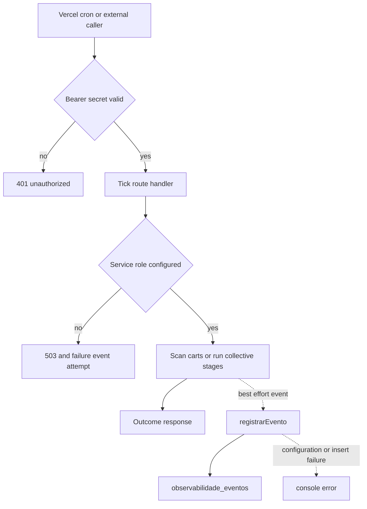

## Scope and deployment boundaries

This repository contains three independently configured deployables:

- The repository root is the Next.js marketplace. Its `vercel.json` schedules the abandoned-cart tick and `next.config.ts` owns response headers and the public webhook rewrite.
- `mcp-server/` is a separately deployed Express Streamable HTTP MCP service. Its Vercel build runs independently and rewrites every request to the Express-function entrypoint; it is not a Next route.
- `dashboard-ops/` is a separate Next.js operations dashboard. It proxies the marketplace's protected cron history and has its own daily `/api/push-metrics` Vercel cron.

Copy `.env.example` to `.env.local` for local marketplace development; do not commit it. `NEXT_PUBLIC_*` values are browser-visible, so credentials belong in server deployment configuration. The public Supabase URL and anon key are client inputs, while `SUPABASE_SERVICE_ROLE_KEY`, bearer secrets, and provider credentials are server-only.

The marketplace service-role client refuses creation without `SUPABASE_SERVICE_ROLE_KEY` and disables persisted and refreshed auth sessions. It is for server-side privileged operations, including scheduled jobs and the event store; never import it into a page or component. The MCP service separately requires a Supabase URL and service-role key at startup, then uses its service role only internally. Partners present individually validated `i24_` Bearer tokens rather than receiving that credential.

### Configuration partitions

| Area | Configuration | Boundary and behavior |
| --- | --- | --- |
| Browser Supabase | `NEXT_PUBLIC_SUPABASE_URL`, `NEXT_PUBLIC_SUPABASE_ANON_KEY` | Public endpoint and anon credential; authorization relies on Supabase/RLS, not secrecy. |
| Privileged marketplace data | `SUPABASE_SERVICE_ROLE_KEY` | Server-only; required by ticks, protected event reads, and event writes. |
| Sentry runtime | `NEXT_PUBLIC_SENTRY_DSN`, environment and sampling variables | A missing DSN leaves SDK initialization inert. Client and server sampling variables are distinct. |
| Sentry build upload | `SENTRY_ORG`, `SENTRY_PROJECT`, `SENTRY_AUTH_TOKEN` | Passed to `withSentryConfig` for build-time source-map upload; the configuration supplies org/project and does not make source-map upload a runtime dependency. |
| Scheduled callers | `CRON_SECRET`, `ASAAS_WEBHOOK_TOKEN` | Server-side Bearer credentials. `CRON_SECRET` protects the Vercel cart tick and cron-history API; `ASAAS_WEBHOOK_TOKEN` protects the alternate cart tick and collective tick. |
| Provider integrations | `RESEND_API_KEY`, Uber Direct credentials and `UBER_DIRECT_WEBHOOK_SIGNING_KEY`, `LANGSMITH_API_KEY`, `WHATSAPP_APP_SECRET` | Server-only integration settings. Do not expose them through `NEXT_PUBLIC_*`. |
| MCP transport and rollout | `SUPABASE_URL`, `SUPABASE_SERVICE_ROLE_KEY`, `SUPABASE_ANON_KEY`, `HOST`, `PORT`, `MCP_WRITE_ENABLED`, `ALLOWED_HOSTS` | MCP-only. Its optional anon key is used for buyer-authenticated checkout rather than service-role access. |

`MCP_WRITE_ENABLED` is a comma-separated, module-level rollout gate and starts empty. A nonempty `ALLOWED_HOSTS` enables DNS-rebinding protection in the otherwise stateless Streamable HTTP transport. The service constructs an MCP server per authorized `POST /mcp`, so every request must authenticate; `GET` and `DELETE /mcp` return 405, and `GET /health` is the liveness endpoint.

## Web security controls and hardening status

The root Next configuration applies HSTS, MIME-type protection, same-origin framing, a strict cross-origin referrer policy, disabled camera/microphone/geolocation, and CSP to `/:path*`. The CSP allows browser connectivity to the application, Supabase, and Sentry, permits Supabase images, and blocks objects. It still includes `'unsafe-inline'` for scripts and styles.

The nonce proposal is **not implemented**. The current configuration has no request middleware or nonce propagation and explicitly retains inline allowances. The PRD and OpenSpec describe a future per-request nonce that would replace those allowances and attach the nonce to inline script/style tags; treat that as a change plan requiring implementation and full App Router regression testing, not as deployed protection.

The marketplace preserves `/webhooks/uber-direct` by rewriting it to `/api/webhooks/uber-direct`; retain this external compatibility URL when moving the handler. The Uber handler only rejects a bad `x-uber-signature` when `UBER_DIRECT_WEBHOOK_SIGNING_KEY` is configured. In that mode it computes an HMAC-SHA256 over the raw body, reports invalid signatures to Sentry at warning level, and returns 401. An absent signing key makes signature validation permissive, so setting the dedicated Uber webhook signing key is an important deployment requirement.

## Sentry and safe error signals

Sentry client initialization occurs before React hydration. It disables default PII collection; default trace sampling is 0.1; replay masks all text and blocks media, with normal-session sampling defaulting to 0.1 and error replays to 1. It also installs feedback and exports the App Router transition hook for navigation breadcrumbs.

At server start, `register()` imports the Node or Edge Sentry configuration according to `NEXT_RUNTIME`; both disable default PII and default server trace sampling to 1 unless `SENTRY_TRACES_SAMPLE_RATE` overrides it. `onRequestError` is exported to capture errors from Server Components, route handlers, Server Actions, and SSR. The generic API error helper captures the underlying exception in Sentry but returns only `{"error":"Erro ao processar requisição"}`, preventing database and provider error text from reaching callers.

## Scheduled work and event lifecycle

The root Vercel project schedules `GET /api/carrinho/abandono/tick` daily at `0 12 * * *`. Vercel's GET caller must match `Authorization: Bearer $CRON_SECRET`; the alternate `POST` entrypoint uses `ASAAS_WEBHOOK_TOKEN`. Both enter the same scan. A missing service role emits a failure event attempt and returns 503. Otherwise the scan finds carts updated more than an hour ago with nonempty items and no reminder timestamp. It marks a cart reminded only after email delivery succeeds; WhatsApp lookup/send is supplementary. The response and persisted outcome are `sucesso` unless per-cart email errors produce `alerta`; a query error follows the generic Sentry-reporting 500 path.

`POST /api/coletivas/tick` is not listed in the root Vercel cron configuration. An external scheduler or authorized manual caller must use `ASAAS_WEBHOOK_TOKEN`; it also requires the service role. It calls `rodarEtapas()`, which executes the collective stage graph and expires overdue collective payments, then records success or failure. See [Collective commerce and affiliates](/openwiki/workflows/collective-commerce-and-affiliates.md) for the domain lifecycle.

This flow shows that event persistence is intentionally isolated from the scheduled operation: a logging failure cannot change the work response.

`registrarEvento()` is the common writer for bounded capability values, an origin, `sucesso`/`falha`/`alerta`, and optional reason and JSON metadata. It writes to `observabilidade_eventos` through the service role. Missing configuration, insert errors, and exceptions are logged and absorbed. The table is RLS-enabled with no policies, has a capability/descending-timestamp index, and is intended for service-role access only.

`GET /api/observabilidade/cron` is the protected cron read model. It requires `CRON_SECRET` and the service role, selects up to 50 newest cron events, and groups them by origin into the latest event and up to ten history records. Query errors use the generic Sentry-reporting response. The dashboard proxy sends the same secret to this endpoint; it returns 500 when its local secret is absent and 502 when the upstream is unavailable or errors.

## Dashboard triage

The dashboard polls its GitHub, Vercel, Sentry, and cron endpoints every 30 seconds. Its cron card displays each origin's latest timestamp and status, while the Sentry card shows unresolved issues and optional p50/p95 transaction latency. The dashboard has its own Vercel daily `GET /api/push-metrics` schedule. That route reads dashboard GitHub/Vercel/Sentry data and pushes numeric summaries to the configured Prometheus remote-write endpoint; a non-200/204 push returns 502.

For cron investigation, first distinguish authorization (401), unavailable privileged data access (503), business/provider failure (`falha` or `alerta`), and absent observability data. An absent event does not prove no invocation occurred because event writing is deliberately non-fatal; check Vercel function logs and Sentry as well. Conversely, a success record shows the handler's recorded outcome, not that the scheduler remains healthy: alert on stale latest timestamps as well as explicit non-success statuses.

## Safe changes and focused verification

1. Keep tick and cron-history endpoints authenticated; correct the caller's endpoint-specific Bearer secret rather than making a route public.
2. Configure `SUPABASE_SERVICE_ROLE_KEY` in the affected deployment when a protected route returns 503. Do not substitute an anon client.
3. When adding a scheduled operation, make repeated calls safe, choose its scheduler/secret, record its outcome through `registrarEvento()`, and add a stale-event as well as failure alert.
4. Treat CSP nonce work as a security-sensitive implementation project: remove `'unsafe-inline'` only after generating and propagating a different request nonce and testing all affected rendering paths.
5. For Uber failures or signature warnings, preserve the rewrite and configure the dedicated signing key; test against an actual provider webhook before declaring the boundary operational.

The focused test for this surface verifies that the event writer does not reject when its dependency is unavailable. Run `npm run lint`, `npm run build`, and `npm run test` in the root when changing marketplace behavior. Run `npm run build` in `mcp-server` for the separately compiled service; `dashboard-ops` provides `npm run lint` and `npm run build`. See [Verification strategy](/openwiki/testing/verification-strategy.md) and [System map](/openwiki/architecture/system-map.md) for wider checks and boundaries.

## Related pages

- [System map](/openwiki/architecture/system-map.md)
- [External services and webhooks](/openwiki/integrations/external-services-and-webhooks.md)
- [Verification strategy](/openwiki/testing/verification-strategy.md)
- [Collective commerce and affiliates](/openwiki/workflows/collective-commerce-and-affiliates.md)
- [Fulfillment and logistics](/openwiki/workflows/fulfillment-and-logistics.md)
