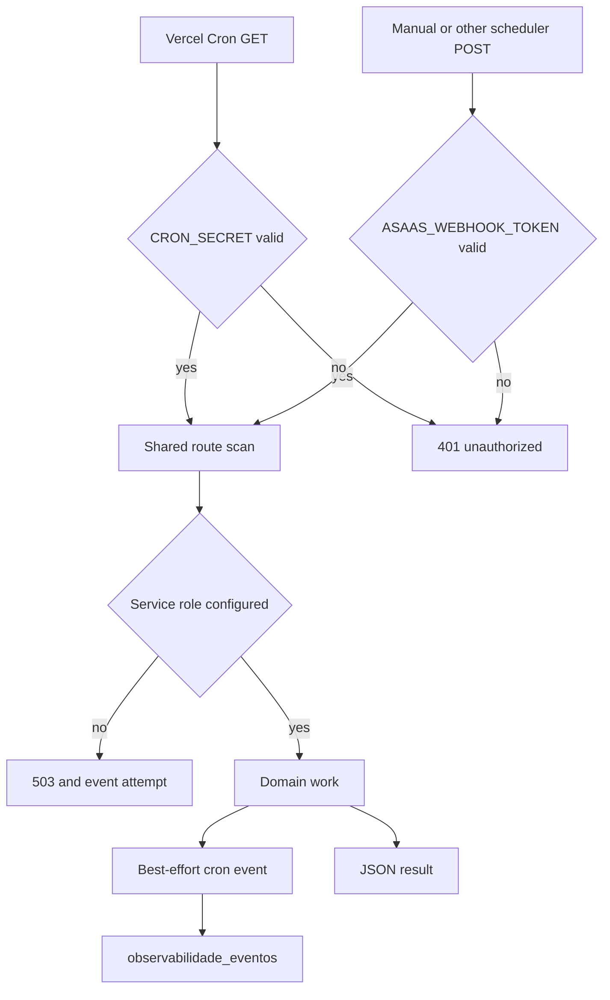

## Runtime boundaries and configuration

The repository root is the Next.js marketplace deployment. `mcp-server/` is independently deployed as an Express service: its Vercel build runs separately and rewrites all paths to the `/api/index` function entrypoint. `dashboard-ops/` is another deployment that reads marketplace cron history and pushes dashboard metrics.

Treat environment configuration as deployment-specific and derive required values from runtime reads, rather than from the tracked, blank `.env.example`. Browser-visible values use the `NEXT_PUBLIC_` prefix. `SUPABASE_SERVICE_ROLE_KEY`, cron credentials, provider credentials, and dashboard remote-write credentials are server-only deployment secrets.

The marketplace service client is server-only: it refuses to construct without `SUPABASE_SERVICE_ROLE_KEY` and disables session persistence and refresh. Ticks and the cron-history read endpoint use it, so a missing key is an operational availability failure, not a reason to substitute the anon client.

## Security headers, CSP, and edge request handling

`next.config.ts` applies static headers to every route: HSTS, `nosniff`, same-origin framing, `strict-origin-when-cross-origin` referrer handling, and a permissions policy that disables camera and microphone while allowing geolocation to the same origin. It also preserves the externally registered `/webhooks/uber-direct` URL by rewriting it to `/api/webhooks/uber-direct`.

CSP is deliberately **not** a static Next header. `proxy.ts` generates it per request, refreshes Supabase session cookies, and redirects unauthenticated protected-panel requests to `/login`. Role authorization remains in layouts and RLS; the proxy only determines whether a session is required.

There are two CSP modes:

- Public and onboarding routes retain `'unsafe-inline'` in `script-src` to preserve static/ISR rendering. They allow the browser integrations used by the app, including Supabase, Sentry ingest, Turnstile, ViaCEP, Meta, YouTube frames, and legacy Bubble CDN images.
- Routes that require a session (`/admin`, `/seller`, `/afiliado`, and `/parceiro`, except named onboarding paths) get a fresh base64 nonce, `strict-dynamic`, and no script `'unsafe-inline'`. The proxy places the nonce and CSP on the forwarded request as well as the response so Next SSR can nonce framework scripts.

Keep this distinction when changing CSP. Applying the strict nonce mode to prerendered onboarding/public pages can leave framework scripts without a nonce; relaxing a protected route reintroduces the higher-risk inline-script policy. The response CSP always allows inline styles because Next/font styling depends on them.

## Sentry and error reporting

Sentry client initialization runs before React hydration. It uses the public DSN, disables default PII collection, takes configurable trace and replay sample rates, masks all replay text, blocks replay media, enables feedback, and exports App Router transition capture. Node and Edge server initialization are selected from `NEXT_RUNTIME`; both disable default PII and have independently configurable server trace sampling. `onRequestError` captures errors from Server Components, route handlers, Server Actions, and SSR.

Use `setSentryUserContext()` only for the user ID and optional role. The generic API error helper captures the actual exception with optional context but returns the generic `{"error":"Erro ao processar requisição"}` response, preventing database and provider messages from reaching callers.

The Uber Direct handler illustrates a deployment-sensitive boundary: it validates `x-uber-signature` as an HMAC-SHA256 of the raw request body only when `UBER_DIRECT_WEBHOOK_SIGNING_KEY` is configured. A mismatch is a Sentry warning and a 401. Without the dedicated signing key, validation is permissive; deploy the endpoint-specific signing key before treating the webhook as authenticated.

## Scheduled entrypoints

The root Vercel configuration schedules four daily **GET** requests:

| Scheduled path | UTC cron schedule | Primary responsibility |
| --- | --- | --- |
| `/api/carrinho/abandono/tick` | `0 12 * * *` | Send abandoned-cart reminders. |
| `/api/estoque/alerta/tick` | `0 11 * * *` | Email sellers about low/out-of-stock inventory. |
| `/api/venda-futura/avisos/tick` | `0 13 * * *` | Send WhatsApp reminders for future-sale reservations. |
| `/api/estoque/reservas/expirar` | `30 5 * * *` | Expire unpaid inventory reservations and notify buyers. |

For all four routes, the Vercel **GET** caller must provide `Authorization: Bearer $CRON_SECRET`. Their alternate **POST** entrypoint is for a manual or other scheduler and instead requires `Authorization: Bearer $ASAAS_WEBHOOK_TOKEN`. These are distinct credentials; a successful GET authorization does not authorize POST, or conversely. Both methods call the same scan within each route.

This shows the shared authorization and reporting shape of the scheduled routes; event persistence never changes the route result.

### Work-specific invariants

- **Abandoned carts:** candidates have been unchanged for at least an hour, have items, and no reminder marker. Successful email marks the cart; an undeliverable address is also terminal and is marked to avoid perpetual retries. WhatsApp is supplementary after a successful email. Per-cart email failures produce an `alerta` outcome; database query failures use the generic 500 error path.
- **Inventory alerts:** only approved products with a non-normal stock state are considered. An out-of-stock item with positive future-sale reserve stock is excluded when it remains sellable. Alerts are grouped per store and deduplicated with `alertas_enviados` keys for seven days; email failures do not create suppression, while an undeliverable store email does so to prevent endless processing.
- **Future-sale reminders:** only undelivered order items whose forecast is the day before or the day of are candidates. An `alertas_enviados` key makes each item/milestone idempotent. The route writes that key only if at least one buyer or seller WhatsApp destination received the message, allowing failed sends to retry.
- **Reservation expiry:** the route first identifies active expired reservations attached to `Aguardando Pagamento` orders, then calls `estoque_reservas_expirar`. The database checkout path is the correctness backstop that expires reservations before judging stock; this daily job is cleanup for conservative storefront availability. Buyer email is best-effort after the RPC has returned stock and cancelled orders, so notification failure is an `alerta`, not a failed expiry.

## Operational event history and triage

`registrarEvento()` writes a bounded capability, origin, result (`sucesso`, `falha`, or `alerta`), and optional reason/JSON metadata through the service role. Its failures—missing configuration, insert errors, or exceptions—are logged and absorbed. The event table is RLS-enabled with no policies, has a capability/newest-time index, and is intended for service-role access only. The focused test asserts this writer does not reject when its dependency is unavailable.

`GET /api/observabilidade/cron` requires `CRON_SECRET` and service-role configuration. It reads up to 50 newest cron events and groups them by origin into a latest item plus up to ten history items. Query errors take the generic Sentry-reporting response path. `dashboard-ops/api/cron` proxies that fixed marketplace endpoint with its own `CRON_SECRET`, caches upstream data for 20 seconds, returns 500 for missing local configuration, and translates upstream unavailability/errors to 502.

For an incident, classify first:

1. **401** means the caller used the wrong method/credential or has no configured secret.
2. **503** means the route lacks privileged Supabase configuration.
3. A recorded **`falha`** or **`alerta`** identifies a domain/query/provider result; inspect its reason and metadata, Vercel logs, and Sentry.
4. Missing history is not proof that the job did not run: event recording is intentionally non-fatal. Check Vercel execution logs and stale latest-event timestamps as well.

The dashboard has a separate daily `GET /api/push-metrics` schedule (`0 11 * * *`). It retrieves dashboard GitHub, Vercel, and Sentry JSON without cache, retains numeric values, and sends them to Prometheus remote write. The push accepts only 200/204 as success; another response becomes 502. This route has no application-level authorization check, so do not expose or invoke it as though Vercel scheduling were a bearer-authentication control.

## Safe changes and verification

1. For a new scheduled route, explicitly choose its scheduler and GET/POST secrets, make repeated work safe, and record a best-effort event without coupling business success to telemetry.
2. Keep the service role in the deployment that executes privileged routes. Test the missing-key 503 behavior rather than silently falling back to a browser client.
3. Preserve the Uber public rewrite and configure its dedicated signing key.
4. Treat CSP changes as request-flow changes: test a protected dynamic panel and a public/ISR or onboarding page in production-like mode.
5. For runtime failures, correlate cron history with Vercel logs and Sentry; alert on explicit non-success results and stale events.

Run the focused observability test with the repository test suite. For marketplace changes, use `npm run lint`, `npm run build`, and `npm run test` at the repository root. See [Quickstart](/openwiki/quickstart.md), [Verification strategy](/openwiki/testing/verification-strategy.md), [Checkout payment and order lifecycle](/openwiki/workflows/checkout-payment-and-order-lifecycle.md), and [Inventory ledger and reservations](/openwiki/workflows/inventory-ledger-and-reservations.md).

## Related pages

- [System map](/openwiki/architecture/system-map.md)
- [External services and webhooks](/openwiki/integrations/external-services-and-webhooks.md)
- [Quickstart](/openwiki/quickstart.md)
- [Verification strategy](/openwiki/testing/verification-strategy.md)
- [Checkout payment and order lifecycle](/openwiki/workflows/checkout-payment-and-order-lifecycle.md)
- [Inventory ledger and reservations](/openwiki/workflows/inventory-ledger-and-reservations.md)
