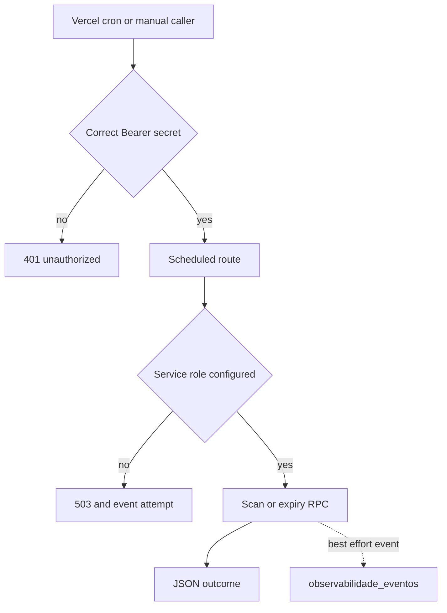

## Deployment and configuration boundaries

This repository contains three independently configured deployments. Keep their environment settings and operational responsibilities separate:

- The repository root is the Next.js marketplace. It owns the public site, route handlers, security headers/CSP, marketplace cron routes, and the Uber webhook rewrite.
- `mcp-server/` is a separately built Express Streamable HTTP MCP service. Its Vercel configuration rewrites every path to the Express function entrypoint; it is not a Next route.
- `dashboard-ops/` is a separate Next.js operations dashboard. It reads external provider APIs, proxies protected marketplace cron history, and runs its own metrics-push cron.

The root `.env.example` is intentionally only a local-copy placeholder, not an authoritative inventory of required variables. Configure values by capability in the deployment that consumes them; do not infer that an integration is disabled because it is absent from that file. Browser-visible `NEXT_PUBLIC_*` values are not secrets. Privileged Supabase credentials, cron Bearer secrets, provider tokens, webhook signing keys, and dashboard remote-write credentials must stay server-side.

| Capability | Configuration boundary and failure mode |
| --- | --- |
| Marketplace privileged data | `SUPABASE_SERVICE_ROLE_KEY` is server-only. The service client refuses to construct without it and disables persisted and refreshed auth sessions. Protected cron work returns 503 when it is unavailable. |
| Marketplace browser session | The proxy only attempts Supabase session refresh when its public URL and anon key are configured. A Supabase auth outage does not itself block navigation; route layouts and RLS remain the authorization backstops. |
| Scheduled callers | Vercel cron `GET`s require `CRON_SECRET`; the alternate/manual `POST`s require `ASAAS_WEBHOOK_TOKEN`. These are distinct Bearer credentials, not a reason to publish an endpoint. |
| Sentry | The DSN, environment, and client/server sampling controls determine reporting. An absent DSN makes the SDK inert. Build-time source-map upload uses Sentry organization/project settings and is non-blocking when unavailable. |
| MCP | Its own `SUPABASE_URL` and service-role key are mandatory at startup. `SUPABASE_ANON_KEY` is additionally needed only for buyer-authenticated checkout. `MCP_WRITE_ENABLED` and `ALLOWED_HOSTS` belong to this deployment. |
| Operations dashboard | GitHub, Vercel, Sentry, marketplace `CRON_SECRET`, and Grafana remote-write settings belong only to `dashboard-ops`. Its routes expose provider failure JSON to its browser UI, so deploy it with appropriate access controls outside the route code. |

The MCP process exits if its Supabase URL or service-role key is missing; that privileged credential is never given to partners. Each MCP request instead presents an `i24_` Bearer token, which is hashed and validated through the database RPC. Writes require both a write-scoped token and the relevant comma-separated module in `MCP_WRITE_ENABLED`; a nonempty `ALLOWED_HOSTS` turns on DNS-rebinding protection. The transport is stateless: each authorized `POST /mcp` creates a server/transport pair, while `GET` and `DELETE /mcp` are rejected and `GET /health` is the liveness probe.

## Marketplace request protections

The root Next configuration applies static HSTS, MIME-type, same-origin framing, strict cross-origin referrer, and permissions headers to every route. Camera and microphone are disabled while geolocation is self-only for the address flow. It also retains permanent redirects for legacy seller/warehouse paths, rewrites the externally registered `/webhooks/uber-direct` endpoint to `/api/webhooks/uber-direct`, and maps the campaign subdomain root internally to `/venda-no-industria`.

CSP is deliberately **not** a static `next.config.ts` header. `src/proxy.ts` generates it per request:

- Public routes retain inline scripts so they can remain Static/ISR; styles retain inline allowance in both variants because of Next/font rendering requirements.
- Login and protected panel paths receive a generated nonce, `strict-dynamic`, and no script inline allowance. The nonce/CSP are also attached to the request headers so Next SSR can nonce framework scripts.
- Both variants permit only the browser-side integrations actually used: Supabase, Sentry, Turnstile, ViaCEP, selected image hosts, Meta resources, and YouTube frames. Server-to-server providers are not browser CSP origins.

The proxy refreshes Supabase cookies on each applicable request and redirects an unauthenticated request for a session-required path to `/login?next=…`. It does not query or enforce roles; each route-group layout and Supabase RLS perform the finer authorization decision. Do not weaken those database/request-path guards to compensate for a missed cron: scheduled work is auxiliary, whereas correctness decisions must remain on the synchronous path.

With `UBER_DIRECT_WEBHOOK_SIGNING_KEY` configured, the Uber handler HMAC-SHA256 validates `x-uber-signature` against the raw body using a timing-safe comparison, reports mismatches to Sentry at warning level, and returns 401. Without the key, signature validation is intentionally permissive; provisioning the dedicated webhook signing key is therefore required before treating this endpoint as authenticated.

## Sentry and error containment

Server instrumentation selects Node or Edge setup from `NEXT_RUNTIME` and exports request-error capture for Server Components, route handlers, Server Actions, and SSR. Node and Edge Sentry initialization disable default PII and use independently configurable trace sampling.

Browser Sentry is loaded dynamically during browser idle time rather than before hydration. Until then, the instrumentation client queues at most ten browser `error`/`unhandledrejection` values and replays them after SDK initialization; an early error triggers loading immediately. The SDK disables default PII, applies configurable tracing and replay rates, masks all replay text and blocks media, enables feedback, and records router-transition breadcrumbs after the SDK is available. `setSentryUserContext()` sets only the user ID and optional role.

Use `respostaErroGenerico()` for database or provider failures that must not disclose implementation details: it captures the exception in Sentry and returns a generic error body. Some purpose-built operational routes return local diagnostic text instead; do not expose them broadly or assume they follow the generic-error contract.

## Scheduled work: authenticated entrypoints and correctness limits

The root Vercel project runs all of these daily GET routes in `gru1`:

| Schedule | Entry point | Work and idempotency boundary |
| --- | --- | --- |
| `0 12 * * *` | `/api/carrinho/abandono/tick` | Scans carts idle at least an hour with items and no reminder marker. Successful email and terminal undeliverable recipients leave the queue; WhatsApp is supplementary. |
| `0 11 * * *` | `/api/estoque/alerta/tick` | Emails sellers about critical/out-of-display approved products, excluding stockouts still sellable from future-sale reserve. Per-product/state suppression lasts seven days. |
| `0 13 * * *` | `/api/venda-futura/avisos/tick` | Sends buyer and seller WhatsApp reminders on the eve and day of a future-sale forecast. An alert key is written only after at least one recipient receives it. |
| `30 5 * * *` | `/api/estoque/reservas/expirar` | Calls the reservation-expiry RPC, then best-effort emails buyers whose pending-payment orders were cancelled. |

Every listed route validates `Authorization: Bearer $CRON_SECRET` for `GET`; its `POST` alternative validates `ASAAS_WEBHOOK_TOKEN` and reaches the same scan. Missing service-role configuration records a best-effort failure event and returns 503. Query/RPC failures record a failure event and use the generic Sentry-reporting response. A completed scan records `sucesso`, while notification/send problems become `alerta` and accompanying metadata/reason.

This flow shows authorization and execution, not the business source of truth. In particular, the stock-reservation cron is cleanup/notification only: `checkout_criar_pedido` expires product reservations before deciding stock, so a delayed cron can make the storefront conservatively understate availability but cannot let checkout oversell. Similarly, a missing collective-commerce tick delays closure notices rather than moving money because the read path has lazy closure. `POST /api/coletivas/tick` has no repository-managed scheduler; an external caller must use `ASAAS_WEBHOOK_TOKEN`, and it runs collective stages with success/failure event recording.

## Event history and dashboard boundaries

`registrarEvento()` is the shared non-blocking event writer. It accepts a bounded capability vocabulary, origin, `sucesso`/`falha`/`alerta`, and optional reason/JSON metadata, then inserts via the service role. Missing configuration, insertion failures, and exceptions are logged and absorbed, so telemetry cannot reject the operation it observes. The `observabilidade_eventos` table is RLS-enabled with no policies, indexed by capability plus descending timestamp, and is intended for service-role access only.

`GET /api/observabilidade/cron` is the marketplace read model: it requires `CRON_SECRET` and service-role configuration, loads up to 50 newest cron events, and groups them by origin into the latest record plus up to ten history records. Query failure goes through the generic Sentry-reporting response. The dashboard's `/api/cron` supplies its own copy of the secret to the fixed marketplace URL, caches successful upstream data for 20 seconds, returns 500 for missing local configuration, and maps unavailable/error upstream responses to 502.

The operations dashboard polls its GitHub, Vercel, Sentry, and cron endpoints every 30 seconds. It shows provider-specific cards rather than a single aggregation: GitHub issues/PRs and rate-limit state, recent Vercel deployments and build percentiles, unresolved Sentry issues and optional transaction latency, and latest cron status/timestamp. Each provider route uses server-side credentials and returns a local 500 JSON error on failure; the Sentry route still returns issue data if its optional latency query fails.

Its separate Vercel project schedules `GET /api/push-metrics` at `0 11 * * *`. That route requests the dashboard's GitHub, Vercel, and Sentry routes without cache, retains numeric values only, and pushes metrics to the configured Prometheus remote-write endpoint. A remote-write result other than 200/204 becomes 502. There is no application-level authorization check on this route, so Vercel scheduling is not an HTTP authorization control; protect the deployment accordingly. The current remote-write password variable is named `GRAFANA_PRHOMOTEUS_API_KEY` in code (including its spelling).

## Diagnosis and safe changes

When scheduled work looks degraded, diagnose in this order:

1. **401** means the calling method or Bearer secret is wrong. Use `CRON_SECRET` for scheduler GETs and `ASAAS_WEBHOOK_TOKEN` for alternate POSTs.
2. **503** means the marketplace service role is absent. Do not substitute the anonymous browser client.
3. A latest `falha` identifies a handler/database failure; `alerta` means the main scan/RPC completed but one or more notifications had a problem. Inspect the stored reason/metadata and Sentry without placing secret values in tickets or logs.
4. No event does not prove no invocation: event writing is deliberately non-fatal. Check Vercel invocation logs and Sentry, then verify freshness of the latest timestamp as well as its result.
5. A dashboard 500 is a provider-route failure; a dashboard cron 502 is its marketplace dependency or network path. These are dashboard visibility failures, not proof that the underlying cron did not run.

For a safe extension, keep a business-correctness guard in the database/request path, select an explicit scheduler and matching Bearer secret, make repeated execution safe, and record outcomes through `registrarEvento()` without awaiting it as a correctness dependency. Preserve the Uber rewrite when relocating its handler, and test CSP changes across public Static/ISR pages and nonce-protected panels. The focused event-writer test asserts that unavailable telemetry never rejects. See [Inventory ledger and warehouse operations](/openwiki/workflows/inventory-ledger-and-warehouse-operations.md), [External services and webhooks](/openwiki/integrations/external-services-and-webhooks.md), and [Verification strategy](/openwiki/testing/verification-strategy.md).
