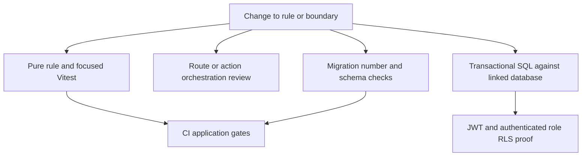

# Verification Strategy and Safety-Critical Test Boundaries

Verification is layered because contracts have different owners. Pure TypeScript decides presentation, input shaping, and safe adapter behavior; Supabase is authoritative for checkout calculations, stock mutation, state transitions, triggers, Storage policies, and row authorization. A passing `npm run test` is necessary for changed application logic, but cannot prove a route handler against real credentials, or an RPC, migration, trigger, or RLS policy on a target database.



This map shows complementary gates: Vitest proves isolated behavior, real SQL proves database-owned behavior, and CI runs only its configured application and filename checks.

## Select proof by the owning boundary

| Change type | Required proof | What it does **not** prove |
| --- | --- | --- |
| Pure calculation, parsing, formatting, deadline, route classification, or input gate | Add a colocated deterministic Vitest test before implementation; exercise accepted, rejected, and boundary inputs. Pass an explicit time for time-sensitive logic. | Database constraints, RLS, actual providers, or HTTP authentication. |
| Checkout payload construction or client-side gate | Test the exact per-store payload and gate ordering, then prove the matching money, stock, or eligibility rule through the authoritative RPC/trigger when a forged request matters. | That browser validation is an enforcement boundary. |
| Route handler or Server Action | Keep non-trivial deterministic logic in `src/lib` and unit-test it; review request auth, client choice, status/error behavior, and side-effect ordering. Add integration/manual proof when those edges matter. | A mocked helper test is not an HTTP, Vercel Cron, provider, or database integration test. |
| RPC, trigger, lifecycle transition, allocation, ledger, or storage rule | Extend a self-contained `begin`/`rollback` SQL test that calls the real object and asserts both success effects and a forbidden actor/transition. | That CI has executed the script. |
| RLS, owner-running view, grant, or private Storage path | Set JWT claims **and** `set local role authenticated`; prove an allowed actor and a forbidden actor. Run `rls_smoke.sql` for shared policy or projection changes. | Policy behavior while running as the CLI's privileged role. |
| Migration | Reserve/check a unique prefix, apply through the linked-database process, check object/policy presence and generated-type drift, and run focused SQL/RLS proof. | That a duplicate-prefix filename check validates DDL or deny-by-default RLS. |

Use red-green-refactor for every new business rule: write its focused failing test, run `npx vitest run <file>`, implement the minimum, then refactor while rerunning it. New rules belong in a testable `src/lib` module with its companion `.test.ts`, rather than embedded in a component, action, or handler. Existing code need not be retrofitted solely for coverage, but changed logic should gain focused proof.

## Fast Node tests: safety-critical examples

`npm run test` runs `vitest run`. Vitest runs in a Node environment, resolves `@` to `src`, and discovers `src/**/*.test.ts` and `scripts/**/*.test.ts`. It is the quick feedback layer for deterministic logic and intentionally has no live database or browser/provider contract.

### Checkout construction and gates

Multi-store checkout must create a separate order per store while preserving the cart's store arrival order. `montarEntregaDaLoja` carries a carrier and optional Uber Direct quote only for delivery, never pickup; when a coupon exists it places the coupon and one shared `checkout_ref` in every store payload so a multi-store checkout consumes it once. Its Mercado Futuro gate requires a business document and terms acceptance, while allowing a rural producer without a corporate name. These are client-side construction and early feedback rules; `checkout_criar_pedido` remains the authoritative rejection point.

Checkout schema tests protect request shape—nonempty UUID item arrays with positive quantities, recognized billing types, and CPF/CNPJ digit lengths—while the schema implementation explicitly leaves price and stock recalculation to the database checkout RPC.

### Inventory, visibility, and physical-location expansion

The seller stock helper classifies zero or null balances as exhausted, uses a valid product minimum or the default critical threshold, and keeps an exhausted product visible only when a future-sale reservation exists. Test changes to stock labels and shelf visibility at these boundaries; test actual stock reservations, expiry, and restoration through SQL/RPC proof.

The warehouse-location expander is a shared client/server pure rule: it normalizes and deduplicates comma lists and numeric or single-letter ranges, rejects literal hyphens that would make generated location codes ambiguous, and generates the cartesian product of street, building, level, and unit. It rejects an oversized range before materializing it and rejects a product over `MAX_POSICOES_POR_LOTE` (2,000), so a malformed preview cannot exhaust the process or disagree with server validation.

### Route/security classification, uploads, and AI safety helpers

`gate-rotas` is the single pure route classification used by the edge session barrier and role layouts. Its tests protect protected-panel prefixes without partial matches, exact public onboarding exceptions, the one logged-in seller-without-store route, the shared affiliate/logistics route, and the rule that strict nonce CSP applies only to session-protected dynamic panels. This is defense-in-depth routing/CSP selection, not a replacement for layout checks or database authorization.

Image validation combines a 5 MiB and declared-MIME allowlist with server-side magic-byte inspection before upload. Tests cover allowed JPEG/PNG, oversized or declared-invalid files, and forged JPEG metadata containing executable or PDF bytes. Bucket limits, Storage policy, and actual upload behavior remain separate database/integration concerns.

AI persona seeds are a safety boundary: only `consumidor`, `seller`, `motorista`, and `afiliado` survive `sanitizarPersona`; any other type or spelling becomes `null` so conversation creation does not persist an invalid persona. The system prompt is guidance to the model, not authority for business rules or data access; route/action identity checks and constrained tools must be validated at their own boundary.

### Other established pure and adapter boundaries

The collective-purchase TypeScript helper mirrors database-facing lot and allocation rules for UI use: it selects only current tiers, and its allocation gives rounding residue to the largest participant so merchandise and freight sums reconcile exactly; its unit test covers tier eligibility and cent-level reconciliation. Change it together with database-facing proof when allocation semantics change.

Dispute unit tests cover deterministic opening windows, seller/admin SLA boundaries, conditional evidence and reason validation, partial-refund bounds, and safe suggested-reason handling; the helper defines the three-day proposal date as a UI reminder rather than a confirmation/denial gate.

The WhatsApp signature helper validates an `sha256=` HMAC over the raw request body with timing-safe comparison and fails closed when secret/header/prefix is absent or comparison is invalid; its test covers altered body, absent/malformed header, wrong secret, and missing secret. Uber Direct phone normalization is separately unit-tested: it strips formatting, adds Brazil’s country code and `+` as necessary, and returns an empty string for no input, leaving sending decisions to the integration caller.

### Route orchestration: reservation-expiry notification

The reservation-expiry cron first snapshots active, due reservations whose orders are awaiting payment, calls the authoritative `estoque_reservas_expirar` RPC, then re-reads only those candidate orders that are now cancelled before emailing buyers. That post-RPC status confirmation avoids notifying an order that was paid in the race window. Email failures are collected as best-effort alerts after the database result; they do not turn the completed expiry into a failed stock operation. The focused Vitest test mocks Supabase and email to prove this candidate-to-cancelled filtering and the empty-candidate fast path. It does **not** test the `GET`/`POST` secrets, the live RPC, the database race, or email delivery; changes to those need integration/manual and linked-database evidence.

## Transactional Supabase workflow tests

`supabase/tests/` contains executable integration/E2E SQL and `supabase/qa/` contains narrower regressions. These scripts use transactions and rollback to exercise real RPCs, triggers, policies, Storage metadata, and fixtures without persisting PostgreSQL changes. Run the most focused script against the intended linked target:

```sh
supabase db query --linked --file supabase/tests/e2e_frete_consolidacao.sql
```

For a QA regression:

```sh
supabase db query --linked --file supabase/qa/qa_pedido_minimo.sql
```

Rollback does not undo external-provider effects, and some QA scripts deliberately select eligible pre-existing target data. Read a script's prerequisites and target selection before running it; do not add transaction-breaking commands.

| Change area | Focused SQL proof to extend or run |
| --- | --- |
| Checkout, payment, and order lifecycle | `qa_pedido_minimo.sql`, `e2e_checkout_cliente_nome.sql`, `e2e_fix_guard_campos_restritos.sql`, `e2e_pipeline_status_cancelamento.sql`, and `qa_pr14.sql` cover minimum-order behavior, checkout name persistence, controlled financial fields, ordered status/cancellation/stock behavior, and guarded PIX/B2B gates. |
| Disputes and private evidence | `e2e_disputas_transicao_status.sql`, `e2e_disputas_mediacao_workflow.sql`, `e2e_disputa_mediacao_foto.sql`, and `e2e_disputa_foto_abertura_regressao.sql` cover actor transitions and both table/Storage isolation of private and legacy paths. |
| Freight and fulfilment | `e2e_frete_consolidacao.sql`, `e2e_corrida_revisao_afiliado.sql`, `rls_frete_corridas_lotes.sql`, and `e2e_logistica_afiliado.sql` cover arithmetic, review/manifest lifecycle, access matrix, assignment choices, and dispatch idempotency. |
| CRM and operational records | `e2e_crm_leads_pipeline.sql` and `e2e_incidentes_atendimento.sql` prove tenant/administrator access and the related privileged workflow. |

Focused freight SQL tests verify checkout freight arithmetic, consolidated-order dispatch suppression, batch manifest creation/cancellation/re-batching, required affiliate review before acceptance, and role-specific visibility of runs and manifests.

Focused dispute SQL tests enforce role-specific escalation/proposal transitions and private mediation channels, including that buyer confirmation/refusal paths work as modeled and each participant cannot write or read the other party’s mediation channel.

Focused checkout/order SQL tests verify checkout name persistence, minimum-order enforcement, state-transition ownership and ordering, cancellation restrictions, and stock restoration; protected-field checks also verify controlled checkout capability and rejection of direct financial/PIX changes.

The affiliate-logistics E2E test verifies that dispatch assigns an exclusive approved affiliate only when every item permits it, falls back to the general pool when an item does not, produces no run for store pickup, and returns the existing run on repeated dispatch.

The PR14 transactional QA script verifies PIX key mutation is guarded and validated through its RPC, records an audit event and temporary payout ineligibility after a valid change, and requires a saved business profile before future-sale checkout passes that gate.

## RLS proof: simulate the caller, then run the smoke check

The CLI runner can use a role with `BYPASSRLS`. A script that only sets a JWT can therefore produce a false policy result. Database tests that verify RLS explicitly set JWT claims and switch to the `authenticated` role because the CLI runner can bypass RLS; without that simulation, policy assertions are not meaningful. Restore the privileged role only for fixture setup or checks that intentionally need it, and keep trigger behavior under privileged setup distinct from RLS behavior.

Dedicated SQL E2E scripts test tenant and privileged-access contracts beyond orders: sellers see only their store's leads while administrators see both scoped and unscoped leads, WhatsApp opt-in registration is admin-gated, and incidents are readable and writable only by administrators.

Dispute attachment SQL tests exercise `storage.objects` policies directly: buyers and sellers can create and read only their own mediation-channel paths, and the legacy dispute-opening photo path remains permitted.

Run the cross-cutting smoke test after changing public tables, policies, owner-running views, grants, `SECURITY DEFINER` routines, or sensitive projections:

```sh
supabase db query --linked --file supabase/tests/rls_smoke.sql
```

The RLS smoke script rolls back and fails on public tables without RLS, missing tenant predicates in designated owner-running views, sensitive columns in limited views, unrelated authenticated access to orders/order lines/affiliations, and an authenticated call to the service-only cancellation RPC; absent optional objects are noticed and skipped. A skipped object is compatibility behavior, not rollout proof: explicitly check required tables, views, policies, routines, and grants after applying the migration. Preserve RLS deny-by-default: a new table starts with RLS enabled and no policy until its business access rule is established and tested.

## Migration validation

Migration filenames are manually numbered under `supabase/migrations`. CI’s migration lint only detects duplicate four-digit prefixes using `ls | grep -oE '^[0-9]{4}' | sort | uniq -d`; contributors must check uniqueness before assigning and pushing a migration number.

Use the worktree-aware helper to choose the next number, and run its collision mode immediately before push:

```sh
scripts/proximo-migration.sh
scripts/proximo-migration.sh --checar
```

The helper reads `origin/master` plus every repository worktree when choosing a number, which detects a concurrently created uncommitted filename that Git history cannot show. Its `--checar` failure condition intentionally matches CI's current-checkout duplicate check, while also warning about higher numbers in other worktrees. This reduces, but does not eliminate, concurrent allocation races; recheck before push and resolve any warning with the other author.

For a security- or data-changing migration:

1. Reserve a unique prefix; keep DDL, RLS enablement, policies, grants, and field guards for one security contract together where practical.
2. Apply with `supabase db query --linked --file <arquivo>`; do not substitute direct `curl`.
3. Verify the actual target schema (for example with `to_regclass` or `information_schema`), then regenerate and inspect Supabase TypeScript types when the schema changes.
4. Run the focused transactional SQL script and `rls_smoke.sql` whenever the change reaches a shared access boundary.
5. Run the root application gates before merge.

## CI gates and their explicit limit

GitHub Actions runs on pushes to `master` and pull requests targeting it, with independent Gitleaks secret scanning, Node 20 lint/build/high-or-higher audit, Vitest test, and duplicate four-digit migration-prefix jobs. `secret-scan` checks full history with Gitleaks; `lint-build` runs `npm ci`, `npm run lint`, `npm run build`, and `npm audit --audit-level=high`; `test` runs `npm ci` and `npm run test`.

The automated application suite is run through `npm run test` in CI; Vitest uses a Node environment and discovers `src/**/*.test.ts` and `scripts/**/*.test.ts`.

The CI workflow does not invoke `supabase db query`; consequently transactional Supabase workflow and RLS verification must be run explicitly against a linked target when database-sensitive changes are released. A green workflow similarly cannot certify route credentials, cron scheduling, external delivery, or schema application.

## Related pages

- [Quickstart](/openwiki/quickstart.md)
- [Data Access, Authorization, and Schema Evolution](/openwiki/architecture/data-access-security-and-schema-evolution.md)
- [AI Assistance and Customer Channels](/openwiki/integrations/ai-assistance-and-customer-channels.md)
- [Checkout, Payment, and Order Lifecycle](/openwiki/workflows/checkout-payment-and-order-lifecycle.md)
- [Inventory Ledger and Reservations](/openwiki/workflows/inventory-ledger-and-reservations.md)
