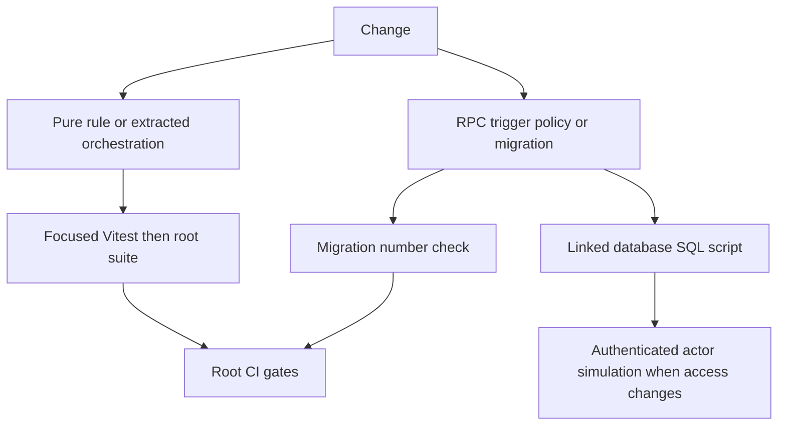

# Verification Strategy

Verification is layered because application and database contracts have different authorities. TypeScript owns fast, deterministic presentation, routing, and adapter decisions; Supabase owns authoritative checkout calculations, state transitions, triggers, storage policy, and row-level authorization. A passing root `npm run test` is necessary for changed application rules, but cannot establish that an RPC, trigger, RLS policy, or `SECURITY DEFINER` guard works on the deployed database.



This is a boundary map: CI runs application and migration-prefix gates, while SQL workflow and authorization proof is an explicit linked-database activity.

## Choose the proving layer

1. **Pure calculation, parsing, classification, routing, or formatting:** write a deterministic Vitest case with accepted, rejected, and boundary inputs. Pass an explicit time where time affects the result.
2. **Route Handler or Server Action:** keep transport/authentication and simple delegation thin. Extract nontrivial validation, orchestration, or business decisions into a testable `src/lib` function first, then test that function. A small exported handler helper can be a focused regression seam, but it must not turn route files into an untested business-rule home.
3. **Request-shape validation:** test the schema/helper contract, then test the database object too if a forged request could affect money, inventory, payment, or lifecycle state. Browser checks improve feedback; they do not replace the authoritative RPC/trigger.
4. **RPC, trigger, state transition, allocation, or stock change:** extend a transaction-scoped SQL script that calls the real database object and asserts both the durable result and a rejected transition or actor.
5. **RLS, owner-running view, Storage, or private channel:** set JWT claims, switch to `authenticated`, and prove both an allowed actor and a forbidden actor. Run the smoke check after changes to shared policy, view, grant, or sensitive projection.
6. **Migration:** separately verify unique numbering, linked-target object/policy presence and behavior, and any type regeneration needed after schema changes. Vitest does not apply or validate SQL migrations.

Assert the property at risk rather than merely a successful page or HTTP status: an unrelated actor sees zero rows, a direct update is rejected, allocations reconcile exactly, or a skipped state transition fails. Keep SQL fixtures self-contained and collision-resistant, preserve the enclosing transaction, and avoid treating a mocked provider as a database/security proof.

## Fast Node tests and red-green-refactor

The root `npm run test` command is `vitest run`. Vitest runs in a Node environment, resolves `@` to `src`, and discovers `src/**/*.test.ts` plus `scripts/**/*.test.ts`. It is the fast layer for code that does not need a live database, browser, or provider.

For every new business-rule function in `src/lib`—including pricing, collective purchase, commission, payout, dispute, and freight logic—the required sequence is **red, green, refactor**:

1. Write the companion `.test.ts` before the implementation and prove it fails with `npx vitest run <file>`.
2. Implement only enough for it to pass.
3. Refactor only while rerunning the focused test.

New tests may use the existing `test(...)` plus `node:assert/strict` style, or `describe`/`it`/`expect`. New work does not require a blanket retrofit of old untested libraries, but a touched function should gain focused coverage. API routes and Server Actions need no duplicate test when they only call covered `lib` logic; nontrivial inline work is the extraction boundary.

### Representative pure-rule regressions

These tests illustrate the kind of invariant to preserve when changing their domains:

- **Checkout/cart:** `montagem-pedido.test.ts` protects stable grouping by store, delivery-only carrier data, one checkout reference for a coupon across per-store orders, and the Mercado Futuro company-document/terms gate. `disponibilidade.test.ts` distinguishes immediate stock from future-sale reservation stock and treats an absent catalogue row as unavailable. Both are preflight UX rules; the checkout RPC remains authoritative.
- **Roles and panel access:** `auth-destino.test.ts` locks destination precedence as admin, seller, active affiliate, logistics partner, then affiliate onboarding. `gate-rotas.test.ts` protects exact protected-route matching, onboarding exceptions, the one logged-in seller route allowed without a store, affiliate/logistics sharing, and the strict-CSP boundary.
- **Inventory and warehouse input:** `estoque-estado.test.ts` preserves the distinction between out-of-stock items removed from the storefront and those still sold by reservation. `faixa-enderecos.test.ts` verifies normalized/deduplicated address ranges, a bounded Cartesian expansion, and rejection before an oversized range is materialized or an ambiguous hyphenated segment can collide.
- **Affiliate and provider adapters:** `afiliacoes.test.ts` protects a single pending-row shape, a 5% default commission while retaining a legitimate zero override, and approved/suspended moderation status. `uber-direct.test.ts` separately verifies Brazilian E.164 normalization and an empty result for no phone; the integration caller decides whether sending is permitted.
- **Race-sensitive notification:** `avisar-compradores.test.ts` mocks only email and service access around the exported notification seam. It proves that, after the expiry RPC, only candidate orders actually found cancelled are emailed; an order paid in the list-to-expiry window is not falsely notified, and an empty candidate list performs no query or send.

Existing focused unit coverage also protects checkout request shape while leaving price/stock recalculation to the checkout RPC; collective-purchase cent reconciliation; deterministic dispute UI rules; and fail-closed WhatsApp raw-body HMAC verification.

## Supabase workflow, migration, and authorization validation

`supabase/tests/` contains executable integration/E2E SQL and `supabase/qa/` holds narrower regression scripts. They use `begin`/`rollback` to exercise real RPCs, triggers, policies, and fixtures without retaining PostgreSQL changes. Run the smallest relevant script against the intended linked project, for example:

```sh
supabase db query --linked --file supabase/tests/0191_guarda_pedido_entregue.sql
```

```sh
supabase db query --linked --file supabase/qa/qa_pedido_minimo.sql
```

Rollback only undoes work in that PostgreSQL transaction. Do not add transaction-breaking statements or assume it reverses external-provider effects. Some QA scripts deliberately need eligible pre-existing target data, so read their prerequisites and confirm the selected linked target first.

The `0191_guarda_pedido_entregue.sql` regression is a focused lifecycle example: it proves stock is restored for an undelivered order, is not restored if any tested line is delivered, and cancellation of a delivered order is rejected (or blocked by permission). Use it with a change to delivery, cancellation, reservation release, restoration, or payout guards.

### Workflow and RLS selection

| Change area | SQL proof to select |
| --- | --- |
| Checkout, payment, and order lifecycle | `qa_pedido_minimo.sql` proves a configured minimum rejects an under-minimum checkout and a null minimum does not. `e2e_checkout_cliente_nome.sql` verifies the six-argument checkout overload preserves the supplied customer name. `e2e_pipeline_status_cancelamento.sql` tests ownership, ordered post-payment progression, cancellation limits, and stock restoration. `e2e_fix_guard_campos_restritos.sql` protects checkout capability and direct financial/PIX-field guards; `qa_pr14.sql` covers guarded PIX mutation, audit/delay behavior, and the business-profile gate. |
| Disputes and private evidence | `e2e_disputas_transicao_status.sql` covers actor-specific escalation/proposal transitions and blocked shortcuts/reversions. `e2e_disputas_mediacao_workflow.sql` covers buyer confirmation/refusal and isolated mediation messages. The mediation-photo test proves own-channel Storage access and cross-channel denial; the opening-photo regression preserves the legacy path. |
| Freight and fulfillment | `e2e_frete_consolidacao.sql` checks freight arithmetic, consolidated-order dispatch suppression, manifest creation/cancellation, and re-batching. `e2e_corrida_revisao_afiliado.sql` requires affiliate review before acceptance. `e2e_logistica_afiliado.sql` covers exclusive assignment, pool fallback, pickup suppression, and idempotent dispatch. |
| CRM and operations data | `e2e_crm_leads_pipeline.sql` checks seller/admin lead visibility and admin-gated WhatsApp opt-in. `e2e_incidentes_atendimento.sql` checks that incidents are readable and writable only by administrators. |

The CLI runner can bypass RLS. Setting a JWT alone is therefore not meaningful policy proof: RLS scripts set `request.jwt.claims` for each subject and use `set local role authenticated` around the policy query/mutation, returning to privileged setup only as required. `rls_frete_corridas_lotes.sql` is a representative actor matrix for exclusive/pool run and lot/manifest visibility. The dispute workflow and Storage tests likewise need both permitted and denied assertions.

After changing a public table, policy, owner-running view, grant, `SECURITY DEFINER` routine, or sensitive projection, run:

```sh
supabase db query --linked --file supabase/tests/rls_smoke.sql
```

The smoke script rolls back and fails for public tables without RLS; designated owner-running views lacking their tenant predicate; sensitive columns in limited views; unrelated authenticated reads of orders, order lines, or affiliations; and authenticated invocation of the service-only cancellation RPC. It notices and skips optional missing objects. That compatibility behavior is not deployment proof for a required new object—pair it with an explicit linked-target presence check.

## Migration numbering is a separate gate

Migration files in `supabase/migrations/` are manually numbered. CI only finds duplicate four-digit prefixes in the checked-out directory; it neither allocates a number nor applies a migration, detects drift, or validates policy semantics. Before creating a migration, use the repository helper, which considers `origin/master` and migration directories across worktrees to avoid a concurrent uncommitted collision:

```sh
scripts/proximo-migration.sh
```

Immediately before pushing, check the current checkout again:

```sh
scripts/proximo-migration.sh --checar
```

CI performs the narrower equivalent collision check:

```sh
cd supabase/migrations && ls | grep -oE '^[0-9]{4}' | sort | uniq -d
```

For a data- or security-changing migration: choose the unique prefix; keep related DDL, RLS, grants, and guards coherent; apply using the approved `supabase db query --linked --file <migration>` process; confirm expected tables/functions/policies/views on the linked target; regenerate and inspect Supabase TypeScript types when schema changes; and run the focused SQL plus `rls_smoke.sql` when access boundaries change. Then run the affected package validation gates.

## Package-specific build and CI gates

The repository has three independently packaged deployables. A root build/test does not validate the dashboard or MCP service. Run commands from each package whose source changes:

| Deployable | Required local validation from its directory | Limit |
| --- | --- | --- |
| Marketplace web app (root) | `npm ci`, `npm run lint`, `npm run test`, `npm run build`; use `npm audit --audit-level=high` for the CI-equivalent dependency audit. | This is the only package covered by the current GitHub Actions workflow; it does not run `supabase db query`. |
| Operations dashboard (`dashboard-ops/`) | `npm ci`, `npm run lint`, `npm run build` | Its manifest has no test script. Validate dashboard changes independently. |
| MCP service (`mcp-server/`) | `npm ci`, `npm run build` | Its manifest has no lint or test script; `npm run build` runs TypeScript compilation. |

GitHub Actions runs for pushes to `master` and pull requests targeting it. Its independent jobs are Gitleaks full-history secret scanning, Node 20 root lint/build/high-or-higher audit, Node 20 root Vitest, and duplicate four-digit migration-prefix detection. A green workflow does not prove deployed SQL behavior because it never invokes `supabase db query`; record the relevant linked-database result in review or release practice.

## Related pages

- [Quickstart](/openwiki/quickstart.md)
- [Supabase data access, authorization, and schema evolution](/openwiki/architecture/data-access-security-and-schema-evolution.md)
- [Runtime configuration, deployment, scheduled work, and observability](/openwiki/operations/runtime-configuration-and-observability.md)
- [Checkout, payment, and order lifecycle](/openwiki/workflows/checkout-payment-and-order-lifecycle.md)
- [Inventory ledger and warehouse operations](/openwiki/workflows/inventory-ledger-and-warehouse-operations.md)
