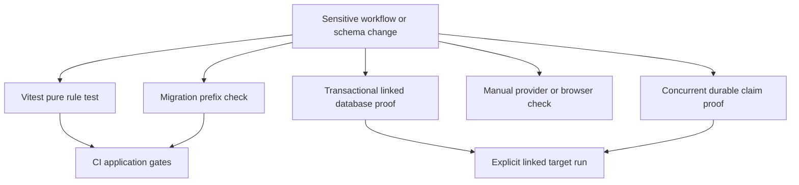
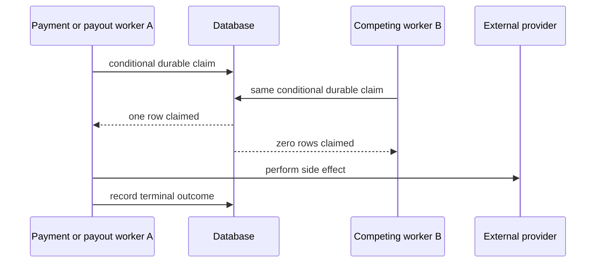

# Verification Strategy

Verification is layered because the application distributes its contracts. TypeScript owns deterministic presentation, parsing, and adapter decisions; Supabase owns durable commercial calculations, state changes, triggers, Storage policy, and row-level authorization. `npm run test` is necessary for an application-rule change, but it cannot prove an RPC, trigger, RLS policy, migration, or external-provider race on a deployed database.



This shows complementary gates: CI runs application checks and prefix detection, whereas durable database behavior and provider boundaries need explicit linked-target evidence. The recent money, freight, encryption, and moderation work is **not** fully covered merely because its migrations and implementation exist.

## Route a change to its authoritative proof

| Changed boundary | Required proof |
| --- | --- |
| Pure calculation, parsing, formatting, signature, or role-precedence rule | Add or update a deterministic Vitest test with positive, rejected, and boundary cases. Pass an explicit date for time-dependent logic. |
| Browser/server request shape | Test the Zod/helper contract, then test the database RPC/trigger too whenever forged input could affect money, inventory, payment, or lifecycle state. |
| RPC, trigger, workflow transition, allocation, stock, or moderation guard | Extend a self-contained `begin`/`rollback` SQL script on a linked database. Assert both durable success and an unauthorized or invalid rejection. |
| RLS, owner-running view, bucket, private channel, grant, or `SECURITY DEFINER` routine | Simulate both allowed and denied actors with JWT claims and `authenticated`; run the smoke script for shared policy/view/projection changes. |
| Payment confirmation or payout around a provider call | Test the durable conditional update against a real database and exercise competing callers at the database boundary. Mock the provider call in a unit test to prove only the winning claim reaches the external transfer. |
| Migration | Check prefix uniqueness, rehearse DDL/data behavior, assert target object presence and grants/policies, then run the focused workflow proof. |

Assert the property at risk rather than a successful page or HTTP response: an unrelated actor sees zero rows, a direct update fails, order and line freight reconcile exactly, or only one worker wins a claim. Fixtures must be self-contained and collision-resistant. Keep rollback scripts transactional, but remember that rollback cannot reverse an external provider call.

## Fast Node tests: existing automated evidence

`npm run test` runs Vitest once. The Node configuration includes `src/**/*.test.ts` and `scripts/**/*.test.ts`, and CI invokes that command. This is the fast feedback layer for code without a live database, browser, or provider.

- **Post-login role precedence.** `destinoPorPapel()` is intentionally pure and has automated coverage for every precedence edge: `admin` wins over all other roles; then store, affiliation, logistics partner, and home for an account with no role. The server resolver obtains role facts using the session-aware Supabase client and delegates the final choice to this function. Changes to onboarding or panels must preserve this test rather than duplicating precedence in a client component.
- **Checkout input versus commercial truth.** Schema tests reject an empty cart, non-UUID product ID, non-positive quantity, unrecognized billing type, and malformed CPF/CNPJ length. They do not validate price, stock, freight, or allocation; `checkout_criar_pedido` owns those values.
- **Freight option presentation.** Unit tests cover percentage rounding, centavos-to-reais conversion, internal-option precedence over Uber Direct, Uber fallback, and no coverage. This is not automated proof that an imported-table carrier is selectable or that the checkout RPC assigns its value.
- **Other focused pure/integration helpers.** Collective-purchase allocation preserves cent-level reconciliation; dispute UI rules use deterministic SLA/window and refund validation; WhatsApp signature validation fails closed using a timing-safe HMAC comparison; Uber Direct phone formatting is independently tested; and the generic webhook token helper tests correct, wrong, short, missing, and absent-secret inputs.

### Explicit gaps in the current Node suite

There is no `repasses.test.ts`, no test that mocks `createPixTransfer`, and no `asaas-confirmar` test. The implementation has important protections, but the following are **specified but pending**, not existing automated evidence:

1. Simulate two payout workers for one `pendente` ledger row and assert one `createPixTransfer` call at the mocked provider boundary; separately prove the database conditional claim lets only one caller update the durable row.
2. Simulate concurrent webhook/manual payment confirmation and a duplicate event after a progressed/delivered order. Assert exactly one conditional `dt_pagamento` winner marks lines paid, notifies, and dispatches; the loser must return `ja_estava_pago` with zero side effects.
3. Keep the role-precedence table-driven test current when adding a new role or destination. Its seven assertions are existing automated evidence, unlike the payment/payout cases above.

## Linked-database workflow and RLS tests

`supabase/tests/` contains executable E2E/integration SQL and `supabase/qa/` contains narrower regression checks. The existing scripts use transactions and `rollback` to exercise real RPCs, triggers, policies, and fixtures without retaining database changes. Run a focused test explicitly against the intended linked project:

```sh
supabase db query --linked --file supabase/tests/e2e_frete_consolidacao.sql
```

A QA script is run the same way:

```sh
supabase db query --linked --file supabase/qa/qa_pedido_minimo.sql
```

Some scripts select eligible pre-existing records, so read their prerequisites and target selection before use. A transaction protects PostgreSQL state only; do not perform a live Asaas transfer in such a test.

Existing SQL coverage includes checkout customer-name persistence, minimum-order behavior, protected checkout/payment fields, order transition/cancellation/stock restoration, freight consolidation and affiliate review, dispatch idempotency, dispute state and private channels, CRM scope, incident administration, and mediation Storage paths. In particular, freight scripts cover arithmetic and freight reconciliation for the established internal/consolidated flow, but they do **not** mention `tabela_importada`.

### RLS simulation is not optional

The CLI runner can bypass RLS. Meaningful policy tests set `request.jwt.claims` and switch to the `authenticated` role for the tested operation, restoring a privileged role only for setup. `rls_frete_corridas_lotes.sql` and dispute tests demonstrate allowed and denied actor matrices. Run the cross-cutting smoke test after shared RLS, view, grant, projection, or service-only routine changes:

```sh
supabase db query --linked --file supabase/tests/rls_smoke.sql
```

The smoke script rolls back and fails on public tables without RLS, tenant-filter loss in designated owner-running views, sensitive columns in limited views, unrelated authenticated access to orders/order lines/affiliations, and authenticated access to the service-only cancellation RPC. It deliberately notices and skips optional objects, so it is not deployment proof that a required new migration is present.

## Required closure for recent database safeguards

The following migrations and code paths require linked-database verification. No matching focused SQL test currently exists under `supabase/tests/` for the listed new object names, and the change task lists leave the requested linked/manual checks unchecked. Treat these as release requirements rather than retroactively claiming automated coverage.

| Safeguard | Durable invariant | Required linked/manual evidence |
| --- | --- | --- |
| `0149_cifrar_cpf_cnpj_asaas_clientes.sql` | A nonempty plaintext CPF/CNPJ is encrypted into `cpf_cnpj_enc` by a `BEFORE INSERT OR UPDATE` trigger and plaintext is cleared. Vault-key lookup and on-demand decryption execute only as `service_role`; missing Vault secret aborts application. | On a safe linked target with the Vault secret, insert/update a representative row and assert ciphertext exists, plaintext is empty, decrypt succeeds as `service_role`, and `anon`/`authenticated` cannot execute the helpers. Confirm trigger, grants, and column presence. Do not record personal data or a secret in fixtures/logs. |
| `0150_checkout_frete_tabela_importada.sql` | The base checkout RPC derives imported-table freight from `cotar_frete_tabela(loja, cep, 0)`, rejects no-match CEPs with the specific message, skips percentage-range lookup for this source, and assigns rounding residue to the last line. | In one rollback SQL test seed global and store override bands, then assert the store override wins, checkout total equals item sum plus table freight, and `sum(linha_itens.valor_frete)` equals the order freight for a three-line order. Assert out-of-band CEP fails with the table-specific message and invoke a six-argument overload to prove delegation remains intact. Run the browser flow separately: choose the returned table option and verify the persisted total/line sum; verify its no-coverage message. |
| `0151_repasse_status_processando.sql` plus `repasses.ts` | `processando` is a durable intermediate state. The transfer worker changes exactly one matching row from `pendente` to `processando` before Asaas, then records `transferido` or `falhou`; later workers must not transfer it again. | Verify the check constraint contains all statuses and the deployed partial uniqueness/recalculation prerequisites exist. Use two concurrent linked sessions/transactions against one row to demonstrate one conditional claim. Add the pending mocked-provider unit test to demonstrate one external call; manually reconcile any row left `processando` before retrying, rather than returning it automatically to `pendente`. |
| `asaas-confirmar.ts` payment core | Webhook and buyer manual fallback converge on `dt_pagamento`: a conditional `dt_pagamento IS NULL` update grants one winner. Only that winner updates paid lines and starts notification/dispatch, while duplicate/progressed events are idempotent. | Add the pending mocked-side-effect test and run two concurrent confirmations on a safe linked order. Assert one update and one set of side effects, then replay against a progressed order. Include wrong charge ID and underpayment rejection. Do not call a real provider from the concurrency run. |
| `0152_loja_situacao_em_analise.sql` | New stores default to `EmAnalise`; a non-admin authenticated insert cannot choose another situation. Existing rows are unchanged; admin, null-identity service/postgres, and checkout-capability contexts follow the stated exceptions. | In rollback SQL, inspect default/check/trigger; simulate authenticated non-admin rejection for `Ativa` and acceptance/default of `EmAnalise`; verify approved/admin and capability exceptions only as intended. After deploy, manually create a seller store and verify it remains out of the public catalogue until administrator moderation. |

For every row, also assert actual target schema presence with catalog queries (`to_regclass`, `pg_constraint`, trigger/function metadata, and grants as applicable). Migration history alone is not evidence of deployment or drift correction.

## Concurrency boundary: durable claim before side effect



This is the required ordering for payment confirmation and payout transfer: establish the durable winner first, invoke the external boundary only from that winner, and retain a durable terminal/recovery state afterward. A mocked provider proves call count; a linked database proves the conditional update under contention. Neither alone proves both properties.

## CI gates and migration discipline

GitHub Actions runs on pushes to `master` and pull requests targeting it. Independent jobs run full-history Gitleaks, Node 20 `npm ci`/lint/build/high-or-higher audit, Node 20 Vitest, and duplicate four-digit migration-prefix detection. CI does not invoke `supabase db query`; a green build is not proof of an RPC, trigger, RLS policy, Vault integration, or deployed migration.

Migration prefixes are manually assigned under `supabase/migrations`; CI only finds duplicate four-digit prefixes. Check before assigning a number and immediately before pushing:

```sh
cd supabase/migrations && ls | grep -oE '^[0-9]{4}' | sort | uniq -d
```

For a security, money, or lifecycle migration: inspect callers and existing deployed contracts; choose a unique prefix; rehearse the focused mutation/authorization case in a rollback transaction; confirm objects and grants on the linked target; run its focused proof plus `rls_smoke.sql` where applicable; and run `npm run lint`, `npm run build`, and `npm run test`. Record linked-target and manual-provider/browser results in review or rollout notes.

## Related pages

- [Repository Quickstart and Change Routing](/openwiki/quickstart.md)
- [Data Access, Security, and Schema Evolution](/openwiki/architecture/data-access-security-and-schema-evolution.md)
- [Authentication and Role Onboarding](/openwiki/workflows/authentication-and-role-onboarding.md)
- [Checkout, Payment, and Order Lifecycle](/openwiki/workflows/checkout-payment-and-order-lifecycle.md)
- [Fulfillment and Logistics](/openwiki/workflows/fulfillment-and-logistics.md)
