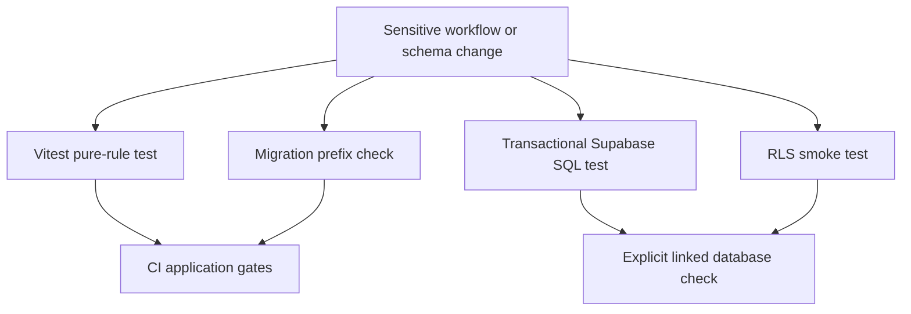

# Verification Strategy

Verification is layered because the application distributes its contracts. TypeScript owns fast, deterministic UI and adapter decisions; Supabase owns authoritative checkout calculations, state changes, triggers, storage policies, and row-level authorization. A passing `npm run test` is therefore necessary for changed application rules, but does not establish that an RPC, trigger, RLS policy, or `SECURITY DEFINER` guard works on the target database.



This shows complementary—not interchangeable—gates: CI executes the application suite and migration-prefix check, while database-sensitive verification is explicitly run against a linked database and rolls back its fixtures.

## Select the smallest proving layer

1. **Pure calculation, parsing, formatting, deadline, or signature rule:** add a deterministic Vitest case with accepted and rejected/boundary inputs. Pass an explicit date for time-sensitive code.
2. **Request-shape validation:** test the Zod/helper contract, but also test the authoritative RPC or trigger if a forged request could affect money, inventory, payment, or lifecycle state.
3. **RPC, trigger, workflow transition, allocation, or stock change:** extend a transaction-scoped SQL script that invokes the real database object, asserts durable-state effects, and includes a rejected authorization or transition case.
4. **RLS, owner-running view, storage bucket, or private channel:** set JWT claims and use the `authenticated` role; prove both the allowed actor and a forbidden actor. Run the cross-cutting smoke check when shared policy, view, grant, or projection contracts change.
5. **Migration:** check prefix uniqueness, object/policy presence on the linked schema, type drift, and the focused SQL test for the invariant changed. Then run the application gates as well.

Assert the property at risk rather than merely a successful page or HTTP response: for example, an unrelated actor sees zero rows, a direct update is rejected, allocations sum exactly, or a skipped transition fails. Keep fixtures self-contained and collision-resistant, use observable assertions, and preserve the enclosing transaction.

## Fast Node tests

`npm run test` is the CI entrypoint for the Vitest suite. Its configuration uses the Node environment and includes `src/**/*.test.ts` and `scripts/**/*.test.ts`. These are the fast feedback layer for modules without a live database, browser, or provider.

Important representative boundaries include:

- **Checkout input versus authoritative calculation.** Checkout schemas require a nonempty list of UUID-based items with positive integer quantities, constrain payment to `PIX`, `BOLETO`, or `CREDIT_CARD`, and accept only 11- or 14-digit CPF/CNPJ strings. This is shape validation before Supabase; the checkout RPC, not the browser schema, recalculates price and inventory.
- **Collective purchase display math.** The TypeScript mirror ignores expired tiers, selects the best reached tier and next eligible target, and allocates values and freight in centavos. It sorts quantities descending and gives residual cents to the largest participant so totals reconcile exactly. Because this intentionally mirrors SQL, change its unit test and database-facing check together when the pricing rule changes.
- **Dispute UI rules.** Tests make opening windows, seller and administrator SLAs, evidence/reason validation, partial-refund limits, and safe suggested reasons deterministic. The three-day proposal date is a reminder only; it must not be presented as a database gate on confirming or refusing a seller proposal.
- **Integration trust boundaries.** WhatsApp verification checks the raw body against a `sha256=` HMAC with timing-safe comparison and fails closed for missing/malformed credentials or a mismatch. Uber Direct phone normalization removes formatting and produces Brazilian E.164 form, returning an empty string for missing input; whether an order can be sent remains the caller's decision.

## Transactional Supabase workflow tests

`supabase/tests/` holds executable integration/E2E SQL; `supabase/qa/` holds narrower regression scripts. They use `begin`/`rollback` to call real RPCs, triggers, policies, and storage metadata checks without retaining fixtures. Run an individual focused script against the intended linked target:

```sh
supabase db query --linked --file supabase/tests/e2e_frete_consolidacao.sql
```

For a QA regression script:

```sh
supabase db query --linked --file supabase/qa/qa_pedido_minimo.sql
```

Rollback only undoes PostgreSQL work in that transaction. Do not add transaction-breaking statements or assume it reverses external provider effects. Some QA scripts deliberately require eligible pre-existing target data; read their prerequisites and target selection before running them.

### Business-invariant test selection

| Change area | Focused SQL evidence |
| --- | --- |
| Checkout, payment, and order lifecycle | `qa_pedido_minimo.sql` proves a configured minimum rejects an under-minimum checkout and a null minimum does not. `e2e_checkout_cliente_nome.sql` verifies the six-argument checkout overload persists a supplied customer name and leaves a null name null. `e2e_pipeline_status_cancelamento.sql` verifies store ownership, ordered post-payment progression, rejected shipment cancellation, and stock restoration on permitted cancellation. `e2e_fix_guard_campos_restritos.sql` tests the checkout capability and direct financial/PIX-field protections; `qa_pr14.sql` covers PIX change validation, audit/delay behavior, and the B2B profile gate. |
| Disputes and private evidence | `e2e_disputas_transicao_status.sql` covers actor-specific escalation/proposal transitions and blocked shortcuts or reversions. `e2e_disputas_mediacao_workflow.sql` covers buyer confirmation/refusal and isolated mediation messages. `e2e_disputa_mediacao_foto.sql` proves the matching storage paths permit each party's own channel but deny the other channel; `e2e_disputa_foto_abertura_regressao.sql` preserves the legacy opening-photo path. |
| Freight and fulfillment | `e2e_frete_consolidacao.sql` checks freight arithmetic, consolidated-order dispatch suppression, manifest creation/cancellation, and re-batching. `e2e_corrida_revisao_afiliado.sql` requires an affiliate review before accepting marked cargo. `e2e_logistica_afiliado.sql` covers exclusive affiliate assignment, fallback to the pool, pickup suppression, and idempotent dispatch. |
| CRM and operations data | `e2e_crm_leads_pipeline.sql` checks owner/admin visibility, contact deduplication, and admin-gated WhatsApp opt-in. `e2e_incidentes_atendimento.sql` checks that incidents are readable and writable only by administrators. |

## RLS simulation and smoke testing

The CLI runner may be a superuser with `BYPASSRLS`. An SQL script that merely sets a JWT can therefore give a false policy result. RLS tests set `request.jwt.claims` for each simulated subject and switch to `set local role authenticated` for the policy query or mutation, resetting the role around privileged setup as necessary. Treat trigger behavior under a privileged setup connection separately from RLS behavior.

`rls_frete_corridas_lotes.sql` is a representative actor matrix: it verifies exclusive-run visibility, pool visibility after exclusivity expires, denial for an unrelated user, and lot/manifest visibility for authorized administrators and accepted carriers. The dispute workflow and storage tests similarly prove both channel access and cross-channel denial.

Run the cross-cutting check after changes to public tables, policies, owner-running views, grants, security-definer routines, or sensitive projections:

```sh
supabase db query --linked --file supabase/tests/rls_smoke.sql
```

The smoke script rolls back and fails for public tables without RLS; designated owner-running views without their tenant predicate; sensitive columns in limited views; unrelated authenticated access to orders, order lines, or affiliations; and an authenticated call to the service-only stock-restoration cancellation RPC. It notices and skips optional objects that do not exist on the target. That compatibility behavior is not proof a newly required migration was deployed: pair it with an explicit object/policy presence check during rollout.

## CI gates and their boundary

GitHub Actions runs on pushes to `master` and pull requests targeting `master`. Independent jobs provide these gates:

1. **`secret-scan`** checks full history with Gitleaks using read-only repository and pull-request access.
2. **`lint-build`** uses Node 20, runs `npm ci`, then `npm run lint`, `npm run build`, and `npm audit --audit-level=high`.
3. **`test`** uses Node 20, runs `npm ci`, then runs the non-watch Vitest suite.
4. **`migrations-lint`** fails on duplicate four-digit migration prefixes.

The workflow does not run `supabase db query`. A green CI build consequently does not demonstrate real RLS, triggers, RPCs, or migrations. Record the relevant linked-database script result in review or deployment practice for database-sensitive changes.

## Safe migration validation

Migration files are manually numbered in `supabase/migrations`. CI only detects collisions by extracting four-digit prefixes; it does not allocate a number, apply migrations, inspect schema drift, or validate policy semantics. Before creating a migration and again immediately before pushing, check for collisions:

```sh
cd supabase/migrations && ls | grep -oE '^[0-9]{4}' | sort | uniq -d
```

For a security or data-changing migration:

1. Choose a unique prefix and keep the DDL, RLS enablement/policy, grants, and guards that establish one security contract together where practical.
2. Rehearse the relevant mutation in a transaction with assertions and `rollback`; apply through the approved linked-database process.
3. Confirm that expected tables, functions, policies, and views are present on the target, then regenerate and review Supabase TypeScript types if the schema changed.
4. Run the focused workflow SQL test and `rls_smoke.sql` when the change affects shared access boundaries.
5. Before merge, also run `npm run lint`, `npm run build`, and `npm run test`.

## Related pages

- [Quickstart](/openwiki/quickstart.md)
- [Supabase data access, authorization, and schema evolution](/openwiki/architecture/data-access-security-and-schema-evolution.md)
- [Runtime configuration, deployment, scheduled work, and observability](/openwiki/operations/runtime-configuration-and-observability.md)
- [Checkout, payment, and order lifecycle](/openwiki/workflows/checkout-payment-and-order-lifecycle.md)
- [Collective commerce and affiliates](/openwiki/workflows/collective-commerce-and-affiliates.md)
- [After-sales disputes](/openwiki/workflows/after-sales-disputes.md)
- [Fulfillment and logistics](/openwiki/workflows/fulfillment-and-logistics.md)
