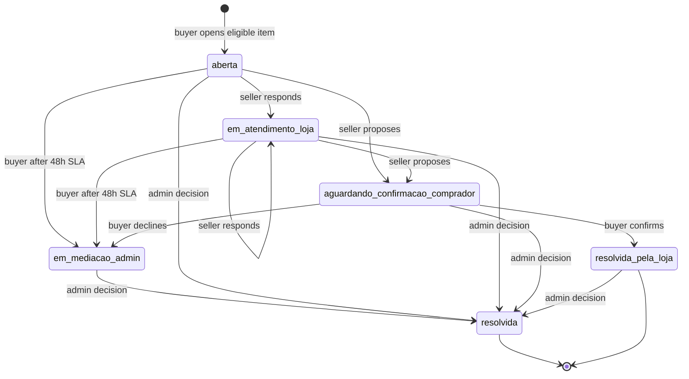
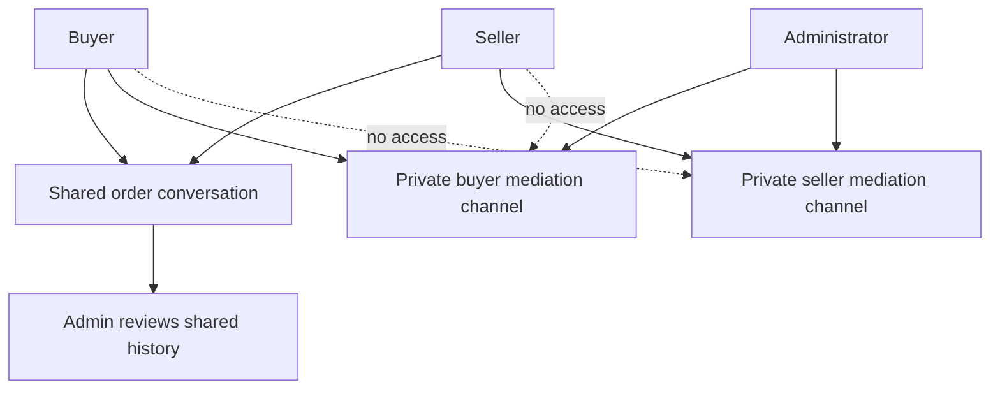

# Post-Sale Support, Chat, and Dispute Resolution

Post-sale support has two deliberately different communication modes:

- **Buyer–seller chat** is a shared `conversas` / `mensagens` thread. It is available to begin only after the buyer has a qualifying paid order with the store, and it is where the parties can discuss the order and a seller can respond to a dispute.
- **A dispute** is an item-level, persisted workflow in `disputas`, attached to the order, item, buyer, store, and an order-specific shared conversation. It adds evidence, deadlines, role-limited transitions, a buyer-confirmation branch, and administrative mediation/final determination.

These modes must not be conflated with the two **private mediation** threads introduced after escalation: the administrator can communicate separately with each side, while the buyer and seller cannot read or write the other side's channel. This page describes the business workflow; see [data access, security, and schema evolution](/openwiki/architecture/data-access-security-and-schema-evolution.md) for broader database conventions, [AI assistance and customer channels](/openwiki/integrations/ai-assistance-and-customer-channels.md) for the support bot, and [checkout, payment, and order lifecycle](/openwiki/workflows/checkout-payment-and-order-lifecycle.md) for order eligibility and delivery.

## Entrypoints and responsibilities

| Actor | Entrypoint | Responsibility |
| --- | --- | --- |
| Buyer | `/pedido/[id]` and `/pedido/[id]/disputa/nova` | Starts ordinary order chat, opens an eligible item dispute, confirms a seller proposal, escalates, and uses the buyer mediation channel. |
| Seller | `/seller/disputas` and `/seller/disputas/[id]` | Sees only its store's cases, reviews the shared history/evidence, then proposes a resolution or communicates privately with the administrator after escalation. |
| Administrator | `/admin/disputas` and `/admin/disputas/[id]` | Sees the system queue, including overdue mediations; reviews evidence and the shared thread; communicates in either private channel; and records the only final decision. |
| Support AI | Support conversation tools | Looks up the buyer's orders and open post-sale cases, collects valid details, and produces a prefilled opening link. It never creates a dispute or uploads evidence itself. |

The buyer's order page shows “talk to seller” only within its paid-order UI flow. Independently, `iniciarConversa` checks a `SECURITY DEFINER` RPC before creating a new direct conversation, rather than trusting the UI. The RPC verifies `auth.uid()`, store, optional product, and an order whose `status_pedido` is `Pagamento Realizado`; it gates creation only, so existing conversations and message RLS remain separately governed. A seller cannot start a conversation with its own store.

## Opening an item dispute

The order page offers the dispute link only for a paid, delivered line item while its opening window remains valid. The opening form receives the order and line-item IDs, categorized reason, description, and up to five images. Server-side `abrirDisputa` re-reads the buyer-scoped item rather than trusting hidden inputs, verifies the item belongs to the supplied order and still has a product/store, then applies the business rules before inserting.

### Eligibility, evidence, and special inventory

- The normal opening window ends **seven days** after `entregue_em`; it ends **24 hours** after delivery for a perishable item. The form and terms explain the reduced perishable window, but the server is the enforcement point.
- Accepted reasons are damaged item, not as advertised, not delivered, incorrect quantity, or other. `produto_estragado_ou_vencido` is available only for a perishable item; suggested reasons arriving via the AI-link query string are accepted only if they are valid for that item's perishability.
- At least one opening photo is mandatory for both a perishable item and a future-sale item (`venda_futura_id`), even if client-side form constraints are bypassed. Opening uploads are limited by the form to five files; each successfully uploaded file is recorded as a `disputa_fotos` row. A storage failure for one opening image does not abort the already-created case; the action continues with remaining images.
- A future-sale item can ultimately be **denied** or receive a **partial refund** only. Exchange and full-refund decisions are rejected because physical return/exchange is not viable after production/harvest and consumption. A partial refund must be positive and no greater than the disputed item value.

A successful opening creates or reuses a conversation scoped by buyer, store, product, **and `pedido_id`**, then inserts the dispute in `aberta` with `sla_loja_vence_em = aberta_em + 48 hours`. The partial unique index permits at most one active case per `linha_item_id`; the action presents a conflict as an already-active dispute. The store receives an email notification when it has an email address and a best-effort WhatsApp notification. A WhatsApp failure is captured by Sentry and does not roll back the persisted case.



The dispute progression enforced for non-admin actors. An administrator can record a final decision for any not-yet-final case.

## State ownership, deadlines, and finality

The state machine is not merely UI behavior. `guard_campos_restritos()` is a database trigger layered over RLS, closing the direct-Supabase-client bypass that ordinary update policies alone would permit.

- A seller who owns the case's store can move only from `aberta` or `em_atendimento_loja` to `em_atendimento_loja` or `aguardando_confirmacao_comprador`. The latter is a proposal, not a unilateral closure.
- A buyer can move `aberta` or `em_atendimento_loja` to `em_mediacao_admin` only once `sla_loja_vence_em` has passed. From `aguardando_confirmacao_comprador`, the buyer can either accept to `resolvida_pela_loja` or decline/escalate to `em_mediacao_admin` immediately.
- The three-day value calculated from `proposta_resolucao_em` is a UI reminder, **not** a deadline or database gate. Confirmation and rejection remain available immediately and later.
- `resolvida_pela_loja` means buyer-confirmed seller resolution, while `resolvida` means an administrator's final decision. Non-admins cannot set `resolvida`, change decision fields, or reverse an escalated/proposed case.
- The admin target is **24 hours after `escalada_em`**. `mediacaoAdminAtrasada` only labels an escalated case overdue in the admin queue; it neither blocks operations nor triggers an automatic outcome.

An administrator records one of `reembolso_total`, `reembolso_parcial`, `troca`, or `negada`, with a required justification, timestamp, and deciding user. The action repeats partial-refund and future-sale validation before update; the trigger and admin RLS are the durable authorization boundary. Recording a refund or exchange does **not** execute a payment automatically: the admin UI explicitly identifies it as a manual payout/reversal follow-up. Decision WhatsApp notices to buyer and store are best-effort and Sentry-observed, so notification failure never undoes the decision.

## Shared discussion versus private mediation

The initial dispute conversation deliberately reuses the ordinary conversation/message schema and is visible to the buyer and store participant; the administrator's detail screen can review it as historical buyer–seller communication. Its order key prevents collision with a general buyer/store/product chat. The in-thread seller assistant can answer buyer messages while active, but a seller or administrator message disables it; the bot is not a mediator and does not decide cases.

After escalation, `disputa_mensagens_mediacao` is a separate table because the shared conversation model grants both buyer and seller participation by design. Each mediation message declares `destinatario` as `comprador` or `loja`; RLS permits a buyer only in its buyer channel, the owning seller only in its seller channel, and an administrator in both. The same isolation applies to photos.



The mediation boundary: the shared conversation is buyer–seller-visible; mediation is two isolated administrator-and-one-side channels.

Messages are nonblank and bounded to 4,000 characters by the table. A mediation sender may attach an image through `uploadFotoMediacao`, which rejects files larger than 5 MB and types other than JPEG, PNG, WEBP, or GIF before storage upload. It writes `mediacao/{disputaId}/{destinatario}/{uuid}-{filename}` to the private `disputas` bucket and saves the resulting path in `foto_url`; pages issue 10-minute signed URLs only when rendering. Storage RLS parses that path and mirrors message-channel authorization, including preventing a buyer upload/read in the store path and vice versa. The generic opening-evidence policies explicitly exclude the `mediacao` prefix, preserving the old `{disputa_id}/{file}` layout without unsafe UUID casts.

## Data model and access invariants

`disputas` is the workflow record: it references `pedidos`, optionally `linha_itens`, buyer, store, and the order conversation; it carries reason, bounded description, status, opening/store-SLA/escalation/resolution timestamps, proposal time, and final-decision audit fields. `disputa_fotos` references a dispute and keeps private-storage paths. `disputa_mensagens_mediacao` references the dispute and stores channel, author, body, creation time, and optional photo path.

RLS gives buyers access to their cases and store owners access to their own store's cases; administrators have all-case access. Evidence access is participant-plus-admin, while mediation data is stricter channel-scoped access. These policies are important but insufficient on their own for update safety: preserve the trigger transition guard whenever changing statuses, roles, or adding an integration that writes `disputas`.

Operationally, `disputas` participates in Supabase Realtime so the administrative queue can observe escalations. The list is dynamic and can filter by status; it marks only `em_mediacao_admin` cases with a populated escalation time as overdue. Both seller and admin detail pages create signed storage URLs on demand, so do not replace stored paths with public URLs or change the bucket to public.

## AI handoff and notification semantics

For a known order, the support prompt calls both `buscar_disputas_pos_venda` and `buscar_pedido` in the same turn. If an active case exists, it reports status instead of creating another. Otherwise, after gathering a valid reason and description, it builds:

```text
https://industria24.com.br/pedido/{pedido_id_interno}/disputa/nova?item={item_id}&motivo={motivo}&descricao={descrição codificada para URL}
```

The link must use `pedido_id_interno`, not the buyer-facing `id_venda`; the opening page validates the item/order relationship and validates the suggested reason again. The bot asks the buyer to submit the prefilled form and attach required evidence, preserving human confirmation and server-side enforcement.

Email is used for new-case and escalation notifications; escalation additionally uses a configured service client to look up administrator auth emails. WhatsApp uses Bubblewhats for new case, seller proposal, and final-decision messages. Only WhatsApp sends are consistently treated as best effort in these actions; failures are reported to Sentry without reversing the committed workflow mutation. Treat notification delivery as advisory, not a transactional guarantee.

## Verification and safe change checklist

Focused SQL end-to-end tests run in `begin`/`rollback` transactions, set the `authenticated` role and JWT claims so they exercise real RLS rather than a bypass role:

- `supabase/tests/e2e_disputas_transicao_status.sql` proves a buyer may escalate after expiry but not before, and proves a seller cannot reclaim mediation, close unilaterally, or reopen a proposal.
- `supabase/tests/e2e_disputas_mediacao_workflow.sql` proves seller proposal, buyer confirmation, immediate buyer rejection without an expired SLA, and text-channel isolation in both directions.
- `supabase/tests/e2e_disputa_mediacao_foto.sql` tests the corresponding storage object upload/read isolation; `e2e_disputa_foto_abertura_regressao.sql` protects the legacy opening-evidence path.

When changing this workflow, update the pure helpers in `src/lib/disputas.ts`, server action validation, database CHECK/RLS/trigger rules, and tests together. In particular, do not implement a new UI transition without a matching database guard; do not loosen `em_mediacao_admin` to a shared chat; and do not convert SLA display calculations into automatic closure unless the database policy, operational expectations, and tests are intentionally changed. See [verification strategy](/openwiki/testing/verification-strategy.md) for the wider test approach.
