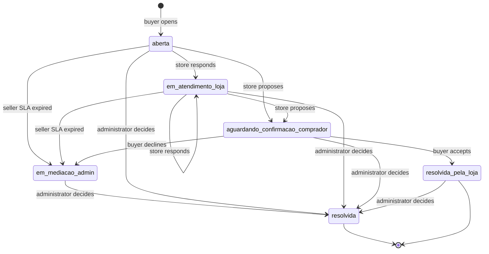
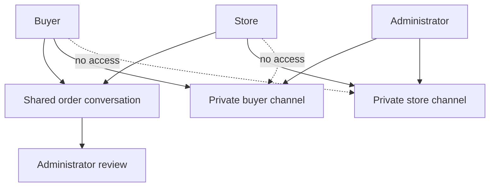

# After-Sales Disputes and Mediation

After-sales support has three intentionally separate paths:

- **Buyer–seller chat** is the ordinary shared `conversas` / `mensagens` thread.
- **A dispute** is an item-level `disputas` record linked to an order, line item, buyer, store, and order-specific shared conversation. It carries evidence, deadlines, and durable status transitions.
- **Mediation** is a pair of private, recipient-scoped channels for an administrator and each party after escalation.

The order and delivery prerequisites are described in [checkout, payment, and order lifecycle](/openwiki/workflows/checkout-payment-and-order-lifecycle.md) and [fulfillment and logistics](/openwiki/workflows/fulfillment-and-logistics.md). For broader RLS and migration conventions, see [data access, security, and schema evolution](/openwiki/architecture/data-access-security-and-schema-evolution.md).

## Entrypoints and ownership boundaries

| Actor | Entrypoints | Responsibility |
| --- | --- | --- |
| Buyer | `/pedido/[id]`, `/pedido/[id]/disputa/nova` | Opens an eligible case, accepts a store proposal, escalates, and uses the buyer-private mediation thread. |
| Store owner | `/seller/disputas`, `/seller/disputas/[id]` | Reviews the case, opening evidence and shared history; responds or proposes a resolution; uses the store-private mediation thread after it is displayed. |
| Administrator | `/admin/disputas`, `/admin/disputas/[id]` | Reviews every case and shared history, communicates privately with either party, and records the final decision. |
| Support AI | Support conversation tools | Queries the buyer's order and cases, then hands off a prefilled opening URL. It never opens a dispute or attaches evidence. |

The standard chat creation action is separately gated. `iniciarConversa` calls the `SECURITY DEFINER` RPC `comprador_tem_pedido_pago`, validates an optional product belongs to the supplied store, and rejects a store owner talking to their own store. This is only a gate for **creating** a thread: existing conversation and message access remain governed by their own RLS rules.

## Opening: eligibility, durable record, and evidence

The buyer order page shows **Trocar ou pedir ajuda** only for an item in the post-payment pipeline with `entregue_em` and a still-valid opening window. The form page and `abrirDisputa` re-read the buyer-scoped item, require that it belongs to the supplied order and has a product, rather than trusting hidden form values.

At submission, the action applies these rules:

- The window is seven days after delivery, shortened to 24 hours for perishable products. The server enforces the window if `entregue_em` is present; the order page is the layer that requires a delivery timestamp before exposing the link.
- `produto_estragado_ou_vencido` is valid only for perishable items. Query-string suggestions from the AI are accepted by the form only if valid for that item's perishability, then validated again on submit.
- Perishable and future-sale (`venda_futura_id`) items require at least one submitted opening-photo file. The form itself marks the field required only for perishables, so the server is authoritative for future-sale cases.
- The action considers at most five files. It server-checks each opening file for the 5 MB limit, JPEG/PNG/WEBP MIME type, and matching image magic bytes; invalid or failed uploads are skipped rather than rolling back the already-created case. Consequently, the required-photo count is checked before individual file validation and is not a guarantee that a valid object was persisted.

On success, `abrirDisputa` finds or creates a buyer/store/order conversation, inserts an `aberta` dispute, and calculates a 48-hour `sla_loja_vence_em`. The partial unique index permits one active case for a line item; `resolvida_pela_loja` and `resolvida` release the slot.

Opening evidence is private data, not a public asset URL. Successful objects use `{disputa_id}/{uuid}.{extension}` in the private `disputas` bucket and `disputa_fotos.url` stores that storage path. Participants and administrators obtain a signed URL only while a seller or administrator page renders it. The bucket independently limits objects to 5 MB and JPEG, PNG, WEBP, or GIF; opening-action validation is narrower and does not accept GIF.



The diagram shows durable statuses, the seller-SLA escalation branch, and terminal resolution exits; administrator access permits finalization from any status.

## Seller response, escalation, and decision

RLS identifies the buyer, owning store, and administrator, but the `guard_campos_restritos()` trigger is also required to stop direct updates from bypassing the lifecycle.

- A store owner can move only `aberta` or `em_atendimento_loja` to `em_atendimento_loja` or `aguardando_confirmacao_comprador`. A proposal is not unilateral closure.
- The buyer can escalate `aberta` or `em_atendimento_loja` only once `sla_loja_vence_em` has passed. From `aguardando_confirmacao_comprador`, the buyer may accept to `resolvida_pela_loja` or decline to `em_mediacao_admin` immediately.
- The derived three-day value after `proposta_resolucao_em` is a UI reminder only, not a database deadline. It does not remove either buyer choice.
- The administrative queue marks an `em_mediacao_admin` dispute overdue 24 hours after `escalada_em`. This is display-only: it neither gates access nor creates an automatic outcome.

Only an administrator can set `resolvida` or modify decision/audit fields. `decidirDisputa` requires a justification, rejects an already-final case, validates partial refunds as positive and no greater than the disputed item value, and limits future-sale outcomes to `reembolso_parcial` or `negada`. A recorded decision does **not** invoke a payment, reversal, or exchange; those are manual follow-up work.

## Shared history and private mediation

The dispute-associated `conversa_id` points to the normal buyer–seller history. `pedido_id` distinguishes that conversation from general chat, and the administrator can review it. It is not the mediation transport: `disputa_mensagens_mediacao` holds separate rows with `destinatario` set to `comprador` or `loja`.



The shared history is visible to buyer and store, while mediation isolates each party's communication with the administrator.

RLS lets a buyer read and insert only `comprador` rows for their dispute, a store owner only `loja` rows for that store's dispute, and an administrator both. Messages must be nonblank and at most 4,000 characters. Neither these policies nor the buyer/store server actions require `em_mediacao_admin`; the buyer and seller pages only display the private threads for `em_mediacao_admin` or `resolvida`. A direct permitted insert therefore is not database-gated on mediation status.

Mediation attachments use the private `disputas` bucket as well. `uploadFotoMediacao` validates 5 MB, JPEG/PNG/WEBP/GIF, and image magic bytes before storing `mediacao/{disputaId}/{destinatario}/{uuid}.{extension}`; the persisted `foto_url` is a storage path. Renderers generate 10-minute signed URLs. Storage policies parse that prefix and mirror the recipient channel isolation. Opening-evidence policies explicitly exclude `mediacao` and safely convert their first path segment to UUID, avoiding a cast failure for this prefix.

## Notifications and AI handoff

State changes are persisted before notification sends, but notifications are not part of the database transition. Opening sends a store email when available and attempts WhatsApp. Seller proposals and final decisions attempt WhatsApp. WhatsApp failures are caught and reported to Sentry, so they do not undo the committed mutation. Opening and escalation email calls are awaited after persistence: a thrown delivery error can fail the request even though the case or escalation is already committed. Escalation looks up administrator emails with the service client and skips administrator fan-out when that client is unavailable.

For a known buyer order, the support prompt tells the bot to call `buscar_disputas_pos_venda` and `buscar_pedido` together. It reports an existing case instead of creating another. Otherwise, after collecting an allowed reason and description, it constructs:

```text
https://industria24.com.br/pedido/{pedido_id_interno}/disputa/nova?item={item_id}&motivo={motivo}&descricao={descrição codificada para URL}
```

The link deliberately uses `pedido_id_interno`, not buyer-facing `id_venda`. The buyer reviews and submits the prefilled form; all page and server validation remains authoritative and evidence remains a buyer upload.

## Verification and safe changes

`src/lib/disputas.test.ts` covers pure opening windows, seller/admin SLA calculations, proposal reminder, opening-photo requirement, reason validation, refund limits, and AI suggestion filtering. `src/lib/validacao-imagem.test.ts` exercises MIME/size checks and rejects content whose magic bytes do not describe an image.

The SQL tests use `begin`/`rollback`, switch to the `authenticated` role, and set JWT claims, exercising RLS rather than a bypass role:

- `e2e_disputas_transicao_status.sql` covers SLA escalation and prohibited store reversal, unilateral closure, and reopening.
- `e2e_disputas_mediacao_workflow.sql` covers proposal, buyer acceptance and immediate rejection, and text-channel isolation.
- `e2e_disputa_mediacao_foto.sql` covers recipient-scoped mediation storage upload/read isolation without retaining fixtures.
- `e2e_disputa_foto_abertura_regressao.sql` ensures the older `{disputa_id}/{file}` opening-evidence path remains usable after mediation-prefix storage policy changes.

When changing this workflow, change pure validation, actions, constraints, RLS, trigger rules, storage policy, and focused tests together. Do not treat a UI condition or best-effort message as a durable transition, and do not add a UI transition without a matching database guard. Changing a display-only SLA into automatic closure requires an explicit persistence and operational design.
