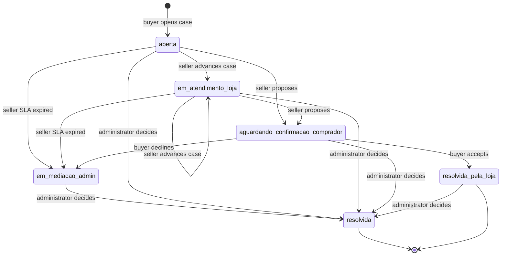
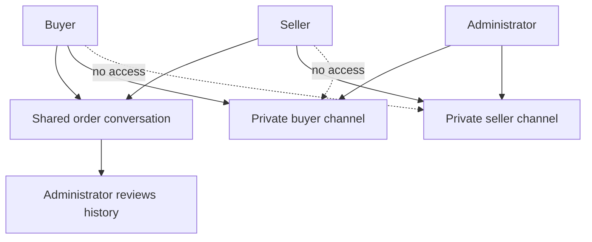

# After-Sales Disputes and Mediation

After-sales support deliberately separates three communication and decision paths:

- **Buyer–seller chat** is the ordinary shared `conversas` / `mensagens` thread. A buyer may start a new thread only after a qualifying paid order with that store.
- **A dispute** is an item-level `disputas` workflow linked to an order, line item, buyer, store, and order-specific shared conversation. It carries evidence, deadlines, and a role-constrained lifecycle.
- **Mediation** uses two private, recipient-scoped channels after escalation. An administrator can communicate with either party; buyer and seller cannot read each other’s channel.

This workflow depends on the order and delivery lifecycle described in [checkout, payment, and order lifecycle](/openwiki/workflows/checkout-payment-and-order-lifecycle.md). See [data access, security, and schema evolution](/openwiki/architecture/data-access-security-and-schema-evolution.md) for wider database conventions and [AI assistance and customer channels](/openwiki/integrations/ai-assistance-and-customer-channels.md) for the support assistant.

## Entrypoints and boundaries

| Actor | Entrypoints | Role in the workflow |
| --- | --- | --- |
| Buyer | `/pedido/[id]`, `/pedido/[id]/disputa/nova` | Opens an eligible dispute, accepts a proposal, escalates, and uses the buyer mediation channel exposed by the order page. |
| Seller | `/seller/disputas`, `/seller/disputas/[id]` | Reviews shared history and evidence, proposes a resolution, and receives a private admin channel once the UI exposes mediation. |
| Administrator | `/admin/disputas`, `/admin/disputas/[id]` | Reviews all cases and shared history, communicates privately with either side, and records final decisions. |
| Support AI | Support conversation tools | Looks up orders and existing disputes, then hands the buyer a prefilled opening URL; it does not create disputes or attach evidence. |

`iniciarConversa` does not trust the paid-order UI. Before creating a new direct chat it calls the `SECURITY DEFINER` RPC `comprador_tem_pedido_pago`, which checks the authenticated buyer, store, optional product, and a `Pagamento Realizado` order. It also verifies that an optional product belongs to the store and prevents a store owner from starting a chat with their own store. This is a creation gate only: existing conversations and `mensagens` RLS have their own access rules.

## Opening a dispute

The buyer order UI exposes “Trocar ou pedir ajuda” only when the order is in its paid pipeline, the line has `entregue_em`, and the opening window remains valid. The opening page and `abrirDisputa` re-read the buyer-scoped line item and verify that it belongs to the supplied order and retains a product. This prevents the hidden order/item fields from choosing someone else’s line.

The server applies the following business rules:

- The window is seven days after `entregue_em`, or 24 hours for a perishable item. The action checks this rule when a delivery timestamp exists; the order UI is what requires that timestamp before offering the link.
- Reasons are bounded by the schema; `produto_estragado_ou_vencido` is rejected for a nonperishable item. Suggested reasons in the AI URL are accepted by the form only when valid for that item’s perishability, and are revalidated when submitted.
- Perishable and future-sale (`venda_futura_id`) items require at least one opening photo. The action processes at most five submitted files, stores successful objects under `{disputa_id}/{uuid}-{filename}` in the private `disputas` bucket, and stores paths—not public URLs—in `disputa_fotos`. An individual upload failure is skipped rather than undoing the persisted case.
- A future-sale dispute can be `negada` or receive `reembolso_parcial`; `troca` and `reembolso_total` are invalid. A partial refund must be positive and no greater than the line-item value.

On success, `abrirDisputa` creates or reuses a conversation identified by buyer, store, product, and `pedido_id`, inserts `aberta`, and sets `sla_loja_vence_em` to 48 hours after opening. The database’s partial unique index allows only one active dispute per `linha_item_id`; `resolvida_pela_loja` and `resolvida` release that slot. It then sends the store an email when an address exists and attempts WhatsApp notification.



The durable dispute status lifecycle; the UI does not necessarily expose every database-permitted transition.

## Status ownership and SLA semantics

RLS identifies the buyer, the owning store, and administrators, but is not the complete update safeguard. The `guard_campos_restritos()` trigger additionally checks transitions, preventing a direct client update from bypassing the workflow.

- A store owner may move only `aberta` or `em_atendimento_loja` to `em_atendimento_loja` or `aguardando_confirmacao_comprador`. The latter is a proposal, not unilateral closure.
- A buyer may move `aberta` or `em_atendimento_loja` to `em_mediacao_admin` only after `sla_loja_vence_em`. From `aguardando_confirmacao_comprador`, the buyer can accept to `resolvida_pela_loja` or decline to `em_mediacao_admin` immediately.
- The three-day value derived from `proposta_resolucao_em` is a UI reminder, not a database deadline. Acceptance and rejection are available at any time after proposal.
- `resolvida_pela_loja` records buyer confirmation. Only an administrator can set final `resolvida` or change decision/audit fields. The admin SLA is 24 hours after `escalada_em`, but it only marks an `em_mediacao_admin` case overdue in the admin queue; it neither blocks access nor creates an automatic outcome.

A final decision is one of `reembolso_total`, `reembolso_parcial`, `troca`, or `negada`, and requires a justification. `decidirDisputa` repeats refund-limit and future-sale validation, writes the deciding user and timestamps, and refuses an already `resolvida` case. It records a decision only: refund, reversal, or exchange execution remains manual follow-up.

## Shared history and private mediation

The dispute’s initial conversation reuses the shared buyer–seller schema; `pedido_id` distinguishes it from a general buyer/store/product chat. The administrator can review that history. By contrast, `disputa_mensagens_mediacao` has a `destinatario` of `comprador` or `loja`, since the shared schema would expose messages to both sides.



The shared thread is buyer–seller-visible, while private channels isolate each side’s communication with the administrator.

RLS permits a buyer to read and insert only `comprador` rows for their case, a store owner only `loja` rows for their store’s case, and an administrator both. Text must be nonblank and at most 4,000 characters. The policies do **not** include a dispute-status condition: server actions and buyer/seller pages present these channels for escalated or resolved cases, but a permitted direct insert is not database-gated on `em_mediacao_admin`.

Mediation attachments are server-validated to 5 MB and JPEG, PNG, WEBP, or GIF. `uploadFotoMediacao` writes `mediacao/{disputaId}/{destinatario}/{uuid}-{filename}` in the same private `disputas` bucket and records the path as `foto_url`; pages create 10-minute signed URLs only while rendering. Storage policies parse the prefix and mirror the recipient-channel isolation. The older opening-evidence policies explicitly exclude the `mediacao` prefix and use a safe text-to-UUID conversion, so the new prefix does not cause a policy cast failure.

## Notifications and AI handoff

Workflow changes persist before their follow-up notifications. New-case, seller-proposal, and final-decision WhatsApp calls catch failures, report them to Sentry, and do not reverse the mutation. Opening and escalation email sends are awaited after persistence; an email failure can fail the request after the case or escalation is already committed. Escalation additionally uses the configured service client to retrieve administrator auth emails; when it is not configured, administrator email fan-out is skipped.

For a known buyer order, the support prompt directs the bot to call `buscar_disputas_pos_venda` and `buscar_pedido` together. An active case is reported rather than recreated. Otherwise, after it gathers a reason and description, it provides:

```text
https://industria24.com.br/pedido/{pedido_id_interno}/disputa/nova?item={item_id}&motivo={motivo}&descricao={descrição codificada para URL}
```

The URL uses `pedido_id_interno`, not buyer-facing `id_venda`. The buyer must review and submit the prefilled form and attach evidence; page and server validation remain authoritative.

## Verification and safe changes

`src/lib/disputas.test.ts` exercises pure opening-window, SLA, reminder, evidence, reason, and partial-refund helpers. The SQL end-to-end tests run in `begin`/`rollback` transactions with the `authenticated` role and JWT claims, so they exercise RLS rather than a bypass role:

- `e2e_disputas_transicao_status.sql` covers expiry-based escalation and prohibited seller reversal, unilateral closure, and reopening.
- `e2e_disputas_mediacao_workflow.sql` covers seller proposal, buyer acceptance and immediate rejection, and text-channel isolation.
- `e2e_disputa_mediacao_foto.sql` covers corresponding recipient-scoped storage upload/read isolation without retaining fixtures.

When changing the workflow, update pure helpers, server action validation, database constraints/RLS/trigger rules, and focused tests together. Do not add a UI transition without a matching database guard. Do not turn display-only SLA calculations into automatic closure without explicitly changing persistence, operational behavior, and tests. See [verification strategy](/openwiki/testing/verification-strategy.md) for the wider test approach.
