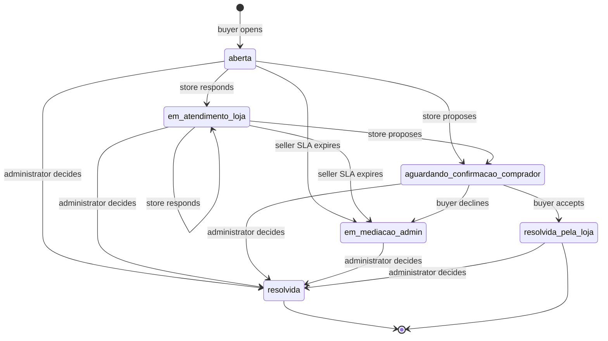
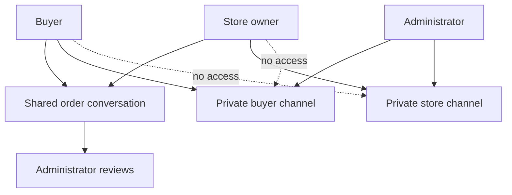

# After-Sales Disputes and Mediation

After-sales handling has three deliberately distinct paths:

- **Buyer–seller chat** is the ordinary shared `conversas` / `mensagens` thread. Its creation is available only after a qualifying paid order, but it is not a dispute.
- **A dispute** is a buyer-opened, item-level `disputas` case linked to an order, line item, buyer, store, and order-specific conversation. It adds eligibility rules, evidence, deadlines, and controlled status changes.
- **Mediation** is private administrator communication after escalation, implemented separately so that buyer and seller cannot see one another’s messages or attachments.

This page covers the dispute workflow. For the underlying order/delivery states, see [checkout, payment, and order lifecycle](/openwiki/workflows/checkout-payment-and-order-lifecycle.md); for broader database security conventions, see [data access, security, and schema evolution](/openwiki/architecture/data-access-security-and-schema-evolution.md).

## Actors, entrypoints, and ownership

| Actor | Entry point | Authority |
| --- | --- | --- |
| Buyer | `/pedido/[id]` and `/pedido/[id]/disputa/nova` | Opens a case, accepts a store proposal, or escalates; sees their own mediation channel. |
| Store owner | `/seller/disputas` and `/seller/disputas/[id]` | Reviews opening evidence and shared history, then proposes a resolution; sees only the store mediation channel. |
| Administrator | `/admin/disputas` and `/admin/disputas/[id]` | Reviews all cases and shared history, communicates privately with each side, and records the final decision. |
| Support AI | General support conversation | Advises and may prefill a buyer URL; it never creates a dispute or uploads evidence. |

Ordinary chat is a separate creation-gated feature. `iniciarConversa` calls the `comprador_tem_pedido_pago` RPC after checking store ownership and optional product/store membership. The RPC requires the authenticated buyer to have a `Pagamento Realizado` order for that store and, when supplied, product. This check controls creating a new chat only; existing-conversation and message access remain governed by their own RLS policies.

## Opening: authoritative buyer submission

The buyer order page offers **“Trocar ou pedir ajuda”** only for an item in the paid pipeline (`Pagamento Realizado`, `Em Separação`, or `Enviado`) with `entregue_em` and an unexpired opening window. The opening form rechecks that the buyer-visible item belongs to the URL order. `abrirDisputa` independently re-reads that item, confirms the submitted order ID matches it, requires a linked product, and derives the store from the product. Hidden form values therefore do not authorize another buyer’s item.

Opening rules are applied server-side:

- The window ends seven days after confirmed delivery, shortened to 24 hours for a perishable item. The action enforces the window only when `entregue_em` exists; the order page is the layer that requires delivery before presenting the link.
- `produto_estragado_ou_vencido` is valid only for perishable items. The other reason values are constrained by the database schema.
- Perishable and future-sale (`venda_futura_id`) items require at least one submitted opening photo. The form visibly requires a photo only for perishables, so future-sale enforcement is server-side.
- A future-sale decision may be only `reembolso_parcial` or `negada`; `troca` and `reembolso_total` are rejected. A partial refund must be positive and no greater than the disputed item value.

The opening action accepts at most five files. Each candidate undergoes the shared server-side size, declared-MIME, and magic-byte validation before upload: normal opening evidence accepts JPEG, PNG, and WEBP up to 5 MB. Invalid files and storage upload failures are skipped, rather than rolling back the case. Consequently, the “photo required” test counts submitted files before content validation; callers needing a guarantee of persisted valid evidence must not assume that a nonempty submission necessarily produced an evidence object.

After inserting the case, successful opening evidence is uploaded to the private `disputas` bucket under:

```text
{disputa_id}/{uuid}.{sanitized-extension}
```

Only this storage path is recorded in `disputa_fotos.url`; it is not a public URL. Participant/admin RLS controls the opening-evidence records and bucket objects. Pages request a 600-second signed URL at render time for an authorized viewer, and omit the image if signing fails.

On success, the action creates or reuses the order-linked conversation, inserts status `aberta`, and sets `sla_loja_vence_em` to 48 hours from opening. The database allows only one active dispute per `linha_item_id`: the partial unique index ceases to occupy the slot only at `resolvida_pela_loja` or `resolvida`.

## Lifecycle and deadlines



The durable, role-guarded dispute lifecycle. The seller UI exposes proposal rather than every database-permitted seller transition.

RLS identifies buyers, owning store owners, and administrators, but the `guard_campos_restritos()` trigger supplies the critical transition guard against direct updates:

- A store owner can move `aberta` or `em_atendimento_loja` only to `em_atendimento_loja` or `aguardando_confirmacao_comprador`. A proposal is not unilateral closure.
- A buyer can move `aberta` or `em_atendimento_loja` to `em_mediacao_admin` only after the 48-hour store SLA. From `aguardando_confirmacao_comprador`, the buyer may accept to `resolvida_pela_loja` or decline to mediation immediately.
- The three-day value derived from `proposta_resolucao_em` is a reminder calculation, not a database deadline. Buyer acceptance or rejection is never automatically timed out.
- Only an administrator can set `resolvida` or mutate final decision/audit fields. An admin may decide an unresolved case, including one not yet escalated.

A final decision is `reembolso_total`, `reembolso_parcial`, `troca`, or `negada` and requires a nonblank justification. `decidirDisputa` rereads the item to apply refund-value and future-sale restrictions, writes `decidida_por` and timestamps, and rejects an already-final case. It records the outcome only: no payment, refund, reversal, or exchange is automatically executed.

The administrative SLA is 24 hours after `escalada_em`. It is display-only: admin pages mark an `em_mediacao_admin` case overdue, but it neither blocks work nor creates an automatic outcome.

## Shared history, private mediation, and evidence isolation

The initial dispute conversation is an ordinary buyer–store conversation distinguished by `pedido_id`; administrators can review its shared message history. Private mediation cannot reuse that schema because it would expose both participants. `disputa_mensagens_mediacao` instead stores a `destinatario` channel of `comprador` or `loja`.



The shared thread is visible to buyer and store, while recipient-scoped mediation threads isolate each side’s communication with the administrator.

Mediation table RLS lets a buyer read/insert only `comprador` rows for their dispute, a store owner only `loja` rows for their store’s dispute, and an administrator access both. Messages must contain 1–4,000 trimmed characters. These table policies—and the corresponding buyer/store server actions—do **not** test that the dispute is in `em_mediacao_admin`; pages only display the channels once the case is mediated or resolved. This UI convention is not a database lifecycle gate.

Mediation photos use the same private bucket, but a recipient-scoped prefix:

```text
mediacao/{disputaId}/{destinatario}/{uuid}.{sanitized-extension}
```

`uploadFotoMediacao` validates a maximum 5 MB size, JPEG/PNG/WEBP/GIF declared MIME, and image magic bytes before upload. Bucket configuration provides the same non-bypassable size/MIME limit, while storage RLS parses this prefix and applies the same recipient-channel isolation as the message table. Stored paths become `foto_url`; authorized pages produce 600-second signed URLs while rendering. The opening-evidence storage policies explicitly exclude `mediacao` and use safe text-to-UUID conversion, avoiding a prefix-induced policy cast error.

## Notifications and AI handoff

The case mutation happens before its notification work. Opening sends store email when available and then attempts WhatsApp; seller proposal and final decision use WhatsApp. WhatsApp failures are caught and reported to Sentry, so they do not reverse persisted work. Opening email and escalation emails are awaited without local failure handling, so an email failure can fail the request after persistence. Escalation notifies the store and fans out to administrator auth emails through the service client; fan-out is skipped when the service client is unavailable.

The general support prompt instructs the AI to look up `buscar_disputas_pos_venda` and `buscar_pedido` together for a known order. It reports an existing active case rather than recreating it. Otherwise it gathers a valid reason and description, then offers a prefilled URL of this form:

```text
https://industria24.com.br/pedido/{pedido_id_interno}/disputa/nova?item={item_id}&motivo={motivo}&descricao={descrição codificada para URL}
```

The internal `pedido_id_interno`, not the buyer-facing `id_venda`, is required. The opening page accepts a suggested reason only if it is valid for the item’s perishability. The buyer still reviews and submits the form; server validation and buyer evidence upload are the authoritative formal creation path. Separately, the store-chat bot can explain current return guidance and explicitly does not open a return/dispute or promise a refund or exchange.

## Verification and safe changes

`src/lib/disputas.test.ts` covers pure deadline, evidence, reason, partial-refund, and suggested-reason helpers. `src/lib/validacao-imagem.test.ts` verifies size/MIME checks and rejects files whose claimed image MIME disagrees with their magic bytes.

The SQL end-to-end tests run in `begin`/`rollback` transactions as the `authenticated` role with JWT claims, exercising RLS instead of a bypass role:

- `e2e_disputas_transicao_status.sql` tests SLA-based escalation and rejects seller reversal, unilateral closure, and reopening.
- `e2e_disputas_mediacao_workflow.sql` tests seller proposal, buyer acceptance and immediate rejection, and text-channel isolation.
- `e2e_disputa_mediacao_foto.sql` tests recipient-scoped mediation storage insert/read isolation without retaining fixtures.

When changing this workflow, update pure helper rules, server actions, schema constraints/RLS/trigger transition guards, bucket configuration, and focused tests together. Do not represent bot guidance as formal submission, add a UI transition without a matching database guard, or expose storage paths as public evidence URLs. See [verification strategy](/openwiki/testing/verification-strategy.md) for the wider testing approach.
