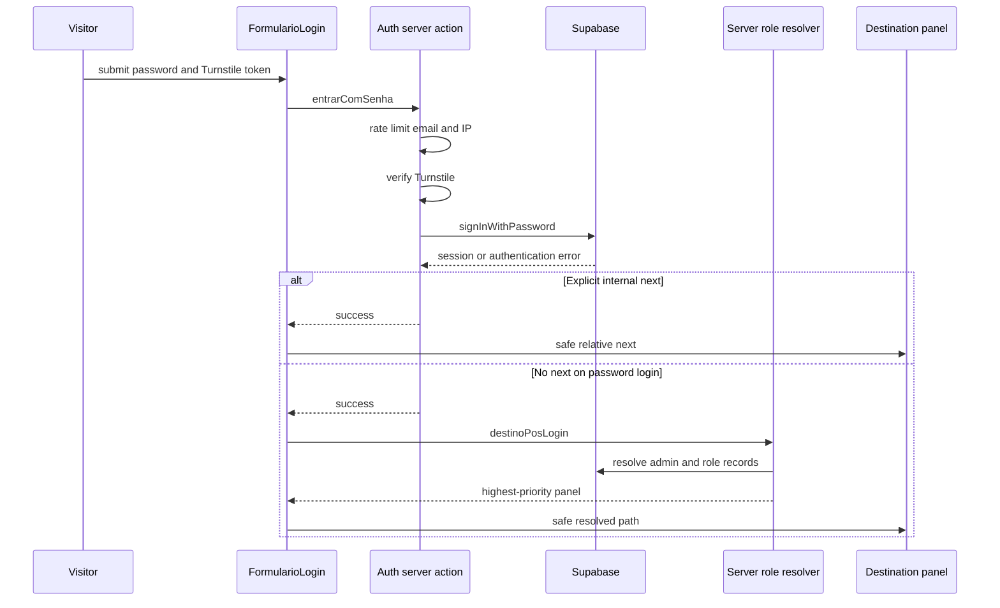

# Authentication, Account Lifecycle, and Role Onboarding

The marketplace has one Supabase identity per person, not separate buyer, seller, affiliate, logistics-partner, and administrator accounts. Public registration creates that generic identity; records such as `lojas`, `afiliacoes`, `parceiros_logisticos`, and `admins` add capabilities over time. The login page and header modal share one form, but the methods shown and the post-login destination depend on the requested destination.

This page describes the current application flow. **Panel selection is navigation behavior, not database authorization.** A route layout can improve the experience by redirecting or withholding its shell, but RLS, database guards, and independently checked server actions remain the authority for data and sensitive mutations. See [Data Access, Security, and Schema Evolution](/openwiki/architecture/data-access-security-and-schema-evolution.md) for those durable controls and [Marketplace Catalog, Roles, and Moderation](/openwiki/concepts/marketplace-catalog-and-roles.md) for role data and moderation.

## Login and post-login routing

`FormularioLogin` is used by both `/login` and the header modal. Password login calls a server action rather than calling Supabase directly from the browser. That action normalizes the email, applies rate limits by email and forwarded IP, requires a valid Cloudflare Turnstile token, then calls `signInWithPassword`. Invalid credentials deliberately receive the same generic message, while rate limiting is reported to Sentry.

This shows the inspected password-login path. The destination is still subject to each panel's session and role gates and to database authorization.

### Redirect safety and destination precedence

Every navigation target passed through `safeNext` must be a relative path beginning with exactly one slash. Absolute URLs, `//host`, and backslash-based variants such as `/\\host` fall back instead; this prevents an authentication open redirect.

When password login has an explicit `next`, the client navigates to that safe internal path. It does **not** replace it with a preferred panel. Without `next`, `destinoPosLogin()` invokes the server-only resolver, which uses session-aware reads to test role records and delegates precedence to the pure `destinoPorPapel()` function:

1. `/admin` for an `admins` row;
2. `/seller` for an owned store;
3. `/afiliado` for an affiliation row;
4. `/parceiro` for a logistics-partner row;
5. `/` for an account with none of those records.

This ordering allows one identity to hold multiple roles without a client-side `admins` lookup. It is deliberately a route-choice rule only: for example, an explicit `/admin` `next` does not make a non-admin an administrator.

### Google OAuth is buyer-destination-only in the current UI

Google uses `signInWithOAuth`, returning to `/auth/callback?next=...`; that route exchanges the authorization code for a cookie session and redirects to a safe `next`, or sends an absent/failed/expired code to `/login?erro=link_invalido`.

The form hides the Google button whenever the sanitized requested destination is `/seller`, `/admin`, `/afiliado`, `/parceiro`, or a descendant. Its fallback destination while deciding that visibility is `/seller`, so a login rendered with no `next` also hides Google. Therefore Google is currently offered only when an explicit buyer-facing destination is supplied, despite the shared login form serving all account types. The OAuth callback itself falls back to `/seller` when its `next` is absent; unlike password login, it does not call the server role resolver. Provider-start errors remain in the form as an actionable message.

Google account merging is controlled by Supabase Auth rather than application role code. Treat provider enablement and the Google redirect URI as deployment configuration; an invalid provider configuration cannot be repaired by this route.

## Account creation and email lifecycle

There are two public entry points with distinct intent but one shared `FormularioCadastro` and one generic account model:

| Intent | Entry point | Confirmation target | What it does not create |
| --- | --- | --- | --- |
| Buy | `/cadastro` | `/` | A store, affiliation, partner record, or admin grant |
| Sell | `/seller/cadastro` | `/seller/minha-loja` | The store itself; it is a follow-on step |

The browser validates matching passwords and an eight-character minimum before sending a registration request. `criarConta` repeats the email/password checks, verifies Turnstile using the request IP, and invokes the server-only Supabase Admin API `generateLink` with `type: "signup"`. It then sends the supplied action link through the application's email sender. The account is created unconfirmed and the UI waits at “Confirm your email”; a duplicate email gets a specific recovery-oriented error, while a Supabase `weak_password` response gets separate guidance.

The confirmation action link returns through `/auth/confirm`, which accepts either a `token_hash` plus OTP type or a PKCE `code`. It verifies/exchanges the token into the cookie session, validates its `next`, and redirects; invalid or exhausted links go to the login page with `erro=link_invalido`. The code fallback matters when email templates use a hosted Supabase confirmation URL under PKCE rather than the custom token-hash form.

### Password recovery and logout

“Forgot password” requires a nonempty email in the shared login form. `solicitarRecuperacaoSenha` uses the service-role Admin API to generate a `recovery` link, constructs a token-hash link directly to `/auth/confirm?next=/definir-senha`, and delivers it through the branded email sender. It always returns control without exposing a missing-address failure, preventing email enumeration; failures to generate or send are captured in Sentry. A verified recovery session reaches `/definir-senha`, whose browser client calls `auth.updateUser({ password })` after confirmation matching. The page currently returns to `/seller` after a successful password update.

The common `sair` server action calls `auth.signOut()` and redirects to `/login`.

## From generic account to an operating role

### Seller and store moderation

A signed-in owner saves store details through `salvarLoja`. It rejects an absent name and a negative minimum order value, derives `owner_id` from the session rather than the form, and requires `owner_id = user.id` on updates. An update that affects no owned row is an error rather than a false success.

On creation, the action explicitly writes `situacao: "EmAnalise"` as well as the owner. Migration `0152` also makes that the database default, permits `Ativa`, `Inativa`, and `EmAnalise`, and adds an insert trigger that rejects a non-admin authenticated store created in any other state. Existing stores are not rewritten. A new store therefore remains out of the public marketplace until administrator moderation makes it `Ativa`; the admin shell counts `EmAnalise` records for its queue. Store save and later edits revalidate the store page and schedule advisory curation with `after()`, so curation does not block the seller response or decide publication.

There is an important current routing constraint: `/seller/**` requires both a session and an owned store. The public seller registration page advertises `/seller/minha-loja` after confirmation, but that destination is under the seller layout; the layout redirects an authenticated account with no owned store to `/login?next=/seller&erro=sem_loja`. Any change to seller onboarding should reconcile this gate with the advertised first-store path, rather than weakening the ownership check globally. An owned store in `EmAnalise` does satisfy the layout's ownership check and can access the panel, subject to seller terms acceptance.

### Affiliate and logistics partner entry

Neither affiliate nor logistics partner has a separate identity-registration form. An existing account can request affiliation at `/afiliado/solicitar`; the UI excludes the caller's own stores and requires a terms checkbox. The server action derives the store and commission from the chosen product rather than trusting posted values, creates a `Pendente` affiliation, and records the accepted terms version. Affiliate layouts render a login-needed state when there is no session and gate logged-in content behind pending affiliate terms.

A signed-in account can open `/parceiro/cadastro` because the `/parceiro/**` layout gates only the session. The partner registration action upserts one record per `user_id`, requires name, a valid driver/carrier type, and first-time acceptance of logistics terms, retaining the original acceptance on later edits. The main partner page shows an onboarding invitation when no record exists and a pending-status message until the record is `Aprovado`; it queries rides only after approval. This separation lets onboarding live inside the protected partner shell without granting ride access to an unapproved record.

### Administrator access is never self-service

There is no public route that creates an `admins` row. Administrator access is granted outside this product flow by insertion into `admins`. The `/admin/**` layout first requires a session and then `isAdmin()`; absent sessions go to `/login?next=/admin`, while an authenticated non-admin receives `/login?next=/admin&erro=sem_acesso_admin`. The application has additional `super_admin` and named-role helpers for selected actions, but database `is_admin()` remains a flat administrator boundary for RLS; do not infer database privilege differentiation from a navigation or application-role label.

## Session failure behavior and panel gates

`getUser()` catches failures from `supabase.auth.getUser()`, including an invalid refresh token, reports the exception to Sentry with `area: auth` and `step: getUser`, and returns `null`. This turns corrupt-session behavior into the existing logged-out route/state instead of a generic Next error boundary.

| Surface | Current application gate when session or role is missing |
| --- | --- |
| `/admin/**` | Login redirect; authenticated non-admin gets a login redirect with `sem_acesso_admin`. |
| `/seller/**` | Login redirect; authenticated account without an owned store gets `sem_loja`; pending seller terms show a terms gate. |
| `/afiliado/**` | Shell renders a “login required” state when logged out; pending terms gate logged-in content. |
| `/parceiro/**` | Login redirect; registration/approval state is handled by the page, not layout. |

These are presentation and navigation controls. Preserve explicit owner predicates and database authorization beneath them, particularly because public store reads can otherwise make an unqualified one-row store query select another seller's active store.

## Operations, extension points, and focused checks

- Authentication depends on Supabase server/client cookie handling, a server-only service client for account-link generation, Resend-backed application email, Cloudflare Turnstile verification, and Sentry reporting. Keep service-role imports server-only.
- Changing login limits, recovery delivery, or the Google callback requires preserving generic credential and recovery feedback where it prevents account enumeration, plus `safeNext` at every redirect boundary.
- Add a role by extending the server resolver and the pure precedence function together, deciding its precedence and its actual database authorization separately. Do not reintroduce a browser `admins` query.
- Preserve all three seller-publication layers: action payload, database default/insert trigger, and administrator moderation/public-store projection. See [Marketplace Catalog, Roles, and Moderation](/openwiki/concepts/marketplace-catalog-and-roles.md).
- `src/lib/auth-destino.test.ts` is the focused fast test for all role-precedence edges. Add equivalent browser/integration checks for password and Google redirects, invalid/expired confirmation and recovery links, corrupt cookies at each panel gate, and registration-to-first-store routing. Database-backed store moderation requires a linked-database proof, not only a component or Vitest test; see [Verification Strategy](/openwiki/testing/verification-strategy.md).

## Related pages

- [System map](/openwiki/architecture/system-map.md)
- [Data Access, Security, and Schema Evolution](/openwiki/architecture/data-access-security-and-schema-evolution.md)
- [Marketplace Catalog, Roles, and Moderation](/openwiki/concepts/marketplace-catalog-and-roles.md)
- [External Services and Webhooks](/openwiki/integrations/external-services-and-webhooks.md)
- [Repository Quickstart and Change Routing](/openwiki/quickstart.md)
- [Verification Strategy](/openwiki/testing/verification-strategy.md)
