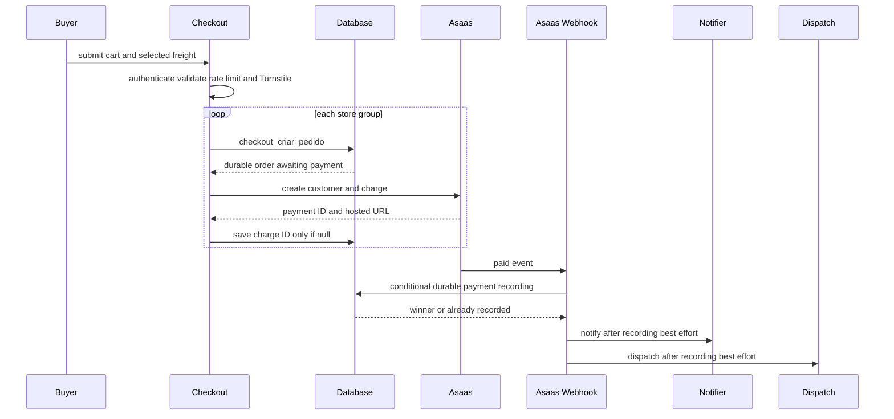
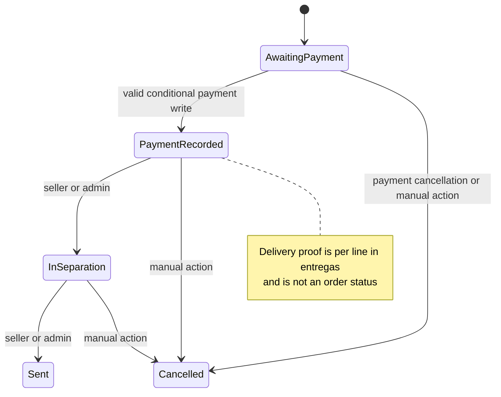

# Checkout, Payment, and Order Lifecycle

Checkout separates browser convenience from durable commercial facts. A cart can contain products from multiple stores, but `finalizarCompra` partitions it by `loja_id` and creates one `pedidos` record per store. Those creations are independent: if a later group fails, orders already created for earlier groups remain visible and are not rolled back.

The database owns the order amount, stock, freight, line allocation, and status transition; the browser supplies a request and selected provider IDs, not money values. Asaas is the charge and transfer boundary. Payment recording is a durable, idempotent transition, whereas buyer/seller notification and delivery dispatch happen afterwards and are explicitly best-effort.

See [Data Access, Security, and Schema Evolution](../architecture/data-access-security-and-schema-evolution.md) for RLS and privileged access, [External Services and Webhooks](../integrations/external-services-and-webhooks.md) for provider boundaries, and [Fulfillment and Logistics](fulfillment-and-logistics.md) for routing and delivery actors.

## Checkout boundary and order transaction

`CarrinhoProvider` persists the client cart in `localStorage` and best-effort mirrors it for signed-in users. It supports items from multiple stores. The checkout server action authenticates the buyer, allows five submission attempts per user per minute, verifies Turnstile using the forwarded IP, parses the cart and freight-selection payloads, and only permits `PIX`, `BOLETO`, or `CREDIT_CARD`. It repeats meaningful eligibility checks: Mercado Futuro items require the required business profile and acceptance, and perishable products require their separate acceptance.

For each store group, `finalizarCompra` calls `checkout_criar_pedido`. This `SECURITY DEFINER` RPC is the authoritative transaction. It requires an authenticated user, rejects empty/duplicate items and invalid billing types, locks product rows, requires approved products from an active single store, validates minimum quantities and store minimums, computes prices, and decrements ordinary or future-sale stock. It creates the order as `Aguardando Pagamento`, creates its `linha_itens`, and derives platform and approved-affiliate allocations from server data.

Contact registration and consent stamps occur after an order exists and are best-effort. Consequently, they must not be used as a reason to reverse a successfully created order.

### Freight is revalidated, not accepted from the quote UI

The freight quote endpoint requires an authenticated, rate-limited buyer. It first asks `cotar_frete_tabela` for an imported carrier-table match using store, destination ZIP code, and currently supplied cart weight. If none applies, it uses internal percentage coverage; only then does it request and persist an Uber Direct quote, when the provider and service client are configured. A quote response contains a carrier or quote identity for selection, but it is never the final financial authority.

At order creation, the RPC verifies that the selected carrier is active and belongs to the resolved store or is global. For a `tabela_importada` carrier it repeats `cotar_frete_tabela` on the server and fails with a carrier-table coverage error if no row matches; it does not fall through to `faixas_cep`. For Uber Direct it requires a store-owned, unexpired persisted quote. Internal freight rechecks coverage and calculates the percentage from the final item total. Pickup is accepted only when the store permits it.

The current imported-table path uses `0` as the weight placeholder because reliable product weight is incomplete. Any future introduction of real cart weight must update the quote endpoint and `checkout_criar_pedido` consistently; it must still recompute rather than trust a client-provided price.

Freight is stored per line as well as in the order total. The RPC rounds each non-final allocation to cents and assigns the final line `total freight − freight already allocated`. This remainder rule guarantees that `sum(linha_itens.valor_frete)` exactly equals the order freight for percentage, imported-table, and Uber Direct paths.

> **Invariant:** Client item prices, stock, freight amounts, affiliate values, and order totals are untrusted. The order RPC re-derives them under database locks; privileged code alone writes payment and charge fields.

## Charge creation is recoverable

After durable order creation, the action attempts to create an Asaas customer and charge only when Asaas and the Supabase service client are configured. A PSP timeout or error does not undo the order or restore stock; the buyer can use the ownership-checked `gerarCobranca` retry action, which is limited to one attempt per order per 15 seconds.

`criarCobrancaPedido` reads the authoritative `valor_pedido` and billing type and sends the order UUID as Asaas `externalReference`. It caches `customer_id` by user in `asaas_clientes`; an `invalid_customer` response retries customer creation once, which accommodates a rotated Asaas account/key. The client times out provider requests after 12 seconds. Charges have a three-day due date. PIX uses the provider QR endpoint, while card and boleto use hosted `invoiceUrl`, so card data does not transit the application.

Concurrent generation is handled as a two-stage compensation pattern: after creating a provider charge, the service client updates `asaas_cobranca_id` only if it is still null. The losing request cancels its newly created charge and sends cleanup failure telemetry to Sentry. This prevents duplicate *stored* live charges, while retaining an operational signal for a possible gateway ghost charge.

Customer CPF/CNPJ persistence is encrypted at rest. The `asaas_clientes` trigger encrypts a nonempty plaintext input with `pgp_sym_encrypt` using a Vault secret, writes `cpf_cnpj_enc`, and clears the plaintext column. The key lookup and on-demand decryption functions are `SECURITY DEFINER` and executable only by `service_role`; the Vault secret itself is not versioned.

This flow separates the transactional order/payment writes from provider calls and post-payment side effects.

## Payment recording, idempotency, and cancellation

`POST /api/asaas/webhook` checks `asaas-access-token` against `ASAAS_WEBHOOK_TOKEN` with a constant-time comparison and requires the service client. It delegates paid events (`PAYMENT_RECEIVED`, `PAYMENT_CONFIRMED`) to `confirmarPagamentoPedido`; malformed, incomplete, unsupported, mismatched, or underpaid events receive an ignored success response where appropriate, avoiding provider retry loops.

The confirmation core uses `pedidos.dt_pagamento` as the durable idempotency fact. If it is already non-null, it returns successful `ja_estava_pago` without rechecking a stale event or repeating line marking, notification, or dispatch—even if the order has since progressed beyond the former fixed status list. Before the first recording, it still requires exact equality between `payment.id` and `asaas_cobranca_id` and requires `payment.value >= valor_pedido`.

The first write conditionally updates the order only where `dt_pagamento is null`, recording `Pagamento Realizado`, the payment date, and received amount. Only the request that affected a row marks all line items paid and starts side effects. A concurrent webhook or buyer verification that loses the conditional update reports already paid. This closes the race between pre-read and write without treating notification or routing as part of the payment transaction.

The buyer fallback `verificarPagamento` is ownership-checked through `pedidos_cliente`, rate-limited to one check per order every 15 seconds, and queries Asaas directly. It passes only `RECEIVED` or `CONFIRMED` charges into the same confirmation core.

Cancellation events (`PAYMENT_OVERDUE`, `PAYMENT_DELETED`, `PAYMENT_CANCELED`, and `PAYMENT_REFUNDED`) call the service-role-only `pedido_cancelar_devolver_estoque` RPC. It cancels only an order still awaiting payment and restores grouped stock. Manual seller/admin cancellation requires a reason, is forbidden for `Enviado` and already-cancelled orders, restores stock, clears unpaid/untransferred line payment flags, and changes pending payout rows to `estornado`. Neither internal cancellation path initiates an Asaas refund.

## Fulfillment state and best-effort work

The verified order-status vocabulary is `Aguardando Pagamento`, `Pagamento Realizado`, `Em Separação`, `Enviado`, and `Cancelado`. An authorized seller or admin can use `pedido_avancar_status` only for the adjacent paid-to-separation-to-sent transition; the RPC audits the change. Delivery is not another order status: it is represented as `Entregue` in `entregas` per line.

This diagram shows durable order status; delivery proof is a separate per-line lifecycle.

After the winning payment write, the application attempts buyer WhatsApp containing the pickup/delivery code, seller paid-order WhatsApp without that code, buyer email, and delivery routing. Failures are captured or logged and leave the paid order intact. For internal delivery, routing may publish an automatic run and give an eligible store logistics affiliate a five-minute exclusive period. If an internal run is absent, Uber Direct can be used when addresses are complete; an explicit Uber Direct checkout selection bypasses internal-run creation. Routing failure requires operational recovery, not payment reversal.

An authenticated store owner or eligible assigned logistics actor can confirm delivery with the buyer code. A public carrier path provides a corresponding constrained route. Correct confirmation writes every order line's `entregas` row; repeated success does not redo delivery work. Wrong codes increment an attempt counter and are limited for logistics/public callers, while the store owner is exempt in the authenticated RPC.

## Delivery-gated payouts and manual reconciliation

Delivery confirmation recalculates seller and affiliate `repasses` ledger rows. The application then examines `pendente` rows, checks the destination's eligible PIX key, and transfers through Asaas `POST /transfers` with the ledger row ID as `externalReference`. This is a marketplace-account PIX transfer, not an Asaas payment-time split.

Before the transfer call, `transferirRepasse` atomically claims the individual ledger row with `status = 'processando' where status = 'pendente'`. Only the caller that changed a row may call Asaas. On success it changes the row to `transferido`, timestamps it, and marks seller order lines transferred. Missing eligibility or a missing key becomes `inelegivel`; a caught transfer error becomes `falhou` with Sentry telemetry. These outcomes do not reverse the completed delivery.

`processando` is intentionally neither a retryable pending row nor a completed transfer. It means a worker claimed the row and the PIX transfer is in flight, or the process failed after claiming it and before persisting a result. A later automatic invocation does not select it again, preventing duplicate payout. The admin `/admin/repasses` page exposes it as a distinct filter/status; operators must reconcile it against Asaas using the row ID/external reference, then decide whether to mark it transferred or reprocess only after establishing that no transfer occurred.

## Operations and verification

- `ASAAS_API_KEY` enables charge and transfer requests. `ASAAS_ENV=production` chooses `https://api.asaas.com/v3`; other values select sandbox. Configure the provider webhook at `/api/asaas/webhook` with `ASAAS_WEBHOOK_TOKEN`.
- Service-role Supabase access is required for charge persistence, webhook confirmation, stored external freight quotes, and payout execution. It must never reach the browser.
- The `cpf_cnpj_encryption_key` Vault secret must exist before applying migration `0149_cifrar_cpf_cnpj_asaas_clientes.sql`; migration application aborts early if it is absent.
- `RESEND_API_KEY` and WhatsApp provider configuration affect notification delivery, not validity of payment recording. Uber Direct is optional; without configuration or viable coverage, it is not offered.

Run `npm test` for focused schema/payment-method, freight selection/rounding, constant-time token, and status-email tests. In a Supabase-backed environment, additionally exercise: competing stock checkout; manipulated imported-table freight; line allocations with fractional-cent remainders; concurrent webhook/manual payment confirmation; repeated callbacks after later order progression; canceled-before-versus-after-sent orders; expired Uber quotes; and concurrent payout execution, including a process crash after the `processando` claim. Verify Vault-secret setup and that `asaas_clientes.cpf_cnpj` is cleared after writes.
