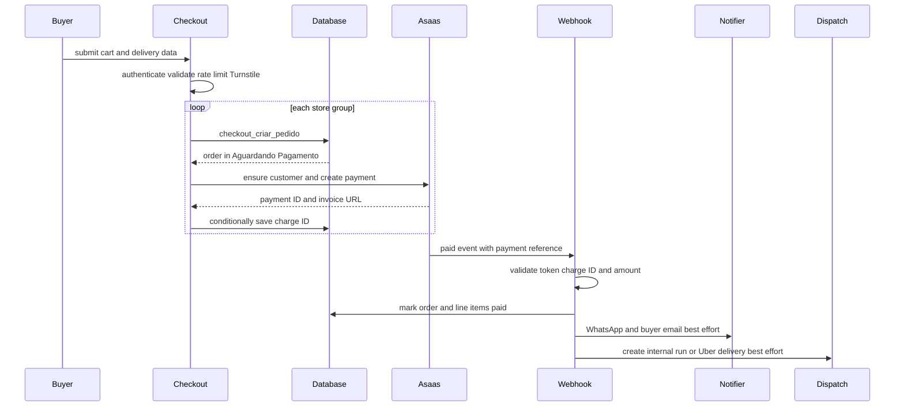
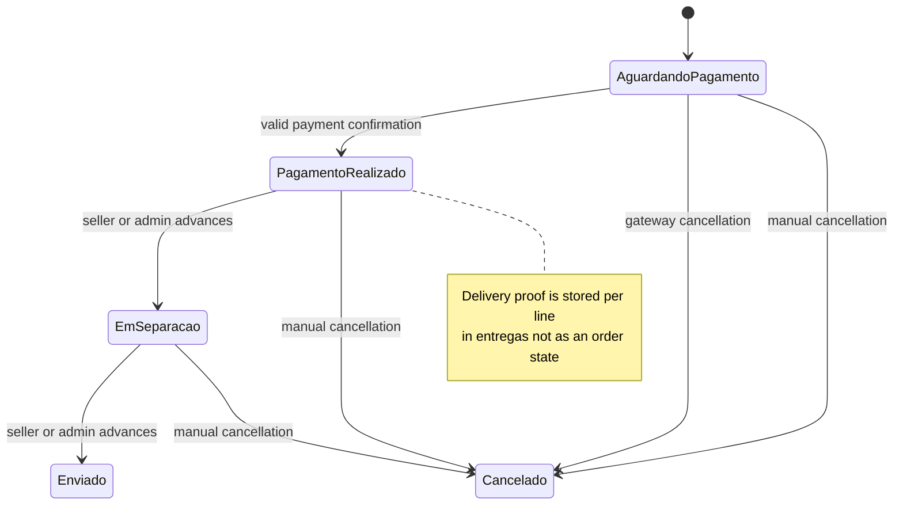

# Checkout, Payments, and Order Lifecycle

Checkout is deliberately split between a convenience-oriented browser cart and database-owned commercial truth. The cart may contain products from several stores, but submission partitions it by `loja_id`; each partition creates an independent `pedidos` record, payment charge, freight choice, and tracking experience. A failure creating a later store's order does **not** roll back orders already created for earlier stores.

The main boundaries are:

- **Client:** `CarrinhoProvider` persists a local cart and, for signed-in users, debounces a best-effort abandoned-cart mirror. The checkout UI collects delivery, identity, terms, freight selection, payment method, and a Turnstile token. Its totals and freight presentation are estimates or quotes, not authority.
- **Checkout server action:** `finalizarCompra` authenticates the buyer, rate-limits checkout attempts, verifies Turnstile, validates the submitted shape, groups items by store, and invokes the database RPC once per group. It owns the follow-up creation of an Asaas customer and charge, which is intentionally best-effort after order creation.
- **Database RPC:** `checkout_criar_pedido` is the transaction boundary for product eligibility, quantities, stock locks/decrements, authoritative price and freight calculation, order and line-item creation, and attribution values. Its `SECURITY DEFINER` implementation is the defense against manipulated browser cart values.
- **Payment integration:** the server-only Asaas client creates hosted PIX, boleto, or card charges. The payment's `externalReference` is the UUID order ID. The webhook is the normal confirmation channel; the buyer can manually query a charge as a rate-limited fallback.
- **Post-payment fulfillment:** payment confirmation marks the order and all lines paid, attempts buyer/seller WhatsApp and buyer email notifications, then starts delivery dispatch as a best-effort side effect. Sellers/admins own the linear order-status progression; delivery completion itself is recorded per line in `entregas`.

See [Data Access, Security, and Schema Evolution](../architecture/data-access-security-and-schema-evolution.md) for the broader RLS/service-role model, [Fulfillment and Logistics](fulfillment-and-logistics.md) for routing, and [After-sales Disputes](after-sales-disputes.md) for the post-sale exception workflow.

## Cart, delivery, and authoritative order creation

`CarrinhoProvider` is browser-local (`industria24h.carrinho.v1`), using a composite product/reservation key so that separate future-sale reservations for one product remain distinct. Logged-in updates are mirrored to `/api/carrinho/sync` after 1.5 seconds, but network failure is ignored; the cart remains usable. The UI supports several stores and tells the buyer that this produces separate orders.

The checkout page has a review step and a payment step within one form. It gathers either pickup or a delivery address, requests a freight quote independently for each store, and submits only IDs for the chosen carrier/quote rather than trusting a price. The client blocks advancing when a complete delivery address has no available option. It also presents required consent for perishable products and the B2B Mercado Futuro path; server-side checks repeat the meaningful rules.

Before database work, `finalizarCompra` requires an authenticated user, permits five checkout submissions per user per minute, verifies a Turnstile token against the forwarding IP, parses the JSON cart with Zod, and permits only `PIX`, `BOLETO`, or `CREDIT_CARD`. If an order includes a future-sale reservation, it first saves the buyer's required legal profile and requires the Mercado Futuro acceptance. It independently reads product perishability and requires the perishable-goods acceptance. Contact-number registration and the consent stamps occur only after each order exists and are best-effort, so they do not undo a created order.

### One order per store, one authoritative RPC per order

For each group, the action calls the six-argument `checkout_criar_pedido` overload, carrying the affiliate reference, consolidated-freight choice, and buyer name. The overload chain preserves the delivery JSON through to the three-argument base implementation; carrier and external quote IDs are therefore embedded in that JSON rather than added as more RPC arguments.

The base RPC requires `auth.uid()`, nonempty nonduplicate product IDs, a supported billing type, and a single store. It locks each product row, requires an approved product from an active store, enforces minimum quantity and store order minimum, calculates progressive pricing (or a future-sale reservation price), and checks/decrements current or reserved stock within the transaction. It inserts the order in `Aguardando Pagamento`, materializes delivery and freight fields onto `linha_itens`, and calculates the 5% platform share plus the selected approved affiliate share. The optional `?ref=` cookie is passed so attribution can select the specific approved affiliate rather than relying solely on the latest affiliation.

For ordinary internal freight, delivery coverage and the percent-based amount are resolved against the finalized store and selected carrier; pickup is allowed only when that store permits it. An active Uber Direct carrier instead requires an unexpired persisted quote owned by that store and uses its fee. The checkout quote endpoint first prefers an applicable imported carrier-table quote, then internal coverage, and only calls Uber Direct when neither internal option applies. Uber quotes are persisted server-side before their ID returns to the client, so the final order RPC can reject missing or expired quote IDs.

> **Invariant:** Browser-submitted item values, freight totals, carrier prices, stock availability, affiliate payout amounts, and financial fields are not the source of truth. The RPC re-derives commercial values and the service role alone persists charge identifiers and payment fields.

## Charge creation and buyer recovery

After a successful RPC call, the action clears the signed-in abandoned-cart mirror on a best-effort basis and redirects to the sole order or a multi-order confirmation page. It then tries to create an Asaas charge only when both Asaas and the Supabase service client are configured. No PSP failure reverses the already-reserved order; the order page exposes a retry route.

`criarCobrancaPedido` caches the Asaas customer ID per user in `asaas_clientes`, creating or locating the customer by CPF/CNPJ when absent. The CPF/CNPJ cache is encrypted by a database trigger and its plaintext column is cleared. Charge creation uses the database `valor_pedido`, stored billing type, order ID as `externalReference`, and an Asaas due date three days ahead. Card data never passes through the application: card and boleto use Asaas's hosted `invoiceUrl`; PIX can use Asaas's QR endpoint.

The action avoids duplicate live charges under concurrent submission. It conditionally writes `asaas_cobranca_id` and `link_cobranca` only while the database field is null. If another request won, it attempts to cancel the newly created gateway charge and reports a possible ghost charge to Sentry if that cleanup fails. An `invalid_customer` gateway error causes one customer re-creation attempt, accommodating a stale cached customer from a rotated Asaas account/key. Individual Asaas requests time out after 12 seconds and surface as handled errors.

This is the normal payment-confirmation path; charge creation and post-payment notifications/dispatch are deliberately non-transactional around the durable order/payment update.

## Payment confirmation and cancellation

`POST /api/asaas/webhook` authenticates `asaas-access-token` with a constant-time comparison to `ASAAS_WEBHOOK_TOKEN`; it rejects unauthenticated requests and requests without a configured service role. Malformed payloads are logged to Sentry and events without an event type or `externalReference` receive an ignored success response. Unsupported Asaas event types also return HTTP 200 to avoid blocking the provider queue.

For `PAYMENT_RECEIVED` and `PAYMENT_CONFIRMED`, the webhook loads the referenced order and accepts the event only when both the stored `asaas_cobranca_id` exactly matches `payment.id` and the received amount is at least `valor_pedido`. It writes `Pagamento Realizado`, a payment timestamp, and the received value, then marks all order lines paid. The manual buyer action is a fallback for delayed/misconfigured webhooks: it authorizes ownership through `pedidos_cliente`, rate-limits to one check per order every 15 seconds, queries Asaas, and accepts only `RECEIVED` or `CONFIRMED` charge statuses before calling the shared confirmation core. That core treats `Pagamento Realizado`, `Em Separação`, and `Enviado` as already-paid, preventing duplicate confirmation effects when manual verification and webhook race.

The webhook maps `PAYMENT_OVERDUE`, `PAYMENT_DELETED`, `PAYMENT_CANCELED`, and `PAYMENT_REFUNDED` to `pedido_cancelar_devolver_estoque`. That service-role-only RPC changes only an order still in `Aguardando Pagamento`; it restores grouped quantities to stock and makes it `Cancelado`. It does not issue a gateway refund.

Buyer/seller WhatsApp and buyer email are attempts after payment persistence, not prerequisites. When contact data and a pickup code exist, the buyer receives the code through Bubblewhats and the seller receives a paid-order notice without the code. Email templates exist for payment, separation, dispatch, and cancellation; the payment and webhook-cancellation paths call the central best-effort mailer. Notification failures are captured or logged without changing the payment result.

## Order status and fulfillment state

The persisted `pedidos.status_pedido` vocabulary is intentionally small. It does **not** include a delivered status: delivery completion is a per-line `entregas.status = Entregue` record. The seller/admin UI may advance only one adjacent post-payment step through `pedido_avancar_status`; the RPC checks the caller is an admin or the order store owner and records an audit event.

This is the verified `status_pedido` lifecycle. A manual seller/admin cancellation requires a nonempty reason and is allowed before `Enviado`, including while awaiting payment. It restores stock, clears unpaid/untransferred line payment flags, marks pending payout ledger entries `estornado`, and audits the action. It intentionally performs internal reversal only; an actual Asaas refund is outside this workflow. Neither cancellation mechanism allows cancellation after `Enviado`.

Payment confirmation also starts logistics without making logistics a payment prerequisite. For non-Uber delivery it asks `despachar_corrida_automatica` to publish a run, potentially giving an approved store-affiliated logistics partner a five-minute exclusive opportunity before general availability. If no internal run exists and the order has complete pickup/destination addresses, the Uber Direct fallback can create an Uber delivery and persist an assigned `rotas` row. When checkout explicitly selected Uber Direct, the webhook skips the internal-run creation and follows the external delivery path. Routing failures go to Sentry and leave the paid order intact.

A paid order can be confirmed delivered by the store owner or an eligible assigned logistics actor using `pedido_confirmar_entrega`, or by an unauthenticated third-party carrier through `pedido_confirmar_entrega_publico`. Both require a matching buyer code and write every line's `entregas` record as `Entregue`; repeated confirmation returns success without duplicate work. Incorrect-code attempts increment the order counter, and logistics actors/public callers are limited to five attempts (the store owner is exempt in the authenticated RPC). The public route also requires a carrier name and writes confirmation or failed-attempt audit events.

## Payout after delivery proof

Delivery proof—not charge creation or payment confirmation—is the payout trigger. The delivery RPC recalculates `repasses` for seller and affiliate destinations. The application then processes pending ledger rows with the service client: it checks the beneficiary's eligible PIX key, calls Asaas `POST /transfers`, marks a successful ledger row `transferido` with a timestamp, and marks order lines transferred after a seller payment. Missing/ineligible PIX credentials produce `inelegivel`; any transfer exception produces `falhou` and Sentry telemetry. A payout failure never rolls back delivery confirmation.

Automatic transfers move funds from the marketplace's Asaas account through a PIX transfer, rather than using an Asaas payment-time split. Seller and affiliate PIX-key changes have a dedicated RPC/confirmation model and eligibility includes a 24-hour waiting period after confirmation, providing an operational safeguard before automatic payout.

## Operations, failure handling, and safe changes

### Required configuration

- `ASAAS_API_KEY` enables charges. `ASAAS_ENV=production` selects `https://api.asaas.com/v3`; any other value selects the sandbox endpoint. Configure the Asaas webhook URL as `/api/asaas/webhook` and use `ASAAS_WEBHOOK_TOKEN` as its authentication token.
- The service-role Supabase client must be configured for charge-field persistence, webhook processing, external freight quote storage, and payouts. Never expose this credential to the browser.
- `RESEND_API_KEY` enables transactional email; without it, the mailer is a no-op. WhatsApp/Bubblewhats failures are also nonfatal by design.
- Uber Direct is optional. Without its configuration or a viable provider quote, the freight endpoint returns no fallback option; it does not manufacture an amount.

### Failure semantics to preserve

1. **Never turn an untrusted UI total into an order total.** Changing cart fields or adding a freight provider must retain database-side validation and repricing.
2. **Treat stores independently.** The loop has no cross-store transaction; improve buyer recovery/visibility rather than adding an assumed rollback.
3. **Keep payment validation before fulfillment.** A payment event must match both charge ID and amount. Do not dispatch, notify as paid, or release payout merely because a callback names an order.
4. **Keep durable transitions ahead of side effects.** Charge creation may fail after ordering; notification, route creation, and payout may fail after their durable state. These failures need Sentry/admin recovery, not reversal of a valid earlier transition.
5. **Preserve idempotency at integration edges.** Retried charges use conditional persistence and cleanup; payment confirmation recognizes already-paid progression states; delivery proof returns an already-confirmed result; pending payout status drives transfer work.

### Focused verification

Run `npm test` for the repository test suite. The focused unit coverage here verifies cart payload schema rejection/acceptance and the closed payment-method set, freight rounding and internal-versus-Uber fallback selection, constant-time webhook-token behavior, and email-content selection for each notification-bearing order status. Database RPCs and gateway/webhook flows are integration boundaries: validate them in a Supabase-backed environment with concurrent stock attempts, a mismatched charge ID/value webhook, repeat payment/delivery callbacks, cancellation before and after `Enviado`, expired Uber quotes, and both eligible and ineligible payout keys.
