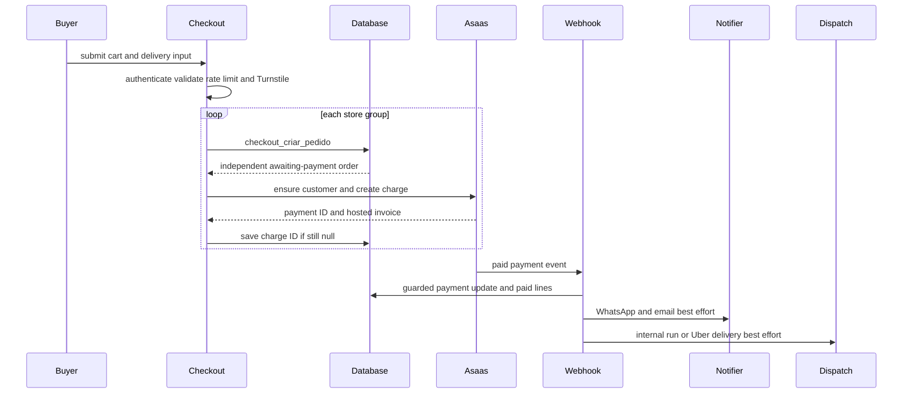
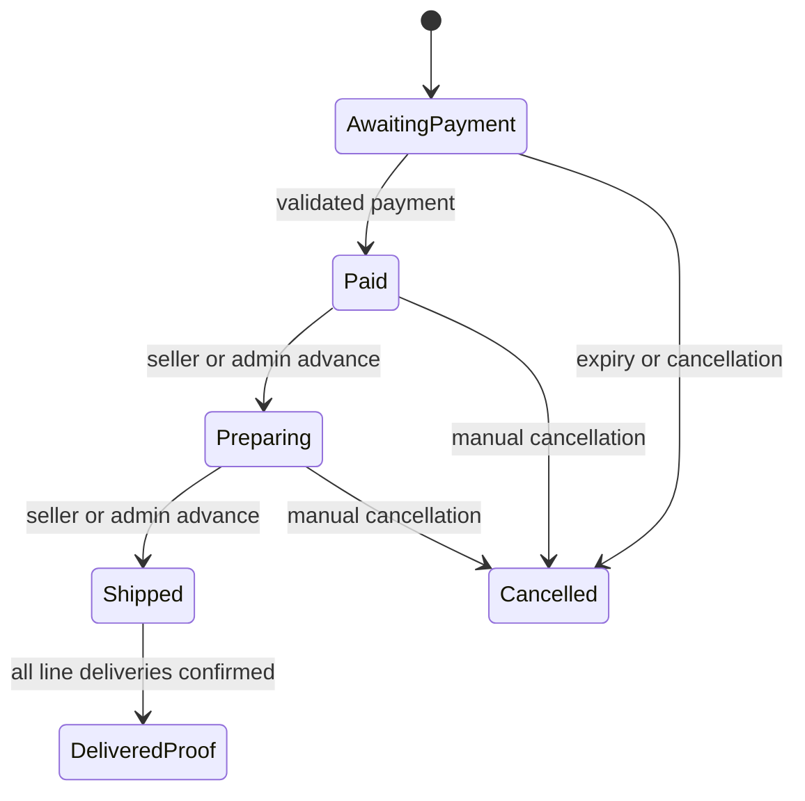

# Checkout, Payment, and Order Lifecycle

Checkout separates browser convenience from commercial authority. A cart can contain items from many stores, but `finalizarCompra` groups it by `loja_id` and calls `checkout_criar_pedido` once for each group. Each successful group is therefore a separate order, stock reservation, payment charge, freight decision, and fulfillment lifecycle. There is **no cross-store transaction or rollback**: if a later group fails, earlier orders remain created and the response reports that partial success.

The browser's displayed totals, cart quantities, selected freight value, coupon effect, and affiliate values are inputs, not facts. The authenticated database RPC locks and re-derives the order's commercial state; service-role code owns charge and payment fields. This division is essential when changing checkout or adding a payment/freight provider.

## Entry points and boundaries

| Boundary | Responsibility |
| --- | --- |
| Cart and checkout page | Collects delivery/pickup, freight selection, payment method, identity and acceptances; serializes only the selected carrier/quote IDs per store. |
| `finalizarCompra` | Authenticates, rate-limits, verifies Turnstile, parses form data, groups cart items, performs per-store RPC calls, and attempts charge creation after each durable order. |
| `checkout_criar_pedido` | The authoritative `SECURITY DEFINER` transaction for order eligibility, product locks, price/freight/coupon calculation, line items, inventory decrement and reservation. |
| Asaas webhook and manual verification | Independently authenticate/authorize their entrance, then converge on `confirmarPagamentoPedido`. |
| Seller actions and delivery RPCs | Advance fulfillment, cancel eligible orders, record delivery proof, and hand off payout work. |

The customer order page reads scoped views (`pedidos_cliente` and `linha_itens_cliente`). It shows a live PIX QR code only for an unpaid PIX charge, otherwise the hosted Asaas invoice URL; absent charge data exposes an owner-only retry form. A customer can talk to the seller only after the order is in a paid fulfillment state. See [Data Access, Security, and Schema Evolution](../architecture/data-access-security-and-schema-evolution.md) for the broader access model.

## Checkout: validation, per-store creation, and reservation

`finalizarCompra` requires a signed-in user, allows five checkout attempts per user per minute, and verifies the Cloudflare Turnstile token using the forwarded client IP. It parses cart and freight JSON with Zod and restricts billing to `PIX`, `BOLETO`, or `CREDIT_CARD`. When Asaas is configured, CPF/CNPJ and name are also required.

Before it loops through stores, the action repeats business gates that cannot be trusted to UI state:

- A cart containing a Mercado Futuro reservation must pass the B2B document and terms gate; the buyer profile is saved before checkout.
- It reads the current products to require the perishable-goods acceptance where applicable.
- It captures affiliate attribution from the `?ref=` cookie, generates one `checkoutRef` for coupon use across the submission, and assembles each store's `entrega` object. A carrier ID, Uber quote ID, coupon code, and checkout reference travel inside that JSON payload.

For every store group, a successful RPC ID is retained before the next group starts. Optional contact registration and terms stamps happen only after that store's order exists and are best effort. At the end, the server-side abandoned-cart mirror is deleted; the redirect passes the stores whose cart entries the client should remove. A failed later store is not an instruction to delete or reverse earlier orders.

### Database commercial authority

The base `checkout_criar_pedido` function requires `auth.uid()`, nonempty nonduplicated product IDs, one store, and an allowed payment type. It locks eligible products from active stores, checks quantity minimums and store order minimum, prices normal items with `preco_faixa` or future-sale items from their reservation, and calculates freight only from current database data. It materializes the result as an `Aguardando Pagamento` order and line items, including delivery fields, platform allocation, approved affiliate allocation, and coupon data.

Freight follows the selected active carrier owned by (or available to) the store. An imported table must cover the destination; ordinary coverage uses a matching CEP band and a percent of the server-calculated item total. Uber Direct needs a persisted, store-owned quote that has not expired, and the RPC uses its stored cent value. Pickup is accepted only if the finalized store permits it. Coupon use is claimed in the database and a shared `checkout_ref` makes one multi-store submission one coupon use; the final order amount is database-calculated after the applicable discount.

### Inventory reservation lifecycle

Creating the order decrements the available stock immediately, but migration 0177 records each decrement in `estoque_reservas` with an owner order, quantity, source (normal or future sale), and a 30-minute expiry. `estoque_atual` continues to mean sellable available quantity; reservation rows explain the stock withheld from that pool.

Reservations make release idempotent. On cancellation, `pedido_restaurar_estoque` restores only `ativa` or `confirmada` reservations to the correct normal/future-sale stock source and marks them `liberada`. Expiry cancels an awaiting-payment order as a whole, releases its coupon use, and can run while another checkout checks the product, rather than relying solely on a cron. A payment transition confirms the reservation and clears expiry. The status trigger consumes it on `Enviado`; migration 0187 additionally consumes it when **all** order lines have delivery proof, including the legacy line flag, because delivery need not advance the order to `Enviado`. An order whose reservation was released cannot be dispatched.

For the broader stock model, see [Inventory Ledger and Reservations](inventory-ledger-and-reservations.md).

## Charging and buyer recovery

Charge creation occurs only after the per-store order is durable and only when both Asaas and the Supabase service client are configured. Thus a gateway outage does not undo stock reservation or order creation; the order page lets its owner retry. `criarCobrancaPedido` caches the buyer's Asaas customer in `asaas_clientes`, creates/recreates it as needed, then reads the authoritative `valor_pedido` and stored billing type. It sends the order UUID as Asaas `externalReference` and uses hosted invoice URLs for boleto/card, keeping card details outside this application.

The charge write is a guarded idempotency boundary: the service client writes `asaas_cobranca_id` and `link_cobranca` only if the ID is still null. If a concurrent request already won, the loser cancels its newly-created gateway payment and emits Sentry telemetry if that cleanup fails. Retry generation is limited to one attempt per order every 15 seconds and verifies that the caller owns the order. An `invalid_customer` error triggers one customer refresh, useful after Asaas credential rotation.

This sequence shows one transaction boundary per store. Charge creation, notifications, and dispatch are deliberately outside the order/payment transaction.

## Payment confirmation, idempotency, and cancellation

`POST /api/asaas/webhook` validates `asaas-access-token` with a constant-time comparison to `ASAAS_WEBHOOK_TOKEN` and requires the service role. It logs malformed JSON; malformed, incomplete, or unsupported events return a successful ignored response so the provider queue does not loop. Paid events are `PAYMENT_RECEIVED` and `PAYMENT_CONFIRMED`; overdue, deleted, canceled, and refunded events use the cancellation path.

Both webhook and the buyer's manual fallback call `confirmarPagamentoPedido`. The fallback is ownership-checked through `pedidos_cliente`, limited to one check per order every 15 seconds, and queries Asaas for `RECEIVED` or `CONFIRMED` status. Before the first write, the shared core requires that the stored charge ID equals the payment ID and that received value is at least the authoritative order value.

Idempotency is based on the persisted fact `dt_pagamento`, not a finite list of status names. The update itself is conditional on `dt_pagamento is null`, so a simultaneous webhook and manual check produce one winner. Only that winner sets `Pagamento Realizado`, timestamp and received amount, marks all lines paid, and triggers side effects. Repeated provider events after subsequent lifecycle changes therefore do not overwrite status, re-notify, or re-dispatch.

Gateway cancellation delegates to the service-role-only `pedido_cancelar_devolver_estoque` RPC, which acts only while awaiting payment and restores stock. Seller/admin cancellation uses `pedido_cancelar`, requires a reason, is forbidden after `Enviado`, restores eligible stock, clears relevant unpaid/untransferred line flags, reverses pending payout ledger entries, and records audit data. Neither path issues an Asaas refund; that is an operational process outside this workflow.

## Fulfillment, delivery proof, and payout handoff

The core order progression is `Aguardando Pagamento` → `Pagamento Realizado` → `Em Separação` → `Enviado`; seller/admin actions delegate progression to `pedido_avancar_status`, whose database rules enforce authorization and adjacent steps. `Cancelado` is reachable only under cancellation rules. Delivery is deliberately not another order status: it is stored on every line in `entregas`.

This diagram shows the core order status progression plus the separate all-lines delivery-proof milestone; `DeliveredProof` represents `entregas` data, not a `pedidos.status_pedido` value.

After payment persistence, notification and routing are nonfatal. The system attempts buyer WhatsApp containing the pickup/delivery code, seller paid-order WhatsApp without that secret, and buyer status email. It invokes internal automatic dispatch first; an approved store logistics affiliate may receive a five-minute exclusive offer, otherwise the run is available to the partner pool. If no internal run exists, Uber Direct may be created when addresses/configuration permit it. An explicit Uber Direct carrier selection skips internal run creation. Failures are reported to Sentry and leave the paid order valid.

Store owners or eligible logistics actors can confirm delivery by buyer code using the authenticated delivery RPC; the public carrier path supports an unauthenticated carrier. Both mark every line delivered and return idempotent success when already confirmed. Bad-code attempts are counted and logistics/public callers are capped at five (the authenticated store owner is exempt). See [Fulfillment and Logistics](fulfillment-and-logistics.md) for routing and actor details.

Delivery confirmation triggers `repasses_recalcular_pedido`, then service code processes pending seller and affiliate ledger rows. A seller can also request payout once paid through `repasse_solicitar_pedido`; this creates/updates the ledger and uses the same transfer processor without waiting for delivery. The processor checks the appropriate PIX-key eligibility RPC and key, atomically claims each row from `pendente` to `processando`, then calls Asaas PIX transfer with the ledger ID as external reference. Success becomes `transferido` and seller transfers mark order lines transferred; absent eligibility/key becomes `inelegivel`; exceptions become `falhou` with Sentry telemetry. The claim prevents concurrent triggers or retries from sending a duplicate PIX transfer, and payout failure never reverses delivery or the request.

## Operations and verification

- `ASAAS_API_KEY` enables Asaas; `ASAAS_ENV=production` selects production and other values select sandbox. Configure `/api/asaas/webhook` with `ASAAS_WEBHOOK_TOKEN`.
- The Supabase service role is required for charge persistence, webhook confirmation/cancellation, dispatch integrations, and transfer processing. It must never reach the browser.
- Preserve the ordering: durable guarded writes first; gateway/notification/routing/transfer effects after. Recover side-effect failures operationally rather than rolling back valid orders or payments.
- `npm test` includes focused schema, freight, token, email, and `montagem-pedido` tests. The latter verifies grouping order, carrier/quote payload inclusion, one shared coupon checkout reference, and Mercado Futuro gates.
- Exercise database/integration paths with concurrent stock and charge attempts, a later-store failure after an earlier success, expired reservation/quote, forged charge ID or low-value payment callback, simultaneous manual/webhook confirmation, duplicate delivery proof, cancellation boundaries, and concurrent payout processors.

Related workflows: [Collective Commerce and Affiliates](collective-commerce-and-affiliates.md), [Fulfillment and Logistics](fulfillment-and-logistics.md), and [Inventory Ledger and Reservations](inventory-ledger-and-reservations.md).
