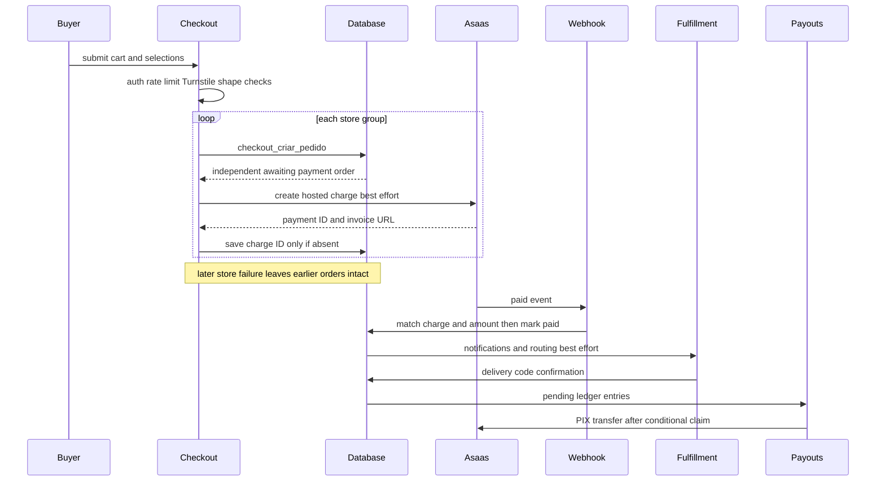
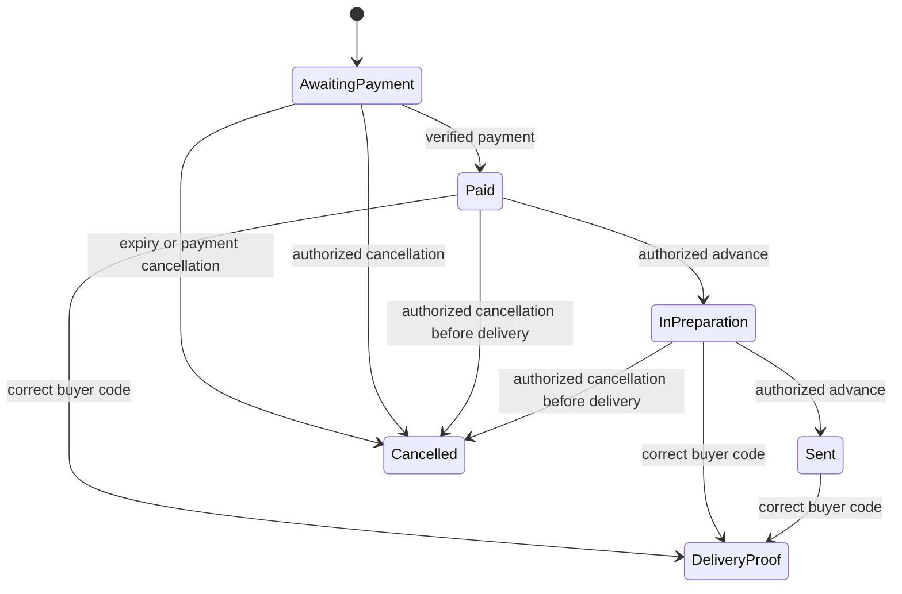

# Checkout, Payment, and Order Lifecycle

Checkout separates buyer convenience from commercial authority. The browser can assemble a cart and display estimates, but the authenticated database RPC determines whether items can be bought, their price, freight, coupon outcome, attribution, and reserved stock. Payment is accepted only after server-side identity and amount checks, and a payout is sent only after a database-backed single-execution claim.

A cart spanning stores is intentionally **not** one cross-store order or transaction: the action groups items by `loja_id` and calls `checkout_criar_pedido` once per group. Earlier stores remain created if a later group fails. This produces independent orders, charges, delivery paths, reservations, and recovery actions.

## Entrypoints and ownership

| Boundary | Responsibility | Authority boundary |
| --- | --- | --- |
| `CarrinhoProvider` and checkout page | Persist/select items, gather address, consent, payment method, coupon code, and freight selection | UI only; local prices, availability, totals, and form values are untrusted |
| `finalizarCompra` | Authenticate, throttle, verify Turnstile, validate request shape, group stores, invoke the RPC, then attempt charge creation | Server action; it does not calculate commercial values |
| `checkout_criar_pedido` | Lock and validate products, price items, choose freight, apply coupon rules, create the order/lines, decrement and record reservation | Authoritative `SECURITY DEFINER` transaction |
| Asaas webhook / manual verification | Establish payment from provider data through one shared confirmation core | Stored charge identity and database order amount must match |
| Seller actions and delivery RPCs | Advance fulfillment, cancel where safe, and record per-line delivery | RPC/RLS enforce the actor and transition rules |
| `repasses` processor | Recalculate ledger entries and send eligible PIX transfers | Conditional `pendente` to `processando` claim prevents duplicate transfers |

## Cart validation, freight, coupons, and order creation

The cart is browser-local under `industria24h.carrinho.v1`; reservations for the same product use a composite product/reservation key. For a signed-in buyer it is also debounced to the abandoned-cart endpoint after 1.5 seconds, but that mirror is deliberately best-effort. The UI mirrors minimum-quantity, store-minimum, and availability checks to avoid a late surprise, including the distinction between current stock and a future-sale reservation. Those checks improve feedback; the RPC repeats the meaningful stock and commercial checks.

`finalizarCompra` requires an authenticated user, allows five attempts per user per minute, verifies the Turnstile token using the forwarded IP, parses the cart and selected freight with Zod, and permits only `PIX`, `BOLETO`, or `CREDIT_CARD`. It rechecks whether the cart contains perishable products before accepting the perishable-goods consent. For a Mercado Futuro reservation it validates a corporate/rural-producer profile and terms acceptance, saves that profile before checkout, and stamps the acceptance on each resulting order best-effort after creation. The contact phone and acceptance stamps are not prerequisites that can roll back an already durable order.

For each store group, `montarEntregaDaLoja` passes the delivery data plus only carrier and external-quote identifiers—not a client freight amount—inside the delivery JSON. It also generates one `checkout_ref` per submission, which makes a coupon use shared across the independent store orders of that submission. If a group fails, the action reports how many prior orders have already been created; it does not pretend to have rolled them back. On successful completion it clears only the signed-in abandoned-cart mirror; the browser removes only successfully closed stores from its local cart.

### Authoritative transaction and reservation lifecycle

The authenticated `SECURITY DEFINER` `checkout_criar_pedido` RPC rejects empty/duplicate products and unsupported billing types, requires a single active store with approved products, locks product rows, enforces per-product and store minima, and recalculates progressive or future-sale prices. It calculates the order and line values, a platform share, and the selected approved affiliate share rather than accepting those values from the browser.

At creation, the RPC expires relevant overdue reservations before deciding availability, decrements either `produtos.estoque_atual` or `vendas_futuras.estoque`, and records `estoque_reservas` rows with a 30-minute expiry. `estoque_atual` remains the sellable available balance; an active reservation explains the removed quantity. A status trigger confirms reservations on `Pagamento Realizado`, consumes them on `Enviado`, and restores them on cancellation. Expiry cancels an unpaid order and releases stock. Restoration is idempotent by moving only active/confirmed reservations, and it restores future-sale stock to its own pool. A late payment after expiry is recorded for operational handling rather than manufacturing stock.

The shipment guard rejects transition to `Enviado` when no active or confirmed reservation remains, preventing fulfillment of stock that has been released. Cancellation also refuses an order with any delivered item; the lower-level restock function audits and leaves stock untouched for an order with even partially delivered goods.

### Freight and coupon authority

The authenticated, rate-limited freight endpoint uses a server calculation in this order:

1. an applicable imported carrier-table quote,
2. internal CEP coverage calculated from the item subtotal, then
3. Uber Direct only when neither internal option applies and both service credentials and complete addresses are available.

An Uber quote is persisted with the store, fee, and expiry before its ID reaches the browser. The order RPC revalidates that the selected carrier is active and belongs to the store (or is global); it recomputes imported-table/internal freight, or reads a still-valid stored Uber quote owned by that store. Freight is allocated across lines, with the final line receiving rounding remainder so the line total exactly matches order freight. Pickup is allowed only when the store permits it.

Coupons are likewise validated in the RPC, not trusted from a preview. It atomically claims `(cupom_id, checkout_ref)`, observes per-buyer and global limits, associates the use with the first created order, and releases it when no discount applies or an unpaid order is cancelled/expired. Platform coupons reduce `pedidos.valor_pedido` while retaining line price and seller/affiliate allocations, with each line discount capped by platform share. The common reference makes one usage across a multi-store submission; consequently, cancelling the first associated order can release that usage while another order from the same checkout still has its discount—an explicitly documented MVP edge case.

> **Invariant:** The browser may send product IDs, quantities, delivery details, a carrier ID, a quote ID, and a coupon code. It is never authoritative for price, stock, freight value, financial allocation, coupon amount, or payment identity.

This sequence shows the independent per-store checkout path and the durable transitions that precede best-effort integrations.

## Charges and payment confirmation

After each durable order exists, the server action attempts Asaas work only when both Asaas and the service client are configured. It loads the server-owned `valor_pedido` and billing type, caches/creates an Asaas customer by CPF/CNPJ, and creates a PIX, boleto, or hosted card payment with the order UUID as `externalReference` and a due date three days ahead. Card data remains in Asaas's hosted invoice flow; PIX has a QR endpoint. Asaas calls time out after 12 seconds, and an `invalid_customer` response gets one customer re-creation attempt for a stale cached customer.

Charge failure does not undo the order or reservation. The buyer can retry generation only after ownership is established through `pedidos_cliente`, and retries are rate-limited. Concurrent charge attempts are safe at the persistence edge: after creating a gateway charge, the service role writes `asaas_cobranca_id` and `link_cobranca` only when the stored charge field is null. A loser cancels its newly created gateway charge and reports failed cleanup as a possible ghost charge.

`POST /api/asaas/webhook` uses a constant-time comparison of `asaas-access-token` with `ASAAS_WEBHOOK_TOKEN` and requires a service-role configuration. It responds successfully to ignored/malformed/unsupported events so that provider retries are not trapped. For paid events, the shared confirmation core loads the order and accepts the provider delivery only if the charge ID equals stored `asaas_cobranca_id` and received value is at least `valor_pedido`.

The first confirmation conditionally sets `dt_pagamento`, `Pagamento Realizado`, and received value, then marks all lines paid. `dt_pagamento`, rather than an assumed short list of statuses, is the idempotency fact: duplicate webhooks and a manual confirmation racing with them cannot re-notify or re-dispatch even if a later workflow has changed status. The buyer-controlled fallback is intentionally not polling: it is ownership checked and one attempt per order per 15 seconds, queries Asaas directly, accepts only `RECEIVED` or `CONFIRMED`, and uses the same confirmation core.

Payment cancellation events (`PAYMENT_OVERDUE`, `PAYMENT_DELETED`, `PAYMENT_CANCELED`, `PAYMENT_REFUNDED`) invoke the service-role cancellation RPC. It affects only `Aguardando Pagamento`, returns stock/reservations and releases an eligible coupon use, then marks the order cancelled. It does not make an Asaas refund.

## Fulfillment, cancellation, and delivery proof

Payment persistence comes before external effects. Confirmation attempts buyer WhatsApp containing the pickup/delivery code, seller WhatsApp without that code, buyer email, and routing. Failures are captured but do not negate payment. For ordinary delivery it tries `despachar_corrida_automatica`; an approved store logistics affiliate may receive a five-minute exclusive opportunity before the general pool. If no internal run was created and the order/address is eligible, Uber Direct is the fallback. When the buyer selected Uber Direct at checkout, internal-run creation is skipped. Routing failure leaves the paid order intact.

The order-status lifecycle is narrow: `Aguardando Pagamento`, `Pagamento Realizado`, `Em Separação`, `Enviado`, and `Cancelado`. Seller or admin advances the linear paid-to-separation-to-sent route through an authorized RPC. Manual seller/admin cancellation requires a reason, is barred at `Enviado`/`Cancelado` and after any delivered item, restores stock where safe, clears untransferred line-payment flags, marks pending payout rows `estornado`, and writes an audit event. It is an internal reversal, not a provider refund.

This state view distinguishes `status_pedido` from delivery proof: `DeliveryProof` represents per-line `entregas` records rather than another persisted order status.

Authenticated store owners and eligible logistics actors use `pedido_confirmar_entrega`; a public carrier path accepts the readable sale ID, buyer code, and carrier name. Both require a paid order and correct code, mark every line's `entregas` row `Entregue`, and return idempotent success when already confirmed. Incorrect attempts are recorded; logistics/public callers are limited to five attempts, while the store-owner authenticated path is exempt. Separate authorized actors may also update an individual line's `entregas` status through the RLS-protected fulfillment helper.

## Payouts: delivery-gated and single execution

A confirmed delivery calls the service-side processor after the durable delivery update; the public delivery path resolves UUID from sale ID and uses the same processor. A seller may also request payout, but the database requires ownership/admin authority, a paid order, and every line delivered before it recalculates the same ledger. Thus the request is recovery/control for an eligible payout, not an early-payment bypass.

The processor first calls `repasses_recalcular_pedido`. Seller value is derived from line value less platform and affiliate allocations (preserving legacy seller values where present); affiliate rows are grouped by affiliate. Pending seller and affiliate rows are considered separately. Before calling Asaas `POST /transfers`, the application checks the beneficiary PIX eligibility/key and atomically updates each ledger row from `pendente` to `processando`. Only the caller that receives that claim invokes the transfer. Success becomes `transferido` with timestamp and marks seller order lines transferred; missing/ineligible credentials become `inelegivel`, and an exception becomes `falhou` with Sentry telemetry. Delivery is never rolled back for a payout problem.

## Operations and safe changes

- `ASAAS_API_KEY` enables payments and transfers. `ASAAS_ENV=production` selects the production URL; other values select sandbox. Configure Asaas to call `/api/asaas/webhook` with `ASAAS_WEBHOOK_TOKEN`.
- Service-role Supabase access is needed for charge persistence, webhook effects, Uber quote persistence, and transfers. It must remain server-only.
- An absent Asaas or service configuration leaves a durable order without a fabricated charge; buyer retry and operational recovery are the intended path.
- Preserve the ordering: transactional order/reservation creation precedes charge attempts; payment persistence precedes notification/routing; delivery persistence precedes payout attempts.
- Preserve the guards when extending the flow: database re-pricing and quote validation, charge ID plus amount validation, `dt_pagamento is null` confirmation write, reservation-state restoration, delivered-item cancellation protection, and `pendente` to `processando` payout claim.

## Focused verification

`npm test` covers checkout payload/payment-method schema validation, freight-selection helpers, email and constant-time-token behavior, and the pure checkout assembly helpers. `montagem-pedido.test.ts` specifically checks store grouping order, delivery payload carrier/quote propagation, shared coupon reference, and Mercado Futuro gating. `travas-minimas.test.ts` checks minimum quantity/store ticket behavior and progressive-price subtotals. For database/integration verification, exercise concurrent stock and charge attempts, partial multi-store creation, coupon-limit races, expired reservations and late payment, mismatched charge ID/value callbacks, repeated payment and delivery callbacks, cancellation after partial delivery, and concurrent payout processors.
