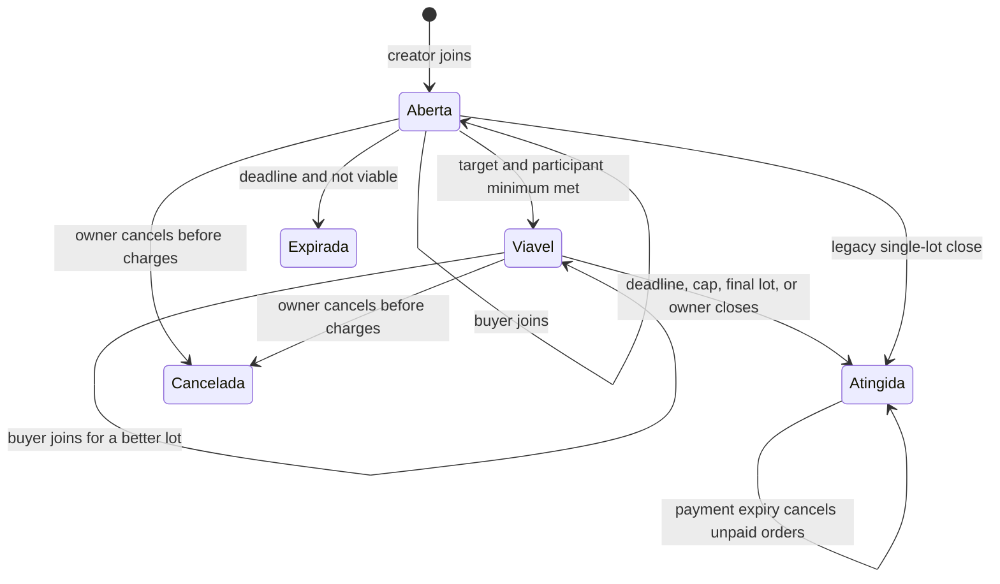
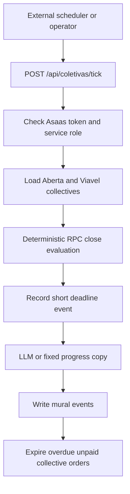

## Scope and boundaries

These programs extend the ordinary catalog, checkout, payment, order, and payout flows rather than replacing them. Their authoritative business and financial decisions live in Supabase `security definer` RPCs and triggers; Next.js server actions validate request shape, enforce UX-level authentication/rate limits, invoke the RPCs, and redirect or revalidate pages. See [Marketplace Catalog and Roles](/openwiki/concepts/marketplace-catalog-and-roles.md) for ownership and product eligibility, and [Checkout, Payment, and Order Lifecycle](/openwiki/workflows/checkout-payment-and-order-lifecycle.md) for payment and order semantics.

* **Collective purchase:** buyers aggregate quantities for one product. The seller owns the reusable product rule, while each newly created collective snapshots it so an in-flight offer cannot have its economics changed.
* **Future sale / Mercado Futuro:** a seller exposes a dated, separately stocked reservation for a catalog product. It uses normal checkout but has a B2B document gate.
* **Reverse auction:** a buyer posts demand and active sellers compete with one current bid each. Selecting a bid records an award, not an automatic catalog order.
* **Affiliate:** an affiliate requests approval to promote a product or store and receives an identifier for `?ref=` links. Commission is attributed only to a matching approved referral, then follows the payout process.

## Collective purchases

### Rule ownership and creation

`coletiva_regras` is one seller/admin-writable rule per product: active flag, target quantity, two-or-more minimum participants, optional participant cap, 1–30 day duration, up to four price lots, optional shared delivery, and a payment-window setting. Public reads let the product page advertise the curve. The database trigger, not the form, rejects an active rule with no lots; non-positive quantities or prices; prices at/above the base price; non-increasing thresholds; non-decreasing prices; or an incoherent target/cap. An explicit target cannot precede the first lot.

At `coletiva_criar`, the RPC authenticates the creator and rechecks that the product is approved, positively priced, attached to an active store, and has sufficient stock. It snapshots the seller rule (lots, targets, participation limits, shared-delivery choice) into `compras_coletivas`; if no active rule exists, it derives a single valid lot from the product’s progressive-promotion configuration. A creator cannot create a group whose own quantity already meets the target. Shared delivery requires the creator’s common destination; otherwise the collective is pickup-oriented. The server action accepts only a UUID and positive quantity plus delivery shape, rate-limits creation/participation to five attempts per minute per user, and delegates every economic decision to the RPC.

A collective is deliberately separate from payment: `coletiva_participacoes` holds one accumulating quantity per buyer and no order is created or stock decremented merely for joining. Public collective reads support the invitation/progress page, while participation rows are readable only by their owner; aggregate views expose payment and participant totals without exposing other buyers.



This is the collective-purchase lifecycle; `Atingida` means orders were created, while payment completion remains individual.

### Joining, viability, and close

`coletiva_participar` locks the collective row, admits only `Aberta` or `Viavel` before its deadline, revalidates product/store availability and aggregate stock, and upserts the participant’s quantity. A cap blocks **new** participants once full but lets an existing participant increase quantity. It records join and unlocked-lot events, then calls the idempotent `coletiva_fechar`.

Viability requires all of: aggregate quantity at least the target, number of distinct participants at least the snapshot minimum, and aggregate merchandise value at least the store minimum order value. Reaching viability does not normally close the offer: it becomes `Viavel` and remains open to unlock better lots. Closure occurs only when viable and the deadline passes, participant cap is reached, final lot is reached, or the store owner forces closure; old empty-lot collectives retain the earlier close-at-target behavior. If the deadline passes before viability, it becomes `Expirada` with no orders, stock debit, or refund.

At close, the RPC locks the collective and computes the best non-expired lot reached (or the legacy locked price). It creates one `Aguardando Pagamento` PIX order and item per participant, debits group stock once, and marks the collective `Atingida`. All participants receive that same best unit price. Optional shared freight uses the one saved destination and the applicable CEP band; item value and freight are allocated by quantity. Since line rounding can leave cents, rows are ordered by quantity descending then creation time and the first (largest) participant receives each remainder, making allocated totals exactly equal the collective totals. Collective order lines have zero affiliate commission and retain the normal 5% platform share.

The payment deadline is stamped on transition to `Atingida`: the rule’s `prazo_pagamento_horas` if present, otherwise 48 hours. After the window, `coletiva_expirar_pagamentos` is serialized and idempotent: it cancels only still-`Aguardando Pagamento` orders and restores their quantities. Paid buyers keep their order and price; the collective stays `Atingida`. The store owner may invoke this manually after expiry.

### Scheduled evaluation and AI boundary

An external scheduler or authenticated operator calls `POST /api/coletivas/tick` with `Authorization: Bearer ${ASAAS_WEBHOOK_TOKEN}`. It requires `SUPABASE_SERVICE_ROLE_KEY`, returns 401 for a missing/bad token and 503 when the service client is unavailable, emits success/failure observability, and executes `rodarEtapas()`. There is no in-repository scheduler. The page and participation RPCs perform lazy closure checks, so absent ticks delay progress messages and batch expiry but do not make financial closure depend on an LLM.



This is the scheduled evaluation graph. `avaliar` calls the database close RPC and derives current/next-lot numbers with the TypeScript mirror; these figures are deterministic. `redigir` may use Anthropic `claude-haiku-4-5` only to phrase a one-sentence Portuguese mural message and is instructed to use supplied numbers exactly. No `ANTHROPIC_API_KEY`, malformed model output, or a missing suggestion produces a fixed template instead; closure, event recording, notification flow, and payment expiry continue. Separately, the seller’s rule-suggestion graph proposes a curve from price, stock, 90-day demand, and prior collectives, validates it arithmetically for at most three iterations, and never persists it—the seller must review and submit it, after which the DB trigger remains authoritative. See [AI Assistance and Customer Channels](/openwiki/integrations/ai-assistance-and-customer-channels.md).

### Seller operations and safe changes

`/seller/coletivas` lets the store owner save/upsert a rule for one of its products, cancel an uncharged collective, force-close a viable collective, and expire overdue unpaid orders. The action’s ownership checks provide clear errors, but RLS and the RPCs are the authorization boundary. Changing a rule affects future collectives only: never reinterpret snapshots. Changes to lot selection, close triggers, allocation, or stock must be made in the SQL source of truth and mirrored in `src/lib/coletiva.ts` only for display/agent calculations.

Focused regression coverage should preserve the following: lot selection ignores expired lots and picks the highest reached threshold; next-lot messaging is correct; quantity/freight allocations sum exactly including a remainder; caps admit existing participants but reject newcomers; schema validation rejects malformed public submissions; and an affiliate batch skips ineligible/previously requested products.

## Future sales and B2B gate

A seller records `vendas_futuras` for its catalog products at `/seller/venda-futura`: availability date, reserved stock, and an optional positive unit price. The product page lists only future entries with positive stock. An optional AI UI helper can fill stock, value, and date, but displays its justification and asks the seller to review before the ordinary server action persists anything.

Normal checkout identifies a future reservation by `venda_futura_id`. It validates that the reservation belongs to the requested product, prices from its `valor` or falls back to the product price, decrements `vendas_futuras.estoque` rather than live product stock, and records the ID on the order line. Any cart containing such an item requires the authenticated buyer to have a saved `perfis_compradores` record with a nonblank CNPJ or IE; the dedicated profile RPC validates document type and basic CNPJ/IE presence. The whole checkout is blocked, not partially approved. Other checkout constraints—including one store per cart, store minimum, delivery coverage, and normal payment method validation—remain in force.

## Reverse auctions

The reverse-auction pages call three RPCs after Zod validates nonempty text, UUIDs, and a positive bid amount. Any authenticated buyer can publish a future-ending request containing title, description, volume, optional category/delivery preference, and bid window. Only an owner of an active store can bid while it is `Aberto` and its window remains open. `dar_lance_leilao` is an upsert keyed by `(leilao_id, loja_id)`, so each seller has one revisable current proposal with price, lead time, and optional conditions.

The posting buyer alone may adjudicate an open auction, and the selected bid must belong to that auction. This locks the auction, sets `Adjudicado` and `lance_vencedor`, and writes an audit event. The detail UI sorts bids by ascending price, but the buyer selects a winner—there is no automatic lowest-price award. Awarding does **not** create a checkout order; payment and delivery are subsequently arranged between the buyer and winning manufacturer, because this v1 flow has no bespoke catalog product.

## Affiliate attribution, approval, and payout readiness

An affiliate can request product-level sales affiliation or store-level sales/logistics affiliation after accepting the corresponding terms. Product requests derive store ID, commission percentage (product value or 5% fallback), and a generated identifier from the database product rather than trusting form fields. Batch requests deduplicate selected IDs, reread current eligibility and commission, omit already requested or now-ineligible products, and create pending rows with an acceptance timestamp and current terms-page version. Seller and admin dashboards can change only `Pendente`, `Aprovada`, and `Suspensa` states; the seller action checks its store for UX and relies on RLS to prevent cross-store updates, while the admin action explicitly checks the admin role.

Approved affiliations produce sharing links with `?ref=<identificador>`. The product page captures that ref and current checkout calls the four-argument `checkout_criar_pedido`. It first clears any legacy automatic affiliate assignment, then credits each line only when the nonblank ref exactly matches an approved affiliation applicable to that product or its store; the line commission is `round(line value × percentage / 100, 2)`. Thus an approved affiliation alone earns no commission on organic purchases, and no ref means zero affiliate share.

The affiliate dashboard reads its own affiliations and a privacy-limited earnings view to separate payable from paid commission. Affiliate PIX credentials are isolated in `afiliado_dados_pix`: there is no generic update policy, the owner changes them only through `alterar_chave_pix_afiliado`, values are type/format validated and audited, and each change clears confirmation. Admin/service confirmation plus a 24-hour aging period is required before automatic payout eligibility. Operationally, treat ref capture, final checkout attribution, payment/order status, and payout eligibility as separate checkpoints; do not infer a payable commission merely from a requested or approved affiliation.

## Verification and operations checklist

Run the relevant Vitest suites when changing pure mirrors or form schemas, for example:

```bash
npx vitest run src/lib/coletiva.test.ts src/lib/coletiva-max-participantes.test.ts src/lib/coletiva/schemas.test.ts src/lib/leilao/schemas.test.ts src/lib/afiliado-lote.test.ts
```

Database integration tests should exercise concurrent collective joins and close idempotency, owner versus non-owner manual close/expiry, paid versus unpaid expiry, CEP failure for shared freight, future-sale document rejection, auction bid/upsert/adjudication ownership, and checkout with absent, invalid, and valid affiliate refs. Before deploying a migration that changes an RPC, follow the checkout and payout verification guidance in [Verification Strategy](/openwiki/testing/verification-strategy.md) and monitoring/secret guidance in [Runtime Configuration and Observability](/openwiki/operations/runtime-configuration-and-observability.md).
