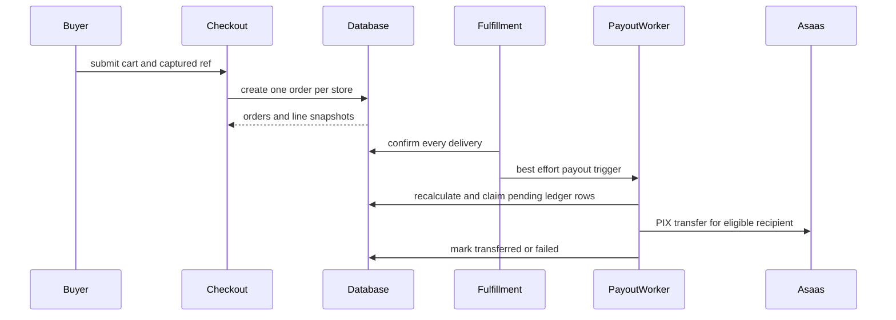

## Scope and authority

Collective purchases and future sales are specialized ways to buy catalog inventory; affiliates are a separate referral and logistics role that can earn through an order. They do not replace the ordinary order, payment, fulfillment, inventory, and payout workflows. See [Checkout, Payment, and Order Lifecycle](/openwiki/workflows/checkout-payment-and-order-lifecycle.md), [Fulfillment and Logistics](/openwiki/workflows/fulfillment-and-logistics.md), and [Inventory Ledger and Reservations](/openwiki/workflows/inventory-ledger-and-reservations.md).

The browser may submit a cart, a `venda_futura_id`, a referral cookie, or a payout request, but none is financial authority. Server actions authenticate, parse, rate-limit, and provide user-facing errors. `security definer` checkout and payout routines re-read authoritative product, affiliation, taxonomic commission, eligibility, order, delivery, and PIX data before recording money-bearing rows or calling the payment provider.



This shows the authoritative order-to-payout path: referral data is input to checkout, while delivery confirmation and the payout ledger govern transfer execution.

## Collective purchases

### Rules, snapshots, and entrypoints

A seller or administrator configures collective-purchase rules per product. The rule validates a genuine discount curve—positive, increasing quantity thresholds, decreasing prices, coherent targets, and no more than four lots—rather than trusting the seller form. `coletiva_criar` copies the applicable rule into a new collective, so later edits affect later offers rather than repricing an offer already in progress. When there is no active rule, creation can derive one valid lot from the product’s progressive-promotion configuration.

The public action authenticates the caller, validates the collective ID, quantity, and delivery input with Zod, and limits creation and participation to five attempts per user per minute. The RPC is still responsible for product/store availability, inventory, and the economics. A creator cannot contribute enough quantity to reach the target alone at creation; a shared-freight collective also requires its common delivery address.

### Participation and lifecycle

A participation is an accumulating buyer quantity, not an order or an immediate stock debit. `coletiva_participar` serializes changes by locking the collective and rechecks open/viable status, deadline, product/store availability, aggregate stock, and the participant limit. Once a participant cap is reached, a new buyer is rejected but an existing participant can increase their quantity.

A collective becomes viable only after reaching its target quantity, its minimum number of distinct buyers, and the store’s minimum aggregate order value. It remains open after viability to allow a better lot. A viable collective closes at deadline, participant cap, final lot, or owner-forced close; an expired nonviable one creates neither orders nor inventory movement.

On closure, the database selects the best reached lot and creates one pending PIX order and item per participant, then debits group inventory once. Shared freight and item amounts are apportioned by quantity; deterministic remainder allocation makes participant totals equal the collective total exactly. The collective line items have no affiliate commission. The payment deadline is stamped at close. Its expiry routine is idempotent: after the deadline it cancels pending collective orders and restores only their stock, leaving paid orders, their prices, and the closed collective intact.

Scheduled `POST /api/coletivas/tick` requires the Asaas webhook bearer token and a service-role client. It runs deterministic lifecycle evaluation and expiry with observability. The LLM can only phrase a mural progress message; absent credentials or malformed output fall back to fixed text and cannot alter closure or payment behavior. Seller AI rule suggestions likewise require seller review and database validation before persistence.

## Future sales and checkout interactions

A future-sale item identifies a separately reserved inventory entry through `venda_futura_id`. Checkout validates that the entry belongs to the requested product, checks and decrements its reserved `vendas_futuras.estoque`, uses its optional price or the current product price, and records the entry on the order line. It does not consume ordinary live product inventory for that item.

Any cart containing a future sale is B2B-gated: the buyer must have a nonblank `CNPJ` or `IE` buyer profile. `finalizarCompra` validates the future-sale document and terms input, saves the profile through `salvar_perfil_comprador_pj`, then calls checkout; the database independently rejects the complete checkout without the qualifying profile. After an order is made, the terms stamp is best effort, so a stamp failure does not undo an already-created order.

The application groups a cart by store and calls checkout once for each group. The database enforces that an individual resulting order contains one store, current approved products, stock, minimum quantities and order value, delivery coverage, and supported payment method. This means a later store failure can leave earlier store orders created; there is intentionally no cross-store rollback. Checkout rate-limits the user and validates Turnstile before these calls, but database validation remains authoritative.

Progressive-price display is advisory: `resumoDescontoProgressivo` excludes expired or non-discounting bands, chooses the lowest valid price, and exposes the soonest dated offer for a timer. Checkout derives actual ordinary-item pricing from the database. “Buy again” similarly constructs a new cart at current price and availability, raises old quantities to today’s minimum, combines duplicate lines, and excludes future-sale reservations because their stock and delivery date are specific to the original reservation.

## Affiliate enrollment, moderation, and attribution

### Enrollment and role boundaries

`solicitarAfiliacao` requires login and sales-terms acceptance. For a product request it reads the store, eligibility flag, and percentage from `produtos`, rather than trusting form values; the stored row starts `Pendente`, has a generated identifier, and records acceptance time and the current CMS terms version. A product’s percentage wins, including a deliberate zero; null uses the 5% fallback. Batch enrollment deduplicates requested IDs, reloads current product eligibility and percentage, and silently skips products already affiliated by that user or no longer eligible.

Store-level requests support both `vendas` and `logistica`, each with its own terms version and duplicate check. A logistics affiliation gives access to logistics operations only through their own delivery/RPC authorization rules; it is not itself a checkout referral commission. The seller dashboard can approve or suspend an affiliation in its store scope. Its precheck is defense in depth; RLS makes a zero-row cross-store update an error rather than a successful moderation. Product and store affiliations are both shown to the owning seller, with de-duplication where a row matches both paths.

### Referral attribution and commissions

An approved sales affiliation exposes an identifier for a `?ref=` link. Product browsing captures that value in `REF_COOKIE`; checkout decodes and trims it and sends it as `ref` in the six-argument `checkout_criar_pedido` call for every store-specific request. Cookie capture is merely untrusted attribution input, not proof of a right to payment.

The four-argument referral wrapper first removes the legacy automatic affiliate assignment from all new line items. A line is credited only if its nonblank reference exactly matches an approved affiliation applicable to its product or store. It writes the matching affiliate ID and `round(line value × affiliation percentage / 100, 2)`; absent, blank, invalid, suspended, or inapplicable refs leave affiliate share at zero. Therefore an approved affiliation alone never credits organic orders.

Platform commission is independent of the affiliate percentage. The checkout database function uses the product taxonomy’s subcategory percentage first, then category, then a 5% default, and snapshots the applied percentage in `linha_itens.repasse_ind_pct`. A configured `0` is distinct from inheritance. Checkout rejects an item if platform and affiliate percentages exceed 100%, then computes platform and affiliate amounts from the authoritative line value. The TypeScript percentage helper is a presentation/input boundary: it normalizes user text to 0–100 with two decimal places and displays the saved item snapshot rather than recalculating historical commission from today’s configuration.

## Payout ledger and PIX ownership

`repasses` is a server-owned ledger. On delivery confirmation, the worker recalculates rows for the order: seller value derives from each line’s value less platform and affiliate shares, preserving a legacy seller amount where present; affiliate rows aggregate credited affiliate shares by recipient. Only security-definer functions/admin populate it. Sellers may read rows for their stores and affiliates may read rows addressed to them, but those read policies grant no writing authority.

A seller can call `repasse_solicitar_pedido` only for its own paid order after every line is delivered; it recalculates the ledger, then the action best-effort triggers the same payout worker. Delivery confirmation also triggers the worker from seller, partner, or logistics-affiliate fulfillment paths. A transfer error cannot reverse delivery: it is recorded for operations as `falhou`.

The worker requires service and Asaas configuration, processes pending rows, and separately checks the destination’s PIX eligibility and key. It atomically claims a row from `pendente` to `processando` before `createPixTransfer`; concurrent retries that claim no row must not issue a second transfer. Success becomes `transferido` with a timestamp; missing/ineligible PIX data becomes `inelegivel`; exceptions become `falhou` and are sent to Sentry. The seller item transfer indicator is updated only after its seller transfer succeeds.

Affiliate PIX data is protected: it has no generic insert/update policy and the owner changes it only via `alterar_chave_pix_afiliado`. That RPC validates allowed key type and format, clears confirmation on every change, and writes an audit event. Only admin or service context can confirm it; automatic eligibility additionally requires confirmation at least 24 hours old. Treat affiliation approval, referral attribution, paid/delivered order state, ledger eligibility, and an executed PIX transfer as distinct checkpoints.

## Change and verification guidance

Keep financial changes in the SQL checkout, collective, and payout source of truth. Do not make client-side referral, commission, or ledger calculations authoritative, and do not recalculate historical commission displays from live taxonomy values. Changes to checkout overloads must preserve the explicit four-argument `ref` wrapper—there is no default referral argument—so the three-argument base call remains unambiguous.

Focused tests include affiliate line construction and moderation statuses, batch eligibility resolution, progressive discount validity/selection, and recompra exclusions:

```bash
npx vitest run src/lib/afiliado/afiliacoes.test.ts src/lib/afiliado-lote.test.ts src/lib/catalogo-compra/desconto-progressivo.test.ts src/lib/catalogo-compra/recompra.test.ts
```

For database integration, cover concurrent collective joins and idempotent close/expiry; B2B future-sale rejection and reserved-stock depletion; absent, invalid, and valid refs across multi-store checkout; category/subcategory/default/zero commission precedence and the 100% cap; seller/affiliate read isolation; payout claim races; missing, re-confirmed, and aged PIX keys; and transfer failure after successful delivery. See [Verification Strategy](/openwiki/testing/verification-strategy.md) for broader release checks.
