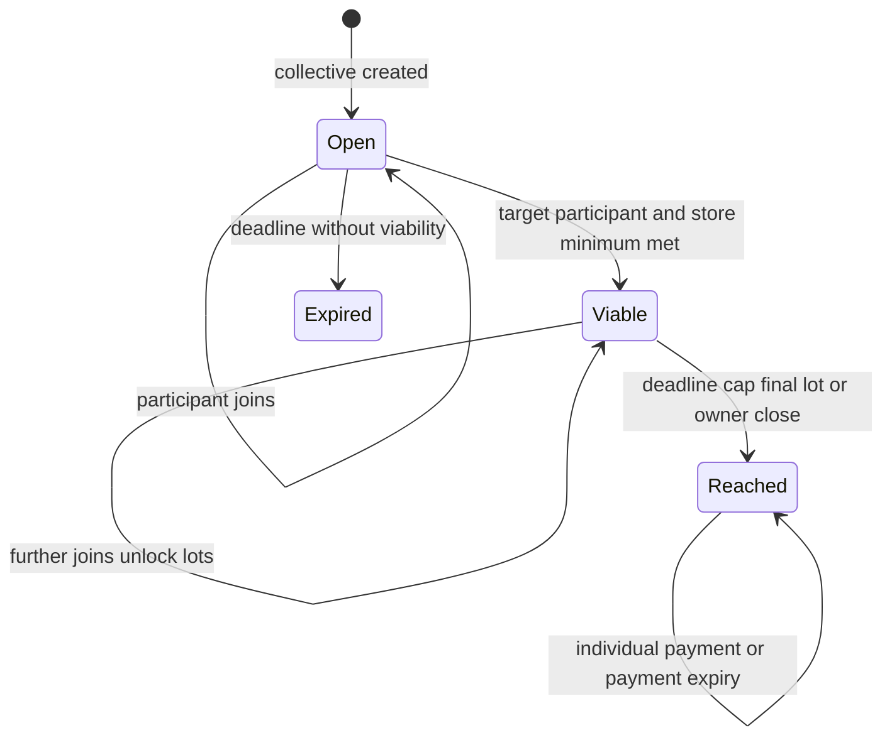
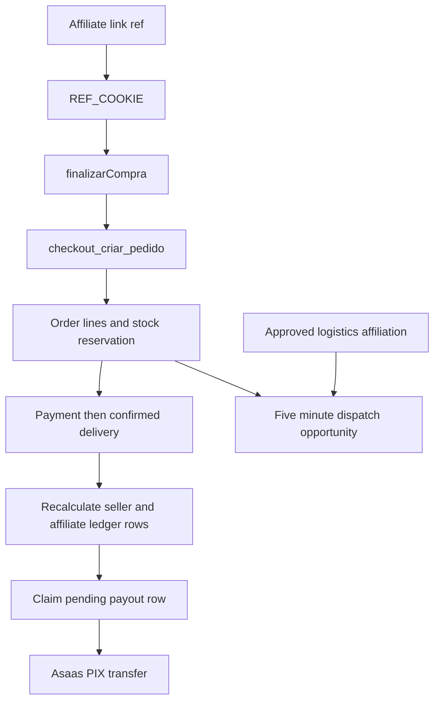

# Collective Commerce, Future Sales, and Affiliates

These programs are additions to the normal catalog, checkout, fulfillment, and payout lifecycle—not alternative money systems. The database owns offer-state, stock, line allocations, and the ledger; server actions shape input and provide user-facing gates. In particular, **sales affiliation**, **platform commission**, and **logistics affiliation** are separate concepts:

- A sales affiliation is a promotable product or store relationship and may produce a line-level affiliate allocation.
- Platform commission is a catalog-taxonomy rate resolved independently for every line.
- A logistics affiliation gives an approved affiliate a short, conditional dispatch opportunity. It is not a sales commission and does not itself create a payout.

For the shared order, payment, delivery, and transfer lifecycle, see [Checkout, Payment, and Order Lifecycle](/openwiki/workflows/checkout-payment-and-order-lifecycle.md). For fulfillment routing, see [Fulfillment and Logistics](/openwiki/workflows/fulfillment-and-logistics.md), and for the stock books see [Inventory Ledger and Warehouse Operations](/openwiki/workflows/inventory-ledger-and-warehouse-operations.md).

## Collective purchases

### Offer configuration and creation

A `coletiva_regras` row is a seller/admin-writable configuration for one product. It supplies active state, a target, participant bounds, a 1–30 day deadline, up to four progressively cheaper quantity lots, and whether freight is shared. The write trigger—not the seller form—requires real discounts, strictly increasing thresholds, strictly decreasing prices, coherent participant bounds, and a target no lower than the first lot. The rule is public to support storefront price-curve display.

`coletiva_criar` rechecks authenticated buyer, approved product, active store, stock, and deadline inputs. It copies the selected rule into `compras_coletivas`, including lots and delivery mode; later edits therefore apply to future offers, not an offer already shared with buyers. If there is no active rule, it can derive a single lot from the product’s current progressive-promotion configuration. A creator may not meet the target alone, and shared freight requires the common delivery address. The Next.js action authenticates, validates the product/quantity/delivery shape, rate-limits each user to five attempts per minute, and calls the RPC rather than calculating price or stock itself.

Joining is a reservation in `coletiva_participacoes`, not an order or stock decrement. The RPC locks the collective, rechecks availability and aggregate stock, and upserts the buyer quantity. A full participant cap rejects a new buyer but permits an existing participant to add quantity.



This is the intended collective lifecycle encoded by the collective lifecycle migrations: no one is charged while the offer is open, and `Reached` means an individual order exists for each participant.

At an intended viable close, the database locks the offer, chooses the best non-expired attained lot, creates one pending PIX order per participant, debits stock once, and allocates optional shared freight by quantity. It gives rounding remainders to the largest participant, with creation time as the tie-breaker, so order and freight sums exactly reconcile to collective totals. Collective lines have no affiliate allocation; their platform allocation is resolved from the product’s commission configuration.

The payment deadline is stamped on transition to `Atingida`, using the rule’s payment-hours setting or 48 hours. `coletiva_expirar_pagamentos` is serialized and idempotent: after that deadline it cancels only still-pending orders and restores those quantities. Paid orders retain their price and the collective remains closed.

### Current lifecycle implementation caveat

The latest `0189` migration replaces `coletiva_participar` with a different implementation: it accepts only `Aberta`, immediately generates PIX orders and debits stock when the quantity reaches `meta_qtd`, and uses the stored `valor_unitario`. This supersedes the earlier `Viavel`/best-final-lot control flow described above, while the landing page and pure `src/lib/coletiva.ts` mirror still describe the progressive, close-later design. Treat this as a release-blocking contract mismatch when changing collective offers: reconcile the latest SQL function, user-facing copy, and TypeScript mirror before relying on multi-lot progression.

The public detail page is deliberately read-oriented: it obtains the caller’s own participation through authenticated RLS, while public aggregate views expose paid/generated order counts and participant totals without disclosing other buyers. It also renders an expired `Aberta` offer as expired, but that read-side presentation does not itself run financial closure.

## Future sales: business gate, reservation stock, and notices

A future-sale cart line carries `venda_futura_id`. The checkout action detects any such line, requires a corporate/rural-producer profile plus Mercado Futuro terms acceptance, saves the profile through `salvar_perfil_comprador_pj`, and best-effort stamps the acceptance after each resulting order. The authoritative checkout function repeats the essential database gate: a buyer must have a nonblank CNPJ or IE profile. It verifies that the reservation belongs to the selected product, uses its optional price or the product price, decrements `vendas_futuras.estoque` rather than current product stock, and records the reservation ID on the line. Thus this stock is reserved supply, not immediately available warehouse stock.

Future-sale stock changes are mirrored to `estoque_movimentos` with `venda_futura_id`. Those movements remain in the audit extract but are intentionally excluded from physical-center balances and addresses, because promised future supply does not occupy a physical location.

`GET /api/venda-futura/avisos/tick` is the daily Vercel-cron path and requires `Authorization: Bearer $CRON_SECRET`; `POST` instead accepts the Asaas webhook token. With a service-role client, it finds undelivered future-sale lines, derives the date in the `America/Manaus` business timezone, and sends buyer and seller WhatsApp reminders two days before and on the promised date. `alertas_enviados` keys each item and milestone, so a successful recipient suppresses duplicates; an all-recipient failure is not marked and can be retried. The route records cron observability and returns 503 when service configuration is absent.

## Affiliations, attribution, and logistics access

### Enrollment and moderation

A product affiliation request derives store ID, allowed commission, and eligibility from the current product—not form fields—and requires sales-terms acceptance. It starts `Pendente`, stamps the current CMS terms version (or an acceptance-time fallback), and creates a generated identifier. Batch enrollment de-duplicates requested IDs, rereads products and existing affiliations, skips ineligible or already affiliated products, and applies the product percentage or the 5% fallback. The product/store owner may moderate only to `Aprovada` or `Suspensa`; the action provides an owner UX gate but RLS is the final scope boundary. A trigger also prevents a non-admin store/product owner from affiliating themselves.

A store-level request may instead be `tipo='vendas'` or `tipo='logistica'`. Do not interpret `tipo='logistica'` as sales-referral attribution: it is a delivery-routing authorization. On automatic dispatch, an approved logistics affiliation for the order’s store gets a five-minute exclusive window only when every delivered line permits logistics affiliation; a disabled product sends the run directly to the general partner pool. The delivery opportunity begins after a paid order is routed and is unrelated to affiliate sales commission.

### Checkout attribution versus platform commission

The current checkout action captures `?ref=` from `REF_COOKIE` and supplies it as `ref` with freight and buyer-name arguments to `checkout_criar_pedido`. However, the latest SQL definition in migration `0189` declares only the three-argument checkout function and independently selects the most recent approved product/store affiliation for each line. The source tree contains no six-argument definition. This is a material interface and attribution conflict: the action’s RPC request cannot match that latest signature, and the three-argument path shown by the migration reintroduces automatic affiliate selection rather than using the captured reference. Resolve this migration/application mismatch before assuming checkout works or that organic sales receive no affiliate commission.

Platform commission is separate from that defect. `comissao_pct_produto` resolves the nearest explicit taxonomy-node rate first, then subcategory, category, and finally 5%. Checkout snapshots the resolved rate in `linha_itens.repasse_ind_pct`, calculates the platform allocation from the line value, and rejects a line if platform plus selected affiliate percentages exceed 100%. The collective closing functions also call this resolver for their platform allocation, while setting affiliate allocation to zero.



This flow distinguishes referral attribution and financial allocation from the later logistics-access decision and the delivery-gated payout.

## Payout dependencies and access

`repasses_recalcular_pedido` derives the seller amount from each line after platform and affiliate allocations, and separately groups positive affiliate allocations by affiliate. Seller and affiliate ledger rows are readable by their respective owner but remain written by privileged ledger functions/admin rather than by dashboard clients. A seller may request ledger recalculation only for its own paid order after every line is confirmed delivered; that is a recovery/control entrypoint, not an early-transfer bypass.

After durable delivery confirmation, `dispararRepasseAutomatico` recalculates the ledger and processes pending seller and affiliate rows independently. It checks beneficiary PIX eligibility, atomically claims `pendente` to `processando`, calls Asaas only for the winning claimant, then marks `transferido`; missing credentials become `inelegivel`, and exceptions become `falhou` with Sentry telemetry. The delivery event is not rolled back for payout failure.

Affiliate PIX data is isolated in `afiliado_dados_pix`: ordinary users have select access to their own row but no generic write policy. `alterar_chave_pix_afiliado` validates key type/format, records an audit event, and clears confirmation. Admin or service-role confirmation followed by 24 hours is required before automatic affiliate payout eligibility.

## Operations and focused verification

- Keep financial authority in SQL RPCs/triggers. UI state, referral cookies, product-card discounts, and client freight values are not financial inputs.
- Before changing collective behavior, test the deployed/latest `coletiva_participar` and `coletiva_fechar` definitions together with the storefront copy. The latest migration conflict means existing pure tests prove mirrors, not necessarily the installed lifecycle.
- Before changing checkout attribution, verify the actual PostgREST RPC signature and test absent, valid, invalid, and product/store refs. Also test the 100% platform-plus-affiliate guard.
- For future sales, test the B2B profile/terms gate, reservation-stock decrement and restoration, ledger movement isolation, timezone boundary, duplicate notice key, and partial WhatsApp failure.
- For payouts, test delivery gating, seller/affiliate ledger visibility, missing or newly changed PIX keys, and concurrent payout claims.

Useful focused suites include:

```bash
npx vitest run src/lib/coletiva.test.ts src/lib/coletiva-max-participantes.test.ts src/lib/afiliado-lote.test.ts
```
