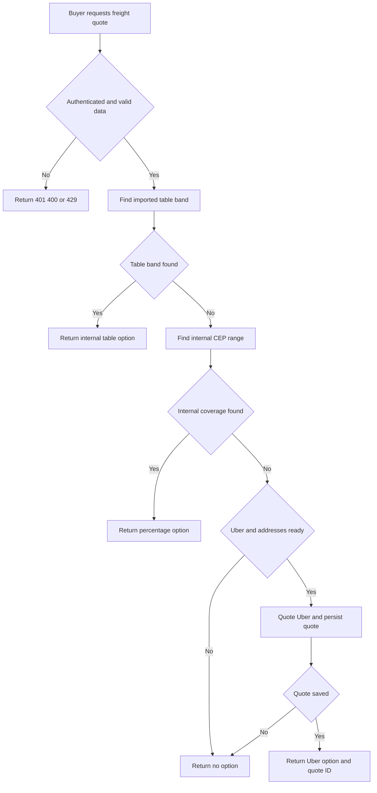
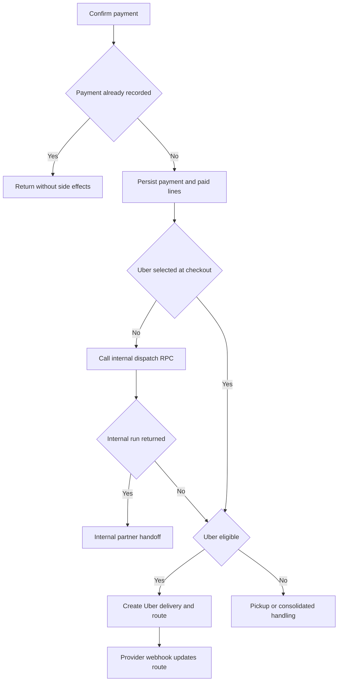

# Fulfillment and Logistics

Fulfillment begins with a server-authoritative freight selection. Once paid, an order is either pickup-only, deferred for a consolidated batch, assigned to the internal `corridas` marketplace, or sent to Uber Direct. These are distinct records and states: `corridas` owns internal-run assignment; `rotas` holds provider/manual route tracking; `entregas` records item fulfillment; and the order payment status is not a provider tracking status.

See [Checkout, Payment, and Order Lifecycle](checkout-payment-and-order-lifecycle.md) for ordering/payment recovery, [Collective Commerce and Affiliates](collective-commerce-and-affiliates.md) for the commercial relationship, and [Inventory Ledger and Reservations](inventory-ledger-and-reservations.md) for the broader stock model.

## Freight choice and quote integrity

`POST /api/checkout/cotar-frete` is authenticated and rate-limited to 20 attempts per user per minute. It requires a store ID, an eight-digit CEP, and a positive items value; cart weight defaults to zero when absent.

The endpoint intentionally returns **at most one** option, rather than comparing providers:

1. `cotar_frete_tabela` is evaluated first for an active imported-carrier table band. A store override wins over a global band.
2. If no table band applies, `cotar_frete_interno` resolves an active internal CEP range. It prefers the store range and then the narrowest range. The application rounds the percentage-based charge to two decimal places.
3. Only with no internal coverage does it try Uber Direct. Missing service/Uber configuration, incomplete pickup or dropoff address data, out-of-coverage/provider failure, or quote-persistence failure yields `opcoes: []`; the provider/persistence failure is reported to Sentry.

This is fail-closed at the checkout choice boundary: an unquotable external delivery is not offered as a price the system cannot honor.

This flow shows precedence: Uber is a fallback only after both internal mechanisms fail to cover the destination.

### External quote boundary

Uber Direct quotes are written by the service client to RLS-protected `cotacoes_frete_externo` with the resolved store, destination CEP, fee in centavos, duration, and expiry. `checkout_criar_pedido` is the authoritative second gate: for an active `uber_direct` carrier it requires an unexpired quote for the resolved store and derives freight from its saved `fee_centavos`, never from a browser-posted value. It also rejects inactive/unavailable carriers and unsupported `mercado_envios`; non-Uber delivery is revalidated against the selected carrier and CEP range.

The checkout RPC proportionally allocates Uber freight across item lines. Any future provider must add both quote behavior and this server-side order-creation validation; adding only a client option would bypass the integrity boundary.

## Paid-order dispatch

`confirmarPagamentoPedido` is called from both the normal payment-webhook path and the manual/status fallback. It rejects a missing order, charge mismatch, or underpayment. Its idempotency marker is `dt_pagamento`, not a fixed list of order statuses; the conditional payment update means concurrent confirmations allow only the winner to mark lines paid and start side effects.

Payment persistence and line payment marking happen before notifications and dispatch. WhatsApp, email, route calculation, partner notification, and provider dispatch are **best effort**: failures are captured where applicable and must not reverse a recorded payment. Consequently, a paid order without a route/run is an operational exception to monitor and reconcile, not a reason to replay payment confirmation blindly.

An explicitly selected Uber Direct item suppresses internal dispatch. Otherwise `despachar_corrida_automatica` returns an existing run, returns no run for pickup or consolidated freight, or creates a first-accept internal run. Uber dispatch runs only when no internal run was returned, so it cannot compete with an internal assignment.

This flow separates payment/order lifecycle from dispatch choice and from later provider route updates.

### Internal runs and consolidated freight

A regular automatic run is order-backed and uses the store pickup and first delivery address. It is `primeiro_aceita`, prices both suggested and final values from the sum of delivery-line freight, uses the schema-required 1 kg placeholder, and has a four-hour collection window. The first approved logistics affiliate for the store gets a five-minute exclusivity window.

Consolidated freight is deliberately deferred: checkout reduces eligible line freight to 70%, adjusts the order total by the cent-accurate difference, and flags the order. `criar_lote_consolidacao` is an admin-only manual-assisted operation requiring at least two paid, consolidated, unassigned orders from one store in the same three-digit destination-CEP corridor. It creates one manifest run priced from the discounted freight and attaches orders through `lote_pedidos`. An admin may cancel an uncollected batch run, releasing its orders for a new batch.

## Partner handoff, completion, and stock effects

New `parceiros_logisticos` profiles begin `Pendente`; an administrator approves or suspends them. Initial profile saving requires acceptance of the current CMS terms version. For a published first-accept run, the exclusive approved store affiliate can see it for five minutes; after that, approved platform partners can see it. `aceitar_corrida` locks and validates the still-published run before assignment. A required affiliate review must revise the weight, volume, window, and description before acceptance. Non-order runs may instead use `leilao`, where approved partners bid and the requester selects a bid.

An internal run progresses through controlled states `Aceita`, `Coletada`, `EmTransito`, and `Entregue`. The assigned partner or affiliate performs the authenticated transition. For an order-backed run, buyer-code confirmation through `pedido_confirmar_entrega` occurs before the terminal run update: a wrong code cannot move the run to delivered. A valid code completes all line deliveries, resets attempts, recalculates the payout ledger, and is idempotent. Photo proof remains required for a standalone run but not for an order-backed one. Seller payout after confirmation is best effort; transfer failure is recorded and does not undo delivery.

A third-party deliverer can also confirm a paid order without platform login using sale ID, buyer code, and name. This public path audits success/failure, caps attempts at five, is idempotent after completion, marks all line deliveries delivered, and then invokes the same best-effort payout handoff.

Delivery completion has a warehouse/accounting consequence. At checkout, lowering `produtos.estoque_atual` represents a 30-minute, order-owned `estoque_reservas` hold. Payment (and `Em Separação`) confirms the active reservation; cancellation releases it idempotently. When **all** lines are delivered—using `entregas.status` or the legacy line flag—the delivery trigger consumes active/confirmed reservations. Consumption changes reservation state without decreasing available stock again, because availability was reduced at checkout. The dispatch/fulfillment process must therefore not treat a delivered `rotas` status alone as proof that inventory is consumed; item delivery is the trigger criterion.

## Uber Direct tracking and auxiliary routing

The server-only Uber client requires `UBER_DIRECT_CUSTOMER_ID`, `UBER_DIRECT_CLIENT_ID`, and `UBER_DIRECT_CLIENT_SECRET`. It obtains an OAuth `client_credentials` token with `eats.deliveries` scope and caches it in-process with a five-minute expiry margin. It formats addresses as unstructured strings and normalizes Brazilian local phone values to E.164.

For an eligible paid order, dispatch obtains a fresh Uber quote, creates a delivery using the order UUID as `external_id`, and inserts `rotas` with the Uber delivery ID, raw provider status, tracking URL, quoted fee, and internal `Atribuida` status. Missing pickup/delivery data, disabled configuration, consolidated freight, or an internal run prevents the path. Creation/persistence failure is best effort relative to payment, but not silently successful: it is captured for operations.

The public webhook is rewritten to `/api/webhooks/uber-direct`. It locates `rotas` by `uber_delivery_id`, always records the raw Uber status, records a supplied tracking URL, and maps only known provider states to the internal route status: `pending`/`pickup` to `Atribuida`, `pickup_complete`/`in_transit` to `EmTransito`, and `delivered` to `Entregue`. A provider `delivered` event updates `rotas`; it is not the buyer-code-based order completion path described above. In-transit buyer notification occurs after persistence and is best effort.

With `UBER_DIRECT_WEBHOOK_SIGNING_KEY`, the webhook fail-closes invalid requests by HMAC-SHA256 validation of the raw body and `x-uber-signature`. Without the key, validation is bypassed: this is an insecure operational configuration, not an alternative authentication mode, and production must supply the endpoint-specific signing key.

Manual `rotas` follow `Atribuida` → `EmTransito` → `Entregue` and may be advanced only by their assigned affiliate or partner. Unlike an order-backed `corridas` completion, that route RPC does not validate a buyer code.

`calcularTrajeto` is auxiliary, not a dispatch prerequisite. It uses Google Routes only when either `GOOGLE_MAPS_API_KEY` or `GOOGLE_MAPS_API` is configured and a per-process daily limit (`GEO_MAX_CHAMADAS_DIA`, default 5000) remains. It returns explicit failure states rather than invented metrics; `linkTrajeto` still constructs a Google Maps directions URL without provider access.

## Operations and focused verification

- Keep external-quote store ownership, expiry, carrier activity, and internal-first precedence fail-closed. Test a new carrier at both quote and `checkout_criar_pedido` boundaries.
- Monitor Sentry signals for `cotacao_checkout`, `roteirizacao_pos_pagamento`, and Uber webhook updates. Reconcile paid orders lacking either an internal run, a legitimate pickup/consolidation state, or a persisted Uber route.
- Configure the three Uber credentials and the separate `UBER_DIRECT_WEBHOOK_SIGNING_KEY`; the latter is mandatory for authenticated webhook operation. Configure Google credentials only for route metrics.
- Preserve the distinction among order payment status, `corridas` assignment/progress, raw `uber_status`, mapped `rotas.status`, and item-level `entregas.status`. They have different writers and effects.
- `src/lib/checkout/opcoes-frete.test.ts` verifies rounding, internal precedence, Uber fallback, and no coverage. `src/lib/uber-direct.test.ts` verifies Brazilian E.164 normalization. Database-focused verification should cover quote ownership/expiry, concurrent payment confirmation, repeated dispatch, consolidation eligibility, invalid/valid buyer codes, and reservation release versus consumption.
