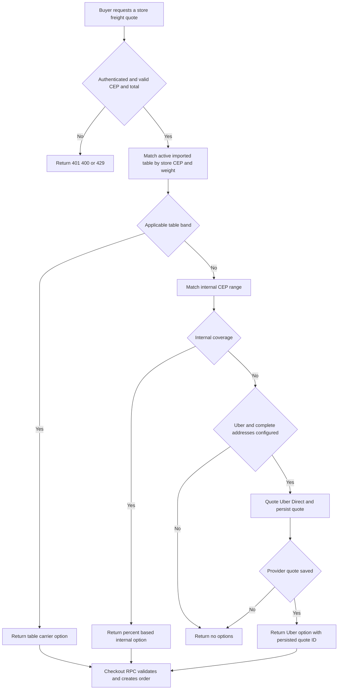
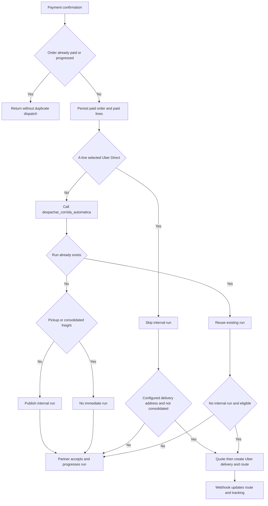

# Freight Quoting, Delivery Dispatch, and Logistics Partners

Freight is selected per store and is not a buyer-supplied price. The checkout quote API discovers one applicable delivery option; the order-creation RPC repeats the consequential validation and computes or retrieves the authoritative charge. After payment, the system treats internal partner dispatch and Uber Direct as distinct fulfillment paths, while pickup and consolidated freight deliberately do not produce an individual immediate run.

This page covers the operational path from freight quote through delivery confirmation. For order/payment creation and recovery, see [Checkout, Payments, and Order Lifecycle](checkout-payment-and-order-lifecycle.md). The wider service-role and RLS boundary is documented in [Data Access, Security, and Schema Evolution](../architecture/data-access-security-and-schema-evolution.md), and webhook infrastructure is covered by [External Services and Webhooks](../integrations/external-services-and-webhooks.md).

## Freight selection at checkout

`POST /api/checkout/cotar-frete` requires an authenticated buyer, limits each user to 20 quote attempts per minute, and requires a store ID, an eight-digit CEP, and a positive item total. It accepts optional cart weight; because product weight is incomplete, a missing value is treated as zero for table matching.

Selection is intentionally precedence-based rather than a marketplace of competing offers:

1. `cotar_frete_tabela(loja_id, cep, peso)` is consulted first. It selects an active `tabela_importada` carrier and an active CEP-and-weight band. A store-specific band wins over the global band for the same carrier; migration `0148` uses `IS NOT DISTINCT FROM` to make this ordering correct even when the global `loja_id` is `NULL`.
2. Without a matching imported band, `cotar_frete_interno(loja_id, cep)` resolves active percent-based `faixas_cep`. It accepts a store-local or global range/carrier, prefers the local range, then chooses the narrowest matching CEP range. The API calculates the two-decimal charge from the item total.
3. Only when neither internal mechanism covers the destination may the server quote Uber Direct. Missing Uber/service credentials, incomplete buyer address, incomplete store pickup address, out-of-coverage results, and provider failures all result in no option rather than a fabricated estimate. Provider failures are sent to Sentry.

`decidirOpcoesFrete` returns the internal option whenever one exists; Uber Direct is a fallback, not an additional choice. Its implementation and focused unit tests make the no-internal-coverage condition explicit.

This flow shows the precedence and the verified fallback condition: Uber Direct is reached only after both internal mechanisms have no applicable coverage.

### External quote integrity

Uber Direct is represented as one active global `transportadoras` row with source `uber_direct`. The quote route calls Uber's `/delivery_quotes` endpoint with formatted pickup/dropoff addresses and writes `loja_id`, destination CEP, fee in centavos, duration, and provider expiry to `cotacoes_frete_externo` before returning the option. This table has RLS enabled with no direct policies: the API uses the service role and `checkout_criar_pedido` is `SECURITY DEFINER`.

The client returns only the selected carrier ID and `cotacao_externa_id` in delivery JSON. If the carrier source is `uber_direct`, `checkout_criar_pedido` requires that quote, checks that it belongs to the resolved store and has not expired, then takes `fee_centavos` from persistence. It rejects unavailable carriers, missing/expired quotes, and unsupported `mercado_envios`; it never trusts a posted freight figure. Internal delivery is separately rechecked against the finalized store, carrier and CEP range. The order stores per-line freight proportionally for Uber Direct and as the authoritative percentage for internal freight.

## Payment-triggered dispatch

`confirmarPagamentoPedido` is the convergence point for the normal Asaas webhook and payment-status fallback. It first rejects a missing order, mismatched charge ID, or insufficient amount. If the order is already `Pagamento Realizado`, `Em Separação`, or `Enviado`, it exits as already paid, so a repeat confirmation does not rerun notification or dispatch side effects. A successful first confirmation persists payment status and line payment flags before best-effort notifications and dispatch; dispatch errors are captured in Sentry and do not roll back payment.

The dispatch routine first detects whether any line selected the fixed Uber Direct carrier. That explicit checkout selection suppresses `despachar_corrida_automatica`; the Uber path then creates the provider delivery. Otherwise it asks the database to create/retrieve an internal `corridas` record. `despachar_corrida_automatica` checks for a prior run by `pedido_id` before inserting, providing the database-level no-duplicate-run guard for repeated invocation. It returns no run for pickup, and consolidated orders are held for a manually assembled consolidation batch.

The diagram distinguishes the two verified no-race/no-duplication conditions: a repeated payment confirmation exits before side effects, and the internal-dispatch RPC returns the pre-existing `corridas` record when one already exists for the order. Uber fallback runs only when `corridaId` is absent; it does not compete with a created internal run. It also rejects consolidated freight and pickup/incomplete-address cases.

### Internal runs and consolidation

A non-consolidated delivered order becomes a `corridas` record in `primeiro_aceita` mode. Its pickup/destination come from store and line-item address data, and its `preco_sugerido` and `preco_final` are the sum of the order's line freight—not a newly calculated logistics-table estimate. The current automatic path uses `1` kg as a schema-required placeholder. Route geometry is best effort: `calcularTrajeto` calls Google Routes if `GOOGLE_MAPS_API_KEY` is configured and below `GEO_MAX_CHAMADAS_DIA` (default 5000 per process/day); otherwise it still stores a Google Maps directions link and no invented distance/duration.

A buyer may choose consolidated freight during checkout. The wrapper discounts each line's freight to 70%, adjusts the order by the cent-accurate difference, marks `frete_consolidado`, and prevents immediate dispatch. An admin-only `criar_lote_consolidacao` later requires at least two paid, consolidated, unassigned orders from one store and the same three-digit destination-CEP corridor, then creates a single manifest/run. This is intentionally manual-assisted batching, not a background optimizer.

## Partners, visibility, and delivery lifecycle

`parceiros_logisticos` represents drivers and carriers and begins in `Pendente`; only an administrator may approve or suspend it. The partner profile captures capacity, operating area/base CEP, contact and vehicle information. Partner terms must be accepted on first profile save and the acceptance records the current CMS terms version. RLS lets the partner manage its own profile while a public view exposes only approved partners' limited identity/capacity/rating data.

For a paid-order run, the earliest approved logistics affiliate of the store gets a five-minute exclusive acceptance window. The affiliate receives a WhatsApp message when it has a phone number; after expiry, or with no affiliate, the run is visible to approved platform partners. This visibility is enforced in the `corridas` select policy using time of read, not a cron. `aceitar_corrida` locks the run, requires `Publicada` and `primeiro_aceita`, verifies the exclusivity window and actor eligibility, then atomically changes it to `Aceita` and records audit data. A competing acceptance therefore sees the changed state rather than winning a second assignment.

The partner console separates available runs, the partner's active runs, and separately assigned `rotas`. It sorts availability by a CEP-prefix proximity hint, but that is presentation only; acceptance remains the database-controlled race. Runs move linearly through `Aceita` → `Coletada` → `EmTransito` → `Entregue`; the status RPC authorizes the assigned partner/affiliate and records optional photo/signature evidence. GPS positions can be inserted only by the assigned partner while collected or in transit, and read by that partner or the requester. A standalone run can be published by an authenticated requester as first-accept or reverse-auction (`leilao`); bids are upserted per partner and the requester selects the winning bid.

For an order-backed internal run, marking it `Entregue` calls `pedido_confirmar_entrega` first. The seller or assigned deliverer must provide the buyer's numeric code; non-sellers are blocked after five bad attempts. A valid code writes every order line's `entregas` record as `Entregue`, resets attempts, recalculates the payout ledger, and is idempotent if delivery is already complete. Only after that succeeds does the app advance the run. Automatic payout transfer is best effort after confirmed delivery, so a transfer failure does not undo proof of delivery.

## Uber Direct execution and tracking

The server-only Uber client is enabled only when `UBER_DIRECT_CUSTOMER_ID`, `UBER_DIRECT_CLIENT_ID`, and `UBER_DIRECT_CLIENT_SECRET` are all present. It obtains a `client_credentials` token for `eats.deliveries`, caches it in-process with a five-minute expiry margin, and sends authenticated requests to `https://api.uber.com/v1/customers/{customer}/delivery_quotes` and `/deliveries`. Sandbox versus production is selected by the configured Uber credentials, not a different API base URL. Phone numbers are normalized to Brazilian E.164 form before delivery creation.

The post-payment Uber path obtains a fresh quote and creates the delivery using the order UUID as `external_id`; it then inserts a `rotas` record with provider delivery ID, initial provider status, tracking URL, calculated fee, and internal `Atribuida` status. Failure anywhere in post-payment routing is best effort and reported to Sentry, leaving the paid order durable but requiring operational follow-up.

Uber's webhook is routed to `/api/webhooks/uber-direct` (the public `/webhooks/uber-direct` is rewritten there). With `UBER_DIRECT_WEBHOOK_SIGNING_KEY` set, the handler verifies the raw body against `x-uber-signature` using HMAC-SHA256 and timing-safe comparison; invalid signatures return 401. **Operational caveat:** when this key is absent, signature validation is intentionally bypassed and the handler emits no rejection, so production must configure the endpoint-specific Uber Webhook Signing Key—not the OAuth client secret. A configured service role locates `rotas` by `uber_delivery_id`, persists the raw provider status/tracking URL, and maps `pending`/`pickup` to `Atribuida`, `pickup_complete`/`in_transit` to `EmTransito`, and `delivered` to `Entregue`. The in-transit buyer notification is best effort after persistence.

`rotas` have the shorter lifecycle `Atribuida` → `EmTransito` → `Entregue`. Assigned affiliates/partners can update manual routes through `atualizar_status_rota`, and buyers can read their routes; unlike internal order-run completion, this route update does not itself validate a buyer delivery code.

## Change and test guide

When changing freight or fulfillment, preserve these boundaries:

- Add a carrier source by extending both carrier validation and the authoritative `checkout_criar_pedido` branch; do not rely on a browser quote or on the quote endpoint alone.
- Preserve internal-first selection unless the commercial policy explicitly changes. Imported bands need store-over-global precedence and carrier activity checks; percent ranges need their own coverage validation.
- Treat quote expiry/store ownership and the payment/dispatch idempotency gates as safety properties. A retry must not publish another internal run or charge a different external amount.
- Keep dispatch and notifications best effort after payment persistence, but monitor Sentry events tagged for `logistica`, `uber_direct`, and `roteirizacao_pos_pagamento`; paid-but-undispatched orders are an operational exception, not a failed payment.
- Configure `UBER_DIRECT_CUSTOMER_ID`, `UBER_DIRECT_CLIENT_ID`, `UBER_DIRECT_CLIENT_SECRET`, and the distinct `UBER_DIRECT_WEBHOOK_SIGNING_KEY`; configure `GOOGLE_MAPS_API_KEY` and, if needed, `GEO_MAX_CHAMADAS_DIA` for route metrics.

Focused tests in `src/lib/checkout/opcoes-frete.test.ts` verify percent rounding, centavos conversion, internal precedence, Uber fallback, and no-coverage output. `src/lib/uber-direct.test.ts` verifies E.164 normalization for Brazilian formatted and unformatted numbers, including empty values. Database/RPC changes should additionally exercise concurrent acceptance, a repeat dispatch for one order, expired/mismatched external quote IDs, consolidated-batch eligibility, and the valid/invalid buyer-code paths described above. See [Verification Strategy](../testing/verification-strategy.md) for repository-wide test guidance.
