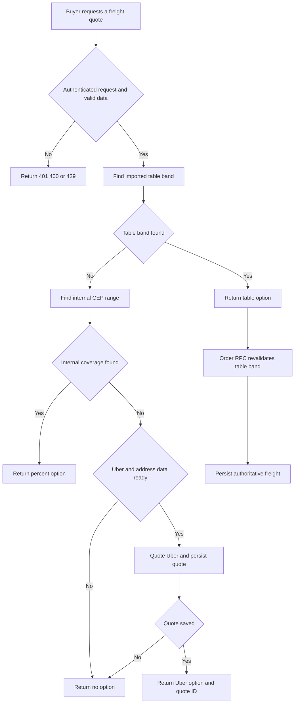
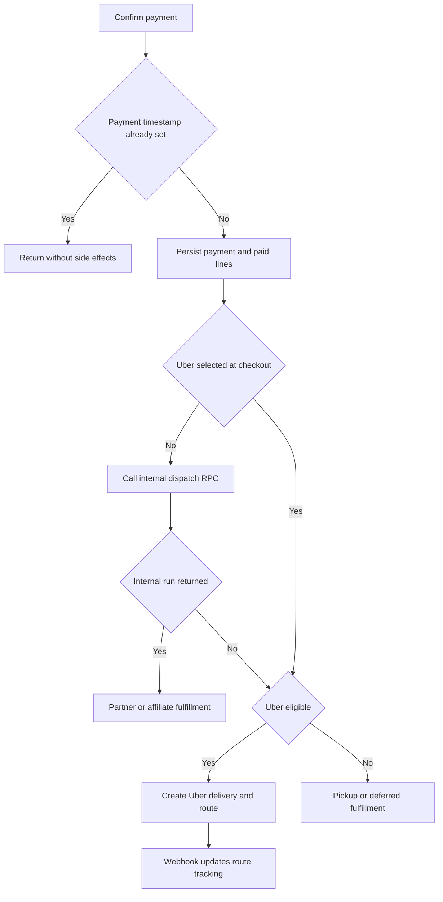

# Fulfillment and Logistics

Fulfillment starts with a server-authoritative freight choice, not a buyer-posted price. Checkout returns at most one delivery option for the store; once paid, an order either enters the internal `corridas` marketplace, is sent to Uber Direct, waits for a consolidation batch, or is pickup-only. `rotas` records provider/manual route tracking, while `corridas` owns internal run assignment and proof-oriented delivery progression.

For order creation and payment recovery, see [Checkout, Payment, and Order Lifecycle](checkout-payment-and-order-lifecycle.md). Partner and affiliate relationships are covered in [Collective Commerce and Affiliates](collective-commerce-and-affiliates.md); service and webhook conventions are in [External Services and Webhooks](../integrations/external-services-and-webhooks.md).

## Checkout freight selection and integrity

`POST /api/checkout/cotar-frete` authenticates the requester, applies a 20-request-per-minute user limit, and requires a store ID, an eight-digit CEP, and a positive item total. Cart weight is optional and defaults to zero for table matching.

The selection sequence is deliberate:

1. `cotar_frete_tabela` is queried first. It considers active `tabela_importada` carriers and active destination-CEP/weight bands. A band overridden for the store takes precedence over a global one; the current ordering uses `IS NOT DISTINCT FROM` so a `NULL` global `loja_id` cannot win accidentally.
2. If no table band applies, `cotar_frete_interno` finds an active percent-based `faixas_cep` range for a store-local or global internal carrier. It prefers the store range and then the narrowest matching range; the application rounds the percentage charge to two decimals.
3. Only when both internal paths have no coverage does the endpoint attempt Uber Direct. Missing Uber/service-role configuration, incomplete destination or store pickup data, unavailable coverage, provider errors, or failure to persist the result produce an empty option list. Provider failures are reported to Sentry.

`decidirOpcoesFrete` enforces this as a single-option policy: internal beats Uber; Uber is returned only when there is no internal option. The quote request passes its optional cart weight (default `0`) to the table RPC. Order creation currently re-resolves an imported-table price at `0` kg, so the persisted checkout amount is not trusted and quote/create behavior must be changed together when real cart weight is introduced.

*Freight selection prefers imported-table and percent internal coverage; imported-table freight is revalidated by the order RPC.*

This flow shows precedence and the database-side validation of an imported-table price, rather than a comparison of competing carrier prices.

### External quote boundary

Uber Direct is a global `transportadoras` record with source `uber_direct`. The quote endpoint calls `/delivery_quotes`, persists the store, destination CEP, fee in centavos, duration, and expiry in `cotacoes_frete_externo`, then returns the persisted quote ID. RLS is enabled on that table without direct policies; the endpoint writes through the service client and the checkout RPC is `SECURITY DEFINER`.

At order creation, `finalizarCompra` splits a multi-store cart into one `checkout_criar_pedido` call per store and carries only the selected carrier and external quote ID inside the delivery JSON; it does not send a freight price. The RPC validates the selected carrier against the resolved store. For `uber_direct`, it requires a matching, unexpired saved quote and derives freight from `fee_centavos`; it rejects unavailable carriers, missing or expired quotes, and unsupported `mercado_envios`.

For `tabela_importada`, the RPC calls `cotar_frete_tabela` itself and rejects checkout when no active matching table band exists. It uses that returned value, skips the percent-range path, and therefore remains authoritative even if the browser presents a stale option. For either external or imported-table freight, it allocates rounded proportional charges to all but the last line and assigns the last line the remaining amount. This makes `sum(linha_itens.valor_frete)` exactly equal the order freight; percent freight uses the same remainder treatment. Pickup lines receive no line freight.

## Payment to dispatch

`confirmarPagamentoPedido` is the shared post-payment entry point for the Asaas webhook and the manual/status fallback. It rejects missing orders, mismatched charge IDs, and underpayments. `dt_pagamento` is the idempotency fact: if already set, it returns without notification or dispatch regardless of later order status. A conditional update requiring `dt_pagamento IS NULL` closes the race between concurrent webhook and fallback calls; only the winner marks the order paid and then marks its lines paid. Notifications and routing happen afterward as best effort: failures go to Sentry and do not undo payment.

A line explicitly selecting the fixed Uber Direct carrier prevents creation of an internal run. Otherwise the code calls `despachar_corrida_automatica`; that database function returns an existing run for the order, skips pickup and consolidated freight, or creates a `primeiro_aceita` run. The post-payment Uber routine only continues when no internal run was returned. This lets explicit Uber selection proceed, while avoiding competition with an internal run.

*After the one winning payment confirmation, internal dispatch takes precedence unless checkout explicitly selected Uber Direct; provider dispatch remains best effort.*

The payment gate and `pedido_id` lookup in the dispatch RPC are separate idempotency protections. They should remain intact when adding retry mechanisms.

### Internal runs and consolidation

For a regular delivery, the automatic RPC creates an order-backed `corridas` record using the store pickup and first delivery address. It uses the sum of delivery-line freight for both suggested and final price, a schema-required placeholder of `1` kg, and a four-hour collection window. The first approved logistics affiliate for the store receives a five-minute exclusive window when one exists.

Consolidated freight is intentionally deferred. Checkout reduces each eligible line freight to 70%, adjusts the order total by the cent-accurate difference, and flags the order. `criar_lote_consolidacao` is an admin-only, manual-assisted batch operation: it needs at least two selected paid consolidated orders, all from one store, not already assigned to another run/batch, and with a shared three-digit destination-CEP corridor. It creates one manifest `corridas` record priced at the sum of the discounted freight and attaches the orders to `lote_pedidos`. An admin can cancel an uncollected batch run to release its orders for a new batch.

Route geometry is supplementary to dispatch. `calcularTrajeto` invokes Google Routes only with `GOOGLE_MAPS_API_KEY` and while its per-process daily counter is below `GEO_MAX_CHAMADAS_DIA` (default 5000). It returns named failure states rather than inventing distance or duration; `linkTrajeto` still provides a Google Maps directions URL without a key.

## Partner handoff and internal completion

`parceiros_logisticos` is the platform driver/carrier profile. New profiles start `Pendente`; only an administrator can approve or suspend them. The profile save action requires acceptance of the current logistics-partner terms on its first save and preserves that acceptance on later edits. Only approved partners appear in the limited public profile view.

For a published first-accept run, RLS makes an approved store logistics affiliate's exclusive run visible to that affiliate during the five-minute window; after expiry, approved platform partners can see it. `aceitar_corrida` locks the run, verifies that it remains `Publicada` and `primeiro_aceita`, applies the exclusivity and eligibility rules, and records the assignment/audit event atomically. If an affiliate review is required, that affiliate must first revise weight, volume, window, and description. A non-order run can instead use `leilao`: approved partners upsert one bid each and the requester chooses the winning bid.

Internal run progress is constrained to `Aceita` → `Coletada` → `EmTransito` → `Entregue` and is authorized for the assigned partner or affiliate. Order-backed completion invokes `pedido_confirmar_entrega` before the status update, so a wrong buyer code cannot advance the run. A valid code marks every line delivery `Entregue`, resets code attempts, recalculates the payout ledger, and is idempotent for an already complete order. A photo is optional for an order-backed run but remains required to complete a standalone run. Seller payout transfer is then best effort: failure is recorded without reversing confirmed delivery. Entering `EmTransito` triggers a buyer notification after the status change.

The automatic payout handler recalculates pending seller and affiliate ledger entries after delivery. Before calling Asaas for a PIX transfer, it conditionally claims each entry from `pendente` to `processando`; concurrent retries that do not claim a row make no transfer. Missing or ineligible PIX details mark the entry `inelegivel`; transfer errors mark it `falhou` and are sent to Sentry for admin handling.

There is also a public completion path for a third-party deliverer without a platform login. It accepts an order sale ID, buyer code, and deliverer name; it uses the same paid-order, idempotency, line-delivery, attempt-reset, and payout-ledger semantics. Unlike the authenticated seller exception, this anonymous path enforces the five-attempt cap for every caller and audits both incorrect and successful attempts with the supplied name.

## Uber Direct and route tracking

The server-only Uber client is enabled only when `UBER_DIRECT_CUSTOMER_ID`, `UBER_DIRECT_CLIENT_ID`, and `UBER_DIRECT_CLIENT_SECRET` are all set. It obtains an OAuth `client_credentials` token for `eats.deliveries` and caches it in-process with a five-minute expiry margin. It formats pickup/dropoff addresses as unstructured strings and normalizes local Brazilian phone values to E.164 before creating a delivery.

Post-payment Uber dispatch obtains a fresh provider quote, creates the delivery with the order UUID as `external_id`, then inserts `rotas` with the provider ID, provider status, tracking URL, fee, and internal `Atribuida` status. Missing delivery/pickup data, consolidated freight, disabled configuration, or a pre-existing internal run prevents this path. Dispatch failures are best effort and require operational follow-up for a paid but unassigned order.

The public Uber webhook URL is rewritten to `/api/webhooks/uber-direct`. The handler uses the service client to locate `rotas` by `uber_delivery_id`, stores the raw provider status and any tracking URL, and maps `pending`/`pickup` to `Atribuida`, `pickup_complete`/`in_transit` to `EmTransito`, and `delivered` to `Entregue`. The in-transit buyer notice is after persistence and does not block the update. With `UBER_DIRECT_WEBHOOK_SIGNING_KEY`, it verifies the raw body and `x-uber-signature` with HMAC-SHA256 and timing-safe comparison. Without that key, verification is bypassed; production must configure the endpoint-specific Uber signing key.

Manual `rotas` have the shorter `Atribuida` → `EmTransito` → `Entregue` transition path and can be updated only by their assigned affiliate or partner. Unlike an order-backed `corridas` completion, this route-status RPC does not validate a buyer code.

## Operations and focused verification

- Treat saved-quote store ownership, expiry, carrier activity, and internal-first selection as checkout integrity boundaries. A new carrier source needs both quote behavior and an authoritative `checkout_criar_pedido` branch.
- Maintain payment/dispatch idempotency. A retry must not create a second internal run or replace a saved external price with a client value.
- Configure `UBER_DIRECT_CUSTOMER_ID`, `UBER_DIRECT_CLIENT_ID`, `UBER_DIRECT_CLIENT_SECRET`, and the separate `UBER_DIRECT_WEBHOOK_SIGNING_KEY`. Monitor Sentry events tagged for `logistica`, `uber_direct`, and `roteirizacao_pos_pagamento` for paid-but-undispatched orders.
- Configure `GOOGLE_MAPS_API_KEY` and optionally `GEO_MAX_CHAMADAS_DIA` only for route metrics; absence must not block dispatch.
- `src/lib/checkout/opcoes-frete.test.ts` tests percentage rounding, centavos conversion, internal precedence, Uber fallback, and no coverage. `src/lib/uber-direct.test.ts` tests Brazilian E.164 normalization, formatted input, existing country code, and empty values. Database changes should additionally exercise quote expiry/ownership, concurrent acceptance, repeated dispatch, consolidation eligibility, and valid/invalid buyer-code completion. See [Verification Strategy](../testing/verification-strategy.md) for broader guidance.
